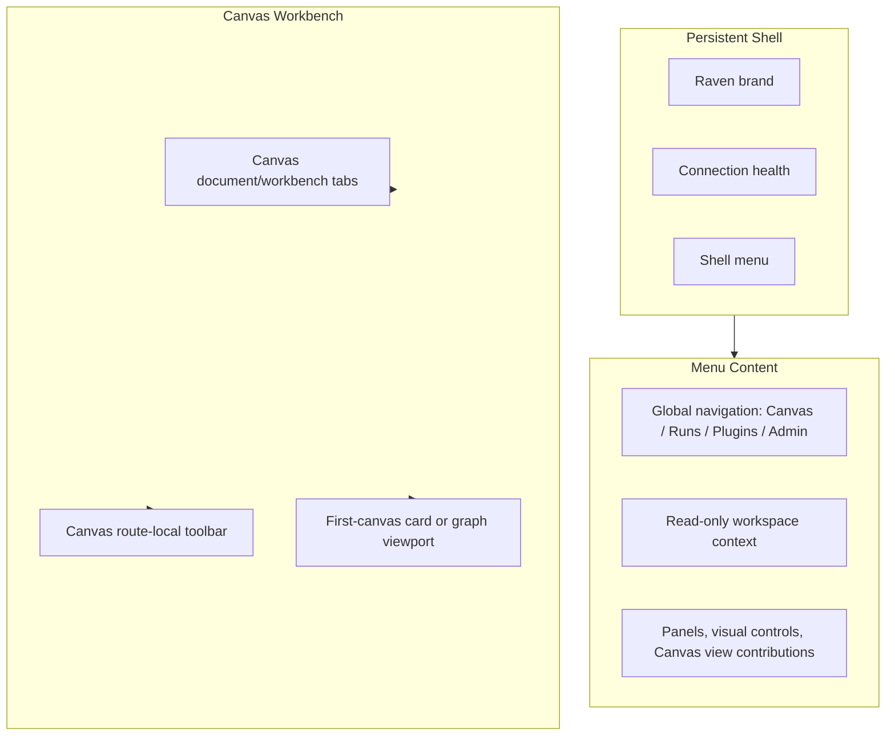
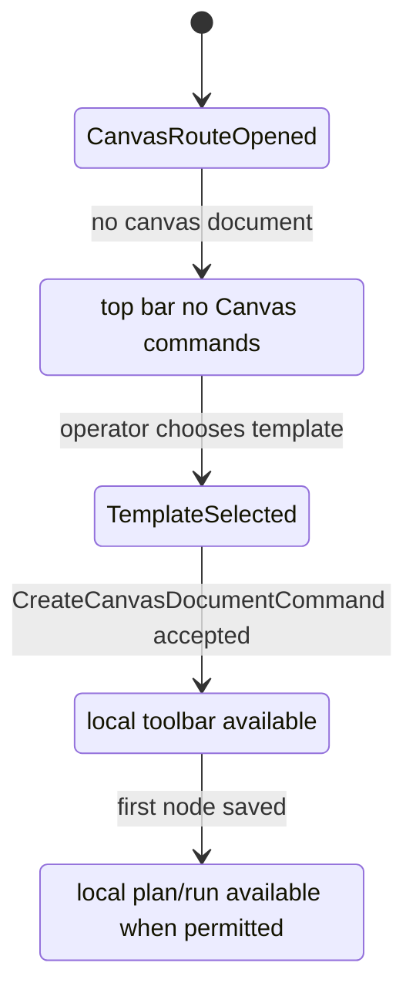

# F-15-F Canvas Workbench Screen Consolidation Plan

## Objective

Reconcile the `/canvas` entry screen as one governed workbench composition:
global top bar stays low-noise, Canvas route commands stay route-local, global
Admin and Plugins navigation remains discoverable when the rail is hidden, and
first-canvas copy is locale-coherent.

## Scope

In scope:

- remove Canvas route command portal ownership from `ShellTopBar`;
- keep Canvas toolbar commands inside the Canvas workbench body;
- hide Canvas toolbar commands before a canvas document or graph-operable state
  exists;
- render global navigation and workspace context inside `ShellMenu`;
- add Spanish shell copy for visible shell/menu/context labels;
- resolve built-in first-canvas template title and description through a Canvas
  template presentation model;
- add semantic architecture tests and focused presentation tests;
- update component docs and user stories.

Out of scope:

- backend routes, contracts, adapters, migrations, RBAC, or protected draft
  semantics;
- project switching, tenant switching, environment switching, or Git branch
  operations;
- new Admin or Plugins behavior;
- replacing Cypress as the governed e2e rail.

## Command And Query Rail Impact

| Rail                                 | Type    | Owner                         | Impact                                                          |
| ------------------------------------ | ------- | ----------------------------- | --------------------------------------------------------------- |
| `ResolveShellNavigationDisposition`  | query   | Frontend shell                | Reused; Canvas remains hidden-rail mode.                        |
| `ListShellNavigationItems`           | query   | Frontend shell                | Reused; menu must expose Canvas, Runs, Plugins, Admin.          |
| `ResolveCanvasWorkbenchContext`      | query   | Canvas workbench presentation | Reused as read-only context; no selector rail added.            |
| `CreateCanvasDocumentCommand`        | command | Canvas document               | Reused; selected localized template title may be command title. |
| `VerifyCanvasWorkbenchVisualPosture` | query   | Browser/test read model       | Extended with no top-bar portal and locale coherence proof.     |

No backend rail is introduced.

## Fowler Opportunity Matrix

<!-- markdownlint-disable MD060 -->

| Scenario                                                            | Opportunity             | Fowler pattern                                  | DDD owner                          | Command/query rail                   | Implementation surfaces                                | Unit or package test                              | Architecture test                                 | User-flow test                  | Out of scope                   |
| ------------------------------------------------------------------- | ----------------------- | ----------------------------------------------- | ---------------------------------- | ------------------------------------ | ------------------------------------------------------ | ------------------------------------------------- | ------------------------------------------------- | ------------------------------- | ------------------------------ |
| Canvas first screen shows route commands in global top bar.         | Boundary drift          | Move Method / Presentation Model                | `CanvasToolbarPlacement`           | existing Canvas commands only        | `CanvasShellMainPanel.tsx`, `CanvasToolbar.tsx`, tests | `CanvasToolbar.test.tsx`, `CanvasShell.test.tsx`  | `CanvasToolbar.architecture.test.tsx`             | Cypress/Playwright visual smoke | New command semantics          |
| Canvas first screen shows disabled commands before a canvas exists. | Responsibility overload | Replace Conditional with explicit route posture | `CanvasWorkbenchScreenComposition` | none - presentation only             | `CanvasShellMainPanel.tsx`                             | `CanvasShell.test.tsx`                            | `CanvasToolbar.architecture.test.tsx`             | Browser smoke                   | Changing graph readiness rules |
| Admin/Plugins lose discoverability after rail removal.              | Hidden navigation       | Gateway / Shell Navigation Read Model           | `ShellNavigationReadModel`         | `ListShellNavigationItems`           | `ShellMenu.tsx`, `TopAppBar.tsx`                       | `TopAppBar.test.tsx`, `Root.shellChrome.test.tsx` | `shellNavigationDisposition.architecture.test.ts` | Cypress/Playwright menu smoke   | Embedding Admin in Canvas      |
| Spanish Canvas copy mixes with English plugin template copy.        | Registry language leak  | Presentation Model                              | `CanvasTemplatePresentation`       | `CreateCanvasDocumentCommand` reused | `CanvasPlaygroundHost.tsx`, new resolver, plugin tests | `CanvasPlaygroundHost.test.tsx`                   | `CanvasPlaygroundHost.architecture.test.tsx`      | Browser smoke                   | Full plugin i18n platform      |
| Existing docs describe target chrome but code keeps portal.         | Documentation drift     | Semantic Fitness Function                       | `CanvasWorkbenchScreenComposition` | `VerifyCanvasWorkbenchVisualPosture` | docs, architecture tests                               | docs lint                                         | architecture tests                                | Browser smoke                   | Reopening F-28                 |

<!-- markdownlint-enable MD060 -->

## Screen Composition Target



## State Flow



## Red / Green Cycles

1. **No top-bar Canvas portal**
   - Red: `pnpm --filter @dvt/web exec vitest run src/app/components/TopAppBar.test.tsx src/app/views/canvas/CanvasToolbar.architecture.test.tsx`
   - Expected failure: `ShellTopBar` still renders `shell-top-bar-canvas-controls` and Canvas toolbar still imports portal support.
   - Green: portal host removed, architecture guard passes.

2. **Route-local toolbar and first-canvas quiet state**
   - Red: `pnpm --filter @dvt/web exec vitest run src/app/views/canvas/CanvasToolbar.test.tsx src/app/views/canvas/CanvasShell.test.tsx`
   - Expected failure: first-canvas route still exposes toolbar commands.
   - Green: `needs_canvas` renders no Canvas toolbar commands; operable graph states render route-local toolbar.

3. **Menu-owned global navigation and context**
   - Red: `pnpm --filter @dvt/web exec vitest run src/app/Root.shellChrome.test.tsx src/app/components/TopAppBar.test.tsx`
   - Expected failure: Canvas top bar still shows workspace/Git controls or menu does not expose shell context/navigation as first-class groups.
   - Green: menu exposes global navigation plus context while Canvas top bar stays low-noise.

4. **Locale-coherent first-canvas template copy**
   - Red: `pnpm --filter @dvt/web exec vitest run src/app/views/canvas/CanvasPlaygroundHost.test.tsx src/app/views/canvas/CanvasPlaygroundHost.architecture.test.tsx`
   - Expected failure: Spanish first-canvas screen still renders English template copy.
   - Green: built-in template presentation resolves Spanish title and description.

## Documentation Updates

- Add this mandatory proposal.
- Add `buzon/20260519-codex-fowler-f15f-canvas-workbench-screen-consolidation.md`.
- Add `docs/architecture/components/web/appshell/canvas-workbench-screen-composition-component.md`.
- Add `docs/architecture/components/web/appshell/canvas-workbench-screen-composition-user-stories.md`.
- Update `main-workspace-views-and-ux.md` and `ux-implementation-guide.md` if implementation changes the current shell contract wording.

## Validation Plan

- `pnpm docs:feature-mechanization -- --feature F15F-CANVAS-WORKBENCH-SCREEN-CONSOLIDATION-20260519`
- focused red/green Vitest commands above;
- `pnpm --filter @dvt/web test:canvas`
- `pnpm --filter @dvt/web typecheck`
- `pnpm lint`
- `pnpm lint:md:changed`
- `pnpm docs:sync`
- `pnpm docs:status:generate` if files under `apps/` are removed or added;
- `pnpm governance:refresh`
- rendered frontend validation using Cypress where available and Playwright only
  as supplemental visual smoke when useful;
- `pnpm verify:prepush`.

## ADR Decision

No ADR is required. This slice reconciles existing frontend shell and Canvas
presentation ownership. It does not alter backend contracts, persistence
authority, protected draft semantics, or cross-package architecture.

```feature-mechanization
version: 1
featureId: F15F-CANVAS-WORKBENCH-SCREEN-CONSOLIDATION-20260519
mechanizationStatus: implemented
noHumanDecisionsRemaining: true
implementationPlan: docs/planning/proposals/mandatory/frontend-and-ux/f15f-canvas-workbench-screen-consolidation-plan-20260519.md
componentGuides:
  - docs/architecture/components/web/appshell/canvas-workbench-screen-composition-component.md
userStories:
  - docs/architecture/components/web/appshell/canvas-workbench-screen-composition-user-stories.md
  - buzon/20260519-codex-fowler-f15f-canvas-workbench-screen-consolidation.md
governingSources:
  - AGENTS.md
  - docs/planning/status/governance-document-rule-inventory.md
  - docs/guides/ai-work-protocol.md
  - docs/architecture/command-query-rail-governance.md
  - docs/architecture/fowler-opportunity-planning-governance.md
  - docs/planning/state/lane-e-shell-baseline-target-guide.md
  - docs/architecture/components/web/main-workspace-views-and-ux.md
  - docs/architecture/components/web/ux-implementation-guide.md
  - docs/planning/proposals/mandatory/frontend-and-ux/f15d-workbench-navigation-disposition-plan-20260518.md
  - docs/planning/proposals/mandatory/frontend-and-ux/f15e-canvas-startup-template-selection-plan-20260518.md
allowedImplementationSurfaces:
  - apps/web/cypress/e2e/shell/canvas-workbench-screen-composition.cy.ts
  - apps/web/src/app/Root.shellChrome.test.support.ts
  - apps/web/src/app/Root.shellChrome.test.tsx
  - apps/web/src/app/components/TopAppBar.architecture.test.ts
  - apps/web/src/app/components/TopAppBar.test.tsx
  - apps/web/src/app/components/TopAppBar.tsx
  - apps/web/src/app/components/shell/ShellGitRef.tsx
  - apps/web/src/app/components/shell/ShellMenu.tsx
  - apps/web/src/app/components/shell/ShellProjectIdentityBadge.tsx
  - apps/web/src/app/components/shell/ShellWorkspaceContextDetails.tsx
  - apps/web/src/app/components/shell/ShellWorkspaceContextMenu.tsx
  - apps/web/src/app/components/shell/copy.ts
  - apps/web/src/app/components/shell/types.ts
  - apps/web/src/app/shell/shellNavigationDisposition.architecture.test.ts
  - apps/web/src/app/views/Canvas.authoringRoute.integration.test.tsx
  - apps/web/src/app/views/Canvas.routeStates.backend-recovery-priority.test.tsx
  - apps/web/src/app/views/Canvas.test.support.tsx
  - apps/web/src/app/views/canvas/CanvasPlaygroundHost.architecture.test.tsx
  - apps/web/src/app/views/canvas/CanvasPlaygroundHost.test.tsx
  - apps/web/src/app/views/canvas/CanvasPlaygroundHost.tsx
  - apps/web/src/app/views/canvas/CanvasPlaygroundHost.templates.tsx
  - apps/web/src/app/views/canvas/CanvasShell.test.tsx
  - apps/web/src/app/views/canvas/CanvasShellMainPanel.tsx
  - apps/web/src/app/views/canvas/CanvasToolbar.architecture.test.tsx
  - apps/web/src/app/views/canvas/CanvasToolbar.test.tsx
  - apps/web/src/app/views/canvas/CanvasToolbar.tsx
  - apps/web/src/app/views/canvas/CanvasToolbarPrimaryControls.tsx
  - apps/web/src/app/views/canvas/canvasCopy.types.ts
  - apps/web/src/app/views/canvas/canvasCopyCatalog.route.es.ts
  - apps/web/src/app/views/canvas/canvasCopyCatalog.route.ts
  - apps/web/src/app/views/canvas/canvasDraftRecoveryBoundary.architecture.test.ts
  - apps/web/src/app/views/canvas/canvasTemplatePresentation.ts
  - apps/web/src/app/views/canvas/canvasTemplatePresentation.test.ts
  - apps/web/src/app/views/canvas/useCanvasToolbarPortalTarget.ts
  - buzon/20260519-codex-fowler-f15f-canvas-workbench-screen-consolidation.md
  - docs/.manifest.json
  - docs/architecture/components/web/appshell/canvas-workbench-screen-composition-component.md
  - docs/architecture/components/web/appshell/canvas-workbench-screen-composition-user-stories.md
  - docs/architecture/components/web/graph/canvas-playground-host-component.md
  - docs/architecture/components/web/graph/canvas-startup-and-draft-recovery-user-stories.md
  - docs/architecture/components/web/graph/canvas-startup-template-selection-component.md
  - docs/architecture/components/web/main-workspace-views-and-ux.md
  - docs/architecture/components/web/ux-implementation-guide.md
  - docs/planning/proposals/mandatory/frontend-and-ux/f15f-canvas-workbench-screen-consolidation-plan-20260519.md
forbiddenImplementationSurfaces:
  - packages/@dvt/contracts/**
  - packages/@dvt/engine/**
  - packages/@dvt/adapter-*/**
  - packages/@dvt/planner/**
  - apps/api/**
  - specs/**
commandQueryRails:
  - name: ResolveShellNavigationDisposition
    type: query
    dddOwner: ShellNavigationDisposition
  - name: ListShellNavigationItems
    type: query
    dddOwner: ShellNavigationReadModel
  - name: ResolveCanvasWorkbenchContext
    type: query
    dddOwner: CanvasWorkbenchContext
  - name: CreateCanvasDocumentCommand
    type: command
    dddOwner: CanvasDocument
  - name: VerifyCanvasWorkbenchVisualPosture
    type: query
    dddOwner: CanvasWorkbenchVisualPostureReadModel
domainObjects:
  - name: CanvasWorkbenchScreenComposition
    type: presentation model
    owner: Frontend shell and Canvas route
  - name: CanvasTemplatePresentation
    type: presentation model
    owner: Canvas host
fowlerSignals:
  - Boundary drift
  - Responsibility overload
  - Registry language leak
  - Hidden navigation
  - Documentation drift
  - Test-only confidence
architectureGuards:
  - pnpm --filter @dvt/web exec vitest run src/app/views/canvas/CanvasToolbar.architecture.test.tsx
  - pnpm --filter @dvt/web exec vitest run src/app/views/canvas/CanvasPlaygroundHost.architecture.test.tsx
  - pnpm --filter @dvt/web exec vitest run src/app/shell/shellNavigationDisposition.architecture.test.ts
cypressFlows:
  - Existing Cypress remains the governed e2e rail; Playwright may be used as supplemental local visual smoke because Browser plugin is not installed in this session.
  - apps/web/cypress/e2e/shell/canvas-workbench-screen-composition.cy.ts verifies the Canvas entry screen chrome, menu navigation, and Spanish first-canvas copy.
completionGate:
  - pnpm docs:feature-mechanization -- --feature F15F-CANVAS-WORKBENCH-SCREEN-CONSOLIDATION-20260519
  - pnpm --filter @dvt/web exec vitest run src/app/components/TopAppBar.test.tsx src/app/Root.shellChrome.test.tsx src/app/views/canvas/CanvasToolbar.test.tsx src/app/views/canvas/CanvasToolbar.architecture.test.tsx src/app/views/canvas/CanvasPlaygroundHost.test.tsx src/app/views/canvas/CanvasPlaygroundHost.architecture.test.tsx
  - pnpm --filter @dvt/web test:canvas
  - pnpm --filter @dvt/web test:e2e:native -- --spec cypress/e2e/shell/canvas-workbench-screen-composition.cy.ts
  - pnpm --filter @dvt/web typecheck
  - pnpm lint
  - pnpm lint:md:changed
  - pnpm docs:sync
  - pnpm governance:refresh
  - pnpm verify:prepush
redGreenCycles:
  - id: no-canvas-topbar-command-portal
    redTest: pnpm --filter @dvt/web exec vitest run src/app/components/TopAppBar.test.tsx src/app/views/canvas/CanvasToolbar.architecture.test.tsx
    expectedFailure: ShellTopBar still renders the Canvas toolbar portal and CanvasToolbar still depends on portal placement.
    patchSurfaces:
      - apps/web/src/app/components/TopAppBar.tsx
      - apps/web/src/app/views/canvas/CanvasToolbar.tsx
      - apps/web/src/app/views/canvas/useCanvasToolbarPortalTarget.ts
    greenTest: pnpm --filter @dvt/web exec vitest run src/app/components/TopAppBar.test.tsx src/app/views/canvas/CanvasToolbar.architecture.test.tsx
  - id: canvas-route-local-toolbar-state
    redTest: pnpm --filter @dvt/web exec vitest run src/app/views/canvas/CanvasToolbar.test.tsx src/app/views/canvas/CanvasShell.test.tsx
    expectedFailure: Needs-canvas still exposes route toolbar commands.
    patchSurfaces:
      - apps/web/src/app/views/canvas/CanvasShellMainPanel.tsx
      - apps/web/src/app/views/canvas/CanvasToolbar.tsx
    greenTest: pnpm --filter @dvt/web exec vitest run src/app/views/canvas/CanvasToolbar.test.tsx src/app/views/canvas/CanvasShell.test.tsx
  - id: menu-global-navigation-and-context
    redTest: pnpm --filter @dvt/web exec vitest run src/app/components/TopAppBar.test.tsx src/app/Root.shellChrome.test.tsx
    expectedFailure: Canvas top bar still renders workspace/Git context outside the menu or menu navigation/context groups are not explicit.
    patchSurfaces:
      - apps/web/src/app/components/TopAppBar.tsx
      - apps/web/src/app/components/shell/ShellMenu.tsx
      - apps/web/src/app/components/shell/copy.ts
    greenTest: pnpm --filter @dvt/web exec vitest run src/app/components/TopAppBar.test.tsx src/app/Root.shellChrome.test.tsx
  - id: locale-coherent-canvas-template-presentation
    redTest: pnpm --filter @dvt/web exec vitest run src/app/views/canvas/canvasTemplatePresentation.test.ts src/app/views/canvas/CanvasPlaygroundHost.test.tsx src/app/views/canvas/CanvasPlaygroundHost.architecture.test.tsx
    expectedFailure: Built-in template copy still renders raw registry English in Spanish locale.
    patchSurfaces:
      - apps/web/src/app/views/canvas/canvasTemplatePresentation.ts
      - apps/web/src/app/views/canvas/CanvasPlaygroundHost.tsx
      - apps/web/src/app/views/canvas/CanvasPlaygroundHost.templates.tsx
    greenTest: pnpm --filter @dvt/web exec vitest run src/app/views/canvas/canvasTemplatePresentation.test.ts src/app/views/canvas/CanvasPlaygroundHost.test.tsx src/app/views/canvas/CanvasPlaygroundHost.architecture.test.tsx
symbols:
  - name: CanvasWorkbenchScreenCompositionComponentGuide
    path: docs/architecture/components/web/appshell/canvas-workbench-screen-composition-component.md
    dddOwner: CanvasWorkbenchScreenComposition
    cqRails: [ResolveShellNavigationDisposition, ListShellNavigationItems, ResolveCanvasWorkbenchContext, VerifyCanvasWorkbenchVisualPosture]
    fowlerSignals: [Boundary drift, Responsibility overload, Documentation drift]
    architectureGuard: pnpm --filter @dvt/web exec vitest run src/app/views/canvas/CanvasToolbar.architecture.test.tsx
    unitTests: [pnpm --filter @dvt/web exec vitest run src/app/components/TopAppBar.test.tsx]
    cypressCoverage: Existing Cypress route smoke; Playwright visual smoke may supplement.
  - name: CanvasTemplatePresentation
    path: apps/web/src/app/views/canvas/canvasTemplatePresentation.ts
    dddOwner: CanvasTemplatePresentation
    cqRails: [CreateCanvasDocumentCommand]
    fowlerSignals: [Registry language leak, Presentation Model]
    architectureGuard: pnpm --filter @dvt/web exec vitest run src/app/views/canvas/CanvasPlaygroundHost.architecture.test.tsx
    unitTests: [pnpm --filter @dvt/web exec vitest run src/app/views/canvas/canvasTemplatePresentation.test.ts]
    cypressCoverage: Visual first-canvas smoke.
  - name: RootShellHeaderChromeMode
    path: apps/web/src/app/Root.shellChrome.test.support.ts
    dddOwner: ShellNavigationReadModel
    cqRails: [VerifyCanvasWorkbenchVisualPosture]
    fowlerSignals: [Boundary drift, Hidden navigation, Semantic Fitness Function]
    architectureGuard: pnpm --filter @dvt/web exec vitest run src/app/Root.shellChrome.test.tsx
    unitTests: [pnpm --filter @dvt/web exec vitest run src/app/Root.shellChrome.test.tsx]
    cypressCoverage: Shell menu visual smoke.
  - name: expectRootShellHeaderChrome
    path: apps/web/src/app/Root.shellChrome.test.support.ts
    dddOwner: ShellNavigationReadModel
    cqRails: [VerifyCanvasWorkbenchVisualPosture]
    fowlerSignals: [Boundary drift, Hidden navigation, Semantic Fitness Function]
    architectureGuard: pnpm --filter @dvt/web exec vitest run src/app/Root.shellChrome.test.tsx
    unitTests: [pnpm --filter @dvt/web exec vitest run src/app/Root.shellChrome.test.tsx]
    cypressCoverage: Shell menu visual smoke.
  - name: COPY_ES
    path: apps/web/src/app/components/shell/copy.ts
    dddOwner: ShellNavigationReadModel
    cqRails: [ListShellNavigationItems]
    fowlerSignals: [Registry language leak, Presentation Model]
    architectureGuard: pnpm --filter @dvt/web exec vitest run src/app/components/TopAppBar.architecture.test.ts
    unitTests: [pnpm --filter @dvt/web exec vitest run src/app/components/TopAppBar.test.tsx]
    cypressCoverage: Shell menu visual smoke.
  - name: detectShellTopBarLocale
    path: apps/web/src/app/components/shell/copy.ts
    dddOwner: ShellNavigationReadModel
    cqRails: [ListShellNavigationItems]
    fowlerSignals: [Registry language leak, Presentation Model]
    architectureGuard: pnpm --filter @dvt/web exec vitest run src/app/components/TopAppBar.architecture.test.ts
    unitTests: [pnpm --filter @dvt/web exec vitest run src/app/components/TopAppBar.test.tsx]
    cypressCoverage: Shell menu visual smoke.
  - name: resolveShellTopBarLanguage
    path: apps/web/src/app/components/shell/copy.ts
    dddOwner: ShellNavigationReadModel
    cqRails: [ListShellNavigationItems]
    fowlerSignals: [Registry language leak, Presentation Model]
    architectureGuard: pnpm --filter @dvt/web exec vitest run src/app/components/TopAppBar.architecture.test.ts
    unitTests: [pnpm --filter @dvt/web exec vitest run src/app/components/TopAppBar.test.tsx]
    cypressCoverage: Shell menu visual smoke.
  - name: shouldRenderCanvasToolbar
    path: apps/web/src/app/views/canvas/CanvasShellMainPanel.tsx
    dddOwner: CanvasWorkbenchScreenComposition
    cqRails: [ResolveCanvasWorkbenchContext, VerifyCanvasWorkbenchVisualPosture]
    fowlerSignals: [Responsibility overload, Boundary drift]
    architectureGuard: pnpm --filter @dvt/web exec vitest run src/app/views/canvas/CanvasToolbar.architecture.test.tsx
    unitTests: [pnpm --filter @dvt/web exec vitest run src/app/views/canvas/CanvasShell.test.tsx]
    cypressCoverage: Canvas first-screen visual smoke.
  - name: buildCanvasKind
    path: apps/web/src/app/views/canvas/canvasTemplatePresentation.test.ts
    dddOwner: CanvasTemplatePresentation
    cqRails: [CreateCanvasDocumentCommand]
    fowlerSignals: [Registry language leak, Semantic Fitness Function]
    architectureGuard: pnpm --filter @dvt/web exec vitest run src/app/views/canvas/CanvasPlaygroundHost.architecture.test.tsx
    unitTests: [pnpm --filter @dvt/web exec vitest run src/app/views/canvas/canvasTemplatePresentation.test.ts]
    cypressCoverage: Visual first-canvas smoke.
  - name: BUILT_IN_SPANISH_TEMPLATE_COPY
    path: apps/web/src/app/views/canvas/canvasTemplatePresentation.ts
    dddOwner: CanvasTemplatePresentation
    cqRails: [CreateCanvasDocumentCommand]
    fowlerSignals: [Registry language leak, Presentation Model]
    architectureGuard: pnpm --filter @dvt/web exec vitest run src/app/views/canvas/CanvasPlaygroundHost.architecture.test.tsx
    unitTests: [pnpm --filter @dvt/web exec vitest run src/app/views/canvas/canvasTemplatePresentation.test.ts]
    cypressCoverage: Visual first-canvas smoke.
  - name: CanvasTemplateCopy
    path: apps/web/src/app/views/canvas/canvasTemplatePresentation.ts
    dddOwner: CanvasTemplatePresentation
    cqRails: [CreateCanvasDocumentCommand]
    fowlerSignals: [Registry language leak, Presentation Model]
    architectureGuard: pnpm --filter @dvt/web exec vitest run src/app/views/canvas/CanvasPlaygroundHost.architecture.test.tsx
    unitTests: [pnpm --filter @dvt/web exec vitest run src/app/views/canvas/canvasTemplatePresentation.test.ts]
    cypressCoverage: Visual first-canvas smoke.
  - name: resolveBuiltInTemplateCopy
    path: apps/web/src/app/views/canvas/canvasTemplatePresentation.ts
    dddOwner: CanvasTemplatePresentation
    cqRails: [CreateCanvasDocumentCommand]
    fowlerSignals: [Registry language leak, Presentation Model]
    architectureGuard: pnpm --filter @dvt/web exec vitest run src/app/views/canvas/CanvasPlaygroundHost.architecture.test.tsx
    unitTests: [pnpm --filter @dvt/web exec vitest run src/app/views/canvas/canvasTemplatePresentation.test.ts]
    cypressCoverage: Visual first-canvas smoke.
  - name: resolveCanvasTemplateLanguage
    path: apps/web/src/app/views/canvas/canvasTemplatePresentation.ts
    dddOwner: CanvasTemplatePresentation
    cqRails: [CreateCanvasDocumentCommand]
    fowlerSignals: [Registry language leak, Presentation Model]
    architectureGuard: pnpm --filter @dvt/web exec vitest run src/app/views/canvas/CanvasPlaygroundHost.architecture.test.tsx
    unitTests: [pnpm --filter @dvt/web exec vitest run src/app/views/canvas/canvasTemplatePresentation.test.ts]
    cypressCoverage: Visual first-canvas smoke.
  - name: resolveCanvasTemplatePresentation
    path: apps/web/src/app/views/canvas/canvasTemplatePresentation.ts
    dddOwner: CanvasTemplatePresentation
    cqRails: [CreateCanvasDocumentCommand]
    fowlerSignals: [Registry language leak, Presentation Model]
    architectureGuard: pnpm --filter @dvt/web exec vitest run src/app/views/canvas/CanvasPlaygroundHost.architecture.test.tsx
    unitTests: [pnpm --filter @dvt/web exec vitest run src/app/views/canvas/canvasTemplatePresentation.test.ts]
    cypressCoverage: Visual first-canvas smoke.
```
