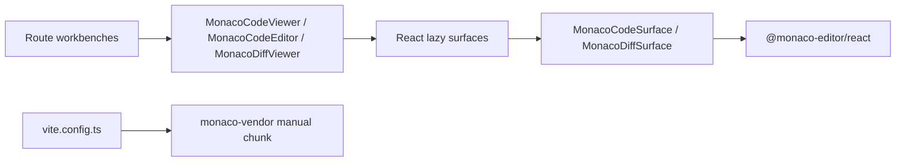
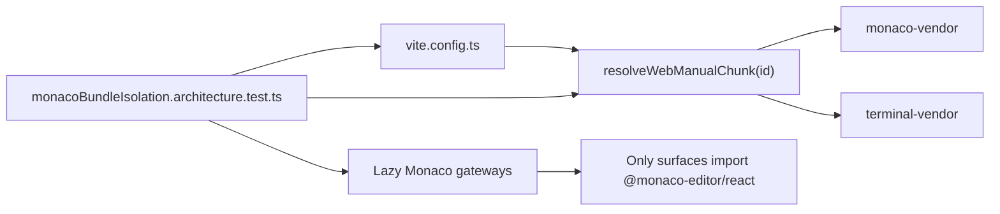

# F-17-E Monaco Bundle Isolation Plan

## Objective

Make Monaco bundle isolation a governed, testable rule instead of an implicit
Vite config detail. `Code`, `Diff`, `Artifacts`, and `Templates` may use the
shared lazy Monaco gateways, but route modules and Canvas modules must not pull
`@monaco-editor/react` into the normal route graph.

## Governing Sources

- `docs/planning/status/governance-document-rule-inventory.md`
- `docs/guides/ai-work-protocol.md`
- `docs/architecture/command-query-rail-governance.md`
- `docs/architecture/fowler-opportunity-planning-governance.md`
- `docs/planning/proposals/monaco-workbench-integration-rationale-20260402.md`
- `docs/architecture/components/web/workbench-ui-contract-and-component-inventory.md`

## Current State



The runtime shape is mostly correct, but the chunk decision is inline inside
`vite.config.ts`. That makes future drift easy: a contributor can change Vite
chunking without touching Monaco tests or docs.

## Target State



## Scope

Included:

- Extract a pure Vite manual chunk resolver.
- Add semantic tests for Monaco vendor isolation and lazy gateway boundaries.
- Add a Monaco bundle isolation component guide and user stories.
- Update the Monaco changed-suite routing so this guard stays close to Monaco
  edits.
- Update F-17 progress evidence.

Not included:

- Bundle-size budget enforcement.
- Real backend data contracts.
- New Monaco capabilities.
- Save/apply/persistence commands.
- Canvas layout changes.

## TDD Plan

1. Red: add `monacoBundleIsolation.architecture.test.ts` expecting a pure
   `resolveWebManualChunk` resolver and route-safe lazy Monaco boundaries.
2. Green: extract the resolver from `vite.config.ts` and wire it back into the
   Vite build output.
3. Refactor: include the guard in `vitest.suites.ts` Monaco focus routing and
   close documentation drift.

## Acceptance

- `@monaco-editor/react` resolves to `monaco-vendor`.
- `monaco-editor` resolves to `monaco-vendor`.
- `@xterm` still resolves to `terminal-vendor`.
- unrelated modules return `undefined`.
- `vite.config.ts` delegates chunk naming to `resolveWebManualChunk`.
- `MonacoCodeViewer`, `MonacoCodeEditor`, and `MonacoDiffViewer` keep
  `lazy(() => import(...Surface))`.
- Only `MonacoCodeSurface` and `MonacoDiffSurface` import
  `@monaco-editor/react`.

## Feature Mechanization Manifest

```feature-mechanization
version: 1
featureId: F17E-MONACO-BUNDLE-ISOLATION-20260522
mechanizationStatus: implemented
noHumanDecisionsRemaining: true
owner: Frontend / Architecture
implementationPlan: docs/planning/proposals/mandatory/frontend-and-ux/f17e-monaco-bundle-isolation-plan-20260522.md
componentGuides:
  - docs/architecture/components/web/monaco/monaco-bundle-isolation-component.md
userStories:
  - docs/architecture/components/web/monaco/monaco-bundle-isolation-user-stories.md
governingSources:
  - AGENTS.md
  - docs/planning/status/governance-document-rule-inventory.md
  - docs/guides/ai-work-protocol.md
  - docs/architecture/command-query-rail-governance.md
  - docs/architecture/fowler-opportunity-planning-governance.md
  - docs/planning/proposals/monaco-workbench-integration-rationale-20260402.md
allowedImplementationSurfaces:
  - apps/web/src/app/components/monaco/monacoBundleIsolation.architecture.test.ts
  - apps/web/vite.config.ts
  - apps/web/vite.manualChunks.ts
  - apps/web/vitest.suites.ts
  - buzon/20260522-f17e-fowler-monaco-bundle-isolation-analysis.md
  - docs/.manifest.json
  - docs/architecture/components/web/frontend-data-boundary-architecture.md
  - docs/architecture/components/web/index.md
  - docs/architecture/components/web/monaco/index.md
  - docs/architecture/components/web/monaco/monaco-bundle-isolation-component.md
  - docs/architecture/components/web/monaco/monaco-bundle-isolation-user-stories.md
  - docs/architecture/components/web/workbench-ui-contract-and-component-inventory.md
  - docs/planning/closeouts/20260522-f17e-monaco-bundle-isolation-closeout.md
  - docs/planning/proposals/mandatory/frontend-and-ux/f17e-monaco-bundle-isolation-plan-20260522.md
forbiddenImplementationSurfaces:
  - apps/api/**
  - packages/@dvt/contracts/**
  - packages/@dvt/engine/**
  - packages/@dvt/adapter-*/**
  - packages/@dvt/planner/**
commandQueryRails:
  - name: ResolveWebManualChunk
    type: query
    dddOwner: WebBuildConfiguration
domainObjects:
  - name: WebManualChunkResolver
    type: semantic configuration
    owner: apps/web
  - name: MonacoLazyGateway
    type: presentation gateway
    owner: apps/web
fowlerSignals:
  - Hidden config semantics
  - Heavy dependency drift
  - Semantic fitness function
architectureGuards:
  - pnpm --filter @dvt/web exec vitest run --config vitest.monaco.config.ts src/app/components/monaco/monacoBundleIsolation.architecture.test.ts
cypressFlows:
  - N/A - build configuration and architecture guard only
completionGate:
  - pnpm docs:feature-mechanization -- --feature F17E-MONACO-BUNDLE-ISOLATION-20260522
  - pnpm docs:feature-mechanization:implementation -- --feature F17E-MONACO-BUNDLE-ISOLATION-20260522
  - pnpm --filter @dvt/web exec vitest run --config vitest.monaco.config.ts src/app/components/monaco/monacoBundleIsolation.architecture.test.ts
  - pnpm --filter @dvt/web exec vitest run --config vitest.architecture.config.ts src/testing/vitestSuites.architecture.test.ts
  - pnpm --filter @dvt/web typecheck
  - pnpm --filter @dvt/web lint
  - pnpm docs:sync
  - pnpm docs:status:generate
  - pnpm governance:refresh
  - pnpm verify:prepush
redGreenCycles:
  - id: f17e-monaco-manual-chunk-resolver
    redTest: pnpm --filter @dvt/web exec vitest run --config vitest.monaco.config.ts src/app/components/monaco/monacoBundleIsolation.architecture.test.ts
    expectedFailure: Missing resolveWebManualChunk API and inline Vite chunk semantics.
    patchSurfaces:
      - apps/web/vite.manualChunks.ts
      - apps/web/vite.config.ts
      - apps/web/src/app/components/monaco/monacoBundleIsolation.architecture.test.ts
    greenTest: pnpm --filter @dvt/web exec vitest run --config vitest.monaco.config.ts src/app/components/monaco/monacoBundleIsolation.architecture.test.ts
symbols:
  - name: resolveWebManualChunk
    path: apps/web/vite.manualChunks.ts
    dddOwner: Web build configuration
    cqRails: [ResolveWebManualChunk]
    fowlerSignals: [Semantic Configuration]
    architectureGuard: pnpm --filter @dvt/web exec vitest run --config vitest.monaco.config.ts src/app/components/monaco/monacoBundleIsolation.architecture.test.ts
    cypressCoverage: N/A
    unitTests: [pnpm --filter @dvt/web exec vitest run --config vitest.monaco.config.ts src/app/components/monaco/monacoBundleIsolation.architecture.test.ts]
  - name: APP_ROOT
    path: apps/web/src/app/components/monaco/monacoBundleIsolation.architecture.test.ts
    dddOwner: Monaco bundle isolation architecture test support
    cqRails: [ResolveWebManualChunk]
    fowlerSignals: [Semantic Fitness Function]
    architectureGuard: pnpm --filter @dvt/web exec vitest run --config vitest.monaco.config.ts src/app/components/monaco/monacoBundleIsolation.architecture.test.ts
    cypressCoverage: N/A
    unitTests: [pnpm --filter @dvt/web exec vitest run --config vitest.monaco.config.ts src/app/components/monaco/monacoBundleIsolation.architecture.test.ts]
  - name: REPO_ROOT
    path: apps/web/src/app/components/monaco/monacoBundleIsolation.architecture.test.ts
    dddOwner: Monaco bundle isolation architecture test support
    cqRails: [ResolveWebManualChunk]
    fowlerSignals: [Semantic Fitness Function]
    architectureGuard: pnpm --filter @dvt/web exec vitest run --config vitest.monaco.config.ts src/app/components/monaco/monacoBundleIsolation.architecture.test.ts
    cypressCoverage: N/A
    unitTests: [pnpm --filter @dvt/web exec vitest run --config vitest.monaco.config.ts src/app/components/monaco/monacoBundleIsolation.architecture.test.ts]
  - name: readAppSource
    path: apps/web/src/app/components/monaco/monacoBundleIsolation.architecture.test.ts
    dddOwner: Monaco bundle isolation architecture test support
    cqRails: [ResolveWebManualChunk]
    fowlerSignals: [Semantic Fitness Function]
    architectureGuard: pnpm --filter @dvt/web exec vitest run --config vitest.monaco.config.ts src/app/components/monaco/monacoBundleIsolation.architecture.test.ts
    cypressCoverage: N/A
    unitTests: [pnpm --filter @dvt/web exec vitest run --config vitest.monaco.config.ts src/app/components/monaco/monacoBundleIsolation.architecture.test.ts]
  - name: readRepoDoc
    path: apps/web/src/app/components/monaco/monacoBundleIsolation.architecture.test.ts
    dddOwner: Monaco bundle isolation architecture test support
    cqRails: [ResolveWebManualChunk]
    fowlerSignals: [Semantic Fitness Function]
    architectureGuard: pnpm --filter @dvt/web exec vitest run --config vitest.monaco.config.ts src/app/components/monaco/monacoBundleIsolation.architecture.test.ts
    cypressCoverage: N/A
    unitTests: [pnpm --filter @dvt/web exec vitest run --config vitest.monaco.config.ts src/app/components/monaco/monacoBundleIsolation.architecture.test.ts]
```
