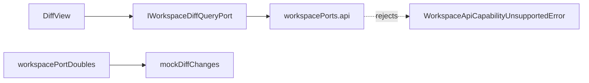
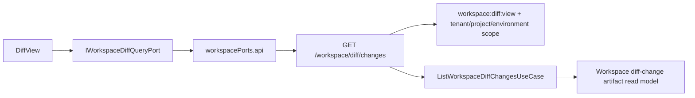

# F-17-F Workspace Diff Backend Rail Plan

## Objective

Move `GetWorkspaceDiffChanges` out of the web API adapter's unsupported
posture and onto a protected runtime query rail, so the Monaco Diff route reads
backend-owned diff data instead of fixture-only data.

## Governing Sources

- `docs/planning/status/governance-document-rule-inventory.md`
- `docs/guides/ai-work-protocol.md`
- `docs/architecture/command-query-rail-governance.md`
- `docs/architecture/fowler-opportunity-planning-governance.md`
- `docs/planning/proposals/monaco-workbench-integration-rationale-20260402.md`
- `docs/architecture/components/web/diff/diff-monaco-review-surface-component.md`
- `docs/architecture/components/web/workspace/workspace-port-decomposition-component.md`

## Current State



## Target State



## Scope

Included:

- `GetWorkspaceDiffChanges` protected runtime query rail catalog entry.
- `GET /workspace/diff/changes` route with the same scoped authorization shape
  as workspace file reads.
- API and web adapters for `DiffChange[]`.
- Tests for success, denial, missing token, missing scope, and malformed diff
  artifact data.
- Documentation updates for Diff and workspace port components.

Not included:

- apply/save diff commands;
- generic diff engine;
- run-to-run artifact comparison;
- contracts package promotion;
- persistence or historical diff storage.

## TDD Plan

1. Red: API route test expects scoped `GET /workspace/diff/changes` to return
   backend diff changes and fail closed on auth/scope errors.
2. Red: web adapter test expects `createApiWorkspaceDiffQueryPort` to call the
   scoped endpoint instead of rejecting before transport.
3. Red: architecture test expects the command/query rail catalog and protected
   route registration.
4. Green: add the route, use case, repository port, local artifact repository,
   web HTTP endpoint helper, and auth action.
5. Refactor: extract duplicated workspace scope parsing only if the green code
   repeats policy mechanics materially.

## Acceptance

- API mode no longer rejects `workspace.diffChanges` before transport.
- The route requires bearer authentication.
- The route requires tenant, project, and environment scope query parameters.
- The route authorizes `workspace:diff:view`.
- Missing diff-change artifact data produces an empty authoritative read model.
- Malformed diff-change artifact data fails closed with a canonical bad-request
  envelope.

## Feature Mechanization Manifest

```feature-mechanization
version: 1
featureId: F17F-WORKSPACE-DIFF-BACKEND-RAIL-20260522
mechanizationStatus: implemented
noHumanDecisionsRemaining: true
owner: Frontend / API / Architecture
implementationPlan: docs/planning/proposals/mandatory/frontend-and-ux/f17f-workspace-diff-backend-rail-plan-20260522.md
componentGuides:
  - docs/architecture/components/web/diff/diff-monaco-review-surface-component.md
  - docs/architecture/components/web/workspace/workspace-port-decomposition-component.md
userStories:
  - docs/architecture/components/web/diff/workspace-diff-backend-rail-user-stories.md
governingSources:
  - AGENTS.md
  - docs/planning/status/governance-document-rule-inventory.md
  - docs/guides/ai-work-protocol.md
  - docs/architecture/command-query-rail-governance.md
  - docs/architecture/fowler-opportunity-planning-governance.md
allowedImplementationSurfaces:
  - apps/api/src/application/ports/accessDecisionActions.ts
  - apps/api/src/application/ports/protectedRuntimeRailVocabulary.ts
  - apps/api/src/application/ports/protectedRuntimeWorkspaceCommandQueryRails.ts
  - apps/api/src/application/ports/workspaceDiffChanges.ts
  - apps/api/src/application/services/listWorkspaceDiffChangesUseCase.ts
  - apps/api/src/entrypoints/http/httpErrorReasonCatalog.ts
  - apps/api/src/entrypoints/http/registerProtectedRuntimeRoutes.ts
  - apps/api/src/entrypoints/http/runtimeRoutes.constants.ts
  - apps/api/src/entrypoints/http/workspaceDiffChangesRouteGroup.ts
  - apps/api/src/entrypoints/http/workspaceDiffChangesRoutes.ts
  - apps/api/src/infrastructure/workspaceDiffChanges/LocalWorkspaceDiffChangesRepository.ts
  - apps/api/test/architecture/workspaceDiffChangesQueryRail.architecture.test.ts
  - apps/api/test/entrypoints/http/protectedRuntimeRouteGroup.architecture.test.ts
  - apps/api/test/entrypoints/http/registerProtectedRuntimeRoutes.test.ts
  - apps/api/test/entrypoints/http/workspaceDiffChangesRoutes.test.ts
  - apps/web/src/app/services/workspace/workspaceDiffChangesHttp.ts
  - apps/web/src/app/services/workspace/workspacePorts.api.ts
  - apps/web/src/app/services/workspace/workspacePorts.api.test.ts
  - apps/web/src/app/services/workspace/workspacePorts.ts
  - apps/web/src/app/services/workspace/workspacePortsApi.test.harness.ts
  - buzon/20260522-f17f-fowler-workspace-diff-backend-rail-analysis.md
  - docs/architecture/components/web/diff/diff-monaco-review-surface-component.md
  - docs/architecture/components/web/diff/workspace-diff-backend-rail-user-stories.md
  - docs/architecture/components/web/workspace/workspace-port-decomposition-component.md
  - docs/planning/closeouts/20260522-f17f-workspace-diff-backend-rail-closeout.md
  - docs/planning/proposals/mandatory/frontend-and-ux/f17f-workspace-diff-backend-rail-plan-20260522.md
  - scripts/run-dev-stack.auth.cjs
  - scripts/run-dev-stack.auth.test.cjs
forbiddenImplementationSurfaces:
  - packages/@dvt/contracts/**
  - packages/@dvt/engine/**
  - packages/@dvt/adapter-*/**
  - packages/@dvt/planner/**
commandQueryRails:
  - name: GetWorkspaceDiffChanges
    type: query
    dddOwner: Operational evidence read models
domainObjects:
  - name: WorkspaceDiffChanges
    type: read model
    owner: apps/api
  - name: WorkspaceDiffChange
    type: read model row
    owner: apps/api
  - name: WorkspaceDiffChangesScope
    type: scope value
    owner: apps/web
fowlerSignals:
  - Primitive obsession
  - Feature envy
  - Documentation drift
  - Semantic fitness function
architectureGuards:
  - pnpm exec vitest run --config vitest.config.ts test/architecture/workspaceDiffChangesQueryRail.architecture.test.ts
cypressFlows:
  - N/A - protected API rail and adapter tests cover this backend slice
completionGate:
  - pnpm docs:feature-mechanization -- --feature F17F-WORKSPACE-DIFF-BACKEND-RAIL-20260522
  - pnpm docs:feature-mechanization:implementation -- --feature F17F-WORKSPACE-DIFF-BACKEND-RAIL-20260522
  - pnpm exec vitest run --config vitest.config.ts test/entrypoints/http/workspaceDiffChangesRoutes.test.ts test/architecture/workspaceDiffChangesQueryRail.architecture.test.ts
  - pnpm exec vitest run --config vitest.unit.config.ts src/app/services/workspace/workspacePorts.api.test.ts
  - pnpm typecheck
  - pnpm lint
  - pnpm verify:prepush
redGreenCycles:
  - id: f17f-workspace-diff-api-rail
    redTest: pnpm exec vitest run --config vitest.config.ts test/entrypoints/http/workspaceDiffChangesRoutes.test.ts test/architecture/workspaceDiffChangesQueryRail.architecture.test.ts
    expectedFailure: Missing route group, use case, repository, and cataloged protected runtime rail.
    patchSurfaces:
      - apps/api/src/application/ports/workspaceDiffChanges.ts
      - apps/api/src/application/services/listWorkspaceDiffChangesUseCase.ts
      - apps/api/src/entrypoints/http/workspaceDiffChangesRoutes.ts
      - apps/api/src/entrypoints/http/workspaceDiffChangesRouteGroup.ts
      - apps/api/src/infrastructure/workspaceDiffChanges/LocalWorkspaceDiffChangesRepository.ts
    greenTest: pnpm exec vitest run --config vitest.config.ts test/entrypoints/http/workspaceDiffChangesRoutes.test.ts test/architecture/workspaceDiffChangesQueryRail.architecture.test.ts
  - id: f17f-workspace-diff-web-adapter
    redTest: pnpm exec vitest run --config vitest.unit.config.ts src/app/services/workspace/workspacePorts.api.test.ts
    expectedFailure: Missing scoped workspace diff endpoint helper and transport-backed diff query port.
    patchSurfaces:
      - apps/web/src/app/services/workspace/workspaceDiffChangesHttp.ts
      - apps/web/src/app/services/workspace/workspacePorts.api.ts
      - apps/web/src/app/services/workspace/workspacePorts.ts
      - apps/web/src/app/services/workspace/workspacePortsApi.test.harness.ts
    greenTest: pnpm exec vitest run --config vitest.unit.config.ts src/app/services/workspace/workspacePorts.api.test.ts
symbols:
  - name: WorkspaceDiffChangeType
    path: apps/api/src/application/ports/workspaceDiffChanges.ts
    dddOwner: Operational evidence read models
    cqRails: [GetWorkspaceDiffChanges]
    fowlerSignals: [Introduce Value Object]
    architectureGuard: pnpm exec vitest run --config vitest.config.ts test/architecture/workspaceDiffChangesQueryRail.architecture.test.ts
    cypressCoverage: N/A
    unitTests: [pnpm exec vitest run --config vitest.config.ts test/entrypoints/http/workspaceDiffChangesRoutes.test.ts]
  - name: WorkspaceDiffChangeSeverity
    path: apps/api/src/application/ports/workspaceDiffChanges.ts
    dddOwner: Operational evidence read models
    cqRails: [GetWorkspaceDiffChanges]
    fowlerSignals: [Introduce Value Object]
    architectureGuard: pnpm exec vitest run --config vitest.config.ts test/architecture/workspaceDiffChangesQueryRail.architecture.test.ts
    cypressCoverage: N/A
    unitTests: [pnpm exec vitest run --config vitest.config.ts test/entrypoints/http/workspaceDiffChangesRoutes.test.ts]
  - name: WorkspaceDiffChange
    path: apps/api/src/application/ports/workspaceDiffChanges.ts
    dddOwner: Operational evidence read models
    cqRails: [GetWorkspaceDiffChanges]
    fowlerSignals: [Introduce Read Model]
    architectureGuard: pnpm exec vitest run --config vitest.config.ts test/architecture/workspaceDiffChangesQueryRail.architecture.test.ts
    cypressCoverage: N/A
    unitTests: [pnpm exec vitest run --config vitest.config.ts test/entrypoints/http/workspaceDiffChangesRoutes.test.ts]
  - name: InvalidWorkspaceDiffChangesError
    path: apps/api/src/application/ports/workspaceDiffChanges.ts
    dddOwner: Operational evidence read models
    cqRails: [GetWorkspaceDiffChanges]
    fowlerSignals: [Fail Closed]
    architectureGuard: pnpm exec vitest run --config vitest.config.ts test/architecture/workspaceDiffChangesQueryRail.architecture.test.ts
    cypressCoverage: N/A
    unitTests: [pnpm exec vitest run --config vitest.config.ts test/entrypoints/http/workspaceDiffChangesRoutes.test.ts]
  - name: IWorkspaceDiffChangesRepository
    path: apps/api/src/application/ports/workspaceDiffChanges.ts
    dddOwner: Operational evidence read models
    cqRails: [GetWorkspaceDiffChanges]
    fowlerSignals: [Repository]
    architectureGuard: pnpm exec vitest run --config vitest.config.ts test/architecture/workspaceDiffChangesQueryRail.architecture.test.ts
    cypressCoverage: N/A
    unitTests: [pnpm exec vitest run --config vitest.config.ts test/entrypoints/http/workspaceDiffChangesRoutes.test.ts]
  - name: ListWorkspaceDiffChangesUseCase
    path: apps/api/src/application/services/listWorkspaceDiffChangesUseCase.ts
    dddOwner: Operational evidence read models
    cqRails: [GetWorkspaceDiffChanges]
    fowlerSignals: [Service Layer]
    architectureGuard: pnpm exec vitest run --config vitest.config.ts test/architecture/workspaceDiffChangesQueryRail.architecture.test.ts
    cypressCoverage: N/A
    unitTests: [pnpm exec vitest run --config vitest.config.ts test/entrypoints/http/workspaceDiffChangesRoutes.test.ts]
  - name: ProtectedWorkspaceDiffChangesRouteGroupOptions
    path: apps/api/src/entrypoints/http/workspaceDiffChangesRouteGroup.ts
    dddOwner: Protected runtime route composition
    cqRails: [GetWorkspaceDiffChanges]
    fowlerSignals: [Gateway]
    architectureGuard: pnpm exec vitest run --config vitest.config.ts test/architecture/workspaceDiffChangesQueryRail.architecture.test.ts
    cypressCoverage: N/A
    unitTests: [pnpm exec vitest run --config vitest.config.ts test/entrypoints/http/workspaceDiffChangesRoutes.test.ts]
  - name: RuntimeAuth
    path: apps/api/src/entrypoints/http/workspaceDiffChangesRouteGroup.ts
    dddOwner: Protected runtime route composition
    cqRails: [GetWorkspaceDiffChanges]
    fowlerSignals: [Gateway]
    architectureGuard: pnpm exec vitest run --config vitest.config.ts test/architecture/workspaceDiffChangesQueryRail.architecture.test.ts
    cypressCoverage: N/A
    unitTests: [pnpm exec vitest run --config vitest.config.ts test/entrypoints/http/workspaceDiffChangesRoutes.test.ts]
  - name: registerProtectedWorkspaceDiffChangesRouteGroup
    path: apps/api/src/entrypoints/http/workspaceDiffChangesRouteGroup.ts
    dddOwner: Protected runtime route composition
    cqRails: [GetWorkspaceDiffChanges]
    fowlerSignals: [Gateway]
    architectureGuard: pnpm exec vitest run --config vitest.config.ts test/architecture/workspaceDiffChangesQueryRail.architecture.test.ts
    cypressCoverage: N/A
    unitTests: [pnpm exec vitest run --config vitest.config.ts test/entrypoints/http/registerProtectedRuntimeRoutes.test.ts]
  - name: resolveWorkspaceDiffChangesRoot
    path: apps/api/src/entrypoints/http/workspaceDiffChangesRouteGroup.ts
    dddOwner: Protected runtime route composition
    cqRails: [GetWorkspaceDiffChanges]
    fowlerSignals: [Extract Function]
    architectureGuard: pnpm exec vitest run --config vitest.config.ts test/architecture/workspaceDiffChangesQueryRail.architecture.test.ts
    cypressCoverage: N/A
    unitTests: [pnpm exec vitest run --config vitest.config.ts test/entrypoints/http/workspaceDiffChangesRoutes.test.ts]
  - name: WorkspaceDiffChangesQuery
    path: apps/api/src/entrypoints/http/workspaceDiffChangesRoutes.ts
    dddOwner: Protected runtime HTTP adapter
    cqRails: [GetWorkspaceDiffChanges]
    fowlerSignals: [Introduce Parameter Object]
    architectureGuard: pnpm exec vitest run --config vitest.config.ts test/architecture/workspaceDiffChangesQueryRail.architecture.test.ts
    cypressCoverage: N/A
    unitTests: [pnpm exec vitest run --config vitest.config.ts test/entrypoints/http/workspaceDiffChangesRoutes.test.ts]
  - name: WorkspaceDiffChangesRouteDeps
    path: apps/api/src/entrypoints/http/workspaceDiffChangesRoutes.ts
    dddOwner: Protected runtime HTTP adapter
    cqRails: [GetWorkspaceDiffChanges]
    fowlerSignals: [Introduce Parameter Object]
    architectureGuard: pnpm exec vitest run --config vitest.config.ts test/architecture/workspaceDiffChangesQueryRail.architecture.test.ts
    cypressCoverage: N/A
    unitTests: [pnpm exec vitest run --config vitest.config.ts test/entrypoints/http/workspaceDiffChangesRoutes.test.ts]
  - name: authorizeWorkspaceDiffChangesRequest
    path: apps/api/src/entrypoints/http/workspaceDiffChangesRoutes.ts
    dddOwner: Protected runtime HTTP adapter
    cqRails: [GetWorkspaceDiffChanges]
    fowlerSignals: [Fail Closed]
    architectureGuard: pnpm exec vitest run --config vitest.config.ts test/architecture/workspaceDiffChangesQueryRail.architecture.test.ts
    cypressCoverage: N/A
    unitTests: [pnpm exec vitest run --config vitest.config.ts test/entrypoints/http/workspaceDiffChangesRoutes.test.ts]
  - name: parseRequestedScope
    path: apps/api/src/entrypoints/http/workspaceDiffChangesRoutes.ts
    dddOwner: Protected runtime HTTP adapter
    cqRails: [GetWorkspaceDiffChanges]
    fowlerSignals: [Validation Boundary]
    architectureGuard: pnpm exec vitest run --config vitest.config.ts test/architecture/workspaceDiffChangesQueryRail.architecture.test.ts
    cypressCoverage: N/A
    unitTests: [pnpm exec vitest run --config vitest.config.ts test/entrypoints/http/workspaceDiffChangesRoutes.test.ts]
  - name: parseRequiredTenantId
    path: apps/api/src/entrypoints/http/workspaceDiffChangesRoutes.ts
    dddOwner: Protected runtime HTTP adapter
    cqRails: [GetWorkspaceDiffChanges]
    fowlerSignals: [Validation Boundary]
    architectureGuard: pnpm exec vitest run --config vitest.config.ts test/architecture/workspaceDiffChangesQueryRail.architecture.test.ts
    cypressCoverage: N/A
    unitTests: [pnpm exec vitest run --config vitest.config.ts test/entrypoints/http/workspaceDiffChangesRoutes.test.ts]
  - name: parseRequiredProjectId
    path: apps/api/src/entrypoints/http/workspaceDiffChangesRoutes.ts
    dddOwner: Protected runtime HTTP adapter
    cqRails: [GetWorkspaceDiffChanges]
    fowlerSignals: [Validation Boundary]
    architectureGuard: pnpm exec vitest run --config vitest.config.ts test/architecture/workspaceDiffChangesQueryRail.architecture.test.ts
    cypressCoverage: N/A
    unitTests: [pnpm exec vitest run --config vitest.config.ts test/entrypoints/http/workspaceDiffChangesRoutes.test.ts]
  - name: parseRequiredEnvironmentId
    path: apps/api/src/entrypoints/http/workspaceDiffChangesRoutes.ts
    dddOwner: Protected runtime HTTP adapter
    cqRails: [GetWorkspaceDiffChanges]
    fowlerSignals: [Validation Boundary]
    architectureGuard: pnpm exec vitest run --config vitest.config.ts test/architecture/workspaceDiffChangesQueryRail.architecture.test.ts
    cypressCoverage: N/A
    unitTests: [pnpm exec vitest run --config vitest.config.ts test/entrypoints/http/workspaceDiffChangesRoutes.test.ts]
  - name: registerWorkspaceDiffChangesRoutes
    path: apps/api/src/entrypoints/http/workspaceDiffChangesRoutes.ts
    dddOwner: Protected runtime HTTP adapter
    cqRails: [GetWorkspaceDiffChanges]
    fowlerSignals: [Gateway]
    architectureGuard: pnpm exec vitest run --config vitest.config.ts test/architecture/workspaceDiffChangesQueryRail.architecture.test.ts
    cypressCoverage: N/A
    unitTests: [pnpm exec vitest run --config vitest.config.ts test/entrypoints/http/workspaceDiffChangesRoutes.test.ts]
  - name: DEFAULT_DIFF_CHANGES_PATH
    path: apps/api/src/infrastructure/workspaceDiffChanges/LocalWorkspaceDiffChangesRepository.ts
    dddOwner: Operational evidence read models
    cqRails: [GetWorkspaceDiffChanges]
    fowlerSignals: [Semantic Configuration]
    architectureGuard: pnpm exec vitest run --config vitest.config.ts test/architecture/workspaceDiffChangesQueryRail.architecture.test.ts
    cypressCoverage: N/A
    unitTests: [pnpm exec vitest run --config vitest.config.ts test/entrypoints/http/workspaceDiffChangesRoutes.test.ts]
  - name: CHANGE_TYPES
    path: apps/api/src/infrastructure/workspaceDiffChanges/LocalWorkspaceDiffChangesRepository.ts
    dddOwner: Operational evidence read models
    cqRails: [GetWorkspaceDiffChanges]
    fowlerSignals: [Validation Boundary]
    architectureGuard: pnpm exec vitest run --config vitest.config.ts test/architecture/workspaceDiffChangesQueryRail.architecture.test.ts
    cypressCoverage: N/A
    unitTests: [pnpm exec vitest run --config vitest.config.ts test/entrypoints/http/workspaceDiffChangesRoutes.test.ts]
  - name: SEVERITIES
    path: apps/api/src/infrastructure/workspaceDiffChanges/LocalWorkspaceDiffChangesRepository.ts
    dddOwner: Operational evidence read models
    cqRails: [GetWorkspaceDiffChanges]
    fowlerSignals: [Validation Boundary]
    architectureGuard: pnpm exec vitest run --config vitest.config.ts test/architecture/workspaceDiffChangesQueryRail.architecture.test.ts
    cypressCoverage: N/A
    unitTests: [pnpm exec vitest run --config vitest.config.ts test/entrypoints/http/workspaceDiffChangesRoutes.test.ts]
  - name: LocalWorkspaceDiffChangesRepository
    path: apps/api/src/infrastructure/workspaceDiffChanges/LocalWorkspaceDiffChangesRepository.ts
    dddOwner: Operational evidence read models
    cqRails: [GetWorkspaceDiffChanges]
    fowlerSignals: [Repository]
    architectureGuard: pnpm exec vitest run --config vitest.config.ts test/architecture/workspaceDiffChangesQueryRail.architecture.test.ts
    cypressCoverage: N/A
    unitTests: [pnpm exec vitest run --config vitest.config.ts test/entrypoints/http/workspaceDiffChangesRoutes.test.ts]
  - name: parseWorkspaceDiffChanges
    path: apps/api/src/infrastructure/workspaceDiffChanges/LocalWorkspaceDiffChangesRepository.ts
    dddOwner: Operational evidence read models
    cqRails: [GetWorkspaceDiffChanges]
    fowlerSignals: [Validation Boundary]
    architectureGuard: pnpm exec vitest run --config vitest.config.ts test/architecture/workspaceDiffChangesQueryRail.architecture.test.ts
    cypressCoverage: N/A
    unitTests: [pnpm exec vitest run --config vitest.config.ts test/entrypoints/http/workspaceDiffChangesRoutes.test.ts]
  - name: parseWorkspaceDiffChange
    path: apps/api/src/infrastructure/workspaceDiffChanges/LocalWorkspaceDiffChangesRepository.ts
    dddOwner: Operational evidence read models
    cqRails: [GetWorkspaceDiffChanges]
    fowlerSignals: [Validation Boundary]
    architectureGuard: pnpm exec vitest run --config vitest.config.ts test/architecture/workspaceDiffChangesQueryRail.architecture.test.ts
    cypressCoverage: N/A
    unitTests: [pnpm exec vitest run --config vitest.config.ts test/entrypoints/http/workspaceDiffChangesRoutes.test.ts]
  - name: isNodeError
    path: apps/api/src/infrastructure/workspaceDiffChanges/LocalWorkspaceDiffChangesRepository.ts
    dddOwner: Operational evidence read models
    cqRails: [GetWorkspaceDiffChanges]
    fowlerSignals: [Fail Closed]
    architectureGuard: pnpm exec vitest run --config vitest.config.ts test/architecture/workspaceDiffChangesQueryRail.architecture.test.ts
    cypressCoverage: N/A
    unitTests: [pnpm exec vitest run --config vitest.config.ts test/entrypoints/http/workspaceDiffChangesRoutes.test.ts]
  - name: repoRoot
    path: apps/api/test/architecture/workspaceDiffChangesQueryRail.architecture.test.ts
    dddOwner: Workspace diff architecture guard
    cqRails: [GetWorkspaceDiffChanges]
    fowlerSignals: [Semantic Fitness Function]
    architectureGuard: pnpm exec vitest run --config vitest.config.ts test/architecture/workspaceDiffChangesQueryRail.architecture.test.ts
    cypressCoverage: N/A
    unitTests: [pnpm exec vitest run --config vitest.config.ts test/architecture/workspaceDiffChangesQueryRail.architecture.test.ts]
  - name: read
    path: apps/api/test/architecture/workspaceDiffChangesQueryRail.architecture.test.ts
    dddOwner: Workspace diff architecture guard
    cqRails: [GetWorkspaceDiffChanges]
    fowlerSignals: [Semantic Fitness Function]
    architectureGuard: pnpm exec vitest run --config vitest.config.ts test/architecture/workspaceDiffChangesQueryRail.architecture.test.ts
    cypressCoverage: N/A
    unitTests: [pnpm exec vitest run --config vitest.config.ts test/architecture/workspaceDiffChangesQueryRail.architecture.test.ts]
  - name: SCOPE_QUERY
    path: apps/api/test/entrypoints/http/workspaceDiffChangesRoutes.test.ts
    dddOwner: Workspace diff route test fixture
    cqRails: [GetWorkspaceDiffChanges]
    fowlerSignals: [Test Fixture]
    architectureGuard: pnpm exec vitest run --config vitest.config.ts test/architecture/workspaceDiffChangesQueryRail.architecture.test.ts
    cypressCoverage: N/A
    unitTests: [pnpm exec vitest run --config vitest.config.ts test/entrypoints/http/workspaceDiffChangesRoutes.test.ts]
  - name: principal
    path: apps/api/test/entrypoints/http/workspaceDiffChangesRoutes.test.ts
    dddOwner: Workspace diff route test fixture
    cqRails: [GetWorkspaceDiffChanges]
    fowlerSignals: [Test Fixture]
    architectureGuard: pnpm exec vitest run --config vitest.config.ts test/architecture/workspaceDiffChangesQueryRail.architecture.test.ts
    cypressCoverage: N/A
    unitTests: [pnpm exec vitest run --config vitest.config.ts test/entrypoints/http/workspaceDiffChangesRoutes.test.ts]
  - name: WORKSPACE_DIFF_CHANGES_ENDPOINT
    path: apps/web/src/app/services/workspace/workspaceDiffChangesHttp.ts
    dddOwner: Web workspace diff API adapter
    cqRails: [GetWorkspaceDiffChanges]
    fowlerSignals: [Semantic Configuration]
    architectureGuard: pnpm exec vitest run --config vitest.config.ts test/architecture/workspaceDiffChangesQueryRail.architecture.test.ts
    cypressCoverage: N/A
    unitTests: [pnpm exec vitest run --config vitest.unit.config.ts src/app/services/workspace/workspacePorts.api.test.ts]
  - name: WorkspaceDiffChangesScope
    path: apps/web/src/app/services/workspace/workspaceDiffChangesHttp.ts
    dddOwner: Web workspace diff API adapter
    cqRails: [GetWorkspaceDiffChanges]
    fowlerSignals: [Introduce Parameter Object]
    architectureGuard: pnpm exec vitest run --config vitest.config.ts test/architecture/workspaceDiffChangesQueryRail.architecture.test.ts
    cypressCoverage: N/A
    unitTests: [pnpm exec vitest run --config vitest.unit.config.ts src/app/services/workspace/workspacePorts.api.test.ts]
  - name: readWorkspaceDiffChangesScope
    path: apps/web/src/app/services/workspace/workspaceDiffChangesHttp.ts
    dddOwner: Web workspace diff API adapter
    cqRails: [GetWorkspaceDiffChanges]
    fowlerSignals: [Gateway]
    architectureGuard: pnpm exec vitest run --config vitest.config.ts test/architecture/workspaceDiffChangesQueryRail.architecture.test.ts
    cypressCoverage: N/A
    unitTests: [pnpm exec vitest run --config vitest.unit.config.ts src/app/services/workspace/workspacePorts.api.test.ts]
  - name: buildWorkspaceDiffChangesEndpoint
    path: apps/web/src/app/services/workspace/workspaceDiffChangesHttp.ts
    dddOwner: Web workspace diff API adapter
    cqRails: [GetWorkspaceDiffChanges]
    fowlerSignals: [Gateway]
    architectureGuard: pnpm exec vitest run --config vitest.config.ts test/architecture/workspaceDiffChangesQueryRail.architecture.test.ts
    cypressCoverage: N/A
    unitTests: [pnpm exec vitest run --config vitest.unit.config.ts src/app/services/workspace/workspacePorts.api.test.ts]
  - name: createApiWorkspaceDiffQueryPort
    path: apps/web/src/app/services/workspace/workspacePorts.api.ts
    dddOwner: Web workspace diff API adapter
    cqRails: [GetWorkspaceDiffChanges]
    fowlerSignals: [Gateway]
    architectureGuard: pnpm exec vitest run --config vitest.config.ts test/architecture/workspaceDiffChangesQueryRail.architecture.test.ts
    cypressCoverage: N/A
    unitTests: [pnpm exec vitest run --config vitest.unit.config.ts src/app/services/workspace/workspacePorts.api.test.ts]
```
