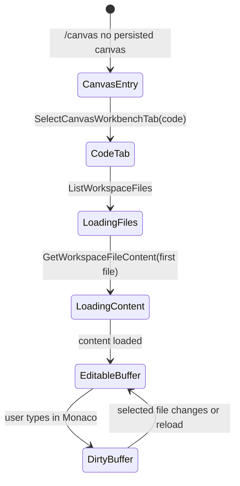
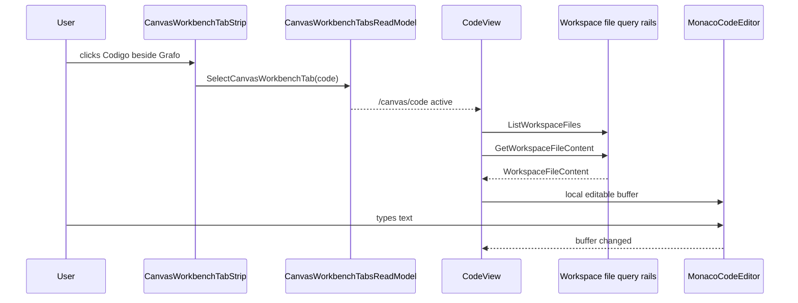

# F-17-G Code Monaco Editable Workspace Access Plan

## Think-First Analysis

Problem summary: `Code` already loads workspace files through governed query
rails, but Monaco is hard-coded as read-only and the Code tab disappears on the
Canvas first-document screen. Users cannot reach Monaco beside `Grafo` and
cannot type in the editor.

Root cause: previous Monaco work optimized for review surfaces and collapsed
the Monaco binding into a read-only viewer. Canvas workbench context also
treated every plugin tab as requiring a persisted canvas document, even though
Code reads workspace files and can be workspace-scoped.

Constraints and invariants:

- `ListWorkspaceFiles` and `GetWorkspaceFileContent` remain query rails.
- This slice does not create `SaveWorkspaceFileContent`.
- Code may own a route-local editable buffer, but not persistence authority.
- Artifacts remains a read-only Monaco viewer consumer.
- Canvas remains graph-first; Monaco does not become the Canvas route owner.
- Cypress must prove a user can open Monaco from the Canvas workbench and type.

## Pre-Implementation Brief

Mode: Full.

Scope:

- update Monaco rationale and Code component docs to distinguish viewer and
  editor consumers;
- make Code workspace-scoped in the Canvas workbench tab model;
- add an editable Monaco editor wrapper for Code;
- keep Artifacts on the read-only viewer wrapper;
- add Cypress coverage for visible Code access beside `Grafo` and typing;
- add a Monaco focus Vitest suite so changed-file routing stays small.

Out of scope:

- saving edited files;
- API file-write routes;
- contracts/packages changes;
- Canvas graph editing semantics;
- turning Canvas into an IDE shell;
- changing Diff review semantics.

## Fowler Opportunity Matrix

<!-- markdownlint-disable MD060 -->

| Scenario                                | Opportunity             | Fowler pattern               | DDD owner                            | Command/query rail                              | Implementation surfaces             | Unit or package test                         | Architecture test                                    | User-flow test                         | Out of scope                                  |
| --------------------------------------- | ----------------------- | ---------------------------- | ------------------------------------ | ----------------------------------------------- | ----------------------------------- | -------------------------------------------- | ---------------------------------------------------- | -------------------------------------- | --------------------------------------------- |
| Code tab visible before canvas document | Boundary drift          | Context Object               | `CanvasWorkbenchTabsReadModel`       | `ListCanvasWorkbenchTabs`                       | Canvas tab model/docs               | `canvasWorkbenchTabs.test.ts`                | `canvasWorkbenchTabs.architecture.test.ts`           | `code-workbench-workspace-files.cy.ts` | Lineage/Diff/Artifacts before canvas document |
| Select Code beside Graph                | Hidden authority        | Command Object               | `CanvasWorkbenchTabSelectionCommand` | `SelectCanvasWorkbenchTab`                      | route state/tab strip               | `canvasWorkbenchRouteState.test.ts` existing | tab architecture guard                               | Cypress Code access proof              | global Code route                             |
| Type in Monaco                          | Responsibility overload | Gateway + Presentation Model | `CodeEditableBuffer`                 | none - route-local presentation only            | CodeView + Monaco components        | `CodeView.test.tsx`                          | `codeMonacoEditableAccess.architecture.test.ts`      | Cypress typing proof                   | save/apply/persist                            |
| Preserve read-only Artifacts            | Duplicate semantics     | Explicit consumer API        | `ArtifactMonacoPreviewPanel`         | `ListWorkspaceFiles`, `GetWorkspaceFileContent` | Artifacts Monaco panel              | `ArtifactMonacoPreviewPanel.test.tsx`        | `artifactsMonacoReadonlyViewer.architecture.test.ts` | existing Artifacts tests               | artifact editing                              |
| Reduce changed tests                    | Test-only confidence    | Suite partition              | `WebVitestChangedSuiteRouter`        | `RouteChangedWebVitestSuites`                   | Vitest suite catalog/config/scripts | `vitestSuites.architecture.test.ts`          | same                                                 | n/a                                    | reducing coverage                             |

<!-- markdownlint-enable MD060 -->

## State Model



## Component Flow



```feature-mechanization
version: 1
featureId: F17G-CODE-MONACO-EDITABLE-WORKSPACE-ACCESS-20260520
mechanizationStatus: implemented
noHumanDecisionsRemaining: true
implementationPlan: docs/planning/proposals/mandatory/frontend-and-ux/f17g-code-monaco-editable-workspace-access-plan-20260520.md
componentGuides:
  - docs/architecture/components/web/code-workbench-workspace-files-component.md
  - docs/architecture/components/web/graph/canvas-workbench-tabs-component.md
userStories:
  - docs/architecture/components/web/code-workbench-workspace-files-user-stories.md
  - docs/architecture/components/web/graph/canvas-workbench-tabs-user-stories.md
governingSources:
  - AGENTS.md
  - docs/planning/status/governance-document-rule-inventory.md
  - docs/guides/ai-work-protocol.md
  - docs/architecture/command-query-rail-governance.md
  - docs/architecture/fowler-opportunity-planning-governance.md
  - docs/planning/proposals/monaco-workbench-integration-rationale-20260402.md
allowedImplementationSurfaces:
  - apps/web/package.json
  - apps/web/vitest.suites.ts
  - apps/web/vitest.monaco.config.ts
  - apps/web/src/testing/vitestSuites.architecture.test.ts
  - apps/web/src/app/plugins/contracts/PluginManifest.ts
  - apps/web/src/app/plugins/dbt/dbtContributions.ts
  - apps/web/src/app/views/CodeView.tsx
  - apps/web/src/app/views/CodeView.test.tsx
  - apps/web/src/app/views/Canvas.tsx
  - apps/web/src/app/views/code/codeMonacoEditableAccess.architecture.test.ts
  - apps/web/src/app/views/code/codeViewCopy.ts
  - apps/web/src/app/views/canvas/CanvasShellMainPanel.tsx
  - apps/web/src/app/views/canvas/CanvasShell.test.tsx
  - apps/web/src/app/views/canvas/canvasWorkbenchTabs.ts
  - apps/web/src/app/views/canvas/canvasWorkbenchTabs.test.ts
  - apps/web/src/app/views/canvas/canvasWorkbenchTabs.architecture.test.ts
  - apps/web/src/app/components/monaco/MonacoCodeSurface.tsx
  - apps/web/src/app/components/monaco/MonacoCodeViewer.tsx
  - apps/web/src/app/components/monaco/MonacoCodeEditor.tsx
  - apps/web/src/app/views/artifacts/artifactsMonacoReadonlyViewer.architecture.test.ts
  - apps/web/cypress/e2e/canvas/code-workbench-workspace-files.cy.ts
  - docs/planning/proposals/monaco-workbench-integration-rationale-20260402.md
  - docs/planning/proposals/mandatory/frontend-and-ux/f17g-code-monaco-editable-workspace-access-plan-20260520.md
  - docs/architecture/components/web/code-workbench-workspace-files-component.md
  - docs/architecture/components/web/code-workbench-workspace-files-user-stories.md
  - docs/architecture/components/web/graph/canvas-workbench-tabs-component.md
  - docs/architecture/components/web/graph/canvas-workbench-tabs-user-stories.md
  - buzon/20260520-f17g-fowler-code-monaco-editable-workspace-access-analysis.md
forbiddenImplementationSurfaces:
  - packages/@dvt/contracts/**
  - packages/@dvt/engine/**
  - packages/@dvt/adapter-*/**
  - packages/@dvt/planner/**
  - apps/api/**
commandQueryRails:
  - name: ListCanvasWorkbenchTabs
    type: query
    dddOwner: CanvasWorkbenchTabsReadModel
  - name: SelectCanvasWorkbenchTab
    type: command
    dddOwner: CanvasWorkbenchTabSelectionCommand
  - name: ListWorkspaceFiles
    type: query
    dddOwner: WorkspaceFileTree
  - name: GetWorkspaceFileContent
    type: query
    dddOwner: WorkspaceFileContent
  - name: RouteChangedWebVitestSuites
    type: query
    dddOwner: WebVitestChangedSuiteRouter
domainObjects:
  - name: CodeEditableBuffer
    type: presentation model
    owner: apps/web
  - name: MonacoCodeEditor
    type: presentation gateway
    owner: apps/web
  - name: CanvasWorkbenchTabScope
    type: value object
    owner: apps/web
fowlerSignals:
  - Boundary drift
  - Hidden authority
  - Documentation drift
  - Test-only confidence
architectureGuards:
  - pnpm --filter @dvt/web test -- src/app/views/code/codeMonacoEditableAccess.architecture.test.ts src/app/views/canvas/canvasWorkbenchTabs.architecture.test.ts src/app/views/artifacts/artifactsMonacoReadonlyViewer.architecture.test.ts src/testing/vitestSuites.architecture.test.ts
cypressFlows:
  - pnpm --filter @dvt/web test:e2e:native -- --spec cypress/e2e/canvas/code-workbench-workspace-files.cy.ts
completionGate:
  - pnpm docs:feature-mechanization -- --feature F17G-CODE-MONACO-EDITABLE-WORKSPACE-ACCESS-20260520
  - pnpm --filter @dvt/web test -- src/app/views/canvas/canvasWorkbenchTabs.test.ts src/app/views/CodeView.test.tsx src/app/views/code/codeMonacoEditableAccess.architecture.test.ts src/testing/vitestSuites.architecture.test.ts
  - pnpm --filter @dvt/web test:changed -- --files apps/web/src/app/components/monaco/MonacoCodeSurface.tsx apps/web/src/app/views/CodeView.tsx
  - pnpm --filter @dvt/web test:e2e:native -- --spec cypress/e2e/canvas/code-workbench-workspace-files.cy.ts
  - pnpm --filter @dvt/web typecheck
  - pnpm --filter @dvt/web lint
  - pnpm governance:refresh
  - pnpm verify:prepush
redGreenCycles:
  - id: f17g-code-workspace-scope
    redTest: pnpm --filter @dvt/web test -- src/app/views/canvas/canvasWorkbenchTabs.test.ts
    expectedFailure: Code is hidden when the canvas document context is unavailable.
    patchSurfaces:
      - apps/web/src/app/plugins/contracts/PluginManifest.ts
      - apps/web/src/app/plugins/dbt/dbtContributions.ts
      - apps/web/src/app/views/canvas/canvasWorkbenchTabs.ts
    greenTest: pnpm --filter @dvt/web test -- src/app/views/canvas/canvasWorkbenchTabs.test.ts
  - id: f17g-code-monaco-editor
    redTest: pnpm --filter @dvt/web test -- src/app/views/CodeView.test.tsx
    expectedFailure: Code renders a read-only Monaco viewer instead of an editable editor.
    patchSurfaces:
      - apps/web/src/app/views/CodeView.tsx
      - apps/web/src/app/components/monaco/MonacoCodeSurface.tsx
      - apps/web/src/app/components/monaco/MonacoCodeEditor.tsx
    greenTest: pnpm --filter @dvt/web test -- src/app/views/CodeView.test.tsx
  - id: f17g-cypress-monaco-typing
    redTest: pnpm --filter @dvt/web test:e2e:native -- --spec cypress/e2e/canvas/code-workbench-workspace-files.cy.ts
    expectedFailure: Monaco cannot be opened beside Graph and typed into from first-canvas state.
    patchSurfaces:
      - apps/web/cypress/e2e/canvas/code-workbench-workspace-files.cy.ts
    greenTest: pnpm --filter @dvt/web test:e2e:native -- --spec cypress/e2e/canvas/code-workbench-workspace-files.cy.ts
  - id: f17g-monaco-changed-suite
    redTest: pnpm --filter @dvt/web test -- src/testing/vitestSuites.architecture.test.ts
    expectedFailure: Monaco-related changed files route to the broad presentation suite.
    patchSurfaces:
      - apps/web/vitest.suites.ts
      - apps/web/vitest.monaco.config.ts
      - apps/web/package.json
      - apps/web/src/testing/vitestSuites.architecture.test.ts
    greenTest: pnpm --filter @dvt/web test -- src/testing/vitestSuites.architecture.test.ts
symbols:
  - name: MonacoCodeEditor
    path: apps/web/src/app/components/monaco/MonacoCodeEditor.tsx
    dddOwner: CodeEditableBuffer presentation gateway
    cqRails: [none - route-local presentation buffer only]
    fowlerSignals: [Gateway, Responsibility overload]
    architectureGuard: src/app/views/code/codeMonacoEditableAccess.architecture.test.ts
    cypressCoverage: cypress/e2e/canvas/code-workbench-workspace-files.cy.ts
    unitTests: [src/app/views/CodeView.test.tsx]
  - name: CanvasWorkbenchTabScope
    path: apps/web/src/app/plugins/contracts/PluginManifest.ts
    dddOwner: CanvasWorkbenchTabPlacement
    cqRails: [ListCanvasWorkbenchTabs]
    fowlerSignals: [Primitive obsession]
    architectureGuard: src/app/views/code/codeMonacoEditableAccess.architecture.test.ts
    cypressCoverage: cypress/e2e/canvas/code-workbench-workspace-files.cy.ts
    unitTests: [src/app/views/canvas/canvasWorkbenchTabs.test.ts]
  - name: isCanvasWorkbenchTabAvailableForContext
    path: apps/web/src/app/views/canvas/canvasWorkbenchTabs.ts
    dddOwner: CanvasWorkbenchTabsReadModel
    cqRails: [ListCanvasWorkbenchTabs]
    fowlerSignals: [Context Object]
    architectureGuard: src/app/views/code/codeMonacoEditableAccess.architecture.test.ts
    cypressCoverage: cypress/e2e/canvas/code-workbench-workspace-files.cy.ts
    unitTests: [src/app/views/canvas/canvasWorkbenchTabs.test.ts]
  - name: stubMissingCanvasDraft
    path: apps/web/cypress/e2e/canvas/code-workbench-workspace-files.cy.ts
    dddOwner: Cypress first-canvas route harness
    cqRails: [ListCanvasWorkbenchTabs]
    fowlerSignals: [Context Object]
    architectureGuard: src/app/views/code/codeMonacoEditableAccess.architecture.test.ts
    cypressCoverage: cypress/e2e/canvas/code-workbench-workspace-files.cy.ts
    unitTests: [cypress/e2e/canvas/code-workbench-workspace-files.cy.ts]
  - name: MonacoCodeEditorProps
    path: apps/web/src/app/components/monaco/MonacoCodeEditor.tsx
    dddOwner: CodeEditableBuffer presentation gateway
    cqRails: [none - route-local presentation buffer only]
    fowlerSignals: [Explicit interface]
    architectureGuard: src/app/views/code/codeMonacoEditableAccess.architecture.test.ts
    cypressCoverage: cypress/e2e/canvas/code-workbench-workspace-files.cy.ts
    unitTests: [src/app/views/CodeView.test.tsx]
  - name: MonacoCodeSurface
    path: apps/web/src/app/components/monaco/MonacoCodeEditor.tsx
    dddOwner: CodeEditableBuffer presentation gateway
    cqRails: [none - route-local presentation buffer only]
    fowlerSignals: [Gateway]
    architectureGuard: src/app/views/code/codeMonacoEditableAccess.architecture.test.ts
    cypressCoverage: cypress/e2e/canvas/code-workbench-workspace-files.cy.ts
    unitTests: [src/app/views/CodeView.test.tsx]
  - name: APP_ROOT
    path: apps/web/src/app/views/code/codeMonacoEditableAccess.architecture.test.ts
    dddOwner: Code Monaco semantic architecture guard
    cqRails: [RouteChangedWebVitestSuites]
    fowlerSignals: [Semantic fitness function]
    architectureGuard: src/app/views/code/codeMonacoEditableAccess.architecture.test.ts
    cypressCoverage: cypress/e2e/canvas/code-workbench-workspace-files.cy.ts
    unitTests: [src/app/views/code/codeMonacoEditableAccess.architecture.test.ts]
  - name: REPO_ROOT
    path: apps/web/src/app/views/code/codeMonacoEditableAccess.architecture.test.ts
    dddOwner: Code Monaco semantic architecture guard
    cqRails: [RouteChangedWebVitestSuites]
    fowlerSignals: [Semantic fitness function]
    architectureGuard: src/app/views/code/codeMonacoEditableAccess.architecture.test.ts
    cypressCoverage: cypress/e2e/canvas/code-workbench-workspace-files.cy.ts
    unitTests: [src/app/views/code/codeMonacoEditableAccess.architecture.test.ts]
  - name: readAppSource
    path: apps/web/src/app/views/code/codeMonacoEditableAccess.architecture.test.ts
    dddOwner: Code Monaco semantic architecture guard
    cqRails: [RouteChangedWebVitestSuites]
    fowlerSignals: [Semantic fitness function]
    architectureGuard: src/app/views/code/codeMonacoEditableAccess.architecture.test.ts
    cypressCoverage: cypress/e2e/canvas/code-workbench-workspace-files.cy.ts
    unitTests: [src/app/views/code/codeMonacoEditableAccess.architecture.test.ts]
  - name: readRepoDoc
    path: apps/web/src/app/views/code/codeMonacoEditableAccess.architecture.test.ts
    dddOwner: Code Monaco semantic architecture guard
    cqRails: [RouteChangedWebVitestSuites]
    fowlerSignals: [Semantic fitness function]
    architectureGuard: src/app/views/code/codeMonacoEditableAccess.architecture.test.ts
    cypressCoverage: cypress/e2e/canvas/code-workbench-workspace-files.cy.ts
    unitTests: [src/app/views/code/codeMonacoEditableAccess.architecture.test.ts]
  - name: isMonacoFocusPath
    path: apps/web/vitest.suites.ts
    dddOwner: WebVitestChangedSuiteRouter
    cqRails: [RouteChangedWebVitestSuites]
    fowlerSignals: [Test suite partition]
    architectureGuard: src/testing/vitestSuites.architecture.test.ts
    cypressCoverage: cypress/e2e/canvas/code-workbench-workspace-files.cy.ts
    unitTests: [src/testing/vitestSuites.architecture.test.ts]
```
