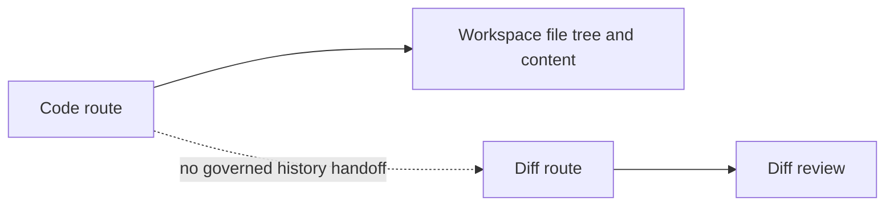
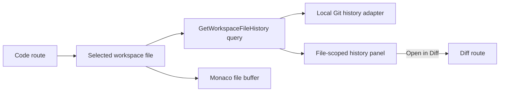

# F-23 Git File History Review Implementation Plan

## Objective

Add governed, file-scoped Git history review to `Code` and hand revision
comparison intent to the existing `Diff` route. The implementation must not
introduce a Git explorer, staging UI, commit UI, conflict resolver, or second
shell model.

## Governing Sources

- `docs/planning/status/governance-document-rule-inventory.md`
- `docs/guides/ai-work-protocol.md`
- `docs/architecture/command-query-rail-governance.md`
- `docs/architecture/fowler-opportunity-planning-governance.md`
- `docs/architecture/components/web/git/git-mode-architecture.md`
- `docs/architecture/components/web/main-workspace-views-and-ux.md`
- `docs/planning/proposals/nice-to-have/frontend-and-ux/f-23-git-file-history-review-plan-20260407.md`

## Current State



`Code` can browse and preview files. `Diff` can render governed comparison
surfaces. The missing seam is a scoped read model for file history plus a narrow
`Code -> Diff` handoff.

## Target State



## Command/Query Rail

- Name: `GetWorkspaceFileHistory`
- Type: query
- Owning bounded context: protected runtime workspace reads
- DDD object: `WorkspaceFileHistory`
- Application port: `IWorkspaceFileHistoryRepository`
- Adapter surface: `GET /workspace/file-history/:path`
- Scope and authorization: tenant/project/environment scope plus
  `workspace:files:view`
- Negative tests: missing bearer token, missing scope, invalid path, and missing
  file history target

## Scope

Included:

- Protected runtime query rail for file history.
- Local Git-backed repository adapter using the configured workspace file root.
- Web workspace port and TanStack query hook for selected-file history.
- `Code` right-panel history surface with loading, empty, error, and loaded
  states.
- Handoff link from a history entry to `/diff`.

Not included:

- staging, commit, branch, conflict, blame, or repository management workflows;
- generic Git client UI;
- persistence of history snapshots;
- modifying `Diff` compare semantics beyond accepting a route handoff.

## TDD Plan

1. Red: API route test expects scoped file history for a selected file and
   negative auth/scope/path failures.
2. Red: web adapter test expects `getFileHistory(path)` to call the scoped
   backend endpoint.
3. Red: Code view test expects selected-file history to render in the governed
   right panel and expose an `Open in Diff` handoff.
4. Green: add the query rail, repository, use case, route, web port, query hook,
   and Code panel.
5. Refactor: keep Git history projection isolated from Code JSX.

## Feature Mechanization Manifest

```feature-mechanization
version: 1
featureId: F23-GIT-FILE-HISTORY-REVIEW-20260522
mechanizationStatus: implemented
noHumanDecisionsRemaining: true
owner: Frontend / API / Architecture
implementationPlan: docs/planning/proposals/mandatory/frontend-and-ux/f23-git-file-history-review-plan-20260522.md
componentGuides:
  - docs/architecture/components/web/git/git-mode-architecture.md
  - docs/architecture/components/web/main-workspace-views-and-ux.md
userStories:
  - docs/architecture/components/web/git/git-file-history-review-user-stories.md
governingSources:
  - AGENTS.md
  - docs/planning/status/governance-document-rule-inventory.md
  - docs/guides/ai-work-protocol.md
  - docs/architecture/command-query-rail-governance.md
  - docs/architecture/fowler-opportunity-planning-governance.md
allowedImplementationSurfaces:
  - apps/api/src/application/ports/accessDecisionActions.ts
  - apps/api/src/application/ports/protectedRuntimeRailVocabulary.ts
  - apps/api/src/application/ports/protectedRuntimeWorkspaceCommandQueryRails.ts
  - apps/api/src/application/ports/workspaceFileHistory.ts
  - apps/api/src/application/services/listWorkspaceFileHistoryUseCase.ts
  - apps/api/src/entrypoints/http/registerProtectedRuntimeRoutes.ts
  - apps/api/src/entrypoints/http/runtimeRoutes.constants.ts
  - apps/api/src/entrypoints/http/workspaceFileHistoryRoutes.ts
  - apps/api/src/entrypoints/http/workspaceFilesRouteGroup.ts
  - apps/api/src/infrastructure/workspaceFiles/LocalWorkspaceFileHistoryRepository.ts
  - apps/api/test/architecture/workspaceFileHistoryQueryRail.architecture.test.ts
  - apps/api/test/entrypoints/http/protectedRuntimeRouteGroup.architecture.test.ts
  - apps/api/test/entrypoints/http/registerProtectedRuntimeRoutes.test.ts
  - apps/api/test/entrypoints/http/workspaceFileHistoryRoutes.test.ts
  - apps/web/src/app/ports/workspace.ts
  - apps/web/src/app/queries/queryKeys.ts
  - apps/web/src/app/queries/workspaceQueries.ts
  - apps/web/src/app/services/AppServicesContext.tsx
  - apps/web/src/app/services/composition/appServices.ts
  - apps/web/src/app/services/workspace/workspaceFileHistoryHttp.ts
  - apps/web/src/app/services/workspace/workspacePorts.api.ts
  - apps/web/src/app/services/workspace/workspacePorts.api.test.ts
  - apps/web/src/app/services/workspace/workspacePorts.ts
  - apps/web/src/app/services/workspace/workspacePortsApi.test.harness.ts
  - apps/web/src/app/views/CodeView.tsx
  - apps/web/src/app/views/CodeView.test.tsx
  - apps/web/src/app/views/code/CodeFileHistoryPanel.tsx
  - apps/web/src/app/views/code/codeFileHistoryModel.ts
  - apps/web/src/app/views/code/codeViewCopy.ts
  - apps/web/src/testing/appServicesTestDoubles.ts
  - apps/web/src/testing/workspacePortDoubles.ts
  - docs/architecture/components/web/git/git-mode-architecture.md
  - docs/architecture/components/web/git/git-file-history-review-user-stories.md
  - docs/planning/closeouts/20260522-f23-git-file-history-review-closeout.md
  - docs/planning/proposals/mandatory/frontend-and-ux/f23-git-file-history-review-plan-20260522.md
  - scripts/planning-db-query.cjs
  - scripts/planning-db-query.test.cjs
forbiddenImplementationSurfaces:
  - packages/@dvt/contracts/**
  - packages/@dvt/engine/**
  - packages/@dvt/adapter-*/**
  - packages/@dvt/planner/**
commandQueryRails:
  - name: GetWorkspaceFileHistory
    type: query
    dddOwner: Protected runtime workspace reads
domainObjects:
  - name: WorkspaceFileHistory
    type: read model
    owner: apps/api
fowlerSignals:
  - Feature envy
  - Primitive obsession
  - Documentation drift
  - Semantic fitness function
architectureGuards:
  - pnpm exec vitest run --config vitest.config.ts test/architecture/workspaceFileHistoryQueryRail.architecture.test.ts
cypressFlows:
  - N/A - unit and API route tests cover this first governed slice
completionGate:
  - pnpm docs:feature-mechanization -- --feature F23-GIT-FILE-HISTORY-REVIEW-20260522
  - pnpm docs:feature-mechanization:implementation -- --feature F23-GIT-FILE-HISTORY-REVIEW-20260522
  - pnpm exec vitest run --config vitest.config.ts test/entrypoints/http/workspaceFileHistoryRoutes.test.ts test/architecture/workspaceFileHistoryQueryRail.architecture.test.ts
  - pnpm exec vitest run --config vitest.config.ts src/app/views/CodeView.test.tsx
  - pnpm exec vitest run --config vitest.unit.config.ts src/app/services/workspace/workspacePorts.api.test.ts
  - pnpm verify:prepush
redGreenCycles:
  - id: f23-api-file-history-rail
    redTest: pnpm exec vitest run --config vitest.config.ts test/entrypoints/http/workspaceFileHistoryRoutes.test.ts test/architecture/workspaceFileHistoryQueryRail.architecture.test.ts
    expectedFailure: Missing GetWorkspaceFileHistory protected runtime rail, route, use case, and repository.
    patchSurfaces:
      - apps/api/src/application/ports/workspaceFileHistory.ts
      - apps/api/src/application/services/listWorkspaceFileHistoryUseCase.ts
      - apps/api/src/entrypoints/http/workspaceFileHistoryRoutes.ts
      - apps/api/src/infrastructure/workspaceFiles/LocalWorkspaceFileHistoryRepository.ts
    greenTest: pnpm exec vitest run --config vitest.config.ts test/entrypoints/http/workspaceFileHistoryRoutes.test.ts test/architecture/workspaceFileHistoryQueryRail.architecture.test.ts
    greenImplementation:
      - apps/api/src/application/ports/workspaceFileHistory.ts
      - apps/api/src/application/services/listWorkspaceFileHistoryUseCase.ts
      - apps/api/src/entrypoints/http/workspaceFileHistoryRoutes.ts
      - apps/api/src/infrastructure/workspaceFiles/LocalWorkspaceFileHistoryRepository.ts
  - id: f23-web-file-history-port
    redTest: pnpm exec vitest run --config vitest.unit.config.ts src/app/services/workspace/workspacePorts.api.test.ts
    expectedFailure: Missing workspace file-history web port and scoped endpoint helper.
    patchSurfaces:
      - apps/web/src/app/services/workspace/workspaceFileHistoryHttp.ts
      - apps/web/src/app/services/workspace/workspacePorts.api.ts
      - apps/web/src/app/queries/workspaceQueries.ts
    greenTest: pnpm exec vitest run --config vitest.unit.config.ts src/app/services/workspace/workspacePorts.api.test.ts
    greenImplementation:
      - apps/web/src/app/services/workspace/workspaceFileHistoryHttp.ts
      - apps/web/src/app/services/workspace/workspacePorts.api.ts
      - apps/web/src/app/queries/workspaceQueries.ts
  - id: f23-code-history-panel
    redTest: pnpm exec vitest run --config vitest.config.ts src/app/views/CodeView.test.tsx
    expectedFailure: Code route has no file-history panel or Diff handoff.
    patchSurfaces:
      - apps/web/src/app/views/code/CodeFileHistoryPanel.tsx
      - apps/web/src/app/views/code/codeFileHistoryModel.ts
      - apps/web/src/app/views/CodeView.tsx
    greenTest: pnpm exec vitest run --config vitest.config.ts src/app/views/CodeView.test.tsx
    greenImplementation:
      - apps/web/src/app/views/code/CodeFileHistoryPanel.tsx
      - apps/web/src/app/views/code/codeFileHistoryModel.ts
      - apps/web/src/app/views/CodeView.tsx
symbols:
  - name: WorkspaceFileHistoryEntry
    path: apps/api/src/application/ports/workspaceFileHistory.ts
    dddOwner: Protected runtime workspace reads
    cqRails: [GetWorkspaceFileHistory]
    fowlerSignals: [Introduce Read Model]
    architectureGuard: pnpm exec vitest run --config vitest.config.ts test/architecture/workspaceFileHistoryQueryRail.architecture.test.ts
    cypressCoverage: N/A
    unitTests: [pnpm exec vitest run --config vitest.config.ts test/entrypoints/http/workspaceFileHistoryRoutes.test.ts]
  - name: IWorkspaceFileHistoryRepository
    path: apps/api/src/application/ports/workspaceFileHistory.ts
    dddOwner: Protected runtime workspace reads
    cqRails: [GetWorkspaceFileHistory]
    fowlerSignals: [Repository]
    architectureGuard: pnpm exec vitest run --config vitest.config.ts test/architecture/workspaceFileHistoryQueryRail.architecture.test.ts
    cypressCoverage: N/A
    unitTests: [pnpm exec vitest run --config vitest.config.ts test/entrypoints/http/workspaceFileHistoryRoutes.test.ts]
  - name: ListWorkspaceFileHistoryUseCase
    path: apps/api/src/application/services/listWorkspaceFileHistoryUseCase.ts
    dddOwner: Protected runtime workspace reads
    cqRails: [GetWorkspaceFileHistory]
    fowlerSignals: [Service Layer]
    architectureGuard: pnpm exec vitest run --config vitest.config.ts test/architecture/workspaceFileHistoryQueryRail.architecture.test.ts
    cypressCoverage: N/A
    unitTests: [pnpm exec vitest run --config vitest.config.ts test/entrypoints/http/workspaceFileHistoryRoutes.test.ts]
  - name: LocalWorkspaceFileHistoryRepository
    path: apps/api/src/infrastructure/workspaceFiles/LocalWorkspaceFileHistoryRepository.ts
    dddOwner: Protected runtime workspace reads
    cqRails: [GetWorkspaceFileHistory]
    fowlerSignals: [Gateway]
    architectureGuard: pnpm exec vitest run --config vitest.config.ts test/architecture/workspaceFileHistoryQueryRail.architecture.test.ts
    cypressCoverage: N/A
    unitTests: [pnpm exec vitest run --config vitest.config.ts test/entrypoints/http/workspaceFileHistoryRoutes.test.ts]
  - name: CodeFileHistoryPanel
    path: apps/web/src/app/views/code/CodeFileHistoryPanel.tsx
    dddOwner: Code workbench file-history presentation
    cqRails: [GetWorkspaceFileHistory]
    fowlerSignals: [Semantic Encapsulation]
    architectureGuard: pnpm exec vitest run --config vitest.config.ts src/app/views/CodeView.test.tsx
    cypressCoverage: N/A
    unitTests: [pnpm exec vitest run --config vitest.config.ts src/app/views/CodeView.test.tsx]
  - name: buildNextTaskRows
    path: scripts/planning-db-query.cjs
    dddOwner: Planning DB query rail
    cqRails: [PlanningNextTaskQuery]
    fowlerSignals: [Make Implicit Explicit]
    architectureGuard: node --test scripts/planning-db-query.test.cjs
    cypressCoverage: N/A
    unitTests: [node --test scripts/planning-db-query.test.cjs]
  - name: WorkspaceFileHistoryQuery
    path: apps/api/src/entrypoints/http/workspaceFileHistoryRoutes.ts
    dddOwner: Protected runtime HTTP adapter
    cqRails: [GetWorkspaceFileHistory]
    fowlerSignals: [Introduce Parameter Object]
    architectureGuard: pnpm exec vitest run --config vitest.config.ts test/architecture/workspaceFileHistoryQueryRail.architecture.test.ts
    cypressCoverage: N/A
    unitTests: [pnpm exec vitest run --config vitest.config.ts test/entrypoints/http/workspaceFileHistoryRoutes.test.ts]
  - name: WorkspaceFileHistoryPathParams
    path: apps/api/src/entrypoints/http/workspaceFileHistoryRoutes.ts
    dddOwner: Protected runtime HTTP adapter
    cqRails: [GetWorkspaceFileHistory]
    fowlerSignals: [Introduce Parameter Object]
    architectureGuard: pnpm exec vitest run --config vitest.config.ts test/architecture/workspaceFileHistoryQueryRail.architecture.test.ts
    cypressCoverage: N/A
    unitTests: [pnpm exec vitest run --config vitest.config.ts test/entrypoints/http/workspaceFileHistoryRoutes.test.ts]
  - name: WorkspaceFileHistoryRouteDeps
    path: apps/api/src/entrypoints/http/workspaceFileHistoryRoutes.ts
    dddOwner: Protected runtime HTTP adapter
    cqRails: [GetWorkspaceFileHistory]
    fowlerSignals: [Introduce Parameter Object]
    architectureGuard: pnpm exec vitest run --config vitest.config.ts test/architecture/workspaceFileHistoryQueryRail.architecture.test.ts
    cypressCoverage: N/A
    unitTests: [pnpm exec vitest run --config vitest.config.ts test/entrypoints/http/workspaceFileHistoryRoutes.test.ts]
  - name: registerWorkspaceFileHistoryRoutes
    path: apps/api/src/entrypoints/http/workspaceFileHistoryRoutes.ts
    dddOwner: Protected runtime HTTP adapter
    cqRails: [GetWorkspaceFileHistory]
    fowlerSignals: [Gateway]
    architectureGuard: pnpm exec vitest run --config vitest.config.ts test/architecture/workspaceFileHistoryQueryRail.architecture.test.ts
    cypressCoverage: N/A
    unitTests: [pnpm exec vitest run --config vitest.config.ts test/entrypoints/http/workspaceFileHistoryRoutes.test.ts]
  - name: authorizeWorkspaceFileHistoryRequest
    path: apps/api/src/entrypoints/http/workspaceFileHistoryRoutes.ts
    dddOwner: Protected runtime HTTP adapter
    cqRails: [GetWorkspaceFileHistory]
    fowlerSignals: [Fail Closed]
    architectureGuard: pnpm exec vitest run --config vitest.config.ts test/architecture/workspaceFileHistoryQueryRail.architecture.test.ts
    cypressCoverage: N/A
    unitTests: [pnpm exec vitest run --config vitest.config.ts test/entrypoints/http/workspaceFileHistoryRoutes.test.ts]
  - name: parseWorkspaceHistoryPath
    path: apps/api/src/entrypoints/http/workspaceFileHistoryRoutes.ts
    dddOwner: Protected runtime HTTP adapter
    cqRails: [GetWorkspaceFileHistory]
    fowlerSignals: [Validation Boundary]
    architectureGuard: pnpm exec vitest run --config vitest.config.ts test/architecture/workspaceFileHistoryQueryRail.architecture.test.ts
    cypressCoverage: N/A
    unitTests: [pnpm exec vitest run --config vitest.config.ts test/entrypoints/http/workspaceFileHistoryRoutes.test.ts]
  - name: parseRequestedScope
    path: apps/api/src/entrypoints/http/workspaceFileHistoryRoutes.ts
    dddOwner: Protected runtime HTTP adapter
    cqRails: [GetWorkspaceFileHistory]
    fowlerSignals: [Validation Boundary]
    architectureGuard: pnpm exec vitest run --config vitest.config.ts test/architecture/workspaceFileHistoryQueryRail.architecture.test.ts
    cypressCoverage: N/A
    unitTests: [pnpm exec vitest run --config vitest.config.ts test/entrypoints/http/workspaceFileHistoryRoutes.test.ts]
  - name: parseRequiredTenantId
    path: apps/api/src/entrypoints/http/workspaceFileHistoryRoutes.ts
    dddOwner: Protected runtime HTTP adapter
    cqRails: [GetWorkspaceFileHistory]
    fowlerSignals: [Validation Boundary]
    architectureGuard: pnpm exec vitest run --config vitest.config.ts test/architecture/workspaceFileHistoryQueryRail.architecture.test.ts
    cypressCoverage: N/A
    unitTests: [pnpm exec vitest run --config vitest.config.ts test/entrypoints/http/workspaceFileHistoryRoutes.test.ts]
  - name: parseRequiredProjectId
    path: apps/api/src/entrypoints/http/workspaceFileHistoryRoutes.ts
    dddOwner: Protected runtime HTTP adapter
    cqRails: [GetWorkspaceFileHistory]
    fowlerSignals: [Validation Boundary]
    architectureGuard: pnpm exec vitest run --config vitest.config.ts test/architecture/workspaceFileHistoryQueryRail.architecture.test.ts
    cypressCoverage: N/A
    unitTests: [pnpm exec vitest run --config vitest.config.ts test/entrypoints/http/workspaceFileHistoryRoutes.test.ts]
  - name: parseRequiredEnvironmentId
    path: apps/api/src/entrypoints/http/workspaceFileHistoryRoutes.ts
    dddOwner: Protected runtime HTTP adapter
    cqRails: [GetWorkspaceFileHistory]
    fowlerSignals: [Validation Boundary]
    architectureGuard: pnpm exec vitest run --config vitest.config.ts test/architecture/workspaceFileHistoryQueryRail.architecture.test.ts
    cypressCoverage: N/A
    unitTests: [pnpm exec vitest run --config vitest.config.ts test/entrypoints/http/workspaceFileHistoryRoutes.test.ts]
  - name: ALLOWED_HISTORY_EXTENSIONS
    path: apps/api/src/entrypoints/http/workspaceFileHistoryRoutes.ts
    dddOwner: Protected runtime HTTP adapter
    cqRails: [GetWorkspaceFileHistory]
    fowlerSignals: [Validation Boundary]
    architectureGuard: pnpm exec vitest run --config vitest.config.ts test/architecture/workspaceFileHistoryQueryRail.architecture.test.ts
    cypressCoverage: N/A
    unitTests: [pnpm exec vitest run --config vitest.config.ts test/entrypoints/http/workspaceFileHistoryRoutes.test.ts]
  - name: LocalWorkspaceFileHistoryRepositoryOptions
    path: apps/api/src/infrastructure/workspaceFiles/LocalWorkspaceFileHistoryRepository.ts
    dddOwner: Protected runtime workspace reads
    cqRails: [GetWorkspaceFileHistory]
    fowlerSignals: [Gateway]
    architectureGuard: pnpm exec vitest run --config vitest.config.ts test/architecture/workspaceFileHistoryQueryRail.architecture.test.ts
    cypressCoverage: N/A
    unitTests: [pnpm exec vitest run --config vitest.config.ts test/entrypoints/http/workspaceFileHistoryRoutes.test.ts]
  - name: projectGitLogLine
    path: apps/api/src/infrastructure/workspaceFiles/LocalWorkspaceFileHistoryRepository.ts
    dddOwner: Protected runtime workspace reads
    cqRails: [GetWorkspaceFileHistory]
    fowlerSignals: [Map Data]
    architectureGuard: pnpm exec vitest run --config vitest.config.ts test/architecture/workspaceFileHistoryQueryRail.architecture.test.ts
    cypressCoverage: N/A
    unitTests: [pnpm exec vitest run --config vitest.config.ts test/entrypoints/http/workspaceFileHistoryRoutes.test.ts]
  - name: execFileAsync
    path: apps/api/src/infrastructure/workspaceFiles/LocalWorkspaceFileHistoryRepository.ts
    dddOwner: Protected runtime workspace reads
    cqRails: [GetWorkspaceFileHistory]
    fowlerSignals: [Gateway]
    architectureGuard: pnpm exec vitest run --config vitest.config.ts test/architecture/workspaceFileHistoryQueryRail.architecture.test.ts
    cypressCoverage: N/A
    unitTests: [pnpm exec vitest run --config vitest.config.ts test/entrypoints/http/workspaceFileHistoryRoutes.test.ts]
  - name: MAX_HISTORY_ENTRIES
    path: apps/api/src/infrastructure/workspaceFiles/LocalWorkspaceFileHistoryRepository.ts
    dddOwner: Protected runtime workspace reads
    cqRails: [GetWorkspaceFileHistory]
    fowlerSignals: [Replace Magic Number]
    architectureGuard: pnpm exec vitest run --config vitest.config.ts test/architecture/workspaceFileHistoryQueryRail.architecture.test.ts
    cypressCoverage: N/A
    unitTests: [pnpm exec vitest run --config vitest.config.ts test/entrypoints/http/workspaceFileHistoryRoutes.test.ts]
  - name: FIELD_SEPARATOR
    path: apps/api/src/infrastructure/workspaceFiles/LocalWorkspaceFileHistoryRepository.ts
    dddOwner: Protected runtime workspace reads
    cqRails: [GetWorkspaceFileHistory]
    fowlerSignals: [Replace Magic String]
    architectureGuard: pnpm exec vitest run --config vitest.config.ts test/architecture/workspaceFileHistoryQueryRail.architecture.test.ts
    cypressCoverage: N/A
    unitTests: [pnpm exec vitest run --config vitest.config.ts test/entrypoints/http/workspaceFileHistoryRoutes.test.ts]
  - name: ALLOWED_EXTENSIONS
    path: apps/api/src/infrastructure/workspaceFiles/LocalWorkspaceFileHistoryRepository.ts
    dddOwner: Protected runtime workspace reads
    cqRails: [GetWorkspaceFileHistory]
    fowlerSignals: [Validation Boundary]
    architectureGuard: pnpm exec vitest run --config vitest.config.ts test/architecture/workspaceFileHistoryQueryRail.architecture.test.ts
    cypressCoverage: N/A
    unitTests: [pnpm exec vitest run --config vitest.config.ts test/entrypoints/http/workspaceFileHistoryRoutes.test.ts]
  - name: IWorkspaceFileHistoryQueryPort
    path: apps/web/src/app/ports/workspace.ts
    dddOwner: Web workspace ports
    cqRails: [GetWorkspaceFileHistory]
    fowlerSignals: [Port]
    architectureGuard: pnpm exec vitest run --config vitest.unit.config.ts src/app/services/workspace/workspacePorts.api.test.ts
    cypressCoverage: N/A
    unitTests: [pnpm exec vitest run --config vitest.unit.config.ts src/app/services/workspace/workspacePorts.api.test.ts]
  - name: WorkspaceFileHistoryEntry
    path: apps/web/src/app/ports/workspace.ts
    dddOwner: Web workspace ports
    cqRails: [GetWorkspaceFileHistory]
    fowlerSignals: [Introduce Read Model]
    architectureGuard: pnpm exec vitest run --config vitest.unit.config.ts src/app/services/workspace/workspacePorts.api.test.ts
    cypressCoverage: N/A
    unitTests: [pnpm exec vitest run --config vitest.unit.config.ts src/app/services/workspace/workspacePorts.api.test.ts]
  - name: useWorkspaceFileHistoryQuery
    path: apps/web/src/app/queries/workspaceQueries.ts
    dddOwner: Web workspace query boundary
    cqRails: [GetWorkspaceFileHistory]
    fowlerSignals: [Query Boundary]
    architectureGuard: pnpm exec vitest run --config vitest.config.ts src/app/views/CodeView.test.tsx
    cypressCoverage: N/A
    unitTests: [pnpm exec vitest run --config vitest.config.ts src/app/views/CodeView.test.tsx]
  - name: useWorkspaceFileHistoryQueryPort
    path: apps/web/src/app/services/AppServicesContext.tsx
    dddOwner: Web service composition
    cqRails: [GetWorkspaceFileHistory]
    fowlerSignals: [Dependency Inversion]
    architectureGuard: pnpm exec vitest run --config vitest.config.ts src/app/views/CodeView.test.tsx
    cypressCoverage: N/A
    unitTests: [pnpm exec vitest run --config vitest.config.ts src/app/views/CodeView.test.tsx]
  - name: WORKSPACE_FILE_HISTORY_ENDPOINT
    path: apps/web/src/app/services/workspace/workspaceFileHistoryHttp.ts
    dddOwner: Web API adapter
    cqRails: [GetWorkspaceFileHistory]
    fowlerSignals: [Centralize Literal]
    architectureGuard: pnpm exec vitest run --config vitest.unit.config.ts src/app/services/workspace/workspacePorts.api.test.ts
    cypressCoverage: N/A
    unitTests: [pnpm exec vitest run --config vitest.unit.config.ts src/app/services/workspace/workspacePorts.api.test.ts]
  - name: buildWorkspaceFileHistoryEndpoint
    path: apps/web/src/app/services/workspace/workspaceFileHistoryHttp.ts
    dddOwner: Web API adapter
    cqRails: [GetWorkspaceFileHistory]
    fowlerSignals: [Extract Function]
    architectureGuard: pnpm exec vitest run --config vitest.unit.config.ts src/app/services/workspace/workspacePorts.api.test.ts
    cypressCoverage: N/A
    unitTests: [pnpm exec vitest run --config vitest.unit.config.ts src/app/services/workspace/workspacePorts.api.test.ts]
  - name: createApiWorkspaceFileHistoryQueryPort
    path: apps/web/src/app/services/workspace/workspacePorts.api.ts
    dddOwner: Web API adapter
    cqRails: [GetWorkspaceFileHistory]
    fowlerSignals: [Adapter]
    architectureGuard: pnpm exec vitest run --config vitest.unit.config.ts src/app/services/workspace/workspacePorts.api.test.ts
    cypressCoverage: N/A
    unitTests: [pnpm exec vitest run --config vitest.unit.config.ts src/app/services/workspace/workspacePorts.api.test.ts]
  - name: CodeFileHistoryPanelProps
    path: apps/web/src/app/views/code/CodeFileHistoryPanel.tsx
    dddOwner: Code workbench file-history presentation
    cqRails: [GetWorkspaceFileHistory]
    fowlerSignals: [Introduce Parameter Object]
    architectureGuard: pnpm exec vitest run --config vitest.config.ts src/app/views/CodeView.test.tsx
    cypressCoverage: N/A
    unitTests: [pnpm exec vitest run --config vitest.config.ts src/app/views/CodeView.test.tsx]
  - name: buildCodeFileHistoryDiffHref
    path: apps/web/src/app/views/code/codeFileHistoryModel.ts
    dddOwner: Code to Diff handoff
    cqRails: [GetWorkspaceFileHistory]
    fowlerSignals: [Extract Function]
    architectureGuard: pnpm exec vitest run --config vitest.config.ts src/app/views/CodeView.test.tsx
    cypressCoverage: N/A
    unitTests: [pnpm exec vitest run --config vitest.config.ts src/app/views/CodeView.test.tsx]
  - name: createMockWorkspaceFileHistoryQueryPort
    path: apps/web/src/testing/workspacePortDoubles.ts
    dddOwner: Web test doubles
    cqRails: [GetWorkspaceFileHistory]
    fowlerSignals: [Test Double]
    architectureGuard: pnpm exec vitest run --config vitest.config.ts src/app/views/CodeView.test.tsx
    cypressCoverage: N/A
    unitTests: [pnpm exec vitest run --config vitest.config.ts src/app/views/CodeView.test.tsx]
  - name: SCOPE_QUERY
    path: apps/api/test/entrypoints/http/workspaceFileHistoryRoutes.test.ts
    dddOwner: API route test fixture
    cqRails: [GetWorkspaceFileHistory]
    fowlerSignals: [Test Fixture]
    architectureGuard: pnpm exec vitest run --config vitest.config.ts test/architecture/workspaceFileHistoryQueryRail.architecture.test.ts
    cypressCoverage: N/A
    unitTests: [pnpm exec vitest run --config vitest.config.ts test/entrypoints/http/workspaceFileHistoryRoutes.test.ts]
  - name: principal
    path: apps/api/test/entrypoints/http/workspaceFileHistoryRoutes.test.ts
    dddOwner: API route test fixture
    cqRails: [GetWorkspaceFileHistory]
    fowlerSignals: [Test Fixture]
    architectureGuard: pnpm exec vitest run --config vitest.config.ts test/architecture/workspaceFileHistoryQueryRail.architecture.test.ts
    cypressCoverage: N/A
    unitTests: [pnpm exec vitest run --config vitest.config.ts test/entrypoints/http/workspaceFileHistoryRoutes.test.ts]
  - name: repoRoot
    path: apps/api/test/architecture/workspaceFileHistoryQueryRail.architecture.test.ts
    dddOwner: Architecture test fixture
    cqRails: [GetWorkspaceFileHistory]
    fowlerSignals: [Test Fixture]
    architectureGuard: pnpm exec vitest run --config vitest.config.ts test/architecture/workspaceFileHistoryQueryRail.architecture.test.ts
    cypressCoverage: N/A
    unitTests: [pnpm exec vitest run --config vitest.config.ts test/architecture/workspaceFileHistoryQueryRail.architecture.test.ts]
  - name: read
    path: apps/api/test/architecture/workspaceFileHistoryQueryRail.architecture.test.ts
    dddOwner: Architecture test fixture
    cqRails: [GetWorkspaceFileHistory]
    fowlerSignals: [Test Fixture]
    architectureGuard: pnpm exec vitest run --config vitest.config.ts test/architecture/workspaceFileHistoryQueryRail.architecture.test.ts
    cypressCoverage: N/A
    unitTests: [pnpm exec vitest run --config vitest.config.ts test/architecture/workspaceFileHistoryQueryRail.architecture.test.ts]
```
