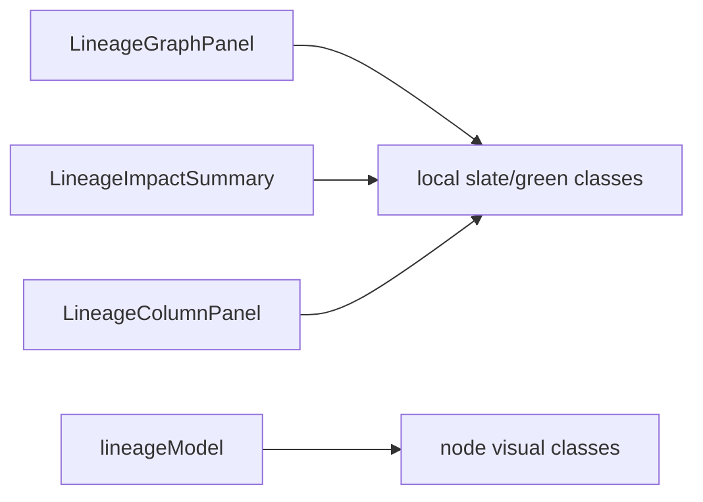
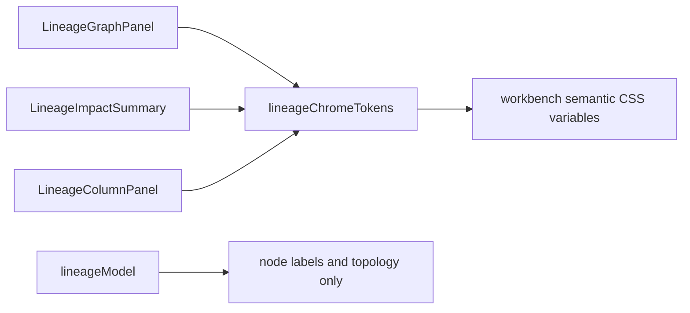

# F-24 Lineage Panel Token Convergence Plan

## Think-First Analysis

Problem summary: `F-24` remains open because several route panels still carry
route-local visual hardcodes. Lineage graph, impact, and column panels were
still using `slate-*`, `blue-*`, and `green-*` classes directly.

Root cause: Lineage was built before the operator-workbench token convergence
work established local presentation-token components for route chrome. Its
graph model also mixed node labels with visual classes.

Selected approach: add a narrow `lineageChromeTokens` presentation-token module,
move Lineage panel and node-kind chrome through it, keep topology and label
logic in `lineageModel.ts`, and guard the boundary with a semantic architecture
test plus local component docs and user stories.

Out of scope:

- Lineage data loading or graph traversal changes;
- React Flow projection changes;
- Monaco convergence;
- route navigation or shell behavior changes.

## Fowler Opportunity Matrix

<!-- markdownlint-disable MD060 -->

| Scenario                                 | Opportunity         | Fowler pattern                      | DDD owner                     | Command/query rail                | Implementation surfaces                       | Unit or package test   | Architecture test                                   | User-flow test                   | Out of scope       |
| ---------------------------------------- | ------------------- | ----------------------------------- | ----------------------------- | --------------------------------- | --------------------------------------------- | ---------------------- | --------------------------------------------------- | -------------------------------- | ------------------ |
| Lineage panels hardcode route colors     | Primitive obsession | Introduce Presentation Token Object | Lineage panel token component | none - internal presentation only | `lineageChromeTokens.ts`, Lineage panel views | `LineageView.test.tsx` | `lineagePanelTokenConvergence.architecture.test.ts` | not required; no behavior change | graph traversal    |
| Node labels and visual classes are mixed | Feature envy        | Move Presentation Logic             | Lineage panel token component | none - internal presentation only | `lineageModel.ts`, `lineageChromeTokens.ts`   | `lineageModel.test.ts` | `lineagePanelTokenConvergence.architecture.test.ts` | not required; no behavior change | node semantics     |
| Lineage token ownership lacks local docs | Documentation drift | Component guide                     | Web / Lineage docs            | none - docs only                  | component guide, user stories, closeout       | markdown/docs gates    | feature mechanization and architecture guard        | not required                     | global style guide |

<!-- markdownlint-enable MD060 -->

## Current State



## Target State



## Red-Green Plan

1. Add an architecture guard requiring `lineageChromeTokens` and rejecting local
   color-family classes in the Lineage panels.
2. Run the guard and observe failure because the token module and docs do not
   exist.
3. Add `lineageChromeTokens.ts` with an owned-concern docblock.
4. Route Lineage graph, impact, and column panel chrome through the token API.
5. Move node-kind visual classes out of `lineageModel.ts`.
6. Add component docs, user stories, closeout, and planning evidence.
7. Validate with focused Lineage tests, typecheck, docs gates, governance
   refresh, and prepush.

ADR decision: no new ADR is required. This slice implements the existing F-24
operator-workbench visual-system and token-convergence governance for Lineage
route panels.

```feature-mechanization
version: 1
featureId: F24-LINEAGE-PANEL-TOKEN-CONVERGENCE-20260522
mechanizationStatus: implemented
noHumanDecisionsRemaining: true
implementationPlan: docs/planning/proposals/mandatory/frontend-and-ux/f24-lineage-panel-token-convergence-plan-20260522.md
componentGuides:
  - docs/architecture/components/web/lineage/lineage-panel-token-component.md
userStories:
  - docs/architecture/components/web/lineage/lineage-panel-token-user-stories.md
governingSources:
  - AGENTS.md
  - docs/planning/status/governance-document-rule-inventory.md
  - docs/architecture/command-query-rail-governance.md
  - docs/architecture/fowler-opportunity-planning-governance.md
  - docs/architecture/components/web/iconography-and-design-tokens-contract.md
  - docs/architecture/components/web/workbench-ui-contract-and-component-inventory.md
  - docs/guides/ai-work-protocol.md
allowedImplementationSurfaces:
  - apps/web/src/app/views/lineage/LineageColumnPanel.tsx
  - apps/web/src/app/views/lineage/LineageGraphPanel.tsx
  - apps/web/src/app/views/lineage/LineageImpactSummary.tsx
  - apps/web/src/app/views/lineage/lineageChromeTokens.ts
  - apps/web/src/app/views/lineage/lineageModel.ts
  - apps/web/src/app/views/lineage/lineagePanelTokenConvergence.architecture.test.ts
  - docs/architecture/components/web/lineage/lineage-panel-token-component.md
  - docs/architecture/components/web/lineage/lineage-panel-token-user-stories.md
  - docs/planning/proposals/mandatory/frontend-and-ux/f24-lineage-panel-token-convergence-plan-20260522.md
forbiddenImplementationSurfaces:
  - apps/api/**
  - packages/@dvt/contracts/**
  - packages/@dvt/engine/**
  - packages/@dvt/adapter-*/**
  - packages/@dvt/planner/**
commandQueryRails:
  - name: LineagePanelVisualTokenQuery
    type: query
    dddOwner: Lineage panel token component
domainObjects:
  - name: lineageChromeTokens
    type: presentation token object
    owner: apps/web
fowlerSignals:
  - Primitive obsession
  - Feature envy
  - Documentation drift
architectureGuards:
  - pnpm --filter @dvt/web test -- src/app/views/lineage/lineagePanelTokenConvergence.architecture.test.ts
cypressFlows:
  - N/A - visual token convergence only; no user flow behavior changes.
completionGate:
  - pnpm --filter @dvt/web test -- src/app/views/lineage/lineagePanelTokenConvergence.architecture.test.ts
  - pnpm --filter @dvt/web test -- src/app/views/LineageView.test.tsx src/app/views/lineage/lineageModel.test.ts
  - pnpm --filter @dvt/web typecheck
  - pnpm docs:feature-mechanization -- --feature F24-LINEAGE-PANEL-TOKEN-CONVERGENCE-20260522
  - pnpm docs:feature-mechanization:implementation
  - pnpm docs:sync
  - pnpm governance:refresh
  - pnpm verify:prepush
redGreenCycles:
  - id: f24-lineage-panel-token-boundary
    redTest: pnpm --filter @dvt/web test -- src/app/views/lineage/lineagePanelTokenConvergence.architecture.test.ts
    expectedFailure: Lineage panel token module and docs do not exist, and panels still contain route-level color-family classes.
    patchSurfaces:
      - apps/web/src/app/views/lineage/LineageColumnPanel.tsx
      - apps/web/src/app/views/lineage/LineageGraphPanel.tsx
      - apps/web/src/app/views/lineage/LineageImpactSummary.tsx
      - apps/web/src/app/views/lineage/lineageChromeTokens.ts
      - apps/web/src/app/views/lineage/lineageModel.ts
    greenTest: pnpm --filter @dvt/web test -- src/app/views/lineage/lineagePanelTokenConvergence.architecture.test.ts
symbols:
  - name: lineageChromeClasses
    path: apps/web/src/app/views/lineage/lineageChromeTokens.ts
    dddOwner: Lineage panel token component
    cqRails: [LineagePanelVisualTokenQuery]
    fowlerSignals: [Primitive obsession]
    architectureGuard: pnpm --filter @dvt/web test -- src/app/views/lineage/lineagePanelTokenConvergence.architecture.test.ts
    cypressCoverage: N/A - visual token class API only.
    unitTests: [pnpm --filter @dvt/web test -- src/app/views/lineage/lineagePanelTokenConvergence.architecture.test.ts]
  - name: resolveLineageNodeKindClassName
    path: apps/web/src/app/views/lineage/lineageChromeTokens.ts
    dddOwner: Lineage panel token component
    cqRails: [LineagePanelVisualTokenQuery]
    fowlerSignals: [Move Presentation Logic]
    architectureGuard: pnpm --filter @dvt/web test -- src/app/views/lineage/lineagePanelTokenConvergence.architecture.test.ts
    cypressCoverage: N/A - visual token query helper only.
    unitTests: [pnpm --filter @dvt/web test -- src/app/views/lineage/lineagePanelTokenConvergence.architecture.test.ts]
  - name: nodeKindClasses
    path: apps/web/src/app/views/lineage/lineageChromeTokens.ts
    dddOwner: Lineage panel token component
    cqRails: [LineagePanelVisualTokenQuery]
    fowlerSignals: [Primitive obsession]
    architectureGuard: pnpm --filter @dvt/web test -- src/app/views/lineage/lineagePanelTokenConvergence.architecture.test.ts
    cypressCoverage: N/A - private token lookup table only.
    unitTests: [pnpm --filter @dvt/web test -- src/app/views/lineage/lineagePanelTokenConvergence.architecture.test.ts]
  - name: TOKEN_SOURCE
    path: apps/web/src/app/views/lineage/lineagePanelTokenConvergence.architecture.test.ts
    dddOwner: Lineage panel token architecture guard
    cqRails: [LineagePanelVisualTokenQuery]
    fowlerSignals: [Architecture fitness function]
    architectureGuard: pnpm --filter @dvt/web test -- src/app/views/lineage/lineagePanelTokenConvergence.architecture.test.ts
    cypressCoverage: N/A - test source fixture only.
    unitTests: [pnpm --filter @dvt/web test -- src/app/views/lineage/lineagePanelTokenConvergence.architecture.test.ts]
  - name: COLUMN_PANEL_SOURCE
    path: apps/web/src/app/views/lineage/lineagePanelTokenConvergence.architecture.test.ts
    dddOwner: Lineage panel token architecture guard
    cqRails: [LineagePanelVisualTokenQuery]
    fowlerSignals: [Architecture fitness function]
    architectureGuard: pnpm --filter @dvt/web test -- src/app/views/lineage/lineagePanelTokenConvergence.architecture.test.ts
    cypressCoverage: N/A - test source fixture only.
    unitTests: [pnpm --filter @dvt/web test -- src/app/views/lineage/lineagePanelTokenConvergence.architecture.test.ts]
  - name: GRAPH_PANEL_SOURCE
    path: apps/web/src/app/views/lineage/lineagePanelTokenConvergence.architecture.test.ts
    dddOwner: Lineage panel token architecture guard
    cqRails: [LineagePanelVisualTokenQuery]
    fowlerSignals: [Architecture fitness function]
    architectureGuard: pnpm --filter @dvt/web test -- src/app/views/lineage/lineagePanelTokenConvergence.architecture.test.ts
    cypressCoverage: N/A - test source fixture only.
    unitTests: [pnpm --filter @dvt/web test -- src/app/views/lineage/lineagePanelTokenConvergence.architecture.test.ts]
  - name: IMPACT_SUMMARY_SOURCE
    path: apps/web/src/app/views/lineage/lineagePanelTokenConvergence.architecture.test.ts
    dddOwner: Lineage panel token architecture guard
    cqRails: [LineagePanelVisualTokenQuery]
    fowlerSignals: [Architecture fitness function]
    architectureGuard: pnpm --filter @dvt/web test -- src/app/views/lineage/lineagePanelTokenConvergence.architecture.test.ts
    cypressCoverage: N/A - test source fixture only.
    unitTests: [pnpm --filter @dvt/web test -- src/app/views/lineage/lineagePanelTokenConvergence.architecture.test.ts]
  - name: COMPONENT_GUIDE
    path: apps/web/src/app/views/lineage/lineagePanelTokenConvergence.architecture.test.ts
    dddOwner: Lineage panel token architecture guard
    cqRails: [LineagePanelVisualTokenQuery]
    fowlerSignals: [Documentation drift guard]
    architectureGuard: pnpm --filter @dvt/web test -- src/app/views/lineage/lineagePanelTokenConvergence.architecture.test.ts
    cypressCoverage: N/A - test source fixture only.
    unitTests: [pnpm --filter @dvt/web test -- src/app/views/lineage/lineagePanelTokenConvergence.architecture.test.ts]
  - name: USER_STORIES
    path: apps/web/src/app/views/lineage/lineagePanelTokenConvergence.architecture.test.ts
    dddOwner: Lineage panel token architecture guard
    cqRails: [LineagePanelVisualTokenQuery]
    fowlerSignals: [Documentation drift guard]
    architectureGuard: pnpm --filter @dvt/web test -- src/app/views/lineage/lineagePanelTokenConvergence.architecture.test.ts
    cypressCoverage: N/A - test source fixture only.
    unitTests: [pnpm --filter @dvt/web test -- src/app/views/lineage/lineagePanelTokenConvergence.architecture.test.ts]
  - name: PANEL_SOURCES
    path: apps/web/src/app/views/lineage/lineagePanelTokenConvergence.architecture.test.ts
    dddOwner: Lineage panel token architecture guard
    cqRails: [LineagePanelVisualTokenQuery]
    fowlerSignals: [Architecture fitness function]
    architectureGuard: pnpm --filter @dvt/web test -- src/app/views/lineage/lineagePanelTokenConvergence.architecture.test.ts
    cypressCoverage: N/A - test source fixture only.
    unitTests: [pnpm --filter @dvt/web test -- src/app/views/lineage/lineagePanelTokenConvergence.architecture.test.ts]
```
