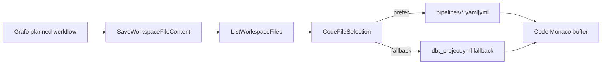

# F-30 Graph Code Artifacts Project Source Parity Plan

## Think-First Analysis

Problem summary: the product now has separate proof that Grafo can persist a
workflow YAML artifact, Code can read workspace files, and Artifacts can preview
pipeline YAML and SQL model artifacts. It does not yet prove the user-facing
promise that the workflow visible in Grafo is the same project source shown in
Code and the same project artifact shown in Artifacts.

Root cause: the route slices were implemented as correct local seams, but their
browser proof is fragmented. Grafo owns `SaveWorkspaceFileContent` for preview
artifact persistence, while Code and Artifacts own read models over
`ListWorkspaceFiles` and `GetWorkspaceFileContent`. Without a cross-route
fitness test and a query-cache refresh policy after the graph artifact save,
stale or fixture-only handoffs can look green while the product experience
remains discontinuous.

Constraints and invariants:

- `AGENTS.md` requires doc-driven design, no hidden debt, no stubs presented as
  complete work, and concrete validation evidence.
- `docs/architecture/command-query-rail-governance.md` requires observable
  behavior to reuse named command/query rails.
- `docs/architecture/fowler-opportunity-planning-governance.md` requires root
  opportunity classification, DDD ownership, allowed surfaces, negative tests,
  and user-flow proof before implementation.
- [Task: F-30] `docs/planning/state/planning-control-tower.md` keeps the task lifecycle in
  the planning DB.
- `docs/planning/reviews/architecture-and-governance/20260525-f30-monaco-code-artifacts-reconciliation-review.md`
  creates `E/F-30-GRAPH-CODE-PARITY` as the remaining product-facing gap after
  Monaco, Code, Artifacts, and Templates reconciliation.
- `docs/planning/proposals/mandatory/frontend-and-ux/artifacts-workspace-project-files-plan-20260524.md`
  already accepts `pipelines/*.yaml|yml` and `models/**/*.sql` as Artifacts
  workspace project artifacts.

Options considered:

- [Task: F-30] Add another mocked Artifacts or Code fixture: rejected because it would keep
  the same fragmented proof and would not exercise user continuity.
- [Task: F-30] Add a backend artifact catalog endpoint: rejected because the existing
  workspace file rails already represent the product intent for this slice.
- [Task: F-30] Add cross-route browser proof and invalidate workspace file read models after
  a successful Grafo preview artifact save: selected because it reuses the
  existing command/query rails and closes the user-facing gap without widening
  backend contracts.

Selected option and rationale: keep `SaveWorkspaceFileContent`,
`ListWorkspaceFiles`, and `GetWorkspaceFileContent` as the only rails; add a
browser flow that plans from Grafo, captures the exact YAML saved through the
workspace file command, then verifies the same content through Code and the same
classified artifact through Artifacts. Add a small query-cache refresh in the
Canvas plan handler so previously loaded Code and Artifacts read models cannot
hide stale project sources after a successful Grafo save.

Rejected alternatives:

- Persisting from Code, because F-17-G explicitly keeps Code in local editable
  buffer mode and does not introduce a save command.
- Letting Artifacts call a Canvas-local store, because that would make UI state
  hidden authority instead of reading governed workspace files.
- Treating the Cypress fixture as the source of truth, because the test must
  store the response from `SaveWorkspaceFileContent` and use that same content
  for later query responses.

## User Role Acceptance

The demanding user acceptance criterion is:

1. Open Grafo with the Sales workflow visible.
2. Run Plan without starting a run.
3. Navigate to Code and see `pipelines/sales_pipeline.yaml`.
4. The Code editor must show the same YAML content that Grafo saved, including
   `src_orders`, `model_orders`, `orders_dashboard`, and
   `entrypoint: "models/analytics/model_orders.sql"`.
5. Navigate to Artifacts and see `pipelines/sales_pipeline.yaml` as a workflow
   pipeline artifact, with the same YAML preview.
6. Unsupported or stale files must not be fabricated to make the flow pass.

### 2026-05-28 Code Selection Drift Follow-up

Observed defect: after planning a transformation graph, the Code tab listed the
generated workflow artifact but still opened `dbt_project.yml` because
`CodeFileSelection` selected the first reachable file in the tree. That made the
real screen diverge from the Grafo -> Code -> Artifacts product promise.

Root cause: the F-30 parity proof asserted artifact visibility, but the Code
selection read model did not encode the product priority that workflow artifacts
explain the graph better than root project configuration files.

Selected correction: keep `ListWorkspaceFiles` as the only query rail and make
`CodeFileSelection` prefer `pipelines/*.yaml|yml` workflow artifacts before
falling back to the first reachable file. This is a read-model selection fix,
not a new persistence or graph mutation behavior.



## Command And Query Rail Impact

No new rail is introduced.

| Product behavior                                | Rail                       | Type    | DDD owner                         | Scope and authorization                                                         |
| ----------------------------------------------- | -------------------------- | ------- | --------------------------------- | ------------------------------------------------------------------------------- |
| Grafo persists preview workflow source          | `SaveWorkspaceFileContent` | command | `PreviewGraphArtifact`            | Existing tenant/project/environment workspace scope and `workspace:files:save`. |
| Code lists available project files              | `ListWorkspaceFiles`       | query   | `CodeWorkspaceFileTreeReadModel`  | Existing tenant/project/environment workspace scope and `workspace:files:view`. |
| Code opens the persisted workflow source        | `GetWorkspaceFileContent`  | query   | `CodeWorkspaceFileContent`        | Existing tenant/project/environment workspace scope and `workspace:files:view`. |
| Artifacts classifies and previews project files | `ListWorkspaceFiles`       | query   | `WorkspaceArtifactClassification` | Existing tenant/project/environment workspace scope and `workspace:files:view`. |
| Artifacts reads preview content                 | `GetWorkspaceFileContent`  | query   | `WorkspaceArtifactPreview`        | Existing tenant/project/environment workspace scope and `workspace:files:view`. |

## Fowler Opportunity Matrix

| Scenario                                                               | Opportunity             | Fowler pattern                       | DDD owner                         | Command/query rail                                                          | Implementation surfaces                                                                                                                                            | Unit or package test                                  | Architecture test                                    | User-flow test                             | Out of scope                              |
| ---------------------------------------------------------------------- | ----------------------- | ------------------------------------ | --------------------------------- | --------------------------------------------------------------------------- | ------------------------------------------------------------------------------------------------------------------------------------------------------------------ | ----------------------------------------------------- | ---------------------------------------------------- | ------------------------------------------ | ----------------------------------------- |
| Grafo planned workflow must become the Code source the user can read.  | Hidden authority        | Application Controller + Query Cache | `PreviewGraphArtifact`            | `SaveWorkspaceFileContent`, `ListWorkspaceFiles`                            | `useCanvasPlanActionHandler.ts`, `useCanvasExecutionActions.test.support.tsx`, `useCanvasExecutionActions.planPreview.core.test.tsx`                               | `useCanvasExecutionActions.planPreview.core.test.tsx` | `useCanvasExecutionActions.architecture.test.ts`     | `canvas-graph-code-artifacts-parity.cy.ts` | Persisting Code edits                     |
| Artifacts must classify the same saved workflow as a project artifact. | Test-only confidence    | Semantic fitness function            | `WorkspaceArtifactClassification` | `ListWorkspaceFiles`, `GetWorkspaceFileContent`                             | `apps/web/cypress/e2e/canvas/canvas-graph-code-artifacts-parity.cy.ts`                                                                                             | Existing `workspaceArtifactPolicy.test.ts`            | `artifactsMonacoReadonlyViewer.architecture.test.ts` | `canvas-graph-code-artifacts-parity.cy.ts` | Generic artifact browser                  |
| The cross-route browser fixture must not invent a handoff.             | Hidden authority        | Gateway-backed fixture               | `WorkspaceArtifactPreview`        | `SaveWorkspaceFileContent`, `GetWorkspaceFileContent`                       | `apps/web/cypress/e2e/canvas/canvas-graph-code-artifacts-parity.cy.ts`                                                                                             | N/A - Cypress semantic flow                           | `pnpm docs:feature-mechanization:implementation`     | `canvas-graph-code-artifacts-parity.cy.ts` | Direct API seeding of graph draft         |
| Previously loaded file read models must not mask a successful save.    | Boundary drift          | Read Model invalidation              | `WorkspaceProjectSourceReadModel` | `SaveWorkspaceFileContent`, `ListWorkspaceFiles`, `GetWorkspaceFileContent` | `useCanvasPlanActionHandler.ts`, `useCanvasExecutionActions.test.support.tsx`, `useCanvasExecutionActions.planPreview.core.test.tsx`, `queryKeys.ts` by reuse only | `useCanvasExecutionActions.planPreview.core.test.tsx` | `useCanvasExecutionActions.architecture.test.ts`     | Covered by cross-route parity flow         | New backend consistency contract          |
| Monaco-backed Code and Artifacts proof must run without CDN workers.   | Hidden config semantics | Semantic configuration               | `MonacoLocalWorkerConfiguration`  | none - internal presentation runtime stability                              | `monacoLocalWorkers.ts`, `MonacoCodeSurface.tsx`, `MonacoDiffSurface.tsx`, Monaco component docs, `monacoBundleIsolation.architecture.test.ts`                     | N/A - architecture guard and Cypress proof            | `monacoBundleIsolation.architecture.test.ts`         | `canvas-graph-code-artifacts-parity.cy.ts` | Bundle-size budget or new Monaco features |

## Pre-Implementation Brief

- Mode: Full.
- Scope: web-only Canvas, Code, and Artifacts route continuity.
- Touched files or paths:
  - `apps/web/src/app/views/canvas/useCanvasPlanActionHandler.ts`
  - `apps/web/src/app/views/canvas/useCanvasExecutionActions.test.support.tsx`
  - `apps/web/src/app/views/canvas/useCanvasExecutionActions.planPreview.core.test.tsx`
  - `apps/web/src/app/components/monaco/monacoLocalWorkers.ts`
  - `apps/web/src/app/components/monaco/MonacoCodeSurface.tsx`
  - `apps/web/src/app/components/monaco/MonacoDiffSurface.tsx`
  - `apps/web/cypress/e2e/canvas/canvas-graph-code-artifacts-parity.cy.ts`
  - this plan and the closeout for `F-30-GRAPH-CODE-PARITY`
- Expected outcome: the browser proof follows one user flow from Grafo to Code
  to Artifacts and the app refreshes workspace file query models after a
  successful graph artifact save.
- Risks and mitigations:
  - Risk: Cypress fixture becomes the authority. Mitigation: the fixture stores
    the actual `POST /workspace/files/pipelines%2Fsales_pipeline.yaml` content
    and serves that same content to later `GET` calls.
  - Risk: Canvas handler grows broad. Mitigation: only invalidate existing
    query keys after the plan action succeeds; do not add persistence semantics
    to Code or Artifacts.
  - Risk: a stale cached file tree hides the saved artifact. Mitigation: unit
    proof checks invalidation of file tree, graph file content, and Artifacts
    query keys.
- Out-of-scope items:
  - Code save/publish.
  - Backend provider source generation.
  - Generic artifact browsing beyond accepted Artifacts project file policy.
  - New workspace file API contracts.
- Validation plan:
  - `pnpm docs:feature-mechanization -- --feature F30-GRAPH-CODE-ARTIFACTS-PARITY-20260525`
  - `pnpm --filter @dvt/web exec vitest run --config vitest.presentation.config.ts src/app/views/canvas/useCanvasExecutionActions.planPreview.core.test.tsx`
  - `pnpm --filter @dvt/web test:e2e:native -- --spec cypress/e2e/canvas/canvas-graph-code-artifacts-parity.cy.ts`
  - `pnpm docs:feature-mechanization:implementation -- --feature F30-GRAPH-CODE-ARTIFACTS-PARITY-20260525`
  - `pnpm governance:refresh`
  - `pnpm verify:prepush`

```feature-mechanization
version: 1
featureId: F30-GRAPH-CODE-ARTIFACTS-PARITY-20260525
mechanizationStatus: implemented
noHumanDecisionsRemaining: true
implementationPlan: docs/planning/proposals/mandatory/frontend-and-ux/f30-graph-code-artifacts-project-source-parity-plan-20260525.md
componentGuides:
  - docs/architecture/components/web/code-workbench-workspace-files-component.md
  - docs/architecture/components/web/artifacts/artifacts-monaco-readonly-viewer-component.md
userStories:
  - docs/planning/proposals/web-user-stories-20260429.md
governingSources:
  - AGENTS.md
  - docs/planning/status/governance-document-rule-inventory.md
  - docs/guides/ai-work-protocol.md
  - docs/architecture/command-query-rail-governance.md
  - docs/architecture/fowler-opportunity-planning-governance.md
  - docs/planning/state/planning-control-tower.md
  - docs/planning/reviews/architecture-and-governance/20260525-f30-monaco-code-artifacts-reconciliation-review.md
allowedImplementationSurfaces:
  - apps/web/package.json
  - apps/web/cypress/e2e/canvas/canvas-graph-code-artifacts-parity.cy.ts
  - apps/web/cypress/e2e/canvas/canvas-preview-run-live.cy.ts
  - apps/web/cypress/support/canvasDraftAuthoring.ts
  - apps/web/cypress/support/liveProtectedRuntime.ts
  - apps/web/src/app/components/monaco/MonacoCodeSurface.tsx
  - apps/web/src/app/components/monaco/MonacoDiffSurface.tsx
  - apps/web/src/app/components/monaco/monacoBundleIsolation.architecture.test.ts
  - apps/web/src/app/components/monaco/monacoLocalWorkers.ts
  - apps/web/src/app/views/code/codeViewFileSelection.ts
  - apps/web/src/app/views/code/codeViewFileSelection.test.ts
  - apps/web/src/app/views/canvas/canvasCopyCatalog.execution.es.ts
  - apps/web/src/app/views/canvas/canvasCopyCatalog.execution.ts
  - apps/web/src/app/views/canvas/canvasPreviewProvenance.ts
  - apps/web/src/app/views/canvas/previewGraphNodePayloads.ts
  - apps/web/src/app/views/canvas/useCanvasExecutionDraftFlush.ts
  - apps/web/src/app/views/canvas/useCanvasExecutionDraftFlush.test.tsx
  - apps/web/src/app/views/canvas/useCanvasExecutionActions.planPreview.core.test.tsx
  - apps/web/src/app/views/canvas/useCanvasExecutionActions.planPreview.provenance.test.tsx
  - apps/web/src/app/views/canvas/useCanvasExecutionActions.test.support.tsx
  - apps/web/src/app/views/canvas/useCanvasPlanActionHandler.ts
  - docs/.manifest.json
  - docs/architecture/components/web/code-workbench-workspace-files-component.md
  - docs/architecture/components/web/graph/canvas-execution-selection-component.md
  - docs/architecture/components/web/graph/canvas-workbench-command-query-catalog.md
  - docs/architecture/components/web/monaco/monaco-bundle-isolation-component.md
  - docs/architecture/components/web/monaco/monaco-bundle-isolation-user-stories.md
  - docs/index.md
  - docs/planning/index.md
  - docs/planning/closeouts/index.md
  - docs/planning/closeouts/20260525-f30-graph-code-artifacts-parity-closeout.md
  - docs/planning/proposals/index.md
  - docs/planning/proposals/mandatory/index.md
  - docs/planning/proposals/mandatory/frontend-and-ux/index.md
  - docs/planning/proposals/mandatory/frontend-and-ux/f17e-monaco-bundle-isolation-plan-20260522.md
  - docs/planning/proposals/mandatory/frontend-and-ux/f30-graph-code-artifacts-project-source-parity-plan-20260525.md
  - docs/planning/reviews/architecture-and-governance/20260525-f30-monaco-code-artifacts-reconciliation-review.md
  - docs/planning/state/execution-workboard.md
  - docs/planning/state/open-task-route.md # Task: F-30
  - docs/planning/status/**
  - pnpm-lock.yaml
forbiddenImplementationSurfaces:
  - apps/api/**
  - packages/**
  - specs/**
commandQueryRails:
  - name: SaveWorkspaceGraphDraft
    type: command
    dddOwner: WorkspaceGraphAuthoringDraft
  - name: GetWorkspaceGraphDraft
    type: query
    dddOwner: WorkspaceGraphAuthoringDraftReadModel
  - name: SaveWorkspaceFileContent
    type: command
    dddOwner: PreviewGraphArtifact
  - name: PreviewExecutionPlan
    type: command
    dddOwner: Canvas execution preview
  - name: GenerateTransformationWorkspaceArtifacts
    type: command
    dddOwner: TransformationWorkspaceArtifactProjection
  - name: ListWorkspaceFiles
    type: query
    dddOwner: WorkspaceProjectSourceReadModel
  - name: GetWorkspaceFileContent
    type: query
    dddOwner: WorkspaceProjectSourceReadModel
  - name: ResolveWebManualChunk
    type: query
    dddOwner: MonacoLocalWorkerConfiguration
domainObjects:
  - name: PreviewGraphArtifact
    type: value object
    owner: Canvas plan action
  - name: TransformationWorkspaceArtifactProjection
    type: value object
    owner: Canvas preview provenance
  - name: CodeWorkspaceFileTreeReadModel
    type: read model
    owner: Code workbench
  - name: CodeWorkspaceFileContent
    type: read model
    owner: Code workbench
  - name: WorkspaceArtifactClassification
    type: policy
    owner: Artifacts workbench
  - name: WorkspaceArtifactPreview
    type: read model
    owner: Artifacts workbench
  - name: WorkspaceProjectSourceReadModel
    type: read model
    owner: Workspace file query cache
  - name: MonacoLocalWorkerConfiguration
    type: semantic configuration
    owner: Monaco surface runtime
fowlerSignals:
  - Hidden authority
  - Test-only confidence
  - Boundary drift
  - Hidden config semantics
architectureGuards:
  - pnpm --filter @dvt/web exec vitest run --config vitest.architecture.config.ts src/app/views/canvas/useCanvasExecutionActions.architecture.test.ts src/app/views/code/codeMonacoEditableAccess.architecture.test.ts src/app/views/artifacts/artifactsMonacoReadonlyViewer.architecture.test.ts
  - pnpm --filter @dvt/web exec vitest run --config vitest.monaco.config.ts src/app/components/monaco/monacoBundleIsolation.architecture.test.ts
cypressFlows:
  - pnpm --filter @dvt/web test:e2e:native -- --spec cypress/e2e/canvas/canvas-graph-code-artifacts-parity.cy.ts
  - pnpm --filter @dvt/web test:e2e:selected-closure:live
completionGate:
  - pnpm docs:feature-mechanization -- --feature F30-GRAPH-CODE-ARTIFACTS-PARITY-20260525
  - pnpm --filter @dvt/web exec vitest run --config vitest.canvas-presentation.config.ts src/app/views/canvas/useCanvasExecutionDraftFlush.test.tsx src/app/views/canvas/useCanvasExecutionActions.planPreview.core.test.tsx src/app/views/canvas/useCanvasExecutionActions.planPreview.provenance.test.tsx
  - pnpm --filter @dvt/web exec vitest run --config vitest.presentation.config.ts src/app/views/canvas/useCanvasExecutionActions.planPreview.core.test.tsx
  - pnpm --filter @dvt/web exec vitest run --config vitest.architecture.config.ts src/app/views/canvas/useCanvasExecutionActions.architecture.test.ts src/app/views/code/codeMonacoEditableAccess.architecture.test.ts src/app/views/artifacts/artifactsMonacoReadonlyViewer.architecture.test.ts
  - pnpm --filter @dvt/web exec vitest run --config vitest.monaco.config.ts src/app/components/monaco/monacoBundleIsolation.architecture.test.ts
  - pnpm --filter @dvt/web test:e2e:native -- --spec cypress/e2e/canvas/canvas-graph-code-artifacts-parity.cy.ts
  - pnpm --filter @dvt/web test:e2e:selected-closure:live
  - pnpm --filter @dvt/web typecheck
  - pnpm docs:feature-mechanization:implementation -- --feature F30-GRAPH-CODE-ARTIFACTS-PARITY-20260525
  - pnpm governance:refresh
  - pnpm verify:prepush
redGreenCycles:
  - id: f30-cross-route-user-proof
    redTest: pnpm --filter @dvt/web test:e2e:native -- --spec cypress/e2e/canvas/canvas-graph-code-artifacts-parity.cy.ts
    expectedFailure: No browser flow proves the same saved graph workflow source appears in Code and Artifacts.
    patchSurfaces:
      - apps/web/cypress/e2e/canvas/canvas-graph-code-artifacts-parity.cy.ts
    greenTest: pnpm --filter @dvt/web test:e2e:native -- --spec cypress/e2e/canvas/canvas-graph-code-artifacts-parity.cy.ts
  - id: f30-workspace-query-refresh
    redTest: pnpm --filter @dvt/web exec vitest run --config vitest.presentation.config.ts src/app/views/canvas/useCanvasExecutionActions.planPreview.core.test.tsx
    expectedFailure: Canvas plan success does not invalidate workspace file tree, workflow content, or Artifacts query keys.
    patchSurfaces:
      - apps/web/src/app/views/canvas/useCanvasPlanActionHandler.ts
      - apps/web/src/app/views/canvas/useCanvasExecutionActions.test.support.tsx
      - apps/web/src/app/views/canvas/useCanvasExecutionActions.planPreview.core.test.tsx
    greenTest: pnpm --filter @dvt/web exec vitest run --config vitest.presentation.config.ts src/app/views/canvas/useCanvasExecutionActions.planPreview.core.test.tsx
  - id: f30-transformation-authoring-plan-projection
    redTest: pnpm exec vitest run --config vitest.canvas-presentation.config.ts src/app/views/canvas/useCanvasExecutionActions.planPreview.provenance.test.tsx
    expectedFailure: A canvas-authored SQL transform without a workspace path cannot create the SQL and graph workspace artifacts required by Plan.
    patchSurfaces:
      - apps/web/src/app/views/canvas/canvasPreviewProvenance.ts
      - apps/web/src/app/views/canvas/previewGraphNodePayloads.ts
      - apps/web/src/app/views/canvas/useCanvasExecutionActions.planPreview.provenance.test.tsx
      - docs/architecture/components/web/graph/canvas-execution-selection-component.md
      - docs/architecture/components/web/graph/canvas-workbench-command-query-catalog.md
    greenTest: pnpm exec vitest run --config vitest.canvas-presentation.config.ts src/app/views/canvas/useCanvasExecutionActions.planPreview.provenance.test.tsx
  - id: f30-monaco-local-worker-runtime
    redTest: pnpm --filter @dvt/web test:e2e:native -- --spec cypress/e2e/canvas/canvas-graph-code-artifacts-parity.cy.ts
    expectedFailure: Monaco tries to load editor workers from cdn.jsdelivr.net during local e2e execution.
    patchSurfaces:
      - apps/web/src/app/components/monaco/monacoLocalWorkers.ts
      - apps/web/src/app/components/monaco/MonacoCodeSurface.tsx
      - apps/web/src/app/components/monaco/MonacoDiffSurface.tsx
      - apps/web/src/app/components/monaco/monacoBundleIsolation.architecture.test.ts
      - apps/web/package.json
      - docs/architecture/components/web/monaco/monaco-bundle-isolation-component.md
      - docs/architecture/components/web/monaco/monaco-bundle-isolation-user-stories.md
      - docs/planning/proposals/mandatory/frontend-and-ux/f17e-monaco-bundle-isolation-plan-20260522.md
      - pnpm-lock.yaml
    greenTest: pnpm --filter @dvt/web test:e2e:native -- --spec cypress/e2e/canvas/canvas-graph-code-artifacts-parity.cy.ts
  - id: f30-plan-after-draft-save-race
    redTest: pnpm --filter @dvt/web exec vitest run --config vitest.canvas-presentation.config.ts src/app/views/canvas/useCanvasExecutionDraftFlush.test.tsx
    expectedFailure: Plan returns a user-visible failure while autosave is still settling instead of waiting for the current draft save to complete.
    patchSurfaces:
      - apps/web/src/app/views/canvas/useCanvasExecutionDraftFlush.ts
      - apps/web/src/app/views/canvas/useCanvasExecutionDraftFlush.test.tsx
    greenTest: pnpm --filter @dvt/web exec vitest run --config vitest.canvas-presentation.config.ts src/app/views/canvas/useCanvasExecutionDraftFlush.test.tsx
  - id: f30-live-authoring-generated-artifacts
    redTest: pnpm --filter @dvt/web test:e2e:selected-closure:live
    expectedFailure: Live protected runtime proof does not verify a canvas-authored graph persists generated SQL and graph artifacts before plan preview.
    patchSurfaces:
      - apps/web/cypress/e2e/canvas/canvas-preview-run-live.cy.ts
      - apps/web/cypress/support/canvasDraftAuthoring.ts
      - apps/web/cypress/support/liveProtectedRuntime.ts
    greenTest: pnpm --filter @dvt/web test:e2e:selected-closure:live
symbols:
  - name: useCanvasPlanActionHandler
    path: apps/web/src/app/views/canvas/useCanvasPlanActionHandler.ts
    dddOwner: Canvas plan action application controller
    cqRails: [SaveWorkspaceFileContent, ListWorkspaceFiles, GetWorkspaceFileContent]
    fowlerSignals: [Boundary drift]
    architectureGuard: pnpm --filter @dvt/web exec vitest run --config vitest.architecture.config.ts src/app/views/canvas/useCanvasExecutionActions.architecture.test.ts
    cypressCoverage: pnpm --filter @dvt/web test:e2e:native -- --spec cypress/e2e/canvas/canvas-graph-code-artifacts-parity.cy.ts
    unitTests: [pnpm --filter @dvt/web exec vitest run --config vitest.presentation.config.ts src/app/views/canvas/useCanvasExecutionActions.planPreview.core.test.tsx]
  - name: formatPlanActionErrorMessage
    path: apps/web/src/app/views/canvas/canvasPlanAction.ts
    dddOwner: Canvas plan action application controller
    cqRails: [PreviewExecutionPlan]
    fowlerSignals: [Leaky abstraction]
    architectureGuard: pnpm docs:feature-mechanization:implementation -- --feature F30-GRAPH-CODE-ARTIFACTS-PARITY-20260525
    cypressCoverage: N/A - plan error projection unit proof
    unitTests: [pnpm exec vitest run --config vitest.canvas-presentation.config.ts src/app/views/canvas/useCanvasExecutionActions.planPreview.core.test.tsx]
  - name: renderExecutionActionsHarness
    path: apps/web/src/app/views/canvas/useCanvasExecutionActions.test.support.tsx
    dddOwner: Canvas plan action test harness
    cqRails: [SaveWorkspaceFileContent]
    fowlerSignals: [Test-only confidence]
    architectureGuard: pnpm docs:feature-mechanization:implementation -- --feature F30-GRAPH-CODE-ARTIFACTS-PARITY-20260525
    cypressCoverage: N/A - unit harness
    unitTests: [pnpm --filter @dvt/web exec vitest run --config vitest.presentation.config.ts src/app/views/canvas/useCanvasExecutionActions.planPreview.core.test.tsx]
  - name: canvas-graph-code-artifacts-parity.cy.ts
    path: apps/web/cypress/e2e/canvas/canvas-graph-code-artifacts-parity.cy.ts
    dddOwner: Cross-route browser user proof
    cqRails: [SaveWorkspaceFileContent, ListWorkspaceFiles, GetWorkspaceFileContent]
    fowlerSignals: [Hidden authority, Test-only confidence]
    architectureGuard: pnpm docs:feature-mechanization:implementation -- --feature F30-GRAPH-CODE-ARTIFACTS-PARITY-20260525
    cypressCoverage: pnpm --filter @dvt/web test:e2e:native -- --spec cypress/e2e/canvas/canvas-graph-code-artifacts-parity.cy.ts
    unitTests: [N/A - Cypress route proof]
  - name: resolveInitialCodeFilePath
    path: apps/web/src/app/views/code/codeViewFileSelection.ts
    dddOwner: CodeWorkspaceFileTreeReadModel
    cqRails: [ListWorkspaceFiles]
    fowlerSignals: [Documentation drift, Hidden authority]
    architectureGuard: pnpm docs:feature-mechanization:implementation -- --feature F30-GRAPH-CODE-ARTIFACTS-PARITY-20260525
    cypressCoverage: pnpm --filter @dvt/web test:e2e:native -- --spec cypress/e2e/canvas/canvas-graph-code-artifacts-parity.cy.ts
    unitTests: [pnpm --filter @dvt/web exec vitest run --config vitest.unit.config.ts src/app/views/code/codeViewFileSelection.test.ts]
  - name: WORKFLOW_ARTIFACT_PATH_PATTERN
    path: apps/web/src/app/views/code/codeViewFileSelection.ts
    dddOwner: CodeWorkspaceFileTreeReadModel
    cqRails: [ListWorkspaceFiles]
    fowlerSignals: [Primitive obsession]
    architectureGuard: pnpm docs:feature-mechanization:implementation -- --feature F30-GRAPH-CODE-ARTIFACTS-PARITY-20260525
    cypressCoverage: pnpm --filter @dvt/web test:e2e:native -- --spec cypress/e2e/canvas/canvas-graph-code-artifacts-parity.cy.ts
    unitTests: [pnpm --filter @dvt/web exec vitest run --config vitest.unit.config.ts src/app/views/code/codeViewFileSelection.test.ts]
  - name: isWorkflowArtifactFile
    path: apps/web/src/app/views/code/codeViewFileSelection.ts
    dddOwner: CodeWorkspaceFileTreeReadModel
    cqRails: [ListWorkspaceFiles]
    fowlerSignals: [Encapsulated Predicate]
    architectureGuard: pnpm docs:feature-mechanization:implementation -- --feature F30-GRAPH-CODE-ARTIFACTS-PARITY-20260525
    cypressCoverage: pnpm --filter @dvt/web test:e2e:native -- --spec cypress/e2e/canvas/canvas-graph-code-artifacts-parity.cy.ts
    unitTests: [pnpm --filter @dvt/web exec vitest run --config vitest.unit.config.ts src/app/views/code/codeViewFileSelection.test.ts]
  - name: MONACO_LOCAL_WORKER_FACTORIES
    path: apps/web/src/app/components/monaco/monacoLocalWorkers.ts
    dddOwner: MonacoLocalWorkerConfiguration
    cqRails: [ResolveWebManualChunk]
    fowlerSignals: [Hidden config semantics]
    architectureGuard: pnpm --filter @dvt/web exec vitest run --config vitest.monaco.config.ts src/app/components/monaco/monacoBundleIsolation.architecture.test.ts
    cypressCoverage: pnpm --filter @dvt/web test:e2e:native -- --spec cypress/e2e/canvas/canvas-graph-code-artifacts-parity.cy.ts
    unitTests: [pnpm --filter @dvt/web exec vitest run --config vitest.monaco.config.ts src/app/components/monaco/monacoBundleIsolation.architecture.test.ts]
  - name: configureMonacoLocalWorkers
    path: apps/web/src/app/components/monaco/monacoLocalWorkers.ts
    dddOwner: MonacoLocalWorkerConfiguration
    cqRails: [ResolveWebManualChunk]
    fowlerSignals: [Hidden config semantics]
    architectureGuard: pnpm --filter @dvt/web exec vitest run --config vitest.monaco.config.ts src/app/components/monaco/monacoBundleIsolation.architecture.test.ts
    cypressCoverage: pnpm --filter @dvt/web test:e2e:native -- --spec cypress/e2e/canvas/canvas-graph-code-artifacts-parity.cy.ts
    unitTests: [pnpm --filter @dvt/web exec vitest run --config vitest.monaco.config.ts src/app/components/monaco/monacoBundleIsolation.architecture.test.ts]
  - { name: DRAFT_SAVE_SETTLE_POLL_MS, path: apps/web/src/app/views/canvas/useCanvasExecutionDraftFlush.ts, dddOwner: Canvas draft execution flush policy, cqRails: [SaveWorkspaceGraphDraft, PreviewExecutionPlan], fowlerSignals: [Boundary drift], architectureGuard: pnpm docs:feature-mechanization:implementation -- --feature F30-GRAPH-CODE-ARTIFACTS-PARITY-20260525, cypressCoverage: pnpm --filter @dvt/web test:e2e:selected-closure:live, unitTests: [pnpm --filter @dvt/web exec vitest run --config vitest.canvas-presentation.config.ts src/app/views/canvas/useCanvasExecutionDraftFlush.test.tsx] }
  - { name: DRAFT_SAVE_SETTLE_TIMEOUT_MS, path: apps/web/src/app/views/canvas/useCanvasExecutionDraftFlush.ts, dddOwner: Canvas draft execution flush policy, cqRails: [SaveWorkspaceGraphDraft, PreviewExecutionPlan], fowlerSignals: [Boundary drift], architectureGuard: pnpm docs:feature-mechanization:implementation -- --feature F30-GRAPH-CODE-ARTIFACTS-PARITY-20260525, cypressCoverage: pnpm --filter @dvt/web test:e2e:selected-closure:live, unitTests: [pnpm --filter @dvt/web exec vitest run --config vitest.canvas-presentation.config.ts src/app/views/canvas/useCanvasExecutionDraftFlush.test.tsx] }
  - { name: waitForDraftSaveToSettle, path: apps/web/src/app/views/canvas/useCanvasExecutionDraftFlush.ts, dddOwner: Canvas draft execution flush policy, cqRails: [SaveWorkspaceGraphDraft, PreviewExecutionPlan], fowlerSignals: [Boundary drift, Hidden authority], architectureGuard: pnpm docs:feature-mechanization:implementation -- --feature F30-GRAPH-CODE-ARTIFACTS-PARITY-20260525, cypressCoverage: pnpm --filter @dvt/web test:e2e:selected-closure:live, unitTests: [pnpm --filter @dvt/web exec vitest run --config vitest.canvas-presentation.config.ts src/app/views/canvas/useCanvasExecutionDraftFlush.test.tsx] }
  - { name: FlushHook, path: apps/web/src/app/views/canvas/useCanvasExecutionDraftFlush.test.tsx, dddOwner: Canvas draft execution flush test harness, cqRails: [SaveWorkspaceGraphDraft, PreviewExecutionPlan], fowlerSignals: [Test-only confidence], architectureGuard: pnpm docs:feature-mechanization:implementation -- --feature F30-GRAPH-CODE-ARTIFACTS-PARITY-20260525, cypressCoverage: N/A - unit harness, unitTests: [pnpm --filter @dvt/web exec vitest run --config vitest.canvas-presentation.config.ts src/app/views/canvas/useCanvasExecutionDraftFlush.test.tsx] }
  - { name: HookArgs, path: apps/web/src/app/views/canvas/useCanvasExecutionDraftFlush.test.tsx, dddOwner: Canvas draft execution flush test harness, cqRails: [SaveWorkspaceGraphDraft, PreviewExecutionPlan], fowlerSignals: [Test-only confidence], architectureGuard: pnpm docs:feature-mechanization:implementation -- --feature F30-GRAPH-CODE-ARTIFACTS-PARITY-20260525, cypressCoverage: N/A - unit harness, unitTests: [pnpm --filter @dvt/web exec vitest run --config vitest.canvas-presentation.config.ts src/app/views/canvas/useCanvasExecutionDraftFlush.test.tsx] }
  - { name: buildDraftState, path: apps/web/src/app/views/canvas/useCanvasExecutionDraftFlush.test.tsx, dddOwner: Canvas draft execution flush test harness, cqRails: [SaveWorkspaceGraphDraft, PreviewExecutionPlan], fowlerSignals: [Test-only confidence], architectureGuard: pnpm docs:feature-mechanization:implementation -- --feature F30-GRAPH-CODE-ARTIFACTS-PARITY-20260525, cypressCoverage: N/A - unit harness, unitTests: [pnpm --filter @dvt/web exec vitest run --config vitest.canvas-presentation.config.ts src/app/views/canvas/useCanvasExecutionDraftFlush.test.tsx] }
  - { name: buildHookArgs, path: apps/web/src/app/views/canvas/useCanvasExecutionDraftFlush.test.tsx, dddOwner: Canvas draft execution flush test harness, cqRails: [SaveWorkspaceGraphDraft, PreviewExecutionPlan], fowlerSignals: [Test-only confidence], architectureGuard: pnpm docs:feature-mechanization:implementation -- --feature F30-GRAPH-CODE-ARTIFACTS-PARITY-20260525, cypressCoverage: N/A - unit harness, unitTests: [pnpm --filter @dvt/web exec vitest run --config vitest.canvas-presentation.config.ts src/app/views/canvas/useCanvasExecutionDraftFlush.test.tsx] }
  - { name: buildRefs, path: apps/web/src/app/views/canvas/useCanvasExecutionDraftFlush.test.tsx, dddOwner: Canvas draft execution flush test harness, cqRails: [SaveWorkspaceGraphDraft, PreviewExecutionPlan], fowlerSignals: [Test-only confidence], architectureGuard: pnpm docs:feature-mechanization:implementation -- --feature F30-GRAPH-CODE-ARTIFACTS-PARITY-20260525, cypressCoverage: N/A - unit harness, unitTests: [pnpm --filter @dvt/web exec vitest run --config vitest.canvas-presentation.config.ts src/app/views/canvas/useCanvasExecutionDraftFlush.test.tsx] }
  - { name: renderFlushHook, path: apps/web/src/app/views/canvas/useCanvasExecutionDraftFlush.test.tsx, dddOwner: Canvas draft execution flush test harness, cqRails: [SaveWorkspaceGraphDraft, PreviewExecutionPlan], fowlerSignals: [Test-only confidence], architectureGuard: pnpm docs:feature-mechanization:implementation -- --feature F30-GRAPH-CODE-ARTIFACTS-PARITY-20260525, cypressCoverage: N/A - unit harness, unitTests: [pnpm --filter @dvt/web exec vitest run --config vitest.canvas-presentation.config.ts src/app/views/canvas/useCanvasExecutionDraftFlush.test.tsx] }
  - { name: readLiveWorkspaceFile, path: apps/web/cypress/support/liveProtectedRuntime.ts, dddOwner: Live protected runtime Cypress query helper, cqRails: [GetWorkspaceFileContent], fowlerSignals: [Test-only confidence, Hidden authority], architectureGuard: pnpm docs:feature-mechanization:implementation -- --feature F30-GRAPH-CODE-ARTIFACTS-PARITY-20260525, cypressCoverage: pnpm --filter @dvt/web test:e2e:selected-closure:live, unitTests: [N/A - Cypress support helper] }
  - { name: TransformArtifactSource, path: apps/web/src/app/views/canvas/canvasPreviewProvenance.ts, dddOwner: TransformationWorkspaceArtifactProjection, cqRails: [GenerateTransformationWorkspaceArtifacts, SaveWorkspaceFileContent], fowlerSignals: [Hidden authority, Boundary drift], architectureGuard: pnpm docs:feature-mechanization:implementation -- --feature F30-GRAPH-CODE-ARTIFACTS-PARITY-20260525, cypressCoverage: N/A - unit provenance proof, unitTests: [pnpm exec vitest run --config vitest.canvas-presentation.config.ts src/app/views/canvas/useCanvasExecutionActions.planPreview.provenance.test.tsx] }
  - { name: buildAuthoringPreviewSql, path: apps/web/src/app/views/canvas/canvasPreviewProvenance.ts, dddOwner: TransformationWorkspaceArtifactProjection, cqRails: [GenerateTransformationWorkspaceArtifacts], fowlerSignals: [Hidden authority], architectureGuard: pnpm docs:feature-mechanization:implementation -- --feature F30-GRAPH-CODE-ARTIFACTS-PARITY-20260525, cypressCoverage: N/A - unit provenance proof, unitTests: [pnpm exec vitest run --config vitest.canvas-presentation.config.ts src/app/views/canvas/useCanvasExecutionActions.planPreview.provenance.test.tsx] }
  - { name: isAsciiAlphaNumeric, path: apps/web/src/app/views/canvas/canvasPreviewProvenance.ts, dddOwner: TransformationWorkspaceArtifactProjection, cqRails: [GenerateTransformationWorkspaceArtifacts], fowlerSignals: [Primitive obsession], architectureGuard: pnpm docs:feature-mechanization:implementation -- --feature F30-GRAPH-CODE-ARTIFACTS-PARITY-20260525, cypressCoverage: N/A - unit provenance proof, unitTests: [pnpm exec vitest run --config vitest.canvas-presentation.config.ts src/app/views/canvas/useCanvasExecutionActions.planPreview.provenance.test.tsx] }
  - { name: normalizeNonBlankString, path: apps/web/src/app/views/canvas/canvasPreviewProvenance.ts, dddOwner: TransformationWorkspaceArtifactProjection, cqRails: [GenerateTransformationWorkspaceArtifacts], fowlerSignals: [Primitive obsession], architectureGuard: pnpm docs:feature-mechanization:implementation -- --feature F30-GRAPH-CODE-ARTIFACTS-PARITY-20260525, cypressCoverage: N/A - unit provenance proof, unitTests: [pnpm exec vitest run --config vitest.canvas-presentation.config.ts src/app/views/canvas/useCanvasExecutionActions.planPreview.provenance.test.tsx] }
  - { name: readNodeSqlText, path: apps/web/src/app/views/canvas/canvasPreviewProvenance.ts, dddOwner: TransformationWorkspaceArtifactProjection, cqRails: [GenerateTransformationWorkspaceArtifacts], fowlerSignals: [Hidden authority], architectureGuard: pnpm docs:feature-mechanization:implementation -- --feature F30-GRAPH-CODE-ARTIFACTS-PARITY-20260525, cypressCoverage: N/A - unit provenance proof, unitTests: [pnpm exec vitest run --config vitest.canvas-presentation.config.ts src/app/views/canvas/useCanvasExecutionActions.planPreview.provenance.test.tsx] }
  - { name: resolvePreviewSqlArtifact, path: apps/web/src/app/views/canvas/canvasPreviewProvenance.ts, dddOwner: TransformationWorkspaceArtifactProjection, cqRails: [GenerateTransformationWorkspaceArtifacts, SaveWorkspaceFileContent], fowlerSignals: [Hidden authority], architectureGuard: pnpm docs:feature-mechanization:implementation -- --feature F30-GRAPH-CODE-ARTIFACTS-PARITY-20260525, cypressCoverage: N/A - unit provenance proof, unitTests: [pnpm exec vitest run --config vitest.canvas-presentation.config.ts src/app/views/canvas/useCanvasExecutionActions.planPreview.provenance.test.tsx] }
  - { name: resolvePreviewWorkspaceConfig, path: apps/web/src/app/views/canvas/canvasPreviewProvenance.ts, dddOwner: TransformationWorkspaceArtifactProjection, cqRails: [GenerateTransformationWorkspaceArtifacts], fowlerSignals: [Hidden authority], architectureGuard: pnpm docs:feature-mechanization:implementation -- --feature F30-GRAPH-CODE-ARTIFACTS-PARITY-20260525, cypressCoverage: N/A - unit provenance proof, unitTests: [pnpm exec vitest run --config vitest.canvas-presentation.config.ts src/app/views/canvas/useCanvasExecutionActions.planPreview.provenance.test.tsx] }
  - { name: resolveTransformArtifactSource, path: apps/web/src/app/views/canvas/canvasPreviewProvenance.ts, dddOwner: TransformationWorkspaceArtifactProjection, cqRails: [GenerateTransformationWorkspaceArtifacts], fowlerSignals: [Hidden authority, Boundary drift], architectureGuard: pnpm docs:feature-mechanization:implementation -- --feature F30-GRAPH-CODE-ARTIFACTS-PARITY-20260525, cypressCoverage: N/A - unit provenance proof, unitTests: [pnpm exec vitest run --config vitest.canvas-presentation.config.ts src/app/views/canvas/useCanvasExecutionActions.planPreview.provenance.test.tsx] }
  - { name: slugifyPathSegment, path: apps/web/src/app/views/canvas/canvasPreviewProvenance.ts, dddOwner: TransformationWorkspaceArtifactProjection, cqRails: [GenerateTransformationWorkspaceArtifacts], fowlerSignals: [Primitive obsession], architectureGuard: pnpm docs:feature-mechanization:implementation -- --feature F30-GRAPH-CODE-ARTIFACTS-PARITY-20260525, cypressCoverage: N/A - unit provenance proof, unitTests: [pnpm exec vitest run --config vitest.canvas-presentation.config.ts src/app/views/canvas/useCanvasExecutionActions.planPreview.provenance.test.tsx] }
  - { name: collectAsciiWords, path: apps/web/src/app/views/canvas/previewGraphNodePayloads.ts, dddOwner: TransformationWorkspaceArtifactProjection, cqRails: [GenerateTransformationWorkspaceArtifacts], fowlerSignals: [Primitive obsession], architectureGuard: pnpm docs:feature-mechanization:implementation -- --feature F30-GRAPH-CODE-ARTIFACTS-PARITY-20260525, cypressCoverage: N/A - unit provenance proof, unitTests: [pnpm exec vitest run --config vitest.canvas-presentation.config.ts src/app/views/canvas/useCanvasExecutionActions.planPreview.provenance.test.tsx] }
  - { name: isAsciiAlphaNumeric, path: apps/web/src/app/views/canvas/previewGraphNodePayloads.ts, dddOwner: TransformationWorkspaceArtifactProjection, cqRails: [GenerateTransformationWorkspaceArtifacts], fowlerSignals: [Primitive obsession], architectureGuard: pnpm docs:feature-mechanization:implementation -- --feature F30-GRAPH-CODE-ARTIFACTS-PARITY-20260525, cypressCoverage: N/A - unit provenance proof, unitTests: [pnpm exec vitest run --config vitest.canvas-presentation.config.ts src/app/views/canvas/useCanvasExecutionActions.planPreview.provenance.test.tsx] }
  - { name: isCanvasAuthoringNode, path: apps/web/src/app/views/canvas/previewGraphNodePayloads.ts, dddOwner: TransformationWorkspaceArtifactProjection, cqRails: [GenerateTransformationWorkspaceArtifacts], fowlerSignals: [Hidden authority], architectureGuard: pnpm docs:feature-mechanization:implementation -- --feature F30-GRAPH-CODE-ARTIFACTS-PARITY-20260525, cypressCoverage: N/A - unit provenance proof, unitTests: [pnpm exec vitest run --config vitest.canvas-presentation.config.ts src/app/views/canvas/useCanvasExecutionActions.planPreview.provenance.test.tsx] }
  - { name: readAuthoringDefaultMaterialization, path: apps/web/src/app/views/canvas/previewGraphNodePayloads.ts, dddOwner: TransformationWorkspaceArtifactProjection, cqRails: [GenerateTransformationWorkspaceArtifacts], fowlerSignals: [Hidden authority], architectureGuard: pnpm docs:feature-mechanization:implementation -- --feature F30-GRAPH-CODE-ARTIFACTS-PARITY-20260525, cypressCoverage: N/A - unit provenance proof, unitTests: [pnpm exec vitest run --config vitest.canvas-presentation.config.ts src/app/views/canvas/useCanvasExecutionActions.planPreview.provenance.test.tsx] }
  - { name: readAuthoringDefaultSchema, path: apps/web/src/app/views/canvas/previewGraphNodePayloads.ts, dddOwner: TransformationWorkspaceArtifactProjection, cqRails: [GenerateTransformationWorkspaceArtifacts], fowlerSignals: [Hidden authority], architectureGuard: pnpm docs:feature-mechanization:implementation -- --feature F30-GRAPH-CODE-ARTIFACTS-PARITY-20260525, cypressCoverage: N/A - unit provenance proof, unitTests: [pnpm exec vitest run --config vitest.canvas-presentation.config.ts src/app/views/canvas/useCanvasExecutionActions.planPreview.provenance.test.tsx] }
  - { name: readAuthoringDefaultTable, path: apps/web/src/app/views/canvas/previewGraphNodePayloads.ts, dddOwner: TransformationWorkspaceArtifactProjection, cqRails: [GenerateTransformationWorkspaceArtifacts], fowlerSignals: [Hidden authority], architectureGuard: pnpm docs:feature-mechanization:implementation -- --feature F30-GRAPH-CODE-ARTIFACTS-PARITY-20260525, cypressCoverage: N/A - unit provenance proof, unitTests: [pnpm exec vitest run --config vitest.canvas-presentation.config.ts src/app/views/canvas/useCanvasExecutionActions.planPreview.provenance.test.tsx] }
  - { name: readAuthoringDefaultWriteMode, path: apps/web/src/app/views/canvas/previewGraphNodePayloads.ts, dddOwner: TransformationWorkspaceArtifactProjection, cqRails: [GenerateTransformationWorkspaceArtifacts], fowlerSignals: [Hidden authority], architectureGuard: pnpm docs:feature-mechanization:implementation -- --feature F30-GRAPH-CODE-ARTIFACTS-PARITY-20260525, cypressCoverage: N/A - unit provenance proof, unitTests: [pnpm exec vitest run --config vitest.canvas-presentation.config.ts src/app/views/canvas/useCanvasExecutionActions.planPreview.provenance.test.tsx] }
  - { name: resolveAuthoringSqlArtifactPath, path: apps/web/src/app/views/canvas/previewGraphNodePayloads.ts, dddOwner: TransformationWorkspaceArtifactProjection, cqRails: [GenerateTransformationWorkspaceArtifacts], fowlerSignals: [Hidden authority], architectureGuard: pnpm docs:feature-mechanization:implementation -- --feature F30-GRAPH-CODE-ARTIFACTS-PARITY-20260525, cypressCoverage: N/A - unit provenance proof, unitTests: [pnpm exec vitest run --config vitest.canvas-presentation.config.ts src/app/views/canvas/useCanvasExecutionActions.planPreview.provenance.test.tsx] }
  - { name: resolveAuthoringSqlIdentifier, path: apps/web/src/app/views/canvas/previewGraphNodePayloads.ts, dddOwner: TransformationWorkspaceArtifactProjection, cqRails: [GenerateTransformationWorkspaceArtifacts], fowlerSignals: [Hidden authority], architectureGuard: pnpm docs:feature-mechanization:implementation -- --feature F30-GRAPH-CODE-ARTIFACTS-PARITY-20260525, cypressCoverage: N/A - unit provenance proof, unitTests: [pnpm exec vitest run --config vitest.canvas-presentation.config.ts src/app/views/canvas/useCanvasExecutionActions.planPreview.provenance.test.tsx] }
  - { name: slugifyPathSegment, path: apps/web/src/app/views/canvas/previewGraphNodePayloads.ts, dddOwner: TransformationWorkspaceArtifactProjection, cqRails: [GenerateTransformationWorkspaceArtifacts], fowlerSignals: [Primitive obsession], architectureGuard: pnpm docs:feature-mechanization:implementation -- --feature F30-GRAPH-CODE-ARTIFACTS-PARITY-20260525, cypressCoverage: N/A - unit provenance proof, unitTests: [pnpm exec vitest run --config vitest.canvas-presentation.config.ts src/app/views/canvas/useCanvasExecutionActions.planPreview.provenance.test.tsx] }
  - { name: slugifySqlIdentifier, path: apps/web/src/app/views/canvas/previewGraphNodePayloads.ts, dddOwner: TransformationWorkspaceArtifactProjection, cqRails: [GenerateTransformationWorkspaceArtifacts], fowlerSignals: [Primitive obsession], architectureGuard: pnpm docs:feature-mechanization:implementation -- --feature F30-GRAPH-CODE-ARTIFACTS-PARITY-20260525, cypressCoverage: N/A - unit provenance proof, unitTests: [pnpm exec vitest run --config vitest.canvas-presentation.config.ts src/app/views/canvas/useCanvasExecutionActions.planPreview.provenance.test.tsx] }
  - { name: startsWithDigit, path: apps/web/src/app/views/canvas/previewGraphNodePayloads.ts, dddOwner: TransformationWorkspaceArtifactProjection, cqRails: [GenerateTransformationWorkspaceArtifacts], fowlerSignals: [Primitive obsession], architectureGuard: pnpm docs:feature-mechanization:implementation -- --feature F30-GRAPH-CODE-ARTIFACTS-PARITY-20260525, cypressCoverage: N/A - unit provenance proof, unitTests: [pnpm exec vitest run --config vitest.canvas-presentation.config.ts src/app/views/canvas/useCanvasExecutionActions.planPreview.provenance.test.tsx] }
```
