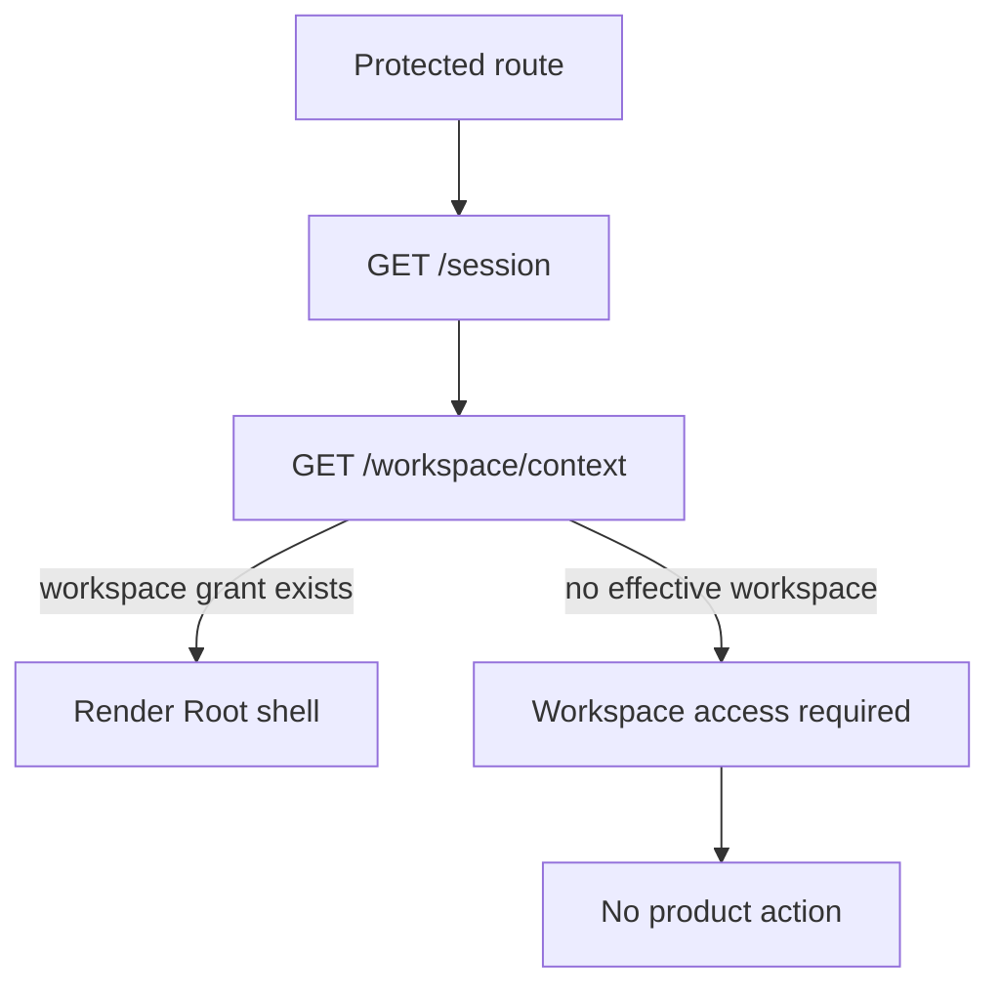
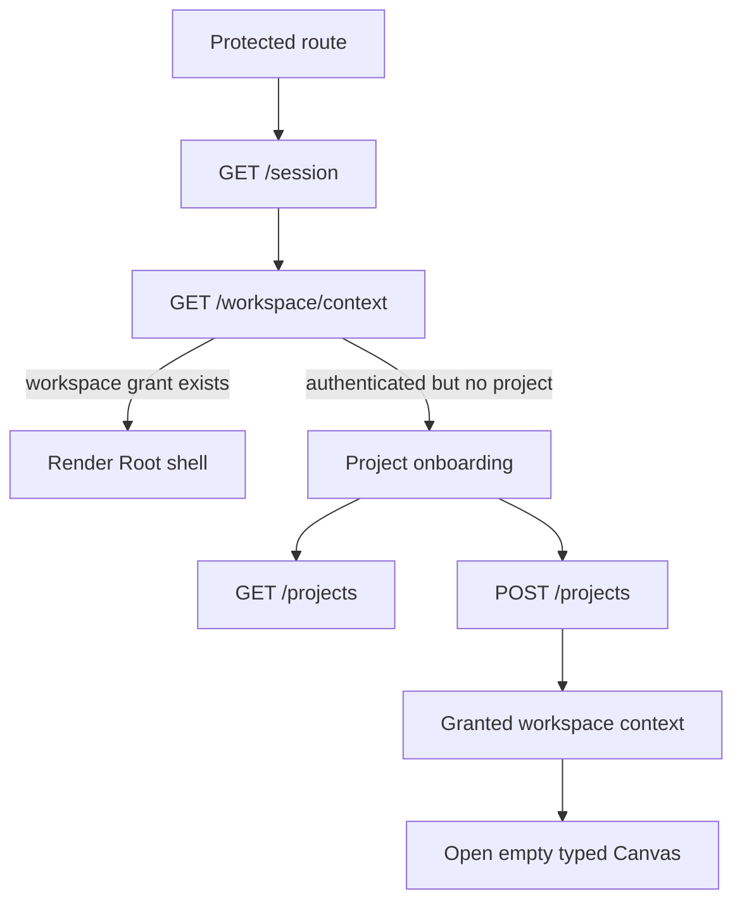

# F-31 Authenticated Project Onboarding Plan

## Think-First Analysis

The product now has a real protected route gate: `/session` resolves before
`/workspace/context`, and protected shell routes do not render before those
queries complete. The remaining product break is first-use onboarding. A valid
authenticated user without an effective project/workspace grant currently
lands on a terminal "workspace access required" posture. That is truthful, but
it does not let the user do the next product action: create or select a project
and start from an empty typed Canvas.

Root cause: the current F-26 and `E-MAND-WEB-AUTH-ONBOARDING-CANON` work
canonized the auth and workspace-context boundary, but it stopped at admission.
Project onboarding is still represented in the proposal and component stories,
not as an implemented command/query route. This leaves browser scope,
workspace grant projection, and first-canvas startup split across route gate,
session store, Canvas host, and test fixtures.

Selected direction: reuse the accepted web-auth command/query catalog and add a
small project-onboarding vertical. The API owns `ListProjects` and
`CreateProject`; the web owns a `ProjectOnboardingView` rendered only after a
valid session cannot resolve an effective workspace. `CreateProject` creates a
real tenant-scoped project record and grants the caller an initial workspace
scope; Canvas then opens through the existing `/workspace/context` and
workspace graph-draft rails. Fixture nodes stay test/demo-only.

Rejected directions:

- letting `AuthRouteGate` keep a terminal denied screen, because that blocks a
  valid first-use product journey;
- teaching the web to invent a project in localStorage, because browser state
  is a projection, not authority;
- adding sample graph nodes as default onboarding, because fixtures must not
  define product truth;
- implementing tenant-admin bootstrap in this slice, because F-31 only covers
  authenticated users with a tenant grant and no selected project.

## Current State



## Target State



## Command And Query Rails

No parallel rail is introduced. F-31 implements the rails already named by the
accepted web-auth proposal.

| Product behavior                                | Rail                           | Type    | DDD owner                        | Scope and authorization                                                          |
| ----------------------------------------------- | ------------------------------ | ------- | -------------------------------- | -------------------------------------------------------------------------------- |
| Load project choices after authenticated denial | `ListProjects`                 | query   | `ProjectCatalogReadModel`        | Authenticated principal, tenant grant; no project grant required.                |
| Create the first project for a tenant           | `CreateProject`                | command | `Project` aggregate              | Authenticated principal with tenant create-project grant and idempotency key.    |
| Re-resolve workspace after project creation     | `GetEffectiveWorkspaceContext` | query   | `SelectedScope` read model       | Server-owned grant projection from protected runtime workspace context.          |
| Open Canvas after project exists                | `GetWorkspaceGraphDraft`       | query   | `WorkspaceGraphDraft` read model | Existing protected Canvas draft rail, downstream of session and project context. |
| Create the first canvas document                | `CreateCanvas`                 | command | `CanvasDocument` authoring state | Existing Canvas create-document command, no sample nodes by default.             |

## Fowler Opportunity Matrix

- Authenticated user has tenant grant but no project:
  Boundary drift. Use Service Layer + Gateway owned by
  `ProjectCatalogReadModel`. Implementation surfaces are
  `apps/api/src/application/ports/projectOnboarding.ts`, the API route group,
  the project onboarding repository, and the web onboarding service. Tests live
  in `apps/api/test/entrypoints/http/projectOnboardingRoutes.test.ts` and
  `apps/web/src/app/views/ProjectOnboardingView.test.tsx`. Tenant-admin
  bootstrap stays out of scope.
- Project creation must grant an initial workspace:
  Hidden authority. Use aggregate command + policy owned by `Project`.
  Implementation surfaces are
  `apps/api/src/application/services/createProjectUseCase.ts`, the embedded
  project repository, and workspace-context query reuse. Tests cover duplicate
  project, unauthorized tenant, missing idempotency, and stale denied workspace
  recheck. External identity provider admin stays out of scope.
- Browser storage must not create scope:
  Duplicate semantics. Use presentation projection owned by
  `SelectedScope` read model. Implementation surfaces are `AuthRouteGate.tsx`,
  `protectedRouteSessionContext.ts`, `ProjectOnboardingView.tsx`, and session
  store updates only from server context. Tests prove no graph draft call before
  workspace context and no browser-storage project authority. Local storage
  migration tooling stays out of scope.
- First project opens empty Canvas without fixtures:
  Test-only confidence. Use semantic browser proof owned by `CanvasDocument`.
  Implementation surfaces are the Canvas first-canvas host path and Cypress
  onboarding flow. Cypress proves an authenticated no-project user can create a
  project, open an empty typed Canvas, and see no `src_orders`, `model_orders`,
  or `orders_dashboard` unless demo data is seeded. Sample data and demo seed
  UX stay out of scope.
- Proposal disposition remains traceable to real work:
  Documentation drift. Use mechanized implementation plan owned by
  `FeatureMechanizationGuard`. Implementation surfaces are this plan,
  `web-auth-project-onboarding-and-actionable-gaps-20260501.md`, planning DB
  task `F-31`, and closeout evidence. Tests are
  `pnpm docs:feature-mechanization -- --feature F31-AUTHENTICATED-PROJECT-ONBOARDING-20260525`
  and `pnpm docs:feature-mechanization:implementation`. Reconciling every
  `E-PROP` action row stays out of scope.

## Pre-Implementation Brief

Mode: Full.

Scope:

- add project onboarding API ports, application services, HTTP routes, and
  embedded Postgres adapter under `apps/api`;
- add web project onboarding service and view under `apps/web`;
- change `AuthRouteGate` so `workspace_context_not_granted` becomes an
  authenticated onboarding path instead of a terminal denied page;
- prove clean empty startup without sample nodes.

Risks and mitigations:

- Risk: project creation becomes a local mock. Mitigation: persist project rows
  and grant updates through the API Postgres adapter, not browser fixtures.
- Risk: onboarding bypasses workspace authorization. Mitigation: after
  `CreateProject`, re-enter through `GetEffectiveWorkspaceContext`.
- Risk: this expands into tenant admin. Mitigation: tenant-admin bootstrap and
  role assignment stay out of scope.

## Validation Plan

- `pnpm docs:feature-mechanization -- --feature F31-AUTHENTICATED-PROJECT-ONBOARDING-20260525`
- `pnpm --filter dvt-api exec vitest run --config vitest.config.ts test/entrypoints/http/projectOnboardingRoutes.test.ts`
- `pnpm --filter @dvt/web exec vitest run --config vitest.presentation.config.ts src/app/views/ProjectOnboardingView.test.tsx src/app/bootstrap/AuthRouteGate.test.tsx`
- `pnpm --filter @dvt/web test:e2e:native -- --spec cypress/e2e/shell/project-onboarding.cy.ts`
- `pnpm --filter dvt-api typecheck`
- `pnpm --filter @dvt/web typecheck`
- `pnpm --filter dvt-api test`
- `pnpm --filter @dvt/web test:ci`
- `pnpm docs:feature-mechanization:implementation -- --feature F31-AUTHENTICATED-PROJECT-ONBOARDING-20260525`
- `pnpm governance:refresh`
- `pnpm verify:prepush`

```feature-mechanization
version: 1
featureId: F31-AUTHENTICATED-PROJECT-ONBOARDING-20260525
mechanizationStatus: closed
noHumanDecisionsRemaining: true
implementationPlan: docs/planning/proposals/mandatory/frontend-and-ux/f31-authenticated-project-onboarding-plan-20260525.md
componentGuides:
  - docs/architecture/components/web/appshell/web-auth-project-onboarding-component.md
  - docs/architecture/components/web/appshell/web-auth-project-onboarding-user-stories.md
userStories:
  - docs/architecture/components/web/appshell/web-auth-project-onboarding-user-stories.md
  - docs/planning/proposals/mandatory/frontend-and-ux/web-auth-project-onboarding-and-actionable-gaps-20260501.md
governingSources:
  - AGENTS.md
  - docs/planning/status/governance-document-rule-inventory.md
  - docs/guides/ai-work-protocol.md
  - docs/architecture/command-query-rail-governance.md
  - docs/architecture/fowler-opportunity-planning-governance.md
  - docs/planning/state/planning-control-tower.md
  - docs/planning/proposals/mandatory/frontend-and-ux/web-auth-project-onboarding-and-actionable-gaps-20260501.md
allowedImplementationSurfaces:
  - apps/api/src/application/ports/projectOnboarding.ts
  - apps/api/src/application/ports/protectedRuntimeRailVocabulary.ts
  - apps/api/src/application/ports/protectedRuntimeWorkspaceCommandQueryRails.ts
  - apps/api/src/application/services/createProjectUseCase.ts
  - apps/api/src/application/services/listProjectsUseCase.ts
  - apps/api/src/entrypoints/http/projectOnboardingRoutes.ts
  - apps/api/src/entrypoints/http/projectOnboardingRouteGroup.ts
  - apps/api/src/entrypoints/http/registerProtectedRuntimeRoutes.ts
  - apps/api/src/entrypoints/http/runtimeRoutes.constants.ts
  - apps/api/src/infrastructure/auth/embeddedProjectOnboardingRepository.ts
  - apps/api/src/modules/buildProtectedRuntimeModule.ts
  - apps/api/src/modules/protectedRuntime/buildProtectedSecurityRuntime.ts
  - apps/api/src/modules/types.ts
  - apps/api/test/app/protectedRuntimeAppTestSupport.ts
  - apps/api/test/app/protectedRuntimeComposition.test.ts
  - apps/api/test/entrypoints/http/protectedRuntimeRouteGroup.architecture.test.ts
  - apps/api/test/entrypoints/http/projectOnboardingRoutes.test.ts
  - apps/api/test/entrypoints/http/registerProtectedRuntimeRoutes.test.ts
  - apps/api/test/modules/registerOperationalHooks.cases.ts
  - apps/web/cypress/e2e/shell/project-onboarding.cy.ts
  - apps/web/src/app/bootstrap/AuthRouteGate.test.tsx
  - apps/web/src/app/bootstrap/AuthRouteGate.tsx
  - apps/web/src/app/services/projectOnboarding/projectOnboardingService.ts
  - apps/web/src/app/services/projectOnboarding/projectOnboardingService.test.ts
  - apps/web/src/app/views/ProjectOnboardingView.test.tsx
  - apps/web/src/app/views/ProjectOnboardingView.tsx
  - docs/architecture/components/web/appshell/web-auth-project-onboarding-component.md
  - docs/architecture/components/web/appshell/web-auth-project-onboarding-user-stories.md
  - docs/planning/proposals/mandatory/frontend-and-ux/f31-authenticated-project-onboarding-plan-20260525.md
  - docs/planning/proposals/mandatory/frontend-and-ux/web-auth-project-onboarding-and-actionable-gaps-20260501.md
  - docs/planning/closeouts/20260525-f31-authenticated-project-onboarding-closeout.md
  - docs/planning/status/**
  - docs/planning/state/execution-workboard.md
  - docs/planning/state/open-task-route.md
  - docs/.manifest.json
forbiddenImplementationSurfaces:
  - packages/@dvt/contracts/**
  - packages/@dvt/engine/**
  - packages/@dvt/adapter-*/**
  - specs/**
commandQueryRails:
  - name: ListProjects
    type: query
    dddOwner: ProjectCatalogReadModel
  - name: CreateProject
    type: command
    dddOwner: Project
  - name: GetEffectiveWorkspaceContext
    type: query
    dddOwner: SelectedScope
  - name: GetWorkspaceGraphDraft
    type: query
    dddOwner: WorkspaceGraphDraft
  - name: CreateCanvas
    type: command
    dddOwner: CanvasDocument
domainObjects:
  - name: Project
    type: aggregate
    owner: Project onboarding
  - name: ProjectCatalogReadModel
    type: read model
    owner: Project onboarding
  - name: SelectedScope
    type: read model
    owner: Protected workspace context
  - name: CanvasDocument
    type: authoring state
    owner: Canvas host
fowlerSignals:
  - Boundary drift
  - Hidden authority
  - Duplicate semantics
  - Test-only confidence
  - Documentation drift
architectureGuards:
  - pnpm docs:feature-mechanization:implementation -- --feature F31-AUTHENTICATED-PROJECT-ONBOARDING-20260525
  - pnpm --filter @dvt/web exec vitest run --config vitest.architecture.config.ts src/app/bootstrap/webAuthProjectOnboarding.architecture.test.ts src/app/services/session/protectedRouteSessionContext.architecture.test.ts
cypressFlows:
  - pnpm --filter @dvt/web test:e2e:native -- --spec cypress/e2e/shell/project-onboarding.cy.ts
completionGate:
  - pnpm docs:feature-mechanization -- --feature F31-AUTHENTICATED-PROJECT-ONBOARDING-20260525
  - pnpm --filter dvt-api exec vitest run --config vitest.config.ts test/entrypoints/http/projectOnboardingRoutes.test.ts
  - pnpm --filter @dvt/web exec vitest run --config vitest.presentation.config.ts src/app/views/ProjectOnboardingView.test.tsx src/app/bootstrap/AuthRouteGate.test.tsx
  - pnpm --filter @dvt/web test:e2e:native -- --spec cypress/e2e/shell/project-onboarding.cy.ts
  - pnpm --filter dvt-api typecheck
  - pnpm --filter @dvt/web typecheck
  - pnpm docs:feature-mechanization:implementation -- --feature F31-AUTHENTICATED-PROJECT-ONBOARDING-20260525
  - pnpm governance:refresh
  - pnpm verify:prepush
redGreenCycles:
  - id: f31-api-project-onboarding
    redTest: pnpm --filter dvt-api exec vitest run --config vitest.config.ts test/entrypoints/http/projectOnboardingRoutes.test.ts
    expectedFailure: There is no protected ListProjects or CreateProject route for authenticated users without a project grant.
    patchSurfaces:
      - apps/api/src/application/ports/projectOnboarding.ts
      - apps/api/src/application/services/createProjectUseCase.ts
      - apps/api/src/application/services/listProjectsUseCase.ts
      - apps/api/src/entrypoints/http/projectOnboardingRoutes.ts
      - apps/api/src/entrypoints/http/projectOnboardingRouteGroup.ts
      - apps/api/src/infrastructure/auth/embeddedProjectOnboardingRepository.ts
      - apps/api/test/entrypoints/http/projectOnboardingRoutes.test.ts
    greenTest: pnpm --filter dvt-api exec vitest run --config vitest.config.ts test/entrypoints/http/projectOnboardingRoutes.test.ts
  - id: f31-web-onboarding-view
    redTest: pnpm --filter @dvt/web exec vitest run --config vitest.presentation.config.ts src/app/views/ProjectOnboardingView.test.tsx src/app/bootstrap/AuthRouteGate.test.tsx
    expectedFailure: Authenticated workspace-context denial renders a terminal denied screen instead of project onboarding.
    patchSurfaces:
      - apps/web/src/app/bootstrap/AuthRouteGate.tsx
      - apps/web/src/app/services/projectOnboarding/projectOnboardingService.ts
      - apps/web/src/app/views/ProjectOnboardingView.tsx
      - apps/web/src/app/views/ProjectOnboardingView.test.tsx
      - apps/web/src/app/bootstrap/AuthRouteGate.test.tsx
    greenTest: pnpm --filter @dvt/web exec vitest run --config vitest.presentation.config.ts src/app/views/ProjectOnboardingView.test.tsx src/app/bootstrap/AuthRouteGate.test.tsx
  - id: f31-browser-first-use
    redTest: pnpm --filter @dvt/web test:e2e:native -- --spec cypress/e2e/shell/project-onboarding.cy.ts
    expectedFailure: A first-use authenticated user cannot create a project and reach an empty Canvas without fixture nodes.
    patchSurfaces:
      - apps/web/cypress/e2e/shell/project-onboarding.cy.ts
    greenTest: pnpm --filter @dvt/web test:e2e:native -- --spec cypress/e2e/shell/project-onboarding.cy.ts
symbols:
  - { name: IProjectOnboardingRepository, path: apps/api/src/application/ports/projectOnboarding.ts, dddOwner: ProjectCatalogReadModel, cqRails: [ListProjects, CreateProject], fowlerSignals: [Boundary drift, Hidden authority], architectureGuard: pnpm docs:feature-mechanization:implementation -- --feature F31-AUTHENTICATED-PROJECT-ONBOARDING-20260525, cypressCoverage: N/A - API boundary, unitTests: [pnpm --filter dvt-api exec vitest run --config vitest.config.ts test/entrypoints/http/projectOnboardingRoutes.test.ts] }
  - { name: CreateProjectUseCase, path: apps/api/src/application/services/createProjectUseCase.ts, dddOwner: Project, cqRails: [CreateProject], fowlerSignals: [Hidden authority], architectureGuard: pnpm docs:feature-mechanization:implementation -- --feature F31-AUTHENTICATED-PROJECT-ONBOARDING-20260525, cypressCoverage: pnpm --filter @dvt/web test:e2e:native -- --spec cypress/e2e/shell/project-onboarding.cy.ts, unitTests: [pnpm --filter dvt-api exec vitest run --config vitest.config.ts test/entrypoints/http/projectOnboardingRoutes.test.ts] }
  - { name: ListProjectsUseCase, path: apps/api/src/application/services/listProjectsUseCase.ts, dddOwner: ProjectCatalogReadModel, cqRails: [ListProjects], fowlerSignals: [Boundary drift], architectureGuard: pnpm docs:feature-mechanization:implementation -- --feature F31-AUTHENTICATED-PROJECT-ONBOARDING-20260525, cypressCoverage: pnpm --filter @dvt/web test:e2e:native -- --spec cypress/e2e/shell/project-onboarding.cy.ts, unitTests: [pnpm --filter dvt-api exec vitest run --config vitest.config.ts test/entrypoints/http/projectOnboardingRoutes.test.ts] }
  - { name: EmbeddedProjectOnboardingRepository, path: apps/api/src/infrastructure/auth/embeddedProjectOnboardingRepository.ts, dddOwner: Project, cqRails: [ListProjects, CreateProject], fowlerSignals: [Hidden authority], architectureGuard: pnpm docs:feature-mechanization:implementation -- --feature F31-AUTHENTICATED-PROJECT-ONBOARDING-20260525, cypressCoverage: pnpm --filter @dvt/web test:e2e:native -- --spec cypress/e2e/shell/project-onboarding.cy.ts, unitTests: [pnpm --filter dvt-api exec vitest run --config vitest.config.ts test/entrypoints/http/projectOnboardingRoutes.test.ts] }
  - { name: ProjectOnboardingView, path: apps/web/src/app/views/ProjectOnboardingView.tsx, dddOwner: ProjectOnboardingPresentation, cqRails: [ListProjects, CreateProject, GetEffectiveWorkspaceContext], fowlerSignals: [Boundary drift, Duplicate semantics], architectureGuard: pnpm docs:feature-mechanization:implementation -- --feature F31-AUTHENTICATED-PROJECT-ONBOARDING-20260525, cypressCoverage: pnpm --filter @dvt/web test:e2e:native -- --spec cypress/e2e/shell/project-onboarding.cy.ts, unitTests: [pnpm --filter @dvt/web exec vitest run --config vitest.presentation.config.ts src/app/views/ProjectOnboardingView.test.tsx] }
  - { name: createProjectOnboardingService, path: apps/web/src/app/services/projectOnboarding/projectOnboardingService.ts, dddOwner: ProjectOnboardingPresentation, cqRails: [ListProjects, CreateProject], fowlerSignals: [Boundary drift], architectureGuard: pnpm docs:feature-mechanization:implementation -- --feature F31-AUTHENTICATED-PROJECT-ONBOARDING-20260525, cypressCoverage: pnpm --filter @dvt/web test:e2e:native -- --spec cypress/e2e/shell/project-onboarding.cy.ts, unitTests: [pnpm --filter @dvt/web exec vitest run --config vitest.presentation.config.ts src/app/views/ProjectOnboardingView.test.tsx] }
  - { name: PROJECT_ONBOARDING_CREATE_SCOPE, path: apps/api/src/application/ports/projectOnboarding.ts, dddOwner: Project, cqRails: [CreateProject], fowlerSignals: [Hidden authority], architectureGuard: pnpm docs:feature-mechanization:implementation -- --feature F31-AUTHENTICATED-PROJECT-ONBOARDING-20260525, cypressCoverage: pnpm --filter @dvt/web test:e2e:native -- --spec cypress/e2e/shell/project-onboarding.cy.ts, unitTests: [pnpm --filter dvt-api exec vitest run --config vitest.config.ts test/entrypoints/http/projectOnboardingRoutes.test.ts] }
  - { name: PROJECT_ONBOARDING_DEFAULT_ENVIRONMENT_ID, path: apps/api/src/application/ports/projectOnboarding.ts, dddOwner: Project, cqRails: [CreateProject], fowlerSignals: [Hidden authority], architectureGuard: pnpm docs:feature-mechanization:implementation -- --feature F31-AUTHENTICATED-PROJECT-ONBOARDING-20260525, cypressCoverage: pnpm --filter @dvt/web test:e2e:native -- --spec cypress/e2e/shell/project-onboarding.cy.ts, unitTests: [pnpm --filter dvt-api exec vitest run --config vitest.config.ts test/entrypoints/http/projectOnboardingRoutes.test.ts] }
  - { name: ProjectOnboardingTenant, path: apps/api/src/application/ports/projectOnboarding.ts, dddOwner: ProjectCatalogReadModel, cqRails: [ListProjects], fowlerSignals: [Boundary drift], architectureGuard: pnpm docs:feature-mechanization:implementation -- --feature F31-AUTHENTICATED-PROJECT-ONBOARDING-20260525, cypressCoverage: pnpm --filter @dvt/web test:e2e:native -- --spec cypress/e2e/shell/project-onboarding.cy.ts, unitTests: [pnpm --filter dvt-api exec vitest run --config vitest.config.ts test/entrypoints/http/projectOnboardingRoutes.test.ts] }
  - { name: ProjectDescriptor, path: apps/api/src/application/ports/projectOnboarding.ts, dddOwner: ProjectCatalogReadModel, cqRails: [ListProjects, CreateProject], fowlerSignals: [Boundary drift], architectureGuard: pnpm docs:feature-mechanization:implementation -- --feature F31-AUTHENTICATED-PROJECT-ONBOARDING-20260525, cypressCoverage: pnpm --filter @dvt/web test:e2e:native -- --spec cypress/e2e/shell/project-onboarding.cy.ts, unitTests: [pnpm --filter dvt-api exec vitest run --config vitest.config.ts test/entrypoints/http/projectOnboardingRoutes.test.ts] }
  - { name: ProjectOnboardingCatalog, path: apps/api/src/application/ports/projectOnboarding.ts, dddOwner: ProjectCatalogReadModel, cqRails: [ListProjects], fowlerSignals: [Boundary drift], architectureGuard: pnpm docs:feature-mechanization:implementation -- --feature F31-AUTHENTICATED-PROJECT-ONBOARDING-20260525, cypressCoverage: pnpm --filter @dvt/web test:e2e:native -- --spec cypress/e2e/shell/project-onboarding.cy.ts, unitTests: [pnpm --filter dvt-api exec vitest run --config vitest.config.ts test/entrypoints/http/projectOnboardingRoutes.test.ts] }
  - { name: EffectiveProjectWorkspaceContext, path: apps/api/src/application/ports/projectOnboarding.ts, dddOwner: SelectedScope, cqRails: [CreateProject, GetEffectiveWorkspaceContext], fowlerSignals: [Hidden authority], architectureGuard: pnpm docs:feature-mechanization:implementation -- --feature F31-AUTHENTICATED-PROJECT-ONBOARDING-20260525, cypressCoverage: pnpm --filter @dvt/web test:e2e:native -- --spec cypress/e2e/shell/project-onboarding.cy.ts, unitTests: [pnpm --filter dvt-api exec vitest run --config vitest.config.ts test/entrypoints/http/projectOnboardingRoutes.test.ts] }
  - { name: CreateProjectCommand, path: apps/api/src/application/ports/projectOnboarding.ts, dddOwner: Project, cqRails: [CreateProject], fowlerSignals: [Hidden authority], architectureGuard: pnpm docs:feature-mechanization:implementation -- --feature F31-AUTHENTICATED-PROJECT-ONBOARDING-20260525, cypressCoverage: pnpm --filter @dvt/web test:e2e:native -- --spec cypress/e2e/shell/project-onboarding.cy.ts, unitTests: [pnpm --filter dvt-api exec vitest run --config vitest.config.ts test/entrypoints/http/projectOnboardingRoutes.test.ts] }
  - { name: CreateProjectOutcome, path: apps/api/src/application/ports/projectOnboarding.ts, dddOwner: Project, cqRails: [CreateProject], fowlerSignals: [Hidden authority], architectureGuard: pnpm docs:feature-mechanization:implementation -- --feature F31-AUTHENTICATED-PROJECT-ONBOARDING-20260525, cypressCoverage: pnpm --filter @dvt/web test:e2e:native -- --spec cypress/e2e/shell/project-onboarding.cy.ts, unitTests: [pnpm --filter dvt-api exec vitest run --config vitest.config.ts test/entrypoints/http/projectOnboardingRoutes.test.ts] }
  - { name: registerProjectOnboardingRouteGroup, path: apps/api/src/entrypoints/http/projectOnboardingRouteGroup.ts, dddOwner: ProjectOnboardingHttpAdapter, cqRails: [ListProjects, CreateProject], fowlerSignals: [Boundary drift], architectureGuard: pnpm docs:feature-mechanization:implementation -- --feature F31-AUTHENTICATED-PROJECT-ONBOARDING-20260525, cypressCoverage: pnpm --filter @dvt/web test:e2e:native -- --spec cypress/e2e/shell/project-onboarding.cy.ts, unitTests: [pnpm --filter dvt-api exec vitest run --config vitest.config.ts test/entrypoints/http/registerProtectedRuntimeRoutes.test.ts] }
  - { name: ProjectOnboardingRouteDeps, path: apps/api/src/entrypoints/http/projectOnboardingRoutes.ts, dddOwner: ProjectOnboardingHttpAdapter, cqRails: [ListProjects, CreateProject], fowlerSignals: [Boundary drift], architectureGuard: pnpm docs:feature-mechanization:implementation -- --feature F31-AUTHENTICATED-PROJECT-ONBOARDING-20260525, cypressCoverage: pnpm --filter @dvt/web test:e2e:native -- --spec cypress/e2e/shell/project-onboarding.cy.ts, unitTests: [pnpm --filter dvt-api exec vitest run --config vitest.config.ts test/entrypoints/http/projectOnboardingRoutes.test.ts] }
  - { name: CreateProjectBody, path: apps/api/src/entrypoints/http/projectOnboardingRoutes.ts, dddOwner: ProjectOnboardingHttpAdapter, cqRails: [CreateProject], fowlerSignals: [Boundary drift], architectureGuard: pnpm docs:feature-mechanization:implementation -- --feature F31-AUTHENTICATED-PROJECT-ONBOARDING-20260525, cypressCoverage: pnpm --filter @dvt/web test:e2e:native -- --spec cypress/e2e/shell/project-onboarding.cy.ts, unitTests: [pnpm --filter dvt-api exec vitest run --config vitest.config.ts test/entrypoints/http/projectOnboardingRoutes.test.ts] }
  - { name: registerProjectOnboardingRoutes, path: apps/api/src/entrypoints/http/projectOnboardingRoutes.ts, dddOwner: ProjectOnboardingHttpAdapter, cqRails: [ListProjects, CreateProject], fowlerSignals: [Boundary drift], architectureGuard: pnpm docs:feature-mechanization:implementation -- --feature F31-AUTHENTICATED-PROJECT-ONBOARDING-20260525, cypressCoverage: pnpm --filter @dvt/web test:e2e:native -- --spec cypress/e2e/shell/project-onboarding.cy.ts, unitTests: [pnpm --filter dvt-api exec vitest run --config vitest.config.ts test/entrypoints/http/projectOnboardingRoutes.test.ts] }
  - { name: authenticateProjectOnboardingRequest, path: apps/api/src/entrypoints/http/projectOnboardingRoutes.ts, dddOwner: ProjectOnboardingHttpAdapter, cqRails: [ListProjects, CreateProject], fowlerSignals: [Boundary drift], architectureGuard: pnpm docs:feature-mechanization:implementation -- --feature F31-AUTHENTICATED-PROJECT-ONBOARDING-20260525, cypressCoverage: pnpm --filter @dvt/web test:e2e:native -- --spec cypress/e2e/shell/project-onboarding.cy.ts, unitTests: [pnpm --filter dvt-api exec vitest run --config vitest.config.ts test/entrypoints/http/projectOnboardingRoutes.test.ts] }
  - { name: parseCreateProjectRequest, path: apps/api/src/entrypoints/http/projectOnboardingRoutes.ts, dddOwner: ProjectOnboardingHttpAdapter, cqRails: [CreateProject], fowlerSignals: [Hidden authority], architectureGuard: pnpm docs:feature-mechanization:implementation -- --feature F31-AUTHENTICATED-PROJECT-ONBOARDING-20260525, cypressCoverage: pnpm --filter @dvt/web test:e2e:native -- --spec cypress/e2e/shell/project-onboarding.cy.ts, unitTests: [pnpm --filter dvt-api exec vitest run --config vitest.config.ts test/entrypoints/http/projectOnboardingRoutes.test.ts] }
  - { name: Queryable, path: apps/api/src/infrastructure/auth/embeddedProjectOnboardingRepository.ts, dddOwner: Project, cqRails: [ListProjects, CreateProject], fowlerSignals: [Hidden authority], architectureGuard: pnpm docs:feature-mechanization:implementation -- --feature F31-AUTHENTICATED-PROJECT-ONBOARDING-20260525, cypressCoverage: pnpm --filter @dvt/web test:e2e:native -- --spec cypress/e2e/shell/project-onboarding.cy.ts, unitTests: [pnpm --filter dvt-api exec vitest run --config vitest.config.ts test/entrypoints/http/projectOnboardingRoutes.test.ts] }
  - { name: EnvironmentGrantJson, path: apps/api/src/infrastructure/auth/embeddedProjectOnboardingRepository.ts, dddOwner: Project, cqRails: [CreateProject], fowlerSignals: [Hidden authority], architectureGuard: pnpm docs:feature-mechanization:implementation -- --feature F31-AUTHENTICATED-PROJECT-ONBOARDING-20260525, cypressCoverage: pnpm --filter @dvt/web test:e2e:native -- --spec cypress/e2e/shell/project-onboarding.cy.ts, unitTests: [pnpm --filter dvt-api exec vitest run --config vitest.config.ts test/entrypoints/http/projectOnboardingRoutes.test.ts] }
  - { name: ProjectGrantJson, path: apps/api/src/infrastructure/auth/embeddedProjectOnboardingRepository.ts, dddOwner: Project, cqRails: [CreateProject], fowlerSignals: [Hidden authority], architectureGuard: pnpm docs:feature-mechanization:implementation -- --feature F31-AUTHENTICATED-PROJECT-ONBOARDING-20260525, cypressCoverage: pnpm --filter @dvt/web test:e2e:native -- --spec cypress/e2e/shell/project-onboarding.cy.ts, unitTests: [pnpm --filter dvt-api exec vitest run --config vitest.config.ts test/entrypoints/http/projectOnboardingRoutes.test.ts] }
  - { name: TenantGrantJson, path: apps/api/src/infrastructure/auth/embeddedProjectOnboardingRepository.ts, dddOwner: Project, cqRails: [ListProjects, CreateProject], fowlerSignals: [Hidden authority], architectureGuard: pnpm docs:feature-mechanization:implementation -- --feature F31-AUTHENTICATED-PROJECT-ONBOARDING-20260525, cypressCoverage: pnpm --filter @dvt/web test:e2e:native -- --spec cypress/e2e/shell/project-onboarding.cy.ts, unitTests: [pnpm --filter dvt-api exec vitest run --config vitest.config.ts test/entrypoints/http/projectOnboardingRoutes.test.ts] }
  - { name: PrincipalAccessRow, path: apps/api/src/infrastructure/auth/embeddedProjectOnboardingRepository.ts, dddOwner: ProjectCatalogReadModel, cqRails: [ListProjects, CreateProject], fowlerSignals: [Hidden authority], architectureGuard: pnpm docs:feature-mechanization:implementation -- --feature F31-AUTHENTICATED-PROJECT-ONBOARDING-20260525, cypressCoverage: pnpm --filter @dvt/web test:e2e:native -- --spec cypress/e2e/shell/project-onboarding.cy.ts, unitTests: [pnpm --filter dvt-api exec vitest run --config vitest.config.ts test/entrypoints/http/projectOnboardingRoutes.test.ts] }
  - { name: ProjectRow, path: apps/api/src/infrastructure/auth/embeddedProjectOnboardingRepository.ts, dddOwner: ProjectCatalogReadModel, cqRails: [ListProjects, CreateProject], fowlerSignals: [Boundary drift], architectureGuard: pnpm docs:feature-mechanization:implementation -- --feature F31-AUTHENTICATED-PROJECT-ONBOARDING-20260525, cypressCoverage: pnpm --filter @dvt/web test:e2e:native -- --spec cypress/e2e/shell/project-onboarding.cy.ts, unitTests: [pnpm --filter dvt-api exec vitest run --config vitest.config.ts test/entrypoints/http/projectOnboardingRoutes.test.ts] }
  - { name: IdempotencyRow, path: apps/api/src/infrastructure/auth/embeddedProjectOnboardingRepository.ts, dddOwner: Project, cqRails: [CreateProject], fowlerSignals: [Hidden authority], architectureGuard: pnpm docs:feature-mechanization:implementation -- --feature F31-AUTHENTICATED-PROJECT-ONBOARDING-20260525, cypressCoverage: pnpm --filter @dvt/web test:e2e:native -- --spec cypress/e2e/shell/project-onboarding.cy.ts, unitTests: [pnpm --filter dvt-api exec vitest run --config vitest.config.ts test/entrypoints/http/projectOnboardingRoutes.test.ts] }
  - { name: loadPrincipalAccess, path: apps/api/src/infrastructure/auth/embeddedProjectOnboardingRepository.ts, dddOwner: ProjectCatalogReadModel, cqRails: [ListProjects, CreateProject], fowlerSignals: [Hidden authority], architectureGuard: pnpm docs:feature-mechanization:implementation -- --feature F31-AUTHENTICATED-PROJECT-ONBOARDING-20260525, cypressCoverage: pnpm --filter @dvt/web test:e2e:native -- --spec cypress/e2e/shell/project-onboarding.cy.ts, unitTests: [pnpm --filter dvt-api exec vitest run --config vitest.config.ts test/entrypoints/http/projectOnboardingRoutes.test.ts] }
  - { name: loadProjectDescriptors, path: apps/api/src/infrastructure/auth/embeddedProjectOnboardingRepository.ts, dddOwner: ProjectCatalogReadModel, cqRails: [ListProjects], fowlerSignals: [Boundary drift], architectureGuard: pnpm docs:feature-mechanization:implementation -- --feature F31-AUTHENTICATED-PROJECT-ONBOARDING-20260525, cypressCoverage: pnpm --filter @dvt/web test:e2e:native -- --spec cypress/e2e/shell/project-onboarding.cy.ts, unitTests: [pnpm --filter dvt-api exec vitest run --config vitest.config.ts test/entrypoints/http/projectOnboardingRoutes.test.ts] }
  - { name: loadIdempotency, path: apps/api/src/infrastructure/auth/embeddedProjectOnboardingRepository.ts, dddOwner: Project, cqRails: [CreateProject], fowlerSignals: [Hidden authority], architectureGuard: pnpm docs:feature-mechanization:implementation -- --feature F31-AUTHENTICATED-PROJECT-ONBOARDING-20260525, cypressCoverage: pnpm --filter @dvt/web test:e2e:native -- --spec cypress/e2e/shell/project-onboarding.cy.ts, unitTests: [pnpm --filter dvt-api exec vitest run --config vitest.config.ts test/entrypoints/http/projectOnboardingRoutes.test.ts] }
  - { name: saveProjectGrant, path: apps/api/src/infrastructure/auth/embeddedProjectOnboardingRepository.ts, dddOwner: Project, cqRails: [CreateProject], fowlerSignals: [Hidden authority], architectureGuard: pnpm docs:feature-mechanization:implementation -- --feature F31-AUTHENTICATED-PROJECT-ONBOARDING-20260525, cypressCoverage: pnpm --filter @dvt/web test:e2e:native -- --spec cypress/e2e/shell/project-onboarding.cy.ts, unitTests: [pnpm --filter dvt-api exec vitest run --config vitest.config.ts test/entrypoints/http/projectOnboardingRoutes.test.ts] }
  - { name: saveIdempotency, path: apps/api/src/infrastructure/auth/embeddedProjectOnboardingRepository.ts, dddOwner: Project, cqRails: [CreateProject], fowlerSignals: [Hidden authority], architectureGuard: pnpm docs:feature-mechanization:implementation -- --feature F31-AUTHENTICATED-PROJECT-ONBOARDING-20260525, cypressCoverage: pnpm --filter @dvt/web test:e2e:native -- --spec cypress/e2e/shell/project-onboarding.cy.ts, unitTests: [pnpm --filter dvt-api exec vitest run --config vitest.config.ts test/entrypoints/http/projectOnboardingRoutes.test.ts] }
  - { name: findTenant, path: apps/api/src/infrastructure/auth/embeddedProjectOnboardingRepository.ts, dddOwner: Project, cqRails: [CreateProject], fowlerSignals: [Hidden authority], architectureGuard: pnpm docs:feature-mechanization:implementation -- --feature F31-AUTHENTICATED-PROJECT-ONBOARDING-20260525, cypressCoverage: pnpm --filter @dvt/web test:e2e:native -- --spec cypress/e2e/shell/project-onboarding.cy.ts, unitTests: [pnpm --filter dvt-api exec vitest run --config vitest.config.ts test/entrypoints/http/projectOnboardingRoutes.test.ts] }
  - { name: canCreateProject, path: apps/api/src/infrastructure/auth/embeddedProjectOnboardingRepository.ts, dddOwner: Project, cqRails: [CreateProject], fowlerSignals: [Hidden authority], architectureGuard: pnpm docs:feature-mechanization:implementation -- --feature F31-AUTHENTICATED-PROJECT-ONBOARDING-20260525, cypressCoverage: pnpm --filter @dvt/web test:e2e:native -- --spec cypress/e2e/shell/project-onboarding.cy.ts, unitTests: [pnpm --filter dvt-api exec vitest run --config vitest.config.ts test/entrypoints/http/projectOnboardingRoutes.test.ts] }
  - { name: buildProjectId, path: apps/api/src/infrastructure/auth/embeddedProjectOnboardingRepository.ts, dddOwner: Project, cqRails: [CreateProject], fowlerSignals: [Hidden authority], architectureGuard: pnpm docs:feature-mechanization:implementation -- --feature F31-AUTHENTICATED-PROJECT-ONBOARDING-20260525, cypressCoverage: pnpm --filter @dvt/web test:e2e:native -- --spec cypress/e2e/shell/project-onboarding.cy.ts, unitTests: [pnpm --filter dvt-api exec vitest run --config vitest.config.ts test/entrypoints/http/projectOnboardingRoutes.test.ts] }
  - { name: hashCreateProjectRequest, path: apps/api/src/infrastructure/auth/embeddedProjectOnboardingRepository.ts, dddOwner: Project, cqRails: [CreateProject], fowlerSignals: [Hidden authority], architectureGuard: pnpm docs:feature-mechanization:implementation -- --feature F31-AUTHENTICATED-PROJECT-ONBOARDING-20260525, cypressCoverage: pnpm --filter @dvt/web test:e2e:native -- --spec cypress/e2e/shell/project-onboarding.cy.ts, unitTests: [pnpm --filter dvt-api exec vitest run --config vitest.config.ts test/entrypoints/http/projectOnboardingRoutes.test.ts] }
  - { name: isAssertedValueAllowed, path: apps/api/src/infrastructure/auth/embeddedProjectOnboardingRepository.ts, dddOwner: ProjectCatalogReadModel, cqRails: [ListProjects, CreateProject], fowlerSignals: [Hidden authority], architectureGuard: pnpm docs:feature-mechanization:implementation -- --feature F31-AUTHENTICATED-PROJECT-ONBOARDING-20260525, cypressCoverage: pnpm --filter @dvt/web test:e2e:native -- --spec cypress/e2e/shell/project-onboarding.cy.ts, unitTests: [pnpm --filter dvt-api exec vitest run --config vitest.config.ts test/entrypoints/http/projectOnboardingRoutes.test.ts] }
  - { name: normalizeProjects, path: apps/api/src/infrastructure/auth/embeddedProjectOnboardingRepository.ts, dddOwner: ProjectCatalogReadModel, cqRails: [ListProjects, CreateProject], fowlerSignals: [Boundary drift], architectureGuard: pnpm docs:feature-mechanization:implementation -- --feature F31-AUTHENTICATED-PROJECT-ONBOARDING-20260525, cypressCoverage: pnpm --filter @dvt/web test:e2e:native -- --spec cypress/e2e/shell/project-onboarding.cy.ts, unitTests: [pnpm --filter dvt-api exec vitest run --config vitest.config.ts test/entrypoints/http/projectOnboardingRoutes.test.ts] }
  - { name: normalizeEnvironments, path: apps/api/src/infrastructure/auth/embeddedProjectOnboardingRepository.ts, dddOwner: ProjectCatalogReadModel, cqRails: [ListProjects, CreateProject], fowlerSignals: [Boundary drift], architectureGuard: pnpm docs:feature-mechanization:implementation -- --feature F31-AUTHENTICATED-PROJECT-ONBOARDING-20260525, cypressCoverage: pnpm --filter @dvt/web test:e2e:native -- --spec cypress/e2e/shell/project-onboarding.cy.ts, unitTests: [pnpm --filter dvt-api exec vitest run --config vitest.config.ts test/entrypoints/http/projectOnboardingRoutes.test.ts] }
  - { name: normalizeStrings, path: apps/api/src/infrastructure/auth/embeddedProjectOnboardingRepository.ts, dddOwner: Project, cqRails: [CreateProject], fowlerSignals: [Hidden authority], architectureGuard: pnpm docs:feature-mechanization:implementation -- --feature F31-AUTHENTICATED-PROJECT-ONBOARDING-20260525, cypressCoverage: pnpm --filter @dvt/web test:e2e:native -- --spec cypress/e2e/shell/project-onboarding.cy.ts, unitTests: [pnpm --filter dvt-api exec vitest run --config vitest.config.ts test/entrypoints/http/projectOnboardingRoutes.test.ts] }
  - { name: quoteIdentifier, path: apps/api/src/infrastructure/auth/embeddedProjectOnboardingRepository.ts, dddOwner: Project, cqRails: [ListProjects, CreateProject], fowlerSignals: [Hidden authority], architectureGuard: pnpm docs:feature-mechanization:implementation -- --feature F31-AUTHENTICATED-PROJECT-ONBOARDING-20260525, cypressCoverage: pnpm --filter @dvt/web test:e2e:native -- --spec cypress/e2e/shell/project-onboarding.cy.ts, unitTests: [pnpm --filter dvt-api exec vitest run --config vitest.config.ts test/entrypoints/http/projectOnboardingRoutes.test.ts] }
  - { name: createDeps, path: apps/api/test/entrypoints/http/projectOnboardingRoutes.test.ts, dddOwner: ProjectOnboardingHttpAdapter, cqRails: [ListProjects, CreateProject], fowlerSignals: [Boundary drift], architectureGuard: pnpm docs:feature-mechanization:implementation -- --feature F31-AUTHENTICATED-PROJECT-ONBOARDING-20260525, cypressCoverage: N/A - route unit harness, unitTests: [pnpm --filter dvt-api exec vitest run --config vitest.config.ts test/entrypoints/http/projectOnboardingRoutes.test.ts] }
  - { name: stubRuntimeCapabilities, path: apps/web/cypress/e2e/shell/project-onboarding.cy.ts, dddOwner: ProjectOnboardingBrowserProof, cqRails: [GetEffectiveWorkspaceContext], fowlerSignals: [Test-only confidence], architectureGuard: pnpm docs:feature-mechanization:implementation -- --feature F31-AUTHENTICATED-PROJECT-ONBOARDING-20260525, cypressCoverage: pnpm --filter @dvt/web test:e2e:native -- --spec cypress/e2e/shell/project-onboarding.cy.ts, unitTests: [pnpm --filter @dvt/web exec vitest run --config vitest.config.ts src/app/bootstrap/AuthRouteGate.test.tsx] }
  - { name: stubFirstUseProjectOnboardingApis, path: apps/web/cypress/e2e/shell/project-onboarding.cy.ts, dddOwner: ProjectOnboardingBrowserProof, cqRails: [ListProjects, CreateProject, GetEffectiveWorkspaceContext], fowlerSignals: [Test-only confidence], architectureGuard: pnpm docs:feature-mechanization:implementation -- --feature F31-AUTHENTICATED-PROJECT-ONBOARDING-20260525, cypressCoverage: pnpm --filter @dvt/web test:e2e:native -- --spec cypress/e2e/shell/project-onboarding.cy.ts, unitTests: [pnpm --filter @dvt/web exec vitest run --config vitest.config.ts src/app/views/ProjectOnboardingView.test.tsx] }
  - { name: visitCanvasWithoutPersistedWorkspace, path: apps/web/cypress/e2e/shell/project-onboarding.cy.ts, dddOwner: ProjectOnboardingBrowserProof, cqRails: [GetEffectiveWorkspaceContext], fowlerSignals: [Test-only confidence], architectureGuard: pnpm docs:feature-mechanization:implementation -- --feature F31-AUTHENTICATED-PROJECT-ONBOARDING-20260525, cypressCoverage: pnpm --filter @dvt/web test:e2e:native -- --spec cypress/e2e/shell/project-onboarding.cy.ts, unitTests: [pnpm --filter @dvt/web exec vitest run --config vitest.config.ts src/app/bootstrap/AuthRouteGate.test.tsx] }
  - { name: workspaceContextDeniedError, path: apps/web/src/app/bootstrap/AuthRouteGate.test.tsx, dddOwner: ProjectOnboardingPresentation, cqRails: [GetEffectiveWorkspaceContext], fowlerSignals: [Boundary drift], architectureGuard: pnpm docs:feature-mechanization:implementation -- --feature F31-AUTHENTICATED-PROJECT-ONBOARDING-20260525, cypressCoverage: pnpm --filter @dvt/web test:e2e:native -- --spec cypress/e2e/shell/project-onboarding.cy.ts, unitTests: [pnpm --filter @dvt/web exec vitest run --config vitest.config.ts src/app/bootstrap/AuthRouteGate.test.tsx] }
  - { name: installBootstrapScreen, path: apps/web/src/app/bootstrap/AuthRouteGate.test.tsx, dddOwner: ProjectOnboardingPresentation, cqRails: [GetEffectiveWorkspaceContext], fowlerSignals: [Test-only confidence], architectureGuard: pnpm docs:feature-mechanization:implementation -- --feature F31-AUTHENTICATED-PROJECT-ONBOARDING-20260525, cypressCoverage: pnpm --filter @dvt/web test:e2e:native -- --spec cypress/e2e/shell/project-onboarding.cy.ts, unitTests: [pnpm --filter @dvt/web exec vitest run --config vitest.config.ts src/app/bootstrap/AuthRouteGate.test.tsx] }
  - { name: ProjectOnboardingTenant, path: apps/web/src/app/services/projectOnboarding/projectOnboardingService.ts, dddOwner: ProjectOnboardingPresentation, cqRails: [ListProjects], fowlerSignals: [Boundary drift], architectureGuard: pnpm docs:feature-mechanization:implementation -- --feature F31-AUTHENTICATED-PROJECT-ONBOARDING-20260525, cypressCoverage: pnpm --filter @dvt/web test:e2e:native -- --spec cypress/e2e/shell/project-onboarding.cy.ts, unitTests: [pnpm --filter @dvt/web exec vitest run --config vitest.config.ts src/app/services/projectOnboarding/projectOnboardingService.test.ts] }
  - { name: ProjectDescriptor, path: apps/web/src/app/services/projectOnboarding/projectOnboardingService.ts, dddOwner: ProjectOnboardingPresentation, cqRails: [ListProjects, CreateProject], fowlerSignals: [Boundary drift], architectureGuard: pnpm docs:feature-mechanization:implementation -- --feature F31-AUTHENTICATED-PROJECT-ONBOARDING-20260525, cypressCoverage: pnpm --filter @dvt/web test:e2e:native -- --spec cypress/e2e/shell/project-onboarding.cy.ts, unitTests: [pnpm --filter @dvt/web exec vitest run --config vitest.config.ts src/app/services/projectOnboarding/projectOnboardingService.test.ts] }
  - { name: ProjectOnboardingCatalog, path: apps/web/src/app/services/projectOnboarding/projectOnboardingService.ts, dddOwner: ProjectOnboardingPresentation, cqRails: [ListProjects], fowlerSignals: [Boundary drift], architectureGuard: pnpm docs:feature-mechanization:implementation -- --feature F31-AUTHENTICATED-PROJECT-ONBOARDING-20260525, cypressCoverage: pnpm --filter @dvt/web test:e2e:native -- --spec cypress/e2e/shell/project-onboarding.cy.ts, unitTests: [pnpm --filter @dvt/web exec vitest run --config vitest.config.ts src/app/services/projectOnboarding/projectOnboardingService.test.ts] }
  - { name: EffectiveProjectWorkspaceContext, path: apps/web/src/app/services/projectOnboarding/projectOnboardingService.ts, dddOwner: ProjectOnboardingPresentation, cqRails: [CreateProject, GetEffectiveWorkspaceContext], fowlerSignals: [Boundary drift], architectureGuard: pnpm docs:feature-mechanization:implementation -- --feature F31-AUTHENTICATED-PROJECT-ONBOARDING-20260525, cypressCoverage: pnpm --filter @dvt/web test:e2e:native -- --spec cypress/e2e/shell/project-onboarding.cy.ts, unitTests: [pnpm --filter @dvt/web exec vitest run --config vitest.config.ts src/app/services/projectOnboarding/projectOnboardingService.test.ts] }
  - { name: CreateProjectCommand, path: apps/web/src/app/services/projectOnboarding/projectOnboardingService.ts, dddOwner: ProjectOnboardingPresentation, cqRails: [CreateProject], fowlerSignals: [Boundary drift], architectureGuard: pnpm docs:feature-mechanization:implementation -- --feature F31-AUTHENTICATED-PROJECT-ONBOARDING-20260525, cypressCoverage: pnpm --filter @dvt/web test:e2e:native -- --spec cypress/e2e/shell/project-onboarding.cy.ts, unitTests: [pnpm --filter @dvt/web exec vitest run --config vitest.config.ts src/app/services/projectOnboarding/projectOnboardingService.test.ts] }
  - { name: CreateProjectResponse, path: apps/web/src/app/services/projectOnboarding/projectOnboardingService.ts, dddOwner: ProjectOnboardingPresentation, cqRails: [CreateProject, GetEffectiveWorkspaceContext], fowlerSignals: [Boundary drift], architectureGuard: pnpm docs:feature-mechanization:implementation -- --feature F31-AUTHENTICATED-PROJECT-ONBOARDING-20260525, cypressCoverage: pnpm --filter @dvt/web test:e2e:native -- --spec cypress/e2e/shell/project-onboarding.cy.ts, unitTests: [pnpm --filter @dvt/web exec vitest run --config vitest.config.ts src/app/services/projectOnboarding/projectOnboardingService.test.ts] }
  - { name: ProjectOnboardingService, path: apps/web/src/app/services/projectOnboarding/projectOnboardingService.ts, dddOwner: ProjectOnboardingPresentation, cqRails: [ListProjects, CreateProject], fowlerSignals: [Boundary drift], architectureGuard: pnpm docs:feature-mechanization:implementation -- --feature F31-AUTHENTICATED-PROJECT-ONBOARDING-20260525, cypressCoverage: pnpm --filter @dvt/web test:e2e:native -- --spec cypress/e2e/shell/project-onboarding.cy.ts, unitTests: [pnpm --filter @dvt/web exec vitest run --config vitest.config.ts src/app/services/projectOnboarding/projectOnboardingService.test.ts] }
  - { name: ProjectOnboardingServiceDeps, path: apps/web/src/app/services/projectOnboarding/projectOnboardingService.ts, dddOwner: ProjectOnboardingPresentation, cqRails: [CreateProject], fowlerSignals: [Boundary drift], architectureGuard: pnpm docs:feature-mechanization:implementation -- --feature F31-AUTHENTICATED-PROJECT-ONBOARDING-20260525, cypressCoverage: pnpm --filter @dvt/web test:e2e:native -- --spec cypress/e2e/shell/project-onboarding.cy.ts, unitTests: [pnpm --filter @dvt/web exec vitest run --config vitest.config.ts src/app/services/projectOnboarding/projectOnboardingService.test.ts] }
  - { name: createBrowserIdempotencyKey, path: apps/web/src/app/services/projectOnboarding/projectOnboardingService.ts, dddOwner: ProjectOnboardingPresentation, cqRails: [CreateProject], fowlerSignals: [Hidden authority], architectureGuard: pnpm docs:feature-mechanization:implementation -- --feature F31-AUTHENTICATED-PROJECT-ONBOARDING-20260525, cypressCoverage: pnpm --filter @dvt/web test:e2e:native -- --spec cypress/e2e/shell/project-onboarding.cy.ts, unitTests: [pnpm --filter @dvt/web exec vitest run --config vitest.config.ts src/app/services/projectOnboarding/projectOnboardingService.test.ts] }
  - { name: buildProjectOnboardingService, path: apps/web/src/app/views/ProjectOnboardingView.test.tsx, dddOwner: ProjectOnboardingPresentation, cqRails: [ListProjects, CreateProject], fowlerSignals: [Boundary drift], architectureGuard: pnpm docs:feature-mechanization:implementation -- --feature F31-AUTHENTICATED-PROJECT-ONBOARDING-20260525, cypressCoverage: pnpm --filter @dvt/web test:e2e:native -- --spec cypress/e2e/shell/project-onboarding.cy.ts, unitTests: [pnpm --filter @dvt/web exec vitest run --config vitest.config.ts src/app/views/ProjectOnboardingView.test.tsx] }
  - { name: ProjectOnboardingViewProps, path: apps/web/src/app/views/ProjectOnboardingView.tsx, dddOwner: ProjectOnboardingPresentation, cqRails: [ListProjects, CreateProject, GetEffectiveWorkspaceContext], fowlerSignals: [Boundary drift], architectureGuard: pnpm docs:feature-mechanization:implementation -- --feature F31-AUTHENTICATED-PROJECT-ONBOARDING-20260525, cypressCoverage: pnpm --filter @dvt/web test:e2e:native -- --spec cypress/e2e/shell/project-onboarding.cy.ts, unitTests: [pnpm --filter @dvt/web exec vitest run --config vitest.config.ts src/app/views/ProjectOnboardingView.test.tsx] }
  - { name: CatalogState, path: apps/web/src/app/views/ProjectOnboardingView.tsx, dddOwner: ProjectOnboardingPresentation, cqRails: [ListProjects], fowlerSignals: [Boundary drift], architectureGuard: pnpm docs:feature-mechanization:implementation -- --feature F31-AUTHENTICATED-PROJECT-ONBOARDING-20260525, cypressCoverage: pnpm --filter @dvt/web test:e2e:native -- --spec cypress/e2e/shell/project-onboarding.cy.ts, unitTests: [pnpm --filter @dvt/web exec vitest run --config vitest.config.ts src/app/views/ProjectOnboardingView.test.tsx] }
  - { name: SubmissionState, path: apps/web/src/app/views/ProjectOnboardingView.tsx, dddOwner: ProjectOnboardingPresentation, cqRails: [CreateProject], fowlerSignals: [Boundary drift], architectureGuard: pnpm docs:feature-mechanization:implementation -- --feature F31-AUTHENTICATED-PROJECT-ONBOARDING-20260525, cypressCoverage: pnpm --filter @dvt/web test:e2e:native -- --spec cypress/e2e/shell/project-onboarding.cy.ts, unitTests: [pnpm --filter @dvt/web exec vitest run --config vitest.config.ts src/app/views/ProjectOnboardingView.test.tsx] }
  - { name: readableErrorMessage, path: apps/web/src/app/views/ProjectOnboardingView.tsx, dddOwner: ProjectOnboardingPresentation, cqRails: [ListProjects, CreateProject], fowlerSignals: [Boundary drift], architectureGuard: pnpm docs:feature-mechanization:implementation -- --feature F31-AUTHENTICATED-PROJECT-ONBOARDING-20260525, cypressCoverage: pnpm --filter @dvt/web test:e2e:native -- --spec cypress/e2e/shell/project-onboarding.cy.ts, unitTests: [pnpm --filter @dvt/web exec vitest run --config vitest.config.ts src/app/views/ProjectOnboardingView.test.tsx] }
  - { name: resolveInitialTenantId, path: apps/web/src/app/views/ProjectOnboardingView.tsx, dddOwner: ProjectOnboardingPresentation, cqRails: [ListProjects], fowlerSignals: [Boundary drift], architectureGuard: pnpm docs:feature-mechanization:implementation -- --feature F31-AUTHENTICATED-PROJECT-ONBOARDING-20260525, cypressCoverage: pnpm --filter @dvt/web test:e2e:native -- --spec cypress/e2e/shell/project-onboarding.cy.ts, unitTests: [pnpm --filter @dvt/web exec vitest run --config vitest.config.ts src/app/views/ProjectOnboardingView.test.tsx] }
  - { name: resolveDefaultEnvironment, path: apps/web/src/app/views/ProjectOnboardingView.tsx, dddOwner: ProjectOnboardingPresentation, cqRails: [GetEffectiveWorkspaceContext], fowlerSignals: [Boundary drift], architectureGuard: pnpm docs:feature-mechanization:implementation -- --feature F31-AUTHENTICATED-PROJECT-ONBOARDING-20260525, cypressCoverage: pnpm --filter @dvt/web test:e2e:native -- --spec cypress/e2e/shell/project-onboarding.cy.ts, unitTests: [pnpm --filter @dvt/web exec vitest run --config vitest.config.ts src/app/views/ProjectOnboardingView.test.tsx] }
  - { name: resolveTenantDisplayName, path: apps/web/src/app/views/ProjectOnboardingView.tsx, dddOwner: ProjectOnboardingPresentation, cqRails: [ListProjects], fowlerSignals: [Boundary drift], architectureGuard: pnpm docs:feature-mechanization:implementation -- --feature F31-AUTHENTICATED-PROJECT-ONBOARDING-20260525, cypressCoverage: pnpm --filter @dvt/web test:e2e:native -- --spec cypress/e2e/shell/project-onboarding.cy.ts, unitTests: [pnpm --filter @dvt/web exec vitest run --config vitest.config.ts src/app/views/ProjectOnboardingView.test.tsx] }
```
