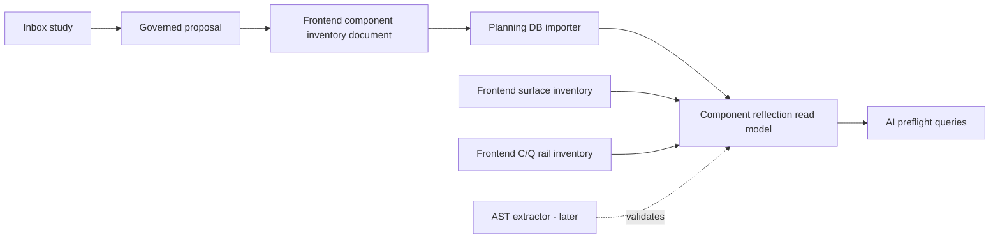

# Frontend Component Reflection Inventory Plan

## Source Intake

This proposal is the governed disposition for the inbox study:

- `buzon/dvt_front_component_inventory_app_reflection_study_20260604.md`

The inbox study is useful as analysis, but it is not a canonical planning or
architecture source. This document is the repository-facing proposal. It
preserves the useful direction while rejecting the parts that would create a
large, untestable implementation slice.

## Critical Disposition

The study fits the DVT model as an extension of the existing frontend DB-first
inventory work, not as a replacement for it.

Accepted direction:

- Persist frontend components as queryable planning DB rows linked to real
  application surfaces, files, ports, command/query rails, and evidence.
- Keep `frontend_mechanical_truth_surfaces` focused on visible surface posture:
  route, plugin, affordance, state, backend dependencies, and capability gaps.
- Add a lower-level component reflection inventory for the implementation parts
  that build those surfaces.
- Use the governed architecture document as the initial intention source and a
  later AST extractor as mechanical validation.
- Treat Backstage-style component/API/resource mapping as a useful comparison,
  not as a schema to copy wholesale.

Rejected or constrained direction:

- Do not implement the full relational model, importer, query CLI, Canvas seed,
  Runs seed, AST extractor, and drift gates in one PR.
- Do not create a single JSONB-heavy `frontend_component_inventory` table that
  cannot support joins by file, surface, rail, or evidence.
- Do not let the browser component inventory invent command/query semantics.
  Rails remain governed by the frontend command/query rail catalog.
- Do not treat Storybook as required tooling for this slice. The DB model can
  leave room for visual evidence, but Storybook adoption is a separate decision.
- Do not mark components as `current` unless the file and evidence references
  can be validated mechanically.

## Existing Model Fit

The proposal sits between two existing governed surfaces:

- `ListFrontendMechanicalTruthSurfaces` answers: what visible frontend surfaces
  exist and what maturity posture do they have?
- `ListFrontendCommandQueryRails` answers: what frontend commands and queries
  exist, what owns them, and where are the gaps?

The new component reflection model answers a distinct question:

> Which frontend components, files, symbols, ports, dependencies, and evidence
> implement or support each visible surface and rail?

That distinction is enough to justify a new read model, but not enough to
justify bypassing the existing rails. The first implementation must reuse the
current surface and rail inventories as foreign authority.

## Rail Posture

Creation-intent preflight for "create a frontend component reflection query"
returns existing rail candidates, including:

- `ListFrontendCommandQueryRails`
- `ListFrontendMechanicalTruthSurfaces`

Therefore this proposal must not start by creating a parallel frontend behavior
rail. The first slice should add a component read model that references those
rails and only introduce a named query such as `ListFrontendComponentReflection`
after the accepted implementation plan proves that surface and rail queries
cannot answer the lower-level component question directly.

Proposed status for the new query:

| Query                             | Status   | DDD owner                              | Reason                                                                                                                                         |
| --------------------------------- | -------- | -------------------------------------- | ---------------------------------------------------------------------------------------------------------------------------------------------- |
| `ListFrontendComponentReflection` | proposed | `FrontendComponentReflectionInventory` | Needed only if the component-level read model has its own schema, filters, and drift checks beyond existing frontend surface and rail queries. |

## Fowler Opportunity Matrix

<!-- markdownlint-disable MD060 -->

| Scenario                                                                           | Opportunity          | Fowler pattern                                      | DDD owner                              | Command/query rail                                                                             | Implementation surfaces                                      | Tests                                        | Out of scope                |
| ---------------------------------------------------------------------------------- | -------------------- | --------------------------------------------------- | -------------------------------------- | ---------------------------------------------------------------------------------------------- | ------------------------------------------------------------ | -------------------------------------------- | --------------------------- |
| A visible route exists but its implementing components and files are not queryable | Hidden authority     | Explicit Read Model                                 | `FrontendComponentReflectionInventory` | proposed `ListFrontendComponentReflection` or extension of existing frontend inventory queries | planning DB migration, governed inventory document, importer | planning DB migration/import/query tests     | AST extractor               |
| Component status lives in prose and cannot be joined to files or rails             | Documentation drift  | Published Language / Documentation Map              | web component inventory                | existing `ListFrontendMechanicalTruthSurfaces`, existing `ListFrontendCommandQueryRails`       | architecture inventory doc                                   | docs sync and import tests                   | product UI changes          |
| Repeated route toolbars and panels have no shared reflection model                 | Duplicate semantics  | Separate Model from Presentation; Extract Component | workbench component catalog            | none - planning read model only                                                                | component inventory seed                                     | parser and vocabulary tests                  | extracting React components |
| Files, symbols, ports, rails, and evidence travel as loose lists                   | Data clumps          | Introduce Parameter Object; normalized child tables | component reflection row               | proposed query once accepted                                                                   | parser row builders and DB tables                            | unit tests for row normalization             | broad source scan           |
| Tests prove string fixtures instead of architecture relationships                  | Test-only confidence | Characterization Test with semantic joins           | component reflection drift check       | proposed query once accepted                                                                   | query views and drift checks                                 | negative tests for missing file/surface/rail | full web suite expansion    |

<!-- markdownlint-enable MD060 -->

## Recommended Architecture



## Implementation Slices

### Slice 1 - Governed Proposal Only

Objective: decide whether the inbox study fits the model and record the
accepted constraints.

Allowed surfaces:

- this proposal;
- docs indexes generated by `pnpm docs:sync`.

No schema, CLI, or product behavior changes belong in this slice.

### Slice 2 - Minimal DB Model

Objective: add the smallest relational component reflection model that can
answer component-to-surface, component-to-file, component-to-rail, and
component-to-evidence questions.

Candidate tables:

- `frontend_components`
- `frontend_surface_component_links`
- `frontend_component_files`
- `frontend_component_cq_rails`
- `frontend_component_evidence`

Deferred tables:

- `frontend_component_symbols`
- `frontend_component_ports`
- `frontend_component_data_contracts`
- `frontend_component_dependencies`

Reason for deferral: those surfaces need either richer manual inventory rules
or AST validation to avoid creating unverifiable prose tables.

### Slice 3 - Governed Inventory And Query CLI

Objective: create `docs/architecture/components/web/frontend-component-inventory.md`,
an importer, and query commands.

Required queries:

```bash
pnpm planning:db:query frontend-components --limit 50
pnpm planning:db:query frontend-components --surface web.canvas.graph
pnpm planning:db:query frontend-component-files --component web.component.canvas.CanvasToolbar
pnpm planning:db:query frontend-component-rails --status gap-needed
```

### Slice 4 - Mechanical Drift Checks

Objective: fail when inventory rows claim app reflection that no longer exists.

Required negative checks:

- declared component file does not exist;
- declared surface ID does not exist in
  `frontend_mechanical_truth_surfaces`;
- declared rail does not exist in the frontend command/query rail catalog;
- `current` component has no file or no evidence;
- `gap-needed` rail is not paired with an explicit capability gap.

### Slice 5 - AST Reflection

Objective: use the TypeScript compiler API or `ts-morph` to validate exports,
React components, hooks, query hooks, stores, ports, and plugin contributions.

This is deliberately later work. It validates the architecture; it must not
become the authority that invents architecture.

## Initial Component Scope

Start with the smallest useful P0 set:

| Component ID                                  | Reason                                                      |
| --------------------------------------------- | ----------------------------------------------------------- |
| `web.component.shell.AppShellFrame`           | persistent shell anchor                                     |
| `web.component.shell.ShellTopBar`             | global actions and context                                  |
| `web.component.shell.LeftNavigationRail`      | plugin-driven route navigation                              |
| `web.component.shell.BottomConsoleDrawer`     | execution/supporting context                                |
| `web.component.workbench.RouteWorkbenchFrame` | shared route layout contract                                |
| `web.component.workbench.WorkbenchStates`     | shared loading, empty, error, degraded, read-only states    |
| `web.component.canvas.CanvasToolbar`          | best current extraction source for route-toolbar reflection |

Canvas, Runs, Code, Diff, Lineage, Artifacts, Templates, Plugins, and Admin
component seeds are deferred until the P0 schema and importer are proven.

## Acceptance Criteria

- The inbox study is no longer treated as active authority.
- The component reflection proposal is explicit about what is accepted,
  rejected, and deferred.
- The first implementation slice does not add product behavior.
- Existing frontend surface and command/query inventories remain the authority
  for surface maturity and rail semantics.
- Any future implementation adds tests before relying on the new DB projection.

## Validation Plan

For this proposal-only slice:

```bash
pnpm docs:sync
pnpm docs:sync:check
pnpm lint:md:changed
pnpm verify:changed
```

For future implementation slices:

```bash
node --test scripts/planning-db-migrate.test.cjs
node --test scripts/planning-db-import.test.cjs scripts/planning-db-query.test.cjs
pnpm planning:db:import -- --governance-only
pnpm planning:db:query frontend-components --limit 20
pnpm docs:feature-mechanization:implementation
pnpm verify:prepush
```
