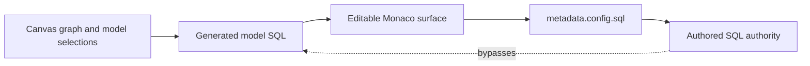
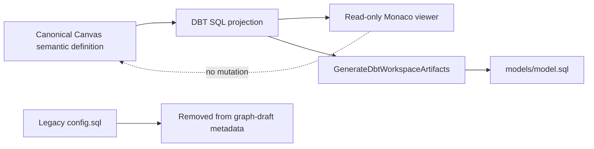

# Generated Model SQL Projection Authority Plan

## Think-First Analysis

### Problem and root cause

Before the shared-kind hard cut, creating and connecting a dbt-qualified Model
produced SQL and presented it in `DbtModelCodeAuthoringSection` through
`MonacoCodeEditor`. An edit was
stored as `metadata.config.sql`; `projectDbtModelArtifact` subsequently treats
that value as authored authority and stops deriving the body from the connected
graph. The generated projection can therefore become an autonomous second model
without an explicit authority transition.



This contradicts ADR-0064: Substrait is the semantic reference and SQL is an
adapter projection. It also contradicts ADR-0060 in graph-draft mode: projected
dbt files are outputs, not a silent alternative authoring authority.

### Constraints and invariants

- Typed pinned Substrait plus the DVT identity/provenance sidecar remains the
  target semantic authority defined by ADR-0064.
- `GenerateDbtWorkspaceArtifacts` remains the existing projection command rail.
- Generated SQL is reviewable and persistable as an artifact, but not editable
  through an implicit ownership transition.
- Legacy `metadata.sql` and `metadata.config.sql` must not continue to influence
  a graph-draft Model projection.
- Supported external dbt column selection and reordering must not be disabled
  by a historical authored-SQL branch. Native semantic functions require DVT
  Model authority.
- External dbt file authority remains a separate explicit mode under ADR-0060;
  this slice does not invent adoption or round-trip semantics.
- Shared Source/Model product kinds and explicit dbt compatibility metadata
  are owned by issue #2903. This slice removes the SQL authority conflict.
- No API, engine, planner, contracts, adapters, or database behavior changes.

### Command/query rail posture

The Planning DB `creation-intent` query returned `reuse-existing-rail`.
`ConfigureCanvasDbtNode` continues to own supported metadata and ordered output
selection. It will no longer accept projected SQL as writable model state.
`GenerateDbtWorkspaceArtifacts` continues to materialize the SQL projection.
No SQL-authoring command, reverse parser, service, route, or store is added.

### Options considered

1. Change only the provenance sentence. Rejected because the editor and
   `metadata.config.sql` would retain the hidden authority.
2. Keep editing but add an explicit "take ownership" confirmation. Rejected
   because ADR-0060 has no graph-draft-to-file-authority transition in MVP and
   ADR-0064 does not make SQL the native semantic model.
3. Convert every newly created dbt-qualified Model into another node kind.
   Rejected because #2903 instead keeps one stable `dvt:transform` identity and
   represents dbt compatibility as metadata.
4. Selected: remove writable SQL state and the authored projection branch;
   present generated SQL in the existing read-only Monaco viewer and prove that
   Preview persists the regenerated artifact.



### Fowler opportunity matrix

| Scenario                                 | Opportunity            | Pattern / owner                           | Rail                            | Proof                                 | Deferred                               |
| ---------------------------------------- | ---------------------- | ----------------------------------------- | ------------------------------- | ------------------------------------- | -------------------------------------- |
| Generated SQL becomes editable authority | Hidden authority       | Projection / Canvas DBT artifact model    | `GenerateDbtWorkspaceArtifacts` | read-only presentation test           | shared Substrait Model species (#2903) |
| `modelSql` duplicates model definition   | Duplicate semantics    | Remove field / `DbtNodeAuthoringMetadata` | `ConfigureCanvasDbtNode`        | metadata normalization tests          | explicit external file mode            |
| Column actions depend on authored SQL    | Divergent policy       | Remove obsolete branch / column authoring | `ConfigureCanvasDbtNode`        | selection and menu tests              | full card convergence (#2903)          |
| Preview must still write SQL             | Integration confidence | Artifact projection                       | `GenerateDbtWorkspaceArtifacts` | live Cypress create-link-preview flow | runtime execution changes              |

## Pre-Implementation Brief

- **Mode:** authority hard cut with compatibility cleanup and a real browser flow.
- **Expected outcome:** creating and linking a Model shows generated SQL as a
  read-only projection; inspecting it cannot create `config.sql`; Preview writes
  the regenerated SQL artifact.
- **Risk:** removal of the authored branch could change legacy drafts that stored
  SQL. The graph-draft authority rule requires fail-closed normalization to the
  generated definition rather than silently preserving the conflicting state.
- **Libraries:** reuse `MonacoCodeViewer`; no dependency is added.
- **Validation:** red/green unit and presentation tests, focused live Cypress,
  Web lint/typecheck, governance refresh, and pre-push gate.

```feature-mechanization
version: 1
featureId: GH-2915-GENERATED-MODEL-SQL-PROJECTION-AUTHORITY
mechanizationStatus: implemented
noHumanDecisionsRemaining: true
implementationPlan: docs/planning/proposals/mandatory/frontend-and-ux/generated-model-sql-projection-authority-plan-20260904.md
componentGuides:
  - docs/architecture/components/web/graph/canvas-inspector-authoring-component.md
  - docs/architecture/components/web/graph/canvas-workbench-command-query-catalog.md
  - docs/architecture/system/subsystems/semantic-transformation/index.md
userStories:
  - https://github.com/dunay2/dvt/issues/2915
governingSources:
  - AGENTS.md
  - docs/planning/status/governance-document-rule-inventory.md
  - docs/guides/ai-work-protocol.md
  - docs/planning/state/github-mvp-issue-workflow.md
  - docs/architecture/command-query-rail-governance.md
  - docs/architecture/fowler-opportunity-planning-governance.md
  - docs/adr/ADR-0060-dbt-project-authoring-authority.md
  - docs/adr/ADR-0064-substrait-semantic-reference-and-bounded-logical-profile.md
  - docs/architecture/system/subsystems/semantic-transformation/index.md
allowedImplementationSurfaces:
  - docs/.manifest.json
  - docs/**/index.md
  - docs/architecture/components/web/graph/canvas-workbench-command-query-catalog.md
  - docs/architecture/components/web/graph/canvas-inspector-authoring-component.md
  - docs/planning/proposals/mandatory/frontend-and-ux/generated-model-sql-projection-authority-plan-20260904.md
  - docs/planning/closeouts/20260904-2915-generated-model-sql-projection-authority-closeout.md
  - apps/web/src/app/views/canvas/DbtModelCodeAuthoringSection.tsx
  - apps/web/src/app/views/canvas/DbtModelCodeAuthoringSection.test.tsx
  - apps/web/src/app/views/canvas/DbtAuthoringFields.tsx
  - apps/web/src/app/views/canvas/canvasCopy.types.ts
  - apps/web/src/app/views/canvas/canvasCopyCatalog.authoring.ts
  - apps/web/src/app/views/canvas/canvasCopyCatalog.authoring.es.ts
  - apps/web/src/app/views/canvas/canvasDbtAuthoringModel.ts
  - apps/web/src/app/views/canvas/canvasDbtAuthoringModel.test.ts
  - apps/web/src/app/views/canvas/canvasDbtModelArtifactProjection.ts
  - apps/web/src/app/views/canvas/canvasDbtModelArtifactProjection.test.ts
  - apps/web/src/app/views/canvas/canvasDbtModelColumnAuthoring.ts
  - apps/web/src/app/views/canvas/canvasColumnFunctionMenuProjection.ts
  - apps/web/src/app/views/canvas/canvasColumnFunctionAuthoring.test.ts
  - apps/web/src/app/views/canvas/canvasDbtWorkspaceArtifacts.test.ts
  - apps/web/src/app/views/canvas/useCanvasControllerReadModel.ts
  - apps/web/src/app/views/canvas/canvasInspectorAuthoringModel.test.ts
  - apps/web/src/app/views/canvas/dbtAuthoringFieldsModel.test.ts
  - apps/web/src/app/views/canvas/useCanvasNodeWorkbenchDraftController.test.tsx
  - apps/web/src/app/views/canvas/CanvasNodeWorkbenchPanel.test.tsx
  - apps/web/src/app/views/artifacts/artifactsMonacoReadonlyViewer.architecture.test.ts
  - apps/web/src/app/views/templates/templatesMonacoPreview.architecture.test.ts
  - apps/web/cypress/e2e/canvas/canvas-source-import-live-clean.cy.ts
forbiddenImplementationSurfaces:
  - packages/@dvt/contracts/**
  - packages/@dvt/engine/**
  - packages/@dvt/planner/**
  - packages/@dvt/adapter-*/**
  - apps/api/**
  - infra/db/**
commandQueryRails:
  - name: ConfigureCanvasDbtNode
    type: command
    dddOwner: Canvas workbench authoring
  - name: GenerateDbtWorkspaceArtifacts
    type: command
    dddOwner: Project workspace I/O
domainObjects:
  - name: DbtNodeAuthoringMetadata
    type: value object
    owner: Canvas Web DBT authoring
  - name: DbtModelArtifactProjection
    type: projection
    owner: Canvas Web DBT artifact projection
fowlerSignals:
  - Hidden authority
  - Duplicate semantics
  - Divergent policy
  - Integration confidence
architectureGuards:
  - pnpm docs:feature-mechanization:implementation --feature GH-2915-GENERATED-MODEL-SQL-PROJECTION-AUTHORITY
cypressFlows:
  - apps/web/cypress/e2e/canvas/canvas-source-import-live-clean.cy.ts
completionGate:
  - pnpm --filter @dvt/web exec vitest run --config vitest.unit.config.ts src/app/views/canvas/canvasDbtAuthoringModel.test.ts src/app/views/canvas/canvasDbtModelArtifactProjection.test.ts
  - pnpm --filter @dvt/web exec vitest run --config vitest.presentation.config.ts src/app/views/canvas/DbtModelCodeAuthoringSection.test.tsx src/app/views/canvas/CanvasNodeWorkbenchPanel.test.tsx
  - pnpm --filter @dvt/web lint
  - pnpm --filter @dvt/web typecheck
  - pnpm governance:refresh
  - pnpm verify:prepush
redGreenCycles:
  - id: generated-model-sql-is-read-only
    redTest: pnpm --filter @dvt/web exec vitest run --config vitest.presentation.config.ts src/app/views/canvas/DbtModelCodeAuthoringSection.test.tsx
    expectedFailure: The Code section still renders an editor and persists SQL into modelSql.
    patchSurfaces:
      - apps/web/src/app/views/canvas/DbtModelCodeAuthoringSection.test.tsx
      - apps/web/src/app/views/canvas/DbtModelCodeAuthoringSection.tsx
      - apps/web/src/app/views/canvas/DbtAuthoringFields.tsx
    greenTest: pnpm --filter @dvt/web exec vitest run --config vitest.presentation.config.ts src/app/views/canvas/DbtModelCodeAuthoringSection.test.tsx
  - id: authored-sql-state-is-retired
    redTest: pnpm --filter @dvt/web exec vitest run --config vitest.unit.config.ts src/app/views/canvas/canvasDbtAuthoringModel.test.ts src/app/views/canvas/canvasDbtModelArtifactProjection.test.ts
    expectedFailure: Metadata and artifact projection still admit an authored SQL branch.
    patchSurfaces:
      - apps/web/src/app/views/canvas/canvasDbtAuthoringModel.test.ts
      - apps/web/src/app/views/canvas/canvasDbtAuthoringModel.ts
      - apps/web/src/app/views/canvas/canvasDbtModelArtifactProjection.test.ts
      - apps/web/src/app/views/canvas/canvasDbtModelArtifactProjection.ts
    greenTest: pnpm --filter @dvt/web exec vitest run --config vitest.unit.config.ts src/app/views/canvas/canvasDbtAuthoringModel.test.ts src/app/views/canvas/canvasDbtModelArtifactProjection.test.ts
symbols:
  - { name: DbtModelCodeAuthoringSection, path: apps/web/src/app/views/canvas/DbtModelCodeAuthoringSection.tsx, dddOwner: DbtModelArtifactProjection, cqRails: [GenerateDbtWorkspaceArtifacts], fowlerSignals: [Hidden authority], architectureGuard: pnpm docs:feature-mechanization:implementation --feature GH-2915-GENERATED-MODEL-SQL-PROJECTION-AUTHORITY, cypressCoverage: apps/web/cypress/e2e/canvas/canvas-source-import-live-clean.cy.ts, unitTests: [apps/web/src/app/views/canvas/DbtModelCodeAuthoringSection.test.tsx] }
  - { name: DbtNodeAuthoringMetadata, path: apps/web/src/app/views/canvas/canvasDbtAuthoringModel.ts, dddOwner: Canvas Web DBT authoring, cqRails: [ConfigureCanvasDbtNode], fowlerSignals: [Duplicate semantics], architectureGuard: pnpm docs:feature-mechanization:implementation --feature GH-2915-GENERATED-MODEL-SQL-PROJECTION-AUTHORITY, cypressCoverage: apps/web/cypress/e2e/canvas/canvas-source-import-live-clean.cy.ts, unitTests: [apps/web/src/app/views/canvas/canvasDbtAuthoringModel.test.ts] }
  - { name: projectDbtModelArtifact, path: apps/web/src/app/views/canvas/canvasDbtModelArtifactProjection.ts, dddOwner: DbtModelArtifactProjection, cqRails: [GenerateDbtWorkspaceArtifacts], fowlerSignals: [Hidden authority, Divergent policy], architectureGuard: pnpm docs:feature-mechanization:implementation --feature GH-2915-GENERATED-MODEL-SQL-PROJECTION-AUTHORITY, cypressCoverage: apps/web/cypress/e2e/canvas/canvas-source-import-live-clean.cy.ts, unitTests: [apps/web/src/app/views/canvas/canvasDbtModelArtifactProjection.test.ts] }
```
