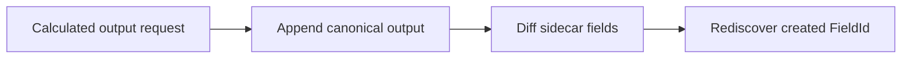
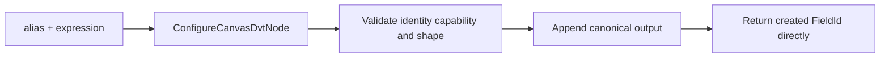

# GH-2920 create-output receipt hard cut

## Governing sources

- `AGENTS.md`
- `docs/planning/status/governance-document-rule-inventory.md`
- Planning DB architecture designs and command/query rails
- `docs/architecture/command-query-rail-governance.md`
- GitHub `#2920`, `#2922`, `#2935`, and `#3020`
- `main@8175e1cd4efe24165197ffba200fe075acbce17d`

## Current state

Calculated output authoring appends canonical Substrait state, then compares the sidecar before
and after mutation to rediscover the created FieldId. The request is also split by gesture-shaped
calculation kinds.



That diff is unnecessary because the mutation allocates the identity. It also makes the upper
command depend on an implementation detail instead of receiving a direct result.

## Decision

The existing `ConfigureCanvasDvtNode` rail receives `alias + expression candidate`. The lower
mutation validates first, allocates one opaque FieldId, appends one output, and returns either
`applied(draft, createdFieldId)` or `rejected`.



Only FieldId addresses an existing operand. Output names, source names, and source FieldIds are
not accepted as aliases for product identity. A scalar expression may consume a previously
derived output by its FieldId.

The operable expression tree and menu coupling from the original PR are removed from this cut.
They belong to `#2922`, where the first visual consumer can constrain that projection.

## Command rail

| Rail                     | Type    | Bounded context           | DDD object                       | Application port              | Adapter              | Scope and authorization                                                |
| ------------------------ | ------- | ------------------------- | -------------------------------- | ----------------------------- | -------------------- | ---------------------------------------------------------------------- |
| `ConfigureCanvasDvtNode` | command | Canvas semantic authoring | `DvtSubstraitAuthoringSidecarV1` | `applyCanvasCalculatedColumn` | Web Canvas authoring | Active writable workspace draft through the existing save/CAS boundary |

Negative behavior is fail closed: blank or duplicate alias, unknown FieldId, unsupported
capability, invalid literal, malformed projection, and Source authoring write nothing.

## Bounded acceptance

- The mutation returns the allocated `createdFieldId` directly.
- The upper command no longer diffs sidecar fields to infer identity.
- A derived scalar output can be the operand of another admitted scalar output.
- Mutable output names are rejected when supplied as operand identity.
- Literal and row-number PostgreSQL fixtures consume the same create-output seam.
- No visual tree, second AST, registry, store, focus behavior, or new capability is added.

## Rejected options

1. Keep diffing sidecar fields: duplicates knowledge already owned by the mutation.
2. Resolve names to FieldIds: reintroduces the identity ambiguity removed by `#3001`.
3. Keep the operable tree in this PR: adds 438 lines before its `#2922` consumer.
4. Add a new command: duplicates `ConfigureCanvasDvtNode`.

## Feature mechanization

```feature-mechanization
{
  "version": 1,
  "featureId": "GH-2920-CREATE-OUTPUT-RECEIPT",
  "userStories": [
    "A calculated output returns its stable identity directly and can feed a later derivation"
  ],
  "cypressFlows": [
    "N/A - semantic command cut with no new interaction surface"
  ],
  "domainObjects": [
    "Canvas Transform output",
    "DvtSubstraitAuthoringSidecarV1",
    "Semantic FieldId"
  ],
  "fowlerSignals": [
    "Duplicate semantics",
    "Hidden mutation",
    "Boundary drift"
  ],
  "symbols": [
    {
      "name": "createDvtSubstraitProjectionOutput",
      "path": "apps/web/src/app/views/canvas/canvasDvtSubstraitCalculatedColumn.ts",
      "cqRails": ["ConfigureCanvasDvtNode"],
      "dddOwner": "Canvas semantic authoring",
      "unitTests": [
        "pnpm --filter @dvt/web test -- canvasCalculatedColumnAuthoring.test.ts canvasDvtSubstraitPostgresProjection.test.ts"
      ],
      "fowlerSignals": ["Duplicate semantics", "Hidden mutation"],
      "cypressCoverage": "N/A - no new interaction surface",
      "architectureGuard": "pnpm docs:feature-mechanization:implementation -- --feature GH-2920-CREATE-OUTPUT-RECEIPT"
    },
    {
      "name": "applyCanvasCalculatedColumn",
      "path": "apps/web/src/app/views/canvas/canvasCalculatedColumnAuthoring.ts",
      "cqRails": ["ConfigureCanvasDvtNode"],
      "dddOwner": "Canvas semantic authoring",
      "unitTests": [
        "pnpm --filter @dvt/web test -- canvasCalculatedColumnAuthoring.test.ts"
      ],
      "fowlerSignals": ["Boundary drift"],
      "cypressCoverage": "N/A - existing authoring adapter",
      "architectureGuard": "pnpm docs:feature-mechanization:implementation -- --feature GH-2920-CREATE-OUTPUT-RECEIPT"
    }
  ],
  "completionGate": [
    "pnpm --filter @dvt/web test -- canvasCalculatedColumnAuthoring.test.ts canvasDvtSubstraitPostgresProjection.test.ts",
    "pnpm --filter @dvt/web lint",
    "pnpm --filter @dvt/web typecheck",
    "pnpm docs:feature-mechanization:implementation -- --feature GH-2920-CREATE-OUTPUT-RECEIPT",
    "pnpm verify:prepush"
  ],
  "redGreenCycles": [
    {
      "id": "direct-create-output-receipt",
      "redTest": "pnpm --filter @dvt/web test -- canvasCalculatedColumnAuthoring.test.ts",
      "greenTest": "pnpm --filter @dvt/web test -- canvasCalculatedColumnAuthoring.test.ts",
      "patchSurfaces": [
        "apps/web/src/app/views/canvas/canvasCalculatedColumnAuthoring.ts",
        "apps/web/src/app/views/canvas/canvasDvtSubstraitCalculatedColumn.ts",
        "apps/web/src/app/views/canvas/canvasCalculatedColumnAuthoring.test.ts"
      ],
      "expectedFailure": "The command rediscovers identity by diff and accepts mutable output names as operand identity"
    }
  ],
  "componentGuides": [
    "docs/architecture/components/web/graph/canvas-authoring-draft-boundary-component.md",
    "docs/architecture/system/subsystems/semantic-transformation/index.md"
  ],
  "governingSources": [
    "AGENTS.md",
    "docs/planning/status/governance-document-rule-inventory.md",
    "docs/architecture/command-query-rail-governance.md",
    "docs/architecture/fowler-opportunity-planning-governance.md",
    "https://github.com/dunay2/dvt/issues/2920"
  ],
  "commandQueryRails": [
    {
      "name": "ConfigureCanvasDvtNode",
      "type": "command",
      "status": "implemented",
      "dddOwner": "DvtSubstraitAuthoringSidecarV1",
      "negativeTests": [
        "Unknown FieldId writes nothing",
        "Duplicate alias writes nothing",
        "Unsupported capability writes nothing"
      ],
      "adapterSurface": "Canvas calculated-output authoring",
      "applicationPort": "applyCanvasCalculatedColumn",
      "authorizationScope": "Active writable workspace draft through the existing save/CAS boundary"
    }
  ],
  "architectureGuards": [
    "pnpm docs:feature-mechanization:implementation -- --feature GH-2920-CREATE-OUTPUT-RECEIPT"
  ],
  "implementationPlan": "docs/planning/proposals/mandatory/frontend-and-ux/gh-2920-create-output-receipt-plan-20260907.md",
  "mechanizationStatus": "implemented",
  "noHumanDecisionsRemaining": true,
  "allowedImplementationSurfaces": [
    "apps/web/src/app/views/canvas/canvasCalculatedColumnAuthoring.ts",
    "apps/web/src/app/views/canvas/canvasDvtSubstraitCalculatedColumn.ts",
    "apps/web/src/app/views/canvas/canvasCalculatedColumnAuthoring.test.ts",
    "apps/web/src/app/views/canvas/canvasDvtSubstraitPostgresProjection.test.ts",
    "docs/.manifest.json",
    "docs/planning/proposals/mandatory/frontend-and-ux/gh-2920-create-output-receipt-plan-20260907.md"
  ],
  "forbiddenImplementationSurfaces": [
    "packages/@dvt/contracts/**",
    "apps/api/**",
    "packages/@dvt/engine/**",
    "packages/@dvt/planner/**",
    "packages/@dvt/adapter-*/**",
    "infra/db/**"
  ]
}
```
