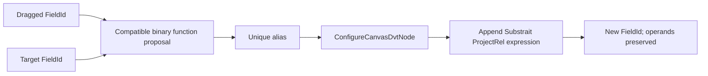

# GH-2921 algebraic derived output hard cut

## Governing sources

- `AGENTS.md`
- `docs/planning/status/governance-document-rule-inventory.md`
- Planning DB architecture designs and command/query rails
- `docs/architecture/command-query-rail-governance.md`
- `docs/architecture/fowler-opportunity-planning-governance.md`
- `docs/adr/ADR-0064-substrait-semantic-reference-and-bounded-logical-profile.md`
- GitHub `#2921`, `#2935`, `#3020`, and `#2642`

## Current state and decision

Centre-drop currently reuses a unary function from the dragged field and replaces the target
output. The result loses one operand and cannot express a binary tree. CONCAT exists as a
Substrait candidate but is not admitted with an invocation signature.



The hard cut admits the official variadic Substrait string signature `concat:str` through a
DVT profile bounded to exactly two ordered operands and `ACCEPT_NULLS`. It carries ordered
`operandFieldIds` and appends one output through `createDvtSubstraitProjectionOutput`. The
inspector and PostgreSQL projection traverse the expression recursively. The old
`sourceColumnId` replacement path and `sourceColumn.functionMenu` composition heuristic are
removed. No Canvas type, operator node, Web capability registry, second AST, or store is added.

## Command rail

| Rail                     | Type    | Bounded context            | DDD object                 | Application port       | Adapter         |
| ------------------------ | ------- | -------------------------- | -------------------------- | ---------------------- | --------------- |
| `ConfigureCanvasDvtNode` | command | Canvas workbench authoring | `DvtNodeAuthoringMetadata` | Canvas draft authoring | Web Canvas card |

Authorization remains the active writable workspace draft through the existing save/CAS
boundary. Unsupported signatures, non-text operands, duplicate aliases, unknown FieldIds,
external dbt models, self-drop, Cancel, and read-only scope write nothing.

## Bounded acceptance

- Centre-drop orders operands as `[target, dragged]` and offers compatible binary functions.
- Apply appends exactly one output with a new opaque FieldId and preserves both operands.
- A derived output can be reused without flattening or losing its expression tree.
- Persist/reload preserves the tree; PostgreSQL projection renders admitted CONCAT.
- Before/after drops remain reorder gestures; Cancel and rejection do not mutate the draft.
- #2935 owns right-click unary actions; #3020 owns result/rejection/focus.

## Feature mechanization

```feature-mechanization
{
  "version": 1,
  "featureId": "GH-2921-ALGEBRAIC-DERIVED-OUTPUT",
  "userStories": ["Compose two Transform outputs into a reusable derived output without losing either operand"],
  "cypressFlows": ["Centre-drop two text outputs, choose CONCAT, name the result, reload, and compose the result again"],
  "domainObjects": ["Canvas Transform output", "Substrait scalar expression", "Semantic FieldId"],
  "fowlerSignals": ["Hidden mutation", "Duplicate semantics", "Boundary drift"],
  "allowedImplementationSurfaces": ["apps/web/cypress/e2e/canvas/canvas-structured-transform-fields.cy.ts", "apps/web/src/app/plugins/graph/**", "apps/web/src/app/views/canvas/**", "packages/@dvt/contracts/src/contracts/planner/**", "packages/@dvt/contracts/test/dvt-substrait-capability-catalog.contract.test.ts", "docs/planning/proposals/mandatory/frontend-and-ux/gh-2921-algebraic-derived-output-plan-20260908.md", "docs/architecture/system/subsystems/semantic-transformation/index.md", "docs/architecture/reference-architecture.md", "docs/evidence/ED-20260908-algebraic-derived-output.md", "docs/risk-register/quality/R-20260908-ALGEBRAIC-DERIVED-OUTPUT-DRIFT.yaml", "docs/**/index.md", "docs/planning/status/**"],
  "forbiddenImplementationSurfaces": ["apps/web/src/app/views/canvas/**/*Vtx1*", "packages/@dvt/contracts/src/contracts/planner/VisualTransformRecipeV1*"],
  "symbols": [
    {
      "name": "latestProjection",
      "path": "apps/web/cypress/e2e/canvas/canvas-structured-transform-fields.cy.ts",
      "cqRails": ["ConfigureCanvasDvtNode"],
      "dddOwner": "DvtNodeAuthoringMetadata",
      "unitTests": ["node tools/ci/run-web-cypress-native.mjs run --headed --browser chrome --spec cypress/e2e/canvas/canvas-structured-transform-fields.cy.ts"],
      "fowlerSignals": ["Boundary drift"],
      "cypressCoverage": "apps/web/cypress/e2e/canvas/canvas-structured-transform-fields.cy.ts",
      "architectureGuard": "pnpm docs:feature-mechanization:implementation -- --feature GH-2921-ALGEBRAIC-DERIVED-OUTPUT"
    },
    {
      "name": "GraphNodeColumnCompositionFunctionResolver",
      "path": "apps/web/src/app/plugins/graph/graphNodeColumnContracts.ts",
      "cqRails": ["ConfigureCanvasDvtNode"],
      "dddOwner": "DvtNodeAuthoringMetadata",
      "unitTests": ["pnpm --filter @dvt/web test -- GraphNodeColumnSection.composition.test.tsx"],
      "fowlerSignals": ["Boundary drift"],
      "cypressCoverage": "apps/web/cypress/e2e/canvas/canvas-structured-transform-fields.cy.ts",
      "architectureGuard": "pnpm docs:feature-mechanization:implementation -- --feature GH-2921-ALGEBRAIC-DERIVED-OUTPUT"
    },
    {
      "name": "GraphNodeColumnFunctionApplyResult",
      "path": "apps/web/src/app/plugins/graph/graphNodeColumnContracts.ts",
      "cqRails": ["ConfigureCanvasDvtNode"],
      "dddOwner": "DvtNodeAuthoringMetadata",
      "unitTests": ["pnpm --filter @dvt/web test -- GraphNodeColumnSection.test.tsx"],
      "fowlerSignals": ["Hidden mutation"],
      "cypressCoverage": "apps/web/cypress/e2e/canvas/canvas-structured-transform-fields.cy.ts",
      "architectureGuard": "pnpm docs:feature-mechanization:implementation -- --feature GH-2921-ALGEBRAIC-DERIVED-OUTPUT"
    },
    {
      "name": "resolveCanvasColumnCompositionFunctions",
      "path": "apps/web/src/app/views/canvas/canvasColumnFunctionMenuProjection.ts",
      "cqRails": ["ConfigureCanvasDvtNode"],
      "dddOwner": "DvtNodeAuthoringMetadata",
      "unitTests": ["pnpm --filter @dvt/web test -- canvasColumnFunctionMenuProjection.test.ts"],
      "fowlerSignals": ["Duplicate semantics", "Boundary drift"],
      "cypressCoverage": "apps/web/cypress/e2e/canvas/canvas-structured-transform-fields.cy.ts",
      "architectureGuard": "pnpm docs:feature-mechanization:implementation -- --feature GH-2921-ALGEBRAIC-DERIVED-OUTPUT"
    },
    {
      "name": "applyCanvasColumnFunction",
      "path": "apps/web/src/app/views/canvas/canvasColumnFunctionAuthoring.ts",
      "cqRails": [
        "ConfigureCanvasDvtNode"
      ],
      "dddOwner": "DvtNodeAuthoringMetadata",
      "unitTests": [
        "pnpm --filter @dvt/web test -- canvasColumnFunctionAuthoring.test.ts"
      ],
      "fowlerSignals": [
        "Hidden mutation",
        "Duplicate semantics"
      ],
      "cypressCoverage": "apps/web/cypress/e2e/canvas/canvas-structured-transform-fields.cy.ts",
      "architectureGuard": "pnpm docs:feature-mechanization:implementation -- --feature GH-2921-ALGEBRAIC-DERIVED-OUTPUT"
    },
    {
      "name": "DvtSubstraitScalarExpression",
      "path": "apps/web/src/app/views/canvas/canvasDvtSubstraitProjection.ts",
      "cqRails": [
        "ConfigureCanvasDvtNode"
      ],
      "dddOwner": "DvtNodeAuthoringMetadata",
      "unitTests": [
        "pnpm --filter @dvt/web test -- canvasColumnFunctionAuthoring.test.ts"
      ],
      "fowlerSignals": [
        "Duplicate semantics",
        "Boundary drift"
      ],
      "cypressCoverage": "apps/web/cypress/e2e/canvas/canvas-structured-transform-fields.cy.ts",
      "architectureGuard": "pnpm docs:feature-mechanization:implementation -- --feature GH-2921-ALGEBRAIC-DERIVED-OUTPUT"
    },
    {
      "name": "buildScalarExpressionPostgresAst",
      "path": "apps/web/src/app/views/canvas/canvasDvtSubstraitPostgresProjection.ts",
      "cqRails": [
        "ConfigureCanvasDvtNode"
      ],
      "dddOwner": "DvtNodeAuthoringMetadata",
      "unitTests": [
        "pnpm --filter @dvt/web test -- canvasDvtSubstraitPostgresProjection.test.ts"
      ],
      "fowlerSignals": [
        "Duplicate semantics",
        "Boundary drift"
      ],
      "cypressCoverage": "apps/web/cypress/e2e/canvas/canvas-structured-transform-fields.cy.ts",
      "architectureGuard": "pnpm docs:feature-mechanization:implementation -- --feature GH-2921-ALGEBRAIC-DERIVED-OUTPUT"
    },
    {
      "name": "pgConcatAcceptNulls",
      "path": "apps/web/src/app/views/canvas/canvasDvtSubstraitPostgresAst.ts",
      "cqRails": [
        "ConfigureCanvasDvtNode"
      ],
      "dddOwner": "DvtNodeAuthoringMetadata",
      "unitTests": [
        "pnpm --filter @dvt/web test -- canvasDvtSubstraitPostgresProjection.test.ts"
      ],
      "fowlerSignals": [
        "Boundary drift"
      ],
      "cypressCoverage": "apps/web/cypress/e2e/canvas/canvas-structured-transform-fields.cy.ts",
      "architectureGuard": "pnpm docs:feature-mechanization:implementation -- --feature GH-2921-ALGEBRAIC-DERIVED-OUTPUT"
    },
    {
      "name": "DvtSubstraitFunctionInvocationOptionV1Schema",
      "path": "packages/@dvt/contracts/src/contracts/planner/DvtSubstraitCapabilityCatalogSchema.v1.ts",
      "cqRails": [
        "ConfigureCanvasDvtNode"
      ],
      "dddOwner": "DvtNodeAuthoringMetadata",
      "unitTests": [
        "pnpm --filter @dvt/contracts test -- dvt-substrait-capability-catalog.contract.test.ts"
      ],
      "fowlerSignals": [
        "Boundary drift"
      ],
      "cypressCoverage": "apps/web/cypress/e2e/canvas/canvas-structured-transform-fields.cy.ts",
      "architectureGuard": "pnpm docs:feature-mechanization:implementation -- --feature GH-2921-ALGEBRAIC-DERIVED-OUTPUT"
    },
    {
      "name": "DvtSubstraitFunctionInvocationV1Schema",
      "path": "packages/@dvt/contracts/src/contracts/planner/DvtSubstraitCapabilityCatalogSchema.v1.ts",
      "cqRails": [
        "ConfigureCanvasDvtNode"
      ],
      "dddOwner": "DvtNodeAuthoringMetadata",
      "unitTests": [
        "pnpm --filter @dvt/contracts test -- dvt-substrait-capability-catalog.contract.test.ts"
      ],
      "fowlerSignals": [
        "Boundary drift"
      ],
      "cypressCoverage": "apps/web/cypress/e2e/canvas/canvas-structured-transform-fields.cy.ts",
      "architectureGuard": "pnpm docs:feature-mechanization:implementation -- --feature GH-2921-ALGEBRAIC-DERIVED-OUTPUT"
    },
    {
      "name": "DvtSubstraitFunctionInvocationOptionV1",
      "path": "packages/@dvt/contracts/src/contracts/planner/DvtSubstraitCapabilityCatalogSchema.v1.ts",
      "cqRails": [
        "ConfigureCanvasDvtNode"
      ],
      "dddOwner": "DvtNodeAuthoringMetadata",
      "unitTests": [
        "pnpm --filter @dvt/contracts test -- dvt-substrait-capability-catalog.contract.test.ts"
      ],
      "fowlerSignals": [
        "Boundary drift"
      ],
      "cypressCoverage": "apps/web/cypress/e2e/canvas/canvas-structured-transform-fields.cy.ts",
      "architectureGuard": "pnpm docs:feature-mechanization:implementation -- --feature GH-2921-ALGEBRAIC-DERIVED-OUTPUT"
    },
    {
      "name": "DvtSubstraitFunctionInvocationV1",
      "path": "packages/@dvt/contracts/src/contracts/planner/DvtSubstraitCapabilityCatalogSchema.v1.ts",
      "cqRails": [
        "ConfigureCanvasDvtNode"
      ],
      "dddOwner": "DvtNodeAuthoringMetadata",
      "unitTests": [
        "pnpm --filter @dvt/contracts test -- dvt-substrait-capability-catalog.contract.test.ts"
      ],
      "fowlerSignals": [
        "Boundary drift"
      ],
      "cypressCoverage": "apps/web/cypress/e2e/canvas/canvas-structured-transform-fields.cy.ts",
      "architectureGuard": "pnpm docs:feature-mechanization:implementation -- --feature GH-2921-ALGEBRAIC-DERIVED-OUTPUT"
    },
    {
      "name": "CONCAT_ID",
      "path": "packages/@dvt/contracts/src/contracts/planner/DvtSubstraitSupportedCapabilities.v1.ts",
      "cqRails": [
        "ConfigureCanvasDvtNode"
      ],
      "dddOwner": "DvtNodeAuthoringMetadata",
      "unitTests": [
        "pnpm --filter @dvt/contracts test -- dvt-substrait-capability-catalog.contract.test.ts"
      ],
      "fowlerSignals": [
        "Boundary drift"
      ],
      "cypressCoverage": "apps/web/cypress/e2e/canvas/canvas-structured-transform-fields.cy.ts",
      "architectureGuard": "pnpm docs:feature-mechanization:implementation -- --feature GH-2921-ALGEBRAIC-DERIVED-OUTPUT"
    }
  ],
  "completionGate": ["pnpm --filter @dvt/contracts test", "pnpm --filter @dvt/contracts schema:verify", "pnpm golden:validate", "pnpm --filter @dvt/web test -- canvasColumnFunctionAuthoring.test.ts canvasDvtSubstraitPostgresProjection.test.ts GraphNodeColumnSection.composition.test.tsx", "pnpm --filter @dvt/web lint", "pnpm --filter @dvt/web typecheck", "node ../../tools/ci/run-web-cypress-native.mjs run --browser chrome --headed --spec cypress/e2e/canvas/canvas-structured-transform-fields.cy.ts", "pnpm docs:feature-mechanization:implementation -- --feature GH-2921-ALGEBRAIC-DERIVED-OUTPUT", "pnpm verify:prepush"],
  "redGreenCycles": [{
    "id": "binary-composition-appends-recursive-output",
    "redTest": "pnpm --filter @dvt/web test -- canvasColumnFunctionAuthoring.test.ts",
    "greenTest": "pnpm --filter @dvt/web test -- canvasColumnFunctionAuthoring.test.ts",
    "patchSurfaces": ["packages/@dvt/contracts/src/contracts/planner/DvtSubstraitSupportedCapabilities.v1.ts", "apps/web/src/app/views/canvas/canvasDvtSubstraitProjection.ts", "apps/web/src/app/views/canvas/canvasDvtSubstraitCalculatedColumn.ts", "apps/web/src/app/views/canvas/canvasColumnFunctionAuthoring.ts", "apps/web/src/app/plugins/graph/GraphNodeColumnDropCompositionFlow.tsx"],
    "expectedFailure": "Centre-drop replaces one output and CONCAT is not admitted as a binary expression"
  }],
  "componentGuides": ["docs/architecture/components/web/graph/canvas-authoring-draft-boundary-component.md", "docs/architecture/system/subsystems/semantic-transformation/index.md"],
  "governingSources": ["AGENTS.md", "docs/planning/status/governance-document-rule-inventory.md", "docs/architecture/command-query-rail-governance.md", "docs/architecture/fowler-opportunity-planning-governance.md", "docs/adr/ADR-0064-substrait-semantic-reference-and-bounded-logical-profile.md", "https://github.com/dunay2/dvt/issues/2921"],
  "commandQueryRails": [{
    "name": "ConfigureCanvasDvtNode",
    "type": "command",
    "status": "implemented",
    "dddOwner": "DvtNodeAuthoringMetadata",
    "negativeTests": ["Duplicate alias writes nothing", "Unsupported binary signature writes nothing", "Unknown FieldId writes nothing"],
    "adapterSurface": "Canvas card centre-drop function proposal",
    "applicationPort": "applyCanvasColumnFunction",
    "authorizationScope": "Active writable workspace draft through the existing save/CAS boundary"
  }],
  "architectureGuards": ["pnpm docs:feature-mechanization:implementation -- --feature GH-2921-ALGEBRAIC-DERIVED-OUTPUT"],
  "implementationPlan": "docs/planning/proposals/mandatory/frontend-and-ux/gh-2921-algebraic-derived-output-plan-20260908.md",
  "mechanizationStatus": "implemented",
  "noHumanDecisionsRemaining": true
}
```
