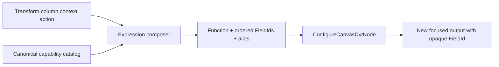

# GH-2935 card expression composer hard cut

## Governing sources

- `AGENTS.md`
- `docs/planning/status/governance-document-rule-inventory.md`
- Planning DB architecture designs and command/query rails
- `docs/architecture/command-query-rail-governance.md`
- `docs/adr/ADR-0064-substrait-semantic-reference-and-bounded-logical-profile.md`
- GitHub `#2641`, `#2920`, `#2921`, `#2935`, and `#3020`

## Decision

The Transform column menu currently hands a unary function to an alias-only form. That split
cannot represent fixed multi-operand or variadic functions and duplicates the broader
calculated-output interaction.

One expression composer owns the interaction. The selected Transform output enters as operand
one. Function identity, supported types, and operand limits come from the canonical Substrait
capability catalog. The composer submits ordered FieldIds and a required alias through the
existing command.



Source keeps only output projection selection and order. It never receives the composer,
function menu, alias authoring, or relation-changing semantic operations.

## Command rail

| Rail                     | Type    | Bounded context           | DDD object                       | Application port            | Adapter         | Scope                                                                  |
| ------------------------ | ------- | ------------------------- | -------------------------------- | --------------------------- | --------------- | ---------------------------------------------------------------------- |
| `ConfigureCanvasDvtNode` | command | Canvas semantic authoring | `DvtSubstraitAuthoringSidecarV1` | `applyCanvasColumnFunction` | Web Canvas card | Active writable workspace draft through the existing save/CAS boundary |

No new command, AST, function registry, or store is introduced.

## Arity hard cut

The catalog invocation contract represents arity as a minimum and optional maximum. Exact unary
and binary functions set equal bounds. Variadic functions omit the maximum. The old
`argumentCount` field is removed directly; no alias or compatibility branch remains.

The first variadic proof admits official Substrait `functions_comparison` `coalesce:any1`
for PostgreSQL text operands:

- minimum two ordered operands;
- additional operands can be added, removed, and reordered;
- every operand resolves by FieldId to a compatible Transform output;
- derived or literal-backed outputs can be reused as operands;
- PostgreSQL renders the canonical expression as `COALESCE(...)`;
- save/reload preserves operand order, alias, and FieldId.

## Acceptance

- Pointer and keyboard context gestures open the same expression composer.
- Unary, fixed multi-operand, and variadic functions derive their controls from catalog arity.
- The selected output is operand one and remains unchanged.
- Apply appends one output with a new opaque FieldId, reveals it, and transfers focus.
- Cancel writes nothing.
- Rejected alias, arity, type, provider, or FieldId keeps canonical state unchanged.
- Source exposes projection controls only.
- A derived output can be used as a later operand after reload.
- No dismissal timer closes the expression workflow.

## Rejected options

1. Separate unary and multi-operand forms duplicate interaction state.
2. A Web-only function list duplicates semantic authority.
3. Repeated binary outputs change one variadic expression into hidden intermediate semantics.
4. Semantic functions on Source violate the Source projection boundary.
5. Free-form SQL bypasses the canonical Substrait document.

## Feature mechanization

```feature-mechanization
{
  "version": 1,
  "featureId": "GH-2935-CARD-EXPRESSION-COMPOSER",
  "userStories": [
    "Compose one derived Transform output from a catalogued function and ordered operands without changing its inputs"
  ],
  "cypressFlows": [
    "Open the Transform column composer, build COALESCE with three outputs, apply, reload, and reuse the derived output"
  ],
  "domainObjects": [
    "Canvas Transform output",
    "DvtSubstraitAuthoringSidecarV1",
    "Semantic FieldId",
    "Substrait scalar expression"
  ],
  "fowlerSignals": [
    "Duplicate interaction state",
    "Hidden semantic authority",
    "Primitive arity"
  ],
  "symbols": [
    {
      "name": "DvtSubstraitFunctionInvocationV1Schema",
      "path": "packages/@dvt/contracts/src/contracts/planner/DvtSubstraitCapabilityCatalogSchema.v1.ts",
      "cqRails": ["ConfigureCanvasDvtNode"],
      "dddOwner": "Substrait capability profile",
      "unitTests": ["packages/@dvt/contracts/test/dvt-substrait-capability-catalog.contract.test.ts"],
      "fowlerSignals": ["Primitive arity"],
      "cypressCoverage": "apps/web/cypress/e2e/canvas/canvas-structured-transform-fields.cy.ts",
      "architectureGuard": "pnpm docs:feature-mechanization:implementation -- --feature GH-2935-CARD-EXPRESSION-COMPOSER"
    },
    {
      "name": "GraphNodeExpressionComposer",
      "path": "apps/web/src/app/plugins/graph/GraphNodeExpressionComposer.tsx",
      "cqRails": ["ConfigureCanvasDvtNode"],
      "dddOwner": "Canvas semantic authoring",
      "unitTests": ["apps/web/src/app/plugins/graph/GraphNodeExpressionComposer.test.tsx"],
      "fowlerSignals": ["Duplicate interaction state"],
      "cypressCoverage": "apps/web/cypress/e2e/canvas/canvas-structured-transform-fields.cy.ts",
      "architectureGuard": "pnpm docs:feature-mechanization:implementation -- --feature GH-2935-CARD-EXPRESSION-COMPOSER"
    },
    {
      "name": "applyCanvasColumnFunction",
      "path": "apps/web/src/app/views/canvas/canvasColumnFunctionAuthoring.ts",
      "cqRails": ["ConfigureCanvasDvtNode"],
      "dddOwner": "Canvas semantic authoring",
      "unitTests": ["apps/web/src/app/views/canvas/canvasColumnFunctionAuthoring.test.ts"],
      "fowlerSignals": ["Hidden mutation"],
      "cypressCoverage": "apps/web/cypress/e2e/canvas/canvas-structured-transform-fields.cy.ts",
      "architectureGuard": "pnpm docs:feature-mechanization:implementation -- --feature GH-2935-CARD-EXPRESSION-COMPOSER"
    },
    {
      "name": "buildScalarExpressionPostgresAst",
      "path": "apps/web/src/app/views/canvas/canvasDvtSubstraitPostgresProjection.ts",
      "cqRails": ["ConfigureCanvasDvtNode"],
      "dddOwner": "PostgreSQL semantic projection",
      "unitTests": ["apps/web/src/app/views/canvas/canvasDvtSubstraitPostgresProjection.test.ts"],
      "fowlerSignals": ["Boundary drift"],
      "cypressCoverage": "apps/web/cypress/e2e/canvas/canvas-structured-transform-fields.cy.ts",
      "architectureGuard": "pnpm docs:feature-mechanization:implementation -- --feature GH-2935-CARD-EXPRESSION-COMPOSER"
    }
  ],
  "completionGate": [
    "pnpm --filter @dvt/contracts test",
    "pnpm --filter @dvt/contracts schema:verify",
    "pnpm --filter @dvt/web test:unit:run",
    "pnpm --filter @dvt/web lint",
    "pnpm --filter @dvt/web typecheck",
    "node ../../tools/ci/run-web-cypress-native.mjs run --browser chrome --headed --spec cypress/e2e/canvas/canvas-structured-transform-fields.cy.ts",
    "pnpm docs:feature-mechanization:implementation -- --feature GH-2935-CARD-EXPRESSION-COMPOSER",
    "pnpm verify:prepush"
  ],
  "redGreenCycles": [
    {
      "id": "catalogued-variadic-composer",
      "redTest": "pnpm --filter @dvt/web test -- GraphNodeExpressionComposer.test.tsx canvasDvtSubstraitPostgresProjection.test.ts",
      "greenTest": "pnpm --filter @dvt/web test -- GraphNodeExpressionComposer.test.tsx canvasDvtSubstraitPostgresProjection.test.ts",
      "patchSurfaces": [
        "packages/@dvt/contracts/src/contracts/planner/DvtSubstraitCapabilityCatalogSchema.v1.ts",
        "packages/@dvt/contracts/src/contracts/planner/DvtSubstraitSupportedCapabilities.v1.ts",
        "apps/web/src/app/plugins/graph/GraphNodeExpressionComposer.tsx",
        "apps/web/src/app/views/canvas/canvasDvtSubstraitProjection.ts",
        "apps/web/src/app/views/canvas/canvasDvtSubstraitPostgresProjection.ts"
      ],
      "expectedFailure": "The unary alias form cannot add ordered operands and COALESCE is not admitted or projected"
    }
  ],
  "componentGuides": [
    "docs/architecture/components/web/graph/canvas-authoring-draft-boundary-component.md",
    "docs/architecture/system/subsystems/semantic-transformation/index.md"
  ],
  "governingSources": [
    "AGENTS.md",
    "docs/planning/status/governance-document-rule-inventory.md",
    "docs/architecture/command-query-rail-governance.md",
    "docs/adr/ADR-0064-substrait-semantic-reference-and-bounded-logical-profile.md",
    "https://github.com/dunay2/dvt/issues/2935"
  ],
  "commandQueryRails": [
    {
      "name": "ConfigureCanvasDvtNode",
      "type": "command",
      "status": "implemented",
      "referenceOnly": true,
      "authorityRef": "docs/planning/proposals/mandatory/frontend-and-ux/vtx2-web-vtx1-authoring-hardcut-plan-20260903.md",
      "dddOwner": "DvtSubstraitAuthoringSidecarV1",
      "negativeTests": [
        "Source writes nothing",
        "Unsupported function or provider writes nothing",
        "Invalid arity, alias, type, or FieldId writes nothing"
      ],
      "adapterSurface": "Canvas Transform column expression composer",
      "applicationPort": "applyCanvasColumnFunction",
      "authorizationScope": "Active writable workspace draft through the existing save/CAS boundary"
    }
  ],
  "architectureGuards": [
    "pnpm docs:feature-mechanization:implementation -- --feature GH-2935-CARD-EXPRESSION-COMPOSER"
  ],
  "implementationPlan": "docs/planning/proposals/mandatory/frontend-and-ux/gh-2935-card-expression-composer-plan-20260911.md",
  "mechanizationStatus": "implemented",
  "noHumanDecisionsRemaining": true,
  "allowedImplementationSurfaces": [
    "packages/@dvt/contracts/src/contracts/planner/**",
    "packages/@dvt/contracts/test/dvt-substrait-capability-catalog.contract.test.ts",
    "apps/web/src/app/plugins/graph/**",
    "apps/web/src/app/views/canvas/**",
    "apps/web/cypress/e2e/canvas/canvas-structured-transform-fields.cy.ts",
    "docs/architecture/system/subsystems/semantic-transformation/index.md",
    "docs/evidence/**",
    "docs/risk-register/quality/**",
    "docs/**/index.md",
    "docs/planning/status/**",
    "docs/.manifest.json",
    "docs/planning/proposals/mandatory/frontend-and-ux/gh-2935-card-expression-composer-plan-20260911.md"
  ],
  "forbiddenImplementationSurfaces": [
    "apps/api/**",
    "packages/@dvt/engine/**",
    "packages/@dvt/planner/**",
    "packages/@dvt/adapter-*/**",
    "infra/db/**"
  ]
}
```
