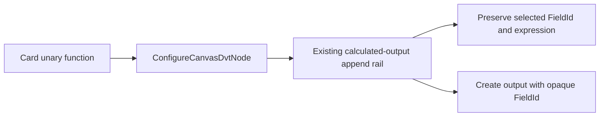

# GH-2935 card unary derived output hard cut

## Governing sources

- `AGENTS.md`
- `docs/planning/status/governance-document-rule-inventory.md`
- Planning DB architecture designs and command/query rails
- `docs/architecture/command-query-rail-governance.md`
- GitHub `#2920`, `#2935`, and `#3020`

## Current state and decision

The card unary-function action replaces the selected Transform output. Product grammar
requires this gesture to derive a new output while preserving the selected output.



`applyCanvasColumnFunction()` delegates requests without `sourceColumnId` to the existing
calculated-output authoring seam. Capability admission, alias validation, Substrait mutation,
and FieldId allocation remain owned by that seam. Requests with `sourceColumnId` retain the
existing centre-drop behavior until `#2921`; no second command, AST, registry, or store is added.

## Command rail

| Rail                     | Type    | Bounded context           | DDD object                       | Application port       | Adapter              | Scope and authorization                                     |
| ------------------------ | ------- | ------------------------- | -------------------------------- | ---------------------- | -------------------- | ----------------------------------------------------------- |
| `ConfigureCanvasDvtNode` | command | Canvas semantic authoring | `DvtSubstraitAuthoringSidecarV1` | Canvas draft authoring | Web Canvas authoring | Active writable workspace draft; existing save/CAS boundary |

Negative behavior is fail closed: invalid target, unsupported capability, duplicate alias,
external dbt model, or unresolved FieldId writes nothing.

## Bounded acceptance

- A unary card action appends one canonical Transform output.
- The selected output keeps its FieldId, name, and expression.
- The new output receives an opaque FieldId independent of its alias.
- Duplicate aliases and external dbt models remain unchanged.
- Focus/result propagation remains owned by `#3020` and is not duplicated here.

## Rejected options

1. Keep destructive replacement for unary card actions: violates derive semantics.
2. Add a gesture-specific command or expression model: duplicates existing authority.
3. Produce focus side effects inside the React updater: risks retries and overlaps `#3020`.
4. Change centre-drop in this cut: that behavior belongs to `#2921`.

## Feature mechanization

```feature-mechanization
{
  "version": 1,
  "featureId": "GH-2935-CARD-UNARY-DERIVED-OUTPUT",
  "userStories": [
    "A unary function on a Transform output creates a new output without changing the selected output"
  ],
  "cypressFlows": [
    "N/A - this semantic cut reuses the existing card interaction and is covered at the Canvas authoring boundary"
  ],
  "domainObjects": [
    "Canvas Transform output",
    "DvtSubstraitAuthoringSidecarV1",
    "Semantic FieldId"
  ],
  "fowlerSignals": [
    "Duplicate semantics",
    "Hidden mutation",
    "Boundary drift"
  ],
  "symbols": [
    {
      "name": "applyCanvasColumnFunction",
      "path": "apps/web/src/app/views/canvas/canvasColumnFunctionAuthoring.ts",
      "cqRails": ["ConfigureCanvasDvtNode"],
      "dddOwner": "Canvas semantic authoring",
      "unitTests": ["pnpm --filter @dvt/web test -- canvasColumnFunctionAuthoring.test.ts"],
      "fowlerSignals": ["Duplicate semantics", "Hidden mutation"],
      "cypressCoverage": "N/A - existing card interaction; semantic result is covered by focused authoring tests",
      "architectureGuard": "pnpm docs:feature-mechanization:implementation -- --feature GH-2935-CARD-UNARY-DERIVED-OUTPUT"
    }
  ],
  "completionGate": [
    "pnpm --filter @dvt/web test -- canvasColumnFunctionAuthoring.test.ts",
    "pnpm --filter @dvt/web typecheck",
    "pnpm docs:feature-mechanization:implementation -- --feature GH-2935-CARD-UNARY-DERIVED-OUTPUT",
    "pnpm verify:prepush"
  ],
  "redGreenCycles": [
    {
      "id": "card-unary-derives-output",
      "redTest": "pnpm --filter @dvt/web test -- canvasColumnFunctionAuthoring.test.ts",
      "greenTest": "pnpm --filter @dvt/web test -- canvasColumnFunctionAuthoring.test.ts",
      "patchSurfaces": [
        "apps/web/src/app/views/canvas/canvasColumnFunctionAuthoring.ts",
        "apps/web/src/app/views/canvas/canvasColumnFunctionAuthoring.test.ts",
        "apps/web/src/app/views/canvas/canvasColumnMappingAuthoring.test.ts",
        "apps/web/src/app/views/canvas/canvasInspectorAuthoringModel.test.ts"
      ],
      "expectedFailure": "The selected output is replaced instead of preserving it and appending a new opaque output"
    }
  ],
  "componentGuides": [
    "docs/architecture/components/web/graph/canvas-authoring-draft-boundary-component.md",
    "docs/architecture/system/subsystems/semantic-transformation/index.md"
  ],
  "governingSources": [
    "AGENTS.md",
    "docs/planning/status/governance-document-rule-inventory.md",
    "docs/architecture/command-query-rail-governance.md",
    "docs/architecture/fowler-opportunity-planning-governance.md",
    "https://github.com/dunay2/dvt/issues/2935"
  ],
  "commandQueryRails": [
    {
      "name": "ConfigureCanvasDvtNode",
      "type": "command",
      "status": "implemented",
      "dddOwner": "DvtSubstraitAuthoringSidecarV1",
      "negativeTests": [
        "Duplicate alias writes nothing",
        "External dbt model writes nothing",
        "Unknown FieldId writes nothing"
      ],
      "adapterSurface": "Canvas card column function action",
      "applicationPort": "applyCanvasColumnFunction",
      "authorizationScope": "Active writable workspace draft through the existing save/CAS boundary"
    }
  ],
  "architectureGuards": [
    "pnpm docs:feature-mechanization:implementation -- --feature GH-2935-CARD-UNARY-DERIVED-OUTPUT"
  ],
  "implementationPlan": "docs/planning/proposals/mandatory/frontend-and-ux/gh-2935-card-unary-derived-output-plan-20260907.md",
  "mechanizationStatus": "implemented",
  "noHumanDecisionsRemaining": true,
  "allowedImplementationSurfaces": [
    "apps/web/src/app/views/canvas/canvasColumnFunctionAuthoring.ts",
    "apps/web/src/app/views/canvas/canvasColumnFunctionAuthoring.test.ts",
        "apps/web/src/app/views/canvas/canvasColumnMappingAuthoring.test.ts",
        "apps/web/src/app/views/canvas/canvasInspectorAuthoringModel.test.ts",
    "apps/web/src/app/views/Canvas.routeStates.host-cycle-persistence.test.tsx",
    "apps/web/src/app/views/Canvas.test.hostCycleScenario.ts",
    "apps/web/src/app/views/canvas/canvasStartupAndDraftRecovery.architecture.support.ts",
    "docs/.manifest.json",
    "docs/planning/proposals/mandatory/frontend-and-ux/gh-2935-card-unary-derived-output-plan-20260907.md"
  ],
  "forbiddenImplementationSurfaces": [
    "packages/@dvt/contracts/**",
    "apps/api/**",
    "packages/@dvt/engine/**",
    "packages/@dvt/planner/**",
    "packages/@dvt/adapter-*/**",
    "infra/db/**"
  ]
}
```
