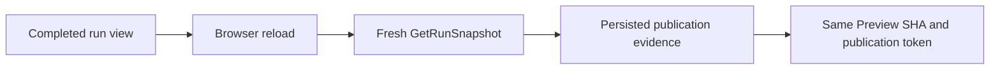
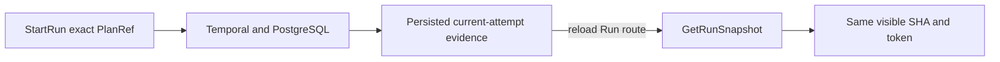

# GH-3021 native DVT Preview to Run live vertical

## Governing sources

- `AGENTS.md`
- `docs/architecture/command-query-rail-governance.md`
- `docs/adr/ADR-0064-substrait-semantic-reference-and-bounded-logical-profile.md`
- `docs/planning/proposals/mandatory/runtime-and-contracts/vtx2-generic-execution-workload-projection-plan-20260903.md`
- GitHub Issues #2524, #2723, #3021 and #3115

## Current state

`main` now executes a protected terminal Transform through PostgreSQL and
projects its validated `dvt-postgres-publication` evidence through
`GetRunSnapshot`. The Runs result tab shows the immutable Preview SHA and
publication token. The remaining question for this cut is whether that identity
comes back from persisted runtime evidence after the browser state is discarded.

## Product cut

Extend the existing live acceptance flow by reloading the completed Run route
and reopening Result. The assertion must read the same Preview SHA and
publication token from the fresh `GetRunSnapshot` response. No product state is
seeded after execution and no additional query is introduced.

## Existing rails and boundaries

| Intent                             | Existing rail                    | Boundary used                      |
| ---------------------------------- | -------------------------------- | ---------------------------------- |
| Preview persisted Canvas semantics | `PreviewPlan`                    | Protected `/plans/preview` command |
| Execute the admitted plan          | `StartRun`                       | Protected `/runs/start` command    |
| Observe completion and evidence    | `GetRunSnapshot`, `GetRunEvents` | Existing Runs read models          |

This cut does not add a command, query, planner, result store, or SQL-first
fallback. It does not restore `/runs/:runId/materialization-rows`; historical row
reading remains owned by #2582 and requires publication-token consistency.

## Verification

The existing live Cypress spec remains the acceptance boundary. It first proves
accepted Preview, exact PlanRef Run start and PostgreSQL publication. It then
reloads the Run route and requires the same `dvt-postgres-publication` identity
to be visible again. Existing unit tests continue to cover current-attempt
selection, API projection, transport decoding and presentation.
