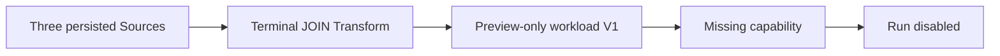
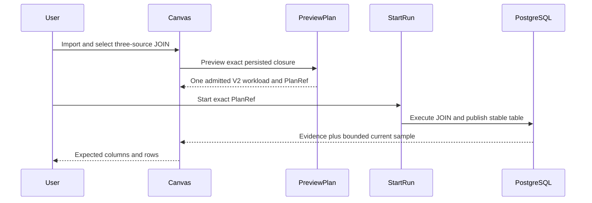

# GH-3021 native DVT Preview to Run live vertical

## Governing sources

- `AGENTS.md`
- `docs/architecture/command-query-rail-governance.md`
- `docs/adr/ADR-0064-substrait-semantic-reference-and-bounded-logical-profile.md`
- `docs/planning/proposals/mandatory/runtime-and-contracts/vtx2-generic-execution-workload-projection-plan-20260903.md`
- GitHub Issues #2524, #2723, #3021 and #3115

## Current state

`main` now executes a protected single-source terminal Transform through
PostgreSQL, restores its evidence after reload, and rejects a stale Preview
after the Canvas changes. The existing three-source JOIN browser fixture stops
at a Preview-only V1 workload and therefore does not prove the required T05
product journey.

## Product cut

Promote that same fixture to the already governed V2 Run contract by assigning
one explicit PostgreSQL table target to the terminal Transform. Seed the three
physical source relations in the local product stack, execute the one admitted
workload, and compare the published schema and rows through the existing
bounded warehouse-sample query with an independent expected oracle.

## Existing rails and boundaries

| Intent                             | Existing rail                    | Boundary used                      |
| ---------------------------------- | -------------------------------- | ---------------------------------- |
| Preview persisted Canvas semantics | `PreviewPlan`                    | Protected `/plans/preview` command |
| Execute the admitted plan          | `StartRun`                       | Protected `/runs/start` command    |
| Observe completion and evidence    | `GetRunSnapshot`, `GetRunEvents` | Existing Runs read models          |

This cut does not add a command, query, planner, result store, or SQL-first
fallback. The oracle reads only the current target through
`PreviewWarehouseSourceObjectRows`; it does not restore
`/runs/:runId/materialization-rows` or claim historical rows. Historical row
identity remains owned by #2582.

## Verification

The existing three-source live Cypress spec remains the acceptance boundary.
It must observe one V2 workload, exact PlanRef execution, completed PostgreSQL
publication evidence, and the expected five-column three-row JOIN result from
the scoped warehouse query. No Preview, draft, Run, event, evidence, or sample
response is stubbed.
