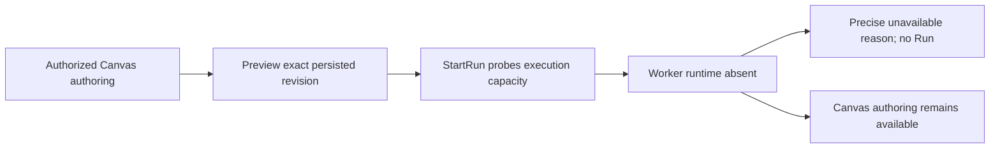
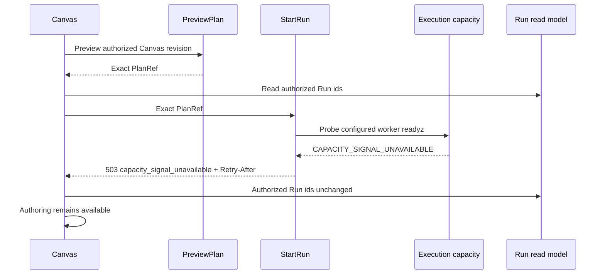

# GH-3021 native DVT Preview to Run live vertical

## Governing sources

- `AGENTS.md`
- `docs/architecture/command-query-rail-governance.md`
- `docs/adr/ADR-0064-substrait-semantic-reference-and-bounded-logical-profile.md`
- `docs/planning/proposals/mandatory/runtime-and-contracts/vtx2-generic-execution-workload-projection-plan-20260903.md`
- GitHub Issues #2524, #2723, #3021 and #3115

## Current state

`main` now proves T05 for both the single-source terminal Transform and the
three-source JOIN, restores PostgreSQL evidence after reload, rejects a stale
Preview, visibly rejects unsupported `view` disposition before Run, and proves
all four T08 boundaries against the protected runtime without creating a Run or
disclosing the PlanRef. The next uncovered product boundary is runtime absence:
the API preserves the execution-capacity reason, but Web currently reduces it
to a generic HTTP 503 message.



## Product cut

Prove runtime absence with the existing rails: obtain an exact PlanRef through
native Canvas Preview while the Temporal worker is intentionally not started,
then submit that same PlanRef through `StartRun`. The execution-capacity port
must reject with its precise unavailable reason and `Retry-After`, Web must
surface that reason, the authorized Run list must remain unchanged, and Canvas
authoring must remain available. The proof stack may omit its real worker
process; it must not stub health, Preview, StartRun, execution capacity, or Run
list responses.



## Existing rails and boundaries

| Intent                             | Existing rail                    | Boundary used                      |
| ---------------------------------- | -------------------------------- | ---------------------------------- |
| Preview persisted Canvas semantics | `PreviewPlan`                    | Protected `/plans/preview` command |
| Execute the admitted plan          | `StartRun`                       | Protected `/runs/start` command    |
| Observe completion and evidence    | `GetRunSnapshot`, `GetRunEvents` | Existing Runs read models          |
| Admit execution capacity           | `StartRun` admission             | Existing worker `readyz` port      |

This cut does not add a command, query, planner, result store, or SQL-first
fallback. The oracle reads only the current target through
`PreviewWarehouseSourceObjectRows`; it does not restore
`/runs/:runId/materialization-rows` or claim historical rows. Historical row
identity remains owned by #2582.

## Verification

The dedicated live runtime-unavailable Cypress spec receives the PlanRef from
real Preview, compares authorized Run ids before and after the normal UI command,
and proves `503 capacity_signal_unavailable` with `Retry-After` while Canvas
authoring remains enabled. The coordinated proof stack starts the real API,
database, authentication and Web processes, configures the real worker-readyz
port, and deliberately omits only the worker process. No Preview, StartRun,
capacity, validation, authorization, or list response is stubbed.

## Feature mechanization

```feature-mechanization
version: 1
featureId: GH-3021-DVT-PREVIEW-RUN-LIVE
mechanizationStatus: implemented
noHumanDecisionsRemaining: true
implementationPlan: docs/planning/proposals/mandatory/frontend-and-ux/gh-3021-dvt-preview-run-live-plan-20260915.md
componentGuides:
  - docs/architecture/components/web/graph/canvas-execution-selection-component.md
  - docs/architecture/components/web/api-client-auth-component.md
userStories:
  - https://github.com/dunay2/dvt/issues/3021
governingSources:
  - AGENTS.md
  - docs/planning/status/governance-document-rule-inventory.md
  - docs/architecture/command-query-rail-governance.md
  - docs/architecture/fowler-opportunity-planning-governance.md
  - docs/adr/ADR-0064-substrait-semantic-reference-and-bounded-logical-profile.md
  - docs/planning/proposals/mandatory/runtime-and-contracts/vtx2-generic-execution-workload-projection-plan-20260903.md
allowedImplementationSurfaces:
  - docs/planning/proposals/mandatory/frontend-and-ux/gh-3021-dvt-preview-run-live-plan-20260915.md
  - scripts/run-selected-closure-live-proof.cjs
  - scripts/run-selected-closure-live-proof.test.cjs
  - apps/web/cypress/support/liveProtectedRuntime.ts
  - apps/web/cypress/e2e/canvas/canvas-dvt-start-run-boundaries-live.cy.ts
  - apps/web/cypress/e2e/canvas/canvas-dvt-runtime-unavailable-live.cy.ts
  - apps/web/src/app/services/api/protectedRuntimeRejection.ts
  - apps/web/src/app/services/api/protectedRuntimeRejection.test.ts
  - apps/web/src/app/views/canvas/canvasRunStartAction.ts
  - apps/web/src/app/views/canvas/useCanvasPlanActionHandler.ts
  - apps/web/src/app/views/canvas/useCanvasRunStartHandler.ts
  - apps/web/src/app/views/canvas/useCanvasExecutionActions.runStartGuards.test.tsx
  - apps/web/src/app/views/canvas/useCanvasExecutionActions.test.support.tsx
forbiddenImplementationSurfaces:
  - packages/@dvt/contracts/**
  - packages/@dvt/engine/**
  - packages/@dvt/adapter-*/**
commandQueryRails:
  - name: PreviewPlan
    type: command
    dddOwner: Protected runtime planning
    referenceOnly: true
    authorityRef: docs/planning/proposals/mandatory/frontend-and-ux/tf-e2-m-b-canvas-draft-denial-posture-implementation-plan-20260501.md
  - name: StartRun
    type: command
    dddOwner: Protected runtime execution
    referenceOnly: true
    authorityRef: docs/architecture/system/subsystems/semantic-transformation/index.md
  - name: ListRuns
    type: query
    dddOwner: Run read model
    referenceOnly: true
    authorityRef: docs/planning/proposals/mandatory/runtime-and-contracts/api-governance-subdivision-plan-20260502.md
domainObjects:
  - name: RuntimeUnavailableProof
    type: test policy
    owner: Web Canvas execution
fowlerSignals:
  - Hidden authority
  - Test-only confidence
architectureGuards:
  - pnpm docs:feature-mechanization:implementation -- --feature GH-3021-DVT-PREVIEW-RUN-LIVE
cypressFlows:
  - apps/web/cypress/e2e/canvas/canvas-dvt-runtime-unavailable-live.cy.ts
completionGate:
  - node --test scripts/run-selected-closure-live-proof.test.cjs
  - pnpm --filter @dvt/web lint
  - pnpm --filter @dvt/web typecheck
  - pnpm verify:prepush
redGreenCycles:
  - id: runtime-unavailable-boundary
    redTest: apps/web/cypress/e2e/canvas/canvas-dvt-runtime-unavailable-live.cy.ts
    expectedFailure: StartRun failure feedback remains hidden behind Preview.
    patchSurfaces:
      - apps/web/src/app/views/canvas/canvasRunStartAction.ts
      - apps/web/src/app/views/canvas/useCanvasRunStartHandler.ts
    greenTest: apps/web/cypress/e2e/canvas/canvas-dvt-runtime-unavailable-live.cy.ts
symbols:
  - &runtimeUnavailableProofSymbol
    name: useCanvasPlanActionHandler
    path: apps/web/src/app/views/canvas/useCanvasPlanActionHandler.ts
    dddOwner: Canvas Web execution preview
    cqRails: [PreviewPlan]
    fowlerSignals: [Test-only confidence]
    architectureGuard: apps/web/src/app/views/canvas/useCanvasExecutionActions.runStartGuards.test.tsx
    cypressCoverage: apps/web/cypress/e2e/canvas/canvas-dvt-runtime-unavailable-live.cy.ts
    unitTests: [apps/web/src/app/views/canvas/useCanvasExecutionActions.runStartGuards.test.tsx]
  - <<: *runtimeUnavailableProofSymbol
    name: executeCanvasRunStartAction
    path: apps/web/src/app/views/canvas/canvasRunStartAction.ts
    dddOwner: Canvas Web runtime admission
    cqRails: [StartRun]
  - <<: *runtimeUnavailableProofSymbol
    name: useCanvasRunStartHandler
    path: apps/web/src/app/views/canvas/useCanvasRunStartHandler.ts
    dddOwner: Canvas Web runtime admission
    cqRails: [StartRun]
  - <<: *runtimeUnavailableProofSymbol
    name: normalizeProtectedRuntimeRejection
    path: apps/web/src/app/services/api/protectedRuntimeRejection.ts
    dddOwner: Canvas Web runtime admission
    cqRails: [StartRun]
  - <<: *runtimeUnavailableProofSymbol
    name: resolveLiveProofTemporalWorkerRuntime
    path: scripts/run-selected-closure-live-proof.cjs
    dddOwner: Canvas Web runtime admission
    cqRails: [StartRun]
    architectureGuard: node --test scripts/run-selected-closure-live-proof.test.cjs
    unitTests: [scripts/run-selected-closure-live-proof.test.cjs]
  - <<: *runtimeUnavailableProofSymbol
    name: readLiveRunIds
    path: apps/web/cypress/support/liveProtectedRuntime.ts
    dddOwner: Live protected runtime Cypress query helper
    cqRails: [ListRuns]
```
