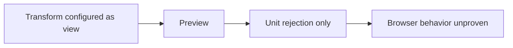

# GH-3021 native DVT Preview to Run live vertical

## Governing sources

- `AGENTS.md`
- `docs/architecture/command-query-rail-governance.md`
- `docs/adr/ADR-0064-substrait-semantic-reference-and-bounded-logical-profile.md`
- `docs/planning/proposals/mandatory/runtime-and-contracts/vtx2-generic-execution-workload-projection-plan-20260903.md`
- GitHub Issues #2524, #2723, #3021 and #3115

## Current state

`main` now proves T05 for both the single-source terminal Transform and the
three-source JOIN, restores PostgreSQL evidence after reload, and rejects a
stale Preview after the Canvas changes. Unit coverage rejects an unsupported
`view` result disposition, but the product journey does not yet prove that the
user sees that rejection before any Run starts.



## Product cut

Complete one T08 boundary through the real product: a user changes the terminal
Transform result disposition from supported `table` to unsupported `view`,
requests Preview, sees the precise disposition rejection, cannot start a Run,
and causes zero `StartRun` calls. This extends no contract and adds no fallback.

```mermaid
sequenceDiagram
  participant U as User
  participant C as Canvas
  participant P as PreviewPlan
  participant R as StartRun
  U->>C: Change table disposition to view
  U->>P: Preview persisted closure
  P-->>C: REJECTED with exact disposition reason
  C-->>U: Visible rejection; Run unavailable
  C-xR: No command
```

## Existing rails and boundaries

| Intent                             | Existing rail                    | Boundary used                      |
| ---------------------------------- | -------------------------------- | ---------------------------------- |
| Preview persisted Canvas semantics | `PreviewPlan`                    | Protected `/plans/preview` command |
| Execute the admitted plan          | `StartRun`                       | Protected `/runs/start` command    |
| Observe completion and evidence    | `GetRunSnapshot`, `GetRunEvents` | Existing Runs read models          |

This cut does not add a command, query, planner, result store, or SQL-first
fallback. The oracle reads only the current target through
`PreviewWarehouseSourceObjectRows`; it does not restore
`/runs/:runId/materialization-rows` or claim historical rows. Historical row
identity remains owned by #2582.

## Verification

The existing terminal-Transform live Cypress spec is the acceptance boundary.
It must perform the real authoring gesture, persist the changed draft, observe
the protected Preview rejection and exact reason, and prove zero `StartRun`
requests. No Preview, draft, Run, or rejection response is stubbed.
