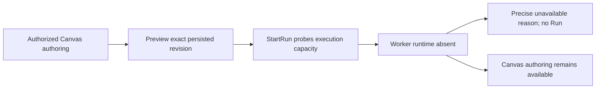
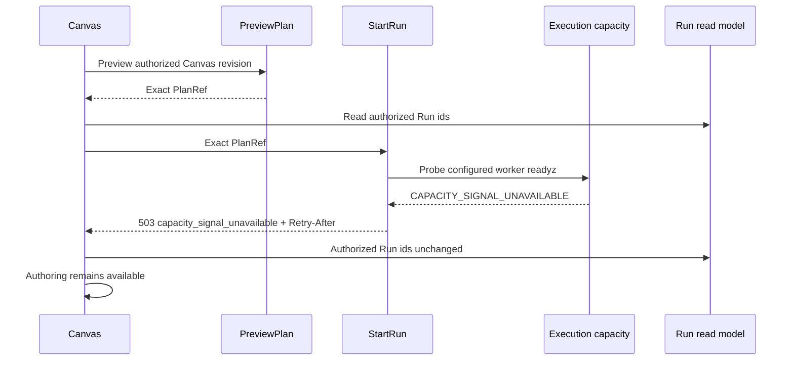

# GH-3021 native DVT Preview to Run live vertical

## Governing sources

- `AGENTS.md`
- `docs/architecture/command-query-rail-governance.md`
- `docs/adr/ADR-0064-substrait-semantic-reference-and-bounded-logical-profile.md`
- `docs/planning/proposals/mandatory/runtime-and-contracts/vtx2-generic-execution-workload-projection-plan-20260903.md`
- GitHub Issues #2524, #2723, #3021 and #3115

## Current state

`main` now proves T05 for both the single-source terminal Transform and the
three-source JOIN, restores PostgreSQL evidence after reload, rejects a stale
Preview, visibly rejects unsupported `view` disposition before Run, and proves
all four T08 boundaries against the protected runtime without creating a Run or
disclosing the PlanRef. The next uncovered product boundary is runtime absence:
the API preserves the execution-capacity reason, but Web currently reduces it
to a generic HTTP 503 message.

## Product cut

Prove runtime absence with the existing rails: obtain an exact PlanRef through
native Canvas Preview while the Temporal worker is intentionally not started,
then submit that same PlanRef through `StartRun`. The execution-capacity port
must reject with its precise unavailable reason and `Retry-After`, Web must
surface that reason, the authorized Run list must remain unchanged, and Canvas
authoring must remain available. The proof stack may omit its real worker
process; it must not stub health, Preview, StartRun, execution capacity, or Run
list responses.

## Existing rails and boundaries

| Intent                             | Existing rail                    | Boundary used                      |
| ---------------------------------- | -------------------------------- | ---------------------------------- |
| Preview persisted Canvas semantics | `PreviewPlan`                    | Protected `/plans/preview` command |
| Execute the admitted plan          | `StartRun`                       | Protected `/runs/start` command    |
| Observe completion and evidence    | `GetRunSnapshot`, `GetRunEvents` | Existing Runs read models          |
| Admit execution capacity           | `StartRun` admission             | Existing worker `readyz` port      |

This cut does not add a command, query, planner, result store, or SQL-first
fallback. The oracle reads only the current target through
`PreviewWarehouseSourceObjectRows`; it does not restore
`/runs/:runId/materialization-rows` or claim historical rows. Historical row
identity remains owned by #2582.

## Verification

The dedicated live runtime-unavailable Cypress spec receives the PlanRef from
real Preview, compares authorized Run ids before and after the normal UI command,
and proves `503 capacity_signal_unavailable` with `Retry-After` while Canvas
authoring remains enabled. The coordinated proof stack starts the real API,
database, authentication and Web processes, configures the real worker-readyz
port, and deliberately omits only the worker process. No Preview, StartRun,
capacity, validation, authorization, or list response is stubbed.
