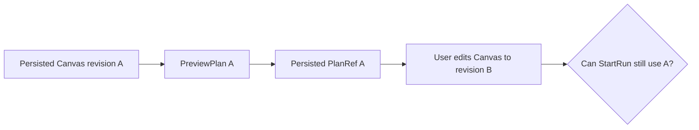

# GH-3021 native DVT Preview to Run live vertical

## Governing sources

- `AGENTS.md`
- `docs/architecture/command-query-rail-governance.md`
- `docs/adr/ADR-0064-substrait-semantic-reference-and-bounded-logical-profile.md`
- `docs/planning/proposals/mandatory/runtime-and-contracts/vtx2-generic-execution-workload-projection-plan-20260903.md`
- GitHub Issues #2524, #2723, #3021 and #3115

## Current state

`main` now executes a protected terminal Transform through PostgreSQL and
projects its validated `dvt-postgres-publication` evidence through
`GetRunSnapshot`. The Runs result tab restores the immutable Preview SHA and
publication token after a browser reload. The remaining question for this cut
is whether editing the Canvas after Preview can silently start the obsolete
plan.



## Product cut

Extend the existing live acceptance flow with one second scenario: Preview a
persisted terminal Transform, close the Preview, edit that Transform through
its real properties command, and observe the execution controls. The active
draft signature must no longer match the signature captured by Preview. The UI
must require a new Preview and must not call `StartRun`.

```mermaid
sequenceDiagram
  participant U as User
  participant C as Canvas
  participant P as PreviewPlan
  participant R as StartRun
  U->>C: Select terminal Transform
  C->>P: Preview persisted revision A
  P-->>C: Persisted PlanRef A
  U->>C: Edit Transform to revision B
  C-->>U: Preview stale; Run disabled
  C-xR: No command sent
```

## Existing rails and boundaries

| Intent                             | Existing rail                    | Boundary used                      |
| ---------------------------------- | -------------------------------- | ---------------------------------- |
| Preview persisted Canvas semantics | `PreviewPlan`                    | Protected `/plans/preview` command |
| Execute the admitted plan          | `StartRun`                       | Protected `/runs/start` command    |
| Observe completion and evidence    | `GetRunSnapshot`, `GetRunEvents` | Existing Runs read models          |

This cut does not add a command, query, planner, result store, or SQL-first
fallback. It does not restore `/runs/:runId/materialization-rows`; historical row
reading remains owned by #2582 and requires publication-token consistency.

## Verification

The existing live Cypress spec remains the acceptance boundary. Its execution
scenario proves exact PlanRef execution, PostgreSQL publication and evidence
reload. The stale-Preview scenario uses the same protected draft and real
Preview service, edits through the visible Canvas properties surface, and
observes that Run becomes unavailable without any `/runs/start` request.
Existing unit tests continue to cover the pure signature and run-start guards.
