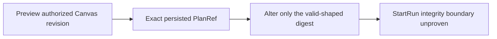

# GH-3021 native DVT Preview to Run live vertical

## Governing sources

- `AGENTS.md`
- `docs/architecture/command-query-rail-governance.md`
- `docs/adr/ADR-0064-substrait-semantic-reference-and-bounded-logical-profile.md`
- `docs/planning/proposals/mandatory/runtime-and-contracts/vtx2-generic-execution-workload-projection-plan-20260903.md`
- GitHub Issues #2524, #2723, #3021 and #3115

## Current state

`main` now proves T05 for both the single-source terminal Transform and the
three-source JOIN, restores PostgreSQL evidence after reload, rejects a stale
Preview, visibly rejects unsupported `view` disposition before Run, and rejects
a cross-project `StartRun` without creating a Run or disclosing the PlanRef. The
remaining T08 integrity boundary is covered below the browser but not by a real
Canvas Preview PlanRef against the protected runtime.



## Product cut

Complete the next T08 integrity boundary with the existing rails: obtain an
exact PlanRef through native Canvas Preview, alter only its digest while keeping
the request structurally valid and in the authorized scope, and submit it to
`StartRun`. The command must reject before execution, disclose neither the
stored nor submitted digest or plan identity, and leave the authorized Run list
unchanged. No UI gesture can construct a corrupted reference, so only the
negative command crosses the protected HTTP boundary.

```mermaid
sequenceDiagram
  participant C as Canvas
  participant P as PreviewPlan
  participant R as StartRun
  participant S as Run read model
  C->>P: Preview authorized Canvas revision
  P-->>C: Exact PlanRef
  C->>S: Read authorized Run ids
  C->>R: Same scope and identity; changed digest
  R-->>C: Sanitized integrity rejection
  C->>S: Authorized Run ids unchanged
```

## Existing rails and boundaries

| Intent                             | Existing rail                    | Boundary used                      |
| ---------------------------------- | -------------------------------- | ---------------------------------- |
| Preview persisted Canvas semantics | `PreviewPlan`                    | Protected `/plans/preview` command |
| Execute the admitted plan          | `StartRun`                       | Protected `/runs/start` command    |
| Observe completion and evidence    | `GetRunSnapshot`, `GetRunEvents` | Existing Runs read models          |

This cut does not add a command, query, planner, result store, or SQL-first
fallback. The oracle reads only the current target through
`PreviewWarehouseSourceObjectRows`; it does not restore
`/runs/:runId/materialization-rows` or claim historical rows. Historical row
identity remains owned by #2582.

## Verification

The live StartRun-boundary Cypress spec receives the PlanRef from real Preview,
compares authorized Run ids before and after the corrupted command, and rejects
the command without returning PlanRef contents. The production HTTP mapping is
changed only if this proof exposes a real disclosure. No Preview, Run,
authorization, validation, or list response is stubbed.
