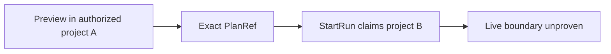

# GH-3021 native DVT Preview to Run live vertical

## Governing sources

- `AGENTS.md`
- `docs/architecture/command-query-rail-governance.md`
- `docs/adr/ADR-0064-substrait-semantic-reference-and-bounded-logical-profile.md`
- `docs/planning/proposals/mandatory/runtime-and-contracts/vtx2-generic-execution-workload-projection-plan-20260903.md`
- GitHub Issues #2524, #2723, #3021 and #3115

## Current state

`main` now proves T05 for both the single-source terminal Transform and the
three-source JOIN, restores PostgreSQL evidence after reload, rejects a stale
Preview, and visibly rejects unsupported `view` disposition before Run. The
remaining T08 scope boundary is covered by route doubles but not by a real
Preview PlanRef against the protected runtime.



## Product cut

Complete one T08 scope boundary with the existing rails: obtain an exact
PlanRef through the native Canvas Preview in authorized project A, submit that
reference to `StartRun` while claiming project B, and prove a sanitized `403`
plus an unchanged authorized Run list. No UI gesture can create this tampered
request, so only the negative command crosses the protected HTTP boundary.

```mermaid
sequenceDiagram
  participant C as Canvas
  participant P as PreviewPlan
  participant R as StartRun
  participant S as Run state
  C->>P: Preview authorized project A
  P-->>C: Exact PlanRef
  C->>S: Read Run ids in project A
  C->>R: Same PlanRef; claim project B
  R-->>C: 403 without plan disclosure
  C->>S: Run ids in project A unchanged
```

## Existing rails and boundaries

| Intent                             | Existing rail                    | Boundary used                      |
| ---------------------------------- | -------------------------------- | ---------------------------------- |
| Preview persisted Canvas semantics | `PreviewPlan`                    | Protected `/plans/preview` command |
| Execute the admitted plan          | `StartRun`                       | Protected `/runs/start` command    |
| Observe completion and evidence    | `GetRunSnapshot`, `GetRunEvents` | Existing Runs read models          |

This cut does not add a command, query, planner, result store, or SQL-first
fallback. The oracle reads only the current target through
`PreviewWarehouseSourceObjectRows`; it does not restore
`/runs/:runId/materialization-rows` or claim historical rows. Historical row
identity remains owned by #2582.

## Verification

The terminal-Transform live Cypress spec remains the acceptance boundary. It
must receive the PlanRef from real Preview, compare the authorized Run ids
before and after the cross-scope command, and reject the command without
returning PlanRef contents. No Preview, Run, authorization, or list response is
stubbed.
