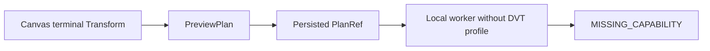
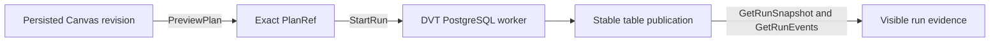

# GH-3021 native DVT Preview to Run live vertical

## Governing sources

- `AGENTS.md`
- `docs/architecture/command-query-rail-governance.md`
- `docs/adr/ADR-0064-substrait-semantic-reference-and-bounded-logical-profile.md`
- `docs/planning/proposals/mandatory/runtime-and-contracts/vtx2-generic-execution-workload-projection-plan-20260903.md`
- GitHub Issues #2524, #2723, #3021 and #3115

## Current state

`main` already projects a protected terminal Transform to an immutable PlanRef
and can execute its V2 PostgreSQL workload. The selected-closure local runner,
however, starts the Temporal worker with only the dbt profile enabled. Its DVT
browser proof therefore asserts the obsolete `MISSING_CAPABILITY` outcome.

## Product cut

Keep the existing rails and enable the implemented DVT PostgreSQL worker profile
in the governed local stack. The browser proof configures one explicit Transform
table target, previews the persisted revision, starts that exact PlanRef, and
observes completion plus PostgreSQL publication evidence through the current run
read models.

## Existing rails and boundaries

| Intent                             | Existing rail                    | Boundary used                      |
| ---------------------------------- | -------------------------------- | ---------------------------------- |
| Preview persisted Canvas semantics | `PreviewPlan`                    | Protected `/plans/preview` command |
| Execute the admitted plan          | `StartRun`                       | Protected `/runs/start` command    |
| Observe completion and evidence    | `GetRunSnapshot`, `GetRunEvents` | Existing Runs read models          |

This cut does not add a command, query, planner, result store, or SQL-first
fallback. It does not restore `/runs/:runId/materialization-rows`; historical row
reading remains owned by #2582 and requires publication-token consistency.

## Verification

The existing live Cypress spec is the acceptance boundary. It must fail before
the local worker profile is enabled, then prove accepted Preview, exact PlanRef
Run start, completed events, and `dvt-postgres-publication` evidence against real
Temporal and PostgreSQL services. Unit tests cover environment composition.
