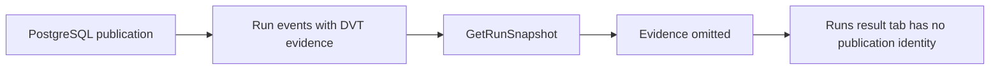
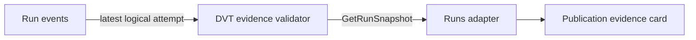

# GH-3021 native DVT Preview to Run live vertical

## Governing sources

- `AGENTS.md`
- `docs/architecture/command-query-rail-governance.md`
- `docs/adr/ADR-0064-substrait-semantic-reference-and-bounded-logical-profile.md`
- `docs/planning/proposals/mandatory/runtime-and-contracts/vtx2-generic-execution-workload-projection-plan-20260903.md`
- GitHub Issues #2524, #2723, #3021 and #3115

## Current state

`main` now projects a protected terminal Transform to an immutable PlanRef and
executes its V2 PostgreSQL workload through Temporal. The worker persists exact
`dvt-postgres-publication` evidence in the run events, but `GetRunSnapshot`
currently projects only the older materialization evidence. The Runs result tab
therefore cannot show the completed DVT publication identity.

## Product cut

Keep the existing rails and extend the current run evidence projection. A
completed snapshot without legacy materialization evidence reads the current
logical attempt events, validates the existing DVT evidence contract, and
returns it through `GetRunSnapshot`. The Runs result tab presents that immutable
publication identity without querying PostgreSQL or claiming historical rows.

## Existing rails and boundaries

| Intent                             | Existing rail                    | Boundary used                      |
| ---------------------------------- | -------------------------------- | ---------------------------------- |
| Preview persisted Canvas semantics | `PreviewPlan`                    | Protected `/plans/preview` command |
| Execute the admitted plan          | `StartRun`                       | Protected `/runs/start` command    |
| Observe completion and evidence    | `GetRunSnapshot`, `GetRunEvents` | Existing Runs read models          |

This cut does not add a command, query, planner, result store, or SQL-first
fallback. It does not restore `/runs/:runId/materialization-rows`; historical row
reading remains owned by #2582 and requires publication-token consistency.

## Verification

The existing live Cypress spec remains the acceptance boundary. It proves
accepted Preview, exact PlanRef Run start, completed PostgreSQL publication, and
the same `dvt-postgres-publication` identity in both the persisted event and the
visible Runs result view. Unit tests cover current-attempt selection, API
projection, transport decoding, and presentation.
