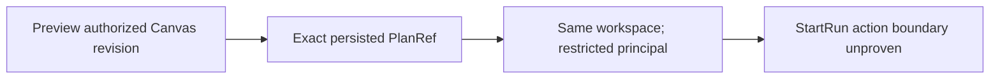

# GH-3021 native DVT Preview to Run live vertical

## Governing sources

- `AGENTS.md`
- `docs/architecture/command-query-rail-governance.md`
- `docs/adr/ADR-0064-substrait-semantic-reference-and-bounded-logical-profile.md`
- `docs/planning/proposals/mandatory/runtime-and-contracts/vtx2-generic-execution-workload-projection-plan-20260903.md`
- GitHub Issues #2524, #2723, #3021 and #3115

## Current state

`main` now proves T05 for both the single-source terminal Transform and the
three-source JOIN, restores PostgreSQL evidence after reload, rejects a stale
Preview, visibly rejects unsupported `view` disposition before Run, and rejects
a cross-project or corrupt-PlanRef `StartRun` without creating a Run or
disclosing the PlanRef. The remaining T08 authorization boundary has transport
coverage but lacks proof against the real principal-grant adapter and protected
runtime.



## Product cut

Complete the next T08 authorization boundary with the existing rails: obtain an
exact PlanRef through native Canvas Preview, then submit it from an authenticated
principal in the same tenant, project, and environment whose persisted grant
lacks only `run:start`. `StartRun` must reject with the precise action-denied
reason before the use case, disclose no PlanRef identity, and leave the
authorized Run list unchanged. The test authority may issue the restricted
principal and seed its real grant; it must not stub authentication,
authorization, Preview, Run, or list responses.

```mermaid
sequenceDiagram
  participant C as Canvas
  participant P as PreviewPlan
  participant R as StartRun
  participant A as Access decision
  participant S as Run read model
  C->>P: Preview authorized Canvas revision
  P-->>C: Exact PlanRef
  C->>S: Read authorized Run ids
  C->>R: Exact PlanRef; restricted same-scope principal
  R->>A: Authorize run:start
  A-->>R: ACTION_NOT_GRANTED
  R-->>C: Sanitized 403 action_not_granted
  C->>S: Authorized Run ids unchanged
```

## Existing rails and boundaries

| Intent                             | Existing rail                    | Boundary used                      |
| ---------------------------------- | -------------------------------- | ---------------------------------- |
| Preview persisted Canvas semantics | `PreviewPlan`                    | Protected `/plans/preview` command |
| Execute the admitted plan          | `StartRun`                       | Protected `/runs/start` command    |
| Observe completion and evidence    | `GetRunSnapshot`, `GetRunEvents` | Existing Runs read models          |

This cut does not add a command, query, planner, result store, or SQL-first
fallback. The oracle reads only the current target through
`PreviewWarehouseSourceObjectRows`; it does not restore
`/runs/:runId/materialization-rows` or claim historical rows. Historical row
identity remains owned by #2582.

## Verification

The live StartRun-boundary Cypress spec receives the PlanRef from real Preview,
compares authorized Run ids before and after the restricted principal's command,
and proves a sanitized `403 action_not_granted` without returning PlanRef
contents. The coordinated proof stack owns issuance of the second signed token
and its persisted grant. Production behavior changes only if the proof exposes
a real defect. No Preview, Run, authorization, validation, or list response is
stubbed.
