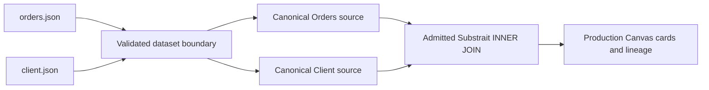

# GH-3067 reusable semantic workbench JSON fixtures

## Governing sources

- `AGENTS.md`
- `docs/planning/status/governance-document-rule-inventory.md`
- `docs/guides/ai-work-protocol.md`
- `docs/architecture/command-query-rail-governance.md`
- `docs/architecture/fowler-opportunity-planning-governance.md`
- `docs/adr/ADR-0064-substrait-semantic-reference-and-bounded-logical-profile.md`
- GitHub issue `#3067`

## Think-first framing

The lab renders production Canvas cards and Substrait projections, but its source schema is embedded
in TypeScript. The missing boundary is a validated local dataset between reusable JSON samples and
canonical Canvas nodes. The selected option is two versioned JSON fixtures plus a strict Web-owned
loader. Constants would duplicate schema/data semantics; remote data would make the lab depend on
protected runtime authentication.

Constraints:

- Keep all records explicitly synthetic and local.
- Reuse `CanonicalNode`, `CanonicalEdge`, connected-source identity, and admitted DVT Substrait.
- Validate fields, values, primary keys, and `orders.client_id -> client.client_id` before projection.
- Do not change APIs, authentication, contracts packages, or production Canvas rails.
- Reject malformed fixtures instead of rendering partial success.



The fixtures support filtering, segmentation, customer value, referential-integrity, and join
demonstrations from one coherent sample.

## Command/query rail impact

No new rail. This is an internal, read-only lab presentation adapter: JSON projects to the existing
`CanonicalNode` read model and the existing DVT Substrait join authority supplies the transform.
There is no write scope, authorization decision, API port, route, or persistence adapter.

## Fowler opportunity matrix

| Signal              | Risk                                | Response                                                  |
| ------------------- | ----------------------------------- | --------------------------------------------------------- |
| Duplicate semantics | JSON and Canvas columns diverge     | Derive columns from validated JSON schema                 |
| Boundary drift      | JSON bypasses canonical models      | Project canonical sources and use admitted Substrait join |
| Hidden mutation     | Shared fixtures mutate between uses | Return immutable projections                              |
| Primitive obsession | Invalid records appear valid        | Version and validate dataset shape, PK, and FK            |

## Acceptance and validation

- Two coherent JSON samples feed two real source cards and an accepted Substrait INNER JOIN.
- Keys are unique, every Order references an existing Client, and invalid data fails in unit tests.
- Focused tests, Web lint/type-check, browser verification, and `pnpm verify:prepush` pass.

## Feature mechanization

```feature-mechanization
{
  "version": 1,
  "featureId": "GH-3067-SEMANTIC-WORKBENCH-JSON-FIXTURES",
  "userStories": ["Explore reusable Orders and Client samples through real Canvas source and join cards"],
  "cypressFlows": ["Open the lab and inspect two fixture-backed sources joined by client_id"],
  "domainObjects": ["Semantic Workbench dataset", "Canonical Canvas source", "Substrait inner join"],
  "fowlerSignals": ["Duplicate semantics", "Boundary drift", "Hidden mutation", "Primitive obsession"],
  "completionGate": ["pnpm --filter @dvt/web test -- semanticWorkbenchDataset.test.ts semanticWorkbenchFixture.test.ts", "pnpm --filter @dvt/web lint", "pnpm --filter @dvt/web typecheck", "pnpm docs:feature-mechanization:implementation -- --feature GH-3067-SEMANTIC-WORKBENCH-JSON-FIXTURES", "pnpm verify:prepush"],
  "redGreenCycles": [
    {
      "id": "validated-orders-client-fixtures",
      "redTest": "pnpm --filter @dvt/web test -- semanticWorkbenchDataset.test.ts semanticWorkbenchFixture.test.ts",
      "greenTest": "pnpm --filter @dvt/web test -- semanticWorkbenchDataset.test.ts semanticWorkbenchFixture.test.ts",
      "patchSurfaces": ["apps/web/src/app/labs/fixtures/orders.json", "apps/web/src/app/labs/fixtures/client.json", "apps/web/src/app/labs/semanticWorkbenchDataset.ts", "apps/web/src/app/labs/semanticWorkbenchFixture.ts", "apps/web/src/app/labs/SemanticWorkbenchLab.tsx"],
      "expectedFailure": "No JSON loader, Client source, foreign-key validation, or two-input fixture exists"
    }
  ],
  "componentGuides": ["docs/architecture/components/web/graph/canvas-workbench-command-query-catalog.md", "docs/architecture/system/subsystems/semantic-transformation/index.md"],
  "governingSources": ["AGENTS.md", "docs/planning/status/governance-document-rule-inventory.md", "docs/guides/ai-work-protocol.md", "docs/architecture/command-query-rail-governance.md", "docs/architecture/fowler-opportunity-planning-governance.md", "docs/adr/ADR-0064-substrait-semantic-reference-and-bounded-logical-profile.md", "https://github.com/dunay2/dvt/issues/3067"],
  "commandQueryRails": [
    {
      "name": "ProjectGraphNodeCardReadModel",
      "type": "query",
      "status": "implemented",
      "dddOwner": "CanvasGraphPresentation",
      "negativeTests": ["Malformed fixtures cannot fabricate card rows", "Broken Client references reject before projection"],
      "adapterSurface": "Semantic Workbench local fixture projection into the production Canvas card renderer",
      "applicationPort": "buildCanvasNodePresentationTruth",
      "authorizationScope": "Local synthetic lab fixture; read-only and outside protected draft persistence"
    }
  ],
  "architectureGuards": ["pnpm docs:feature-mechanization:implementation -- --feature GH-3067-SEMANTIC-WORKBENCH-JSON-FIXTURES"],
  "implementationPlan": "docs/planning/proposals/mandatory/frontend-and-ux/gh-3067-semantic-workbench-json-fixtures-plan-20260908.md",
  "mechanizationStatus": "implemented",
  "noHumanDecisionsRemaining": true,
  "allowedImplementationSurfaces": ["apps/web/src/app/labs/**", "docs/planning/proposals/mandatory/frontend-and-ux/gh-3067-semantic-workbench-json-fixtures-plan-20260908.md", "docs/**/index.md", "docs/planning/status/**"],
  "forbiddenImplementationSurfaces": ["apps/api/**", "packages/@dvt/contracts/**", "packages/@dvt/engine/**", "packages/@dvt/adapter-*/**"],
  "symbols": [
    {
      "name": "loadSemanticWorkbenchDataset",
      "path": "apps/web/src/app/labs/semanticWorkbenchDataset.ts",
      "cqRails": ["ProjectGraphNodeCardReadModel"],
      "dddOwner": "Semantic Workbench lab presentation adapter",
      "unitTests": ["pnpm --filter @dvt/web test -- semanticWorkbenchDataset.test.ts"],
      "fowlerSignals": ["Primitive obsession", "Boundary drift"],
      "cypressCoverage": "Manual browser verification of /lab/semantic-workbench",
      "architectureGuard": "pnpm docs:feature-mechanization:implementation -- --feature GH-3067-SEMANTIC-WORKBENCH-JSON-FIXTURES"
    },
    {
      "name": "buildSemanticWorkbenchFixture",
      "path": "apps/web/src/app/labs/semanticWorkbenchFixture.ts",
      "cqRails": ["ProjectGraphNodeCardReadModel"],
      "dddOwner": "Semantic Workbench lab presentation adapter",
      "unitTests": ["pnpm --filter @dvt/web test -- semanticWorkbenchFixture.test.ts"],
      "fowlerSignals": ["Duplicate semantics", "Boundary drift"],
      "cypressCoverage": "Manual browser verification of /lab/semantic-workbench",
      "architectureGuard": "pnpm docs:feature-mechanization:implementation -- --feature GH-3067-SEMANTIC-WORKBENCH-JSON-FIXTURES"
    }
  ]
}
```
