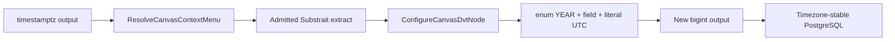

# GH-3101 timestamp column function hard cut

## Governing sources

- `AGENTS.md`
- `docs/planning/status/governance-document-rule-inventory.md`
- `docs/adr/ADR-0064-substrait-semantic-reference-and-bounded-logical-profile.md`
- `docs/architecture/command-query-rail-governance.md`
- `docs/architecture/components/web/graph/canvas-workbench-command-query-catalog.md`
- Substrait `v0.101.0` `extensions/functions_datetime.yaml`
- GitHub `#2935`, `#2642`, and `#3101`

## Decision

The Model column menu is reachable, but PostgreSQL `timestamp with time zone` outputs resolve no
admitted operation. Admit one deterministic standard operation: Substrait
`functions_datetime.extract` with component `YEAR` and timezone `UTC`. Canvas projects it as
`EXTRACT YEAR (UTC)`. Applying it preserves the selected output and appends a `bigint` output
with a new FieldId through the existing authoring rail.



No provider session timezone, free-form SQL, Web-only registry, or implicit text coercion participates.

## Rails and negative behavior

| Rail                       | Type    | Owner                            | Port                                 | Adapter           | Scope                       |
| -------------------------- | ------- | -------------------------------- | ------------------------------------ | ----------------- | --------------------------- |
| `ResolveCanvasContextMenu` | query   | Capability projection            | `resolveDvtSubstraitColumnFunctions` | Model column menu | Active Canvas/provider      |
| `ConfigureCanvasDvtNode`   | command | `DvtSubstraitAuthoringSidecarV1` | `applyCanvasColumnFunction`          | Canvas draft      | Writable workspace/save-CAS |

Unsupported provider, type, capability, malformed invocation, duplicate alias, or unknown FieldId
writes nothing.

## Acceptance

- Pointer and keyboard show `EXTRACT YEAR (UTC)` for PostgreSQL timestamptz outputs.
- The option comes from the admitted canonical catalog.
- The source remains and a new opaque FieldId is appended.
- Roundtrip/reload preserves `YEAR`, `UTC`, lineage and `bigint`.
- PostgreSQL projection is timezone-stable and integral.
- Unsupported combinations remain fail-closed.

## Rejected options

1. Text functions on timestamps change the type contract.
2. A Web-only list duplicates the catalog.
3. Session timezone makes the plan environment-dependent.
4. The full datetime extension widens scope without evidence.

## Feature mechanization

```feature-mechanization
{
  "version": 1,
  "featureId": "GH-3101-TIMESTAMP-COLUMN-FUNCTION",
  "userStories": ["Derive a stable UTC year from a PostgreSQL timestamptz Model column"],
  "cypressFlows": ["Right-click occurred_at, choose EXTRACT YEAR (UTC), alias, save and reopen"],
  "domainObjects": ["DVT Substrait capability catalog", "Canvas Transform output", "DvtSubstraitAuthoringSidecarV1"],
  "fowlerSignals": ["Duplicate semantics", "Provider-dependent behavior", "Boundary drift"],
  "symbols": [
    {
      "name": "resolveDvtSubstraitColumnFunctions",
      "path": "apps/web/src/app/views/canvas/canvasDvtSubstraitProjection.ts",
      "cqRails": ["ResolveCanvasContextMenu"],
      "dddOwner": "Canvas semantic authoring",
      "unitTests": ["pnpm --filter @dvt/web test -- canvasDvtSubstraitPostgresProjection.test.ts"],
      "fowlerSignals": ["Duplicate semantics"],
      "cypressCoverage": "canvas-structured-transform-fields.cy.ts temporal menu flow",
      "architectureGuard": "pnpm docs:feature-mechanization:implementation -- --feature GH-3101-TIMESTAMP-COLUMN-FUNCTION"
    },
    {
      "name": "applyDvtSubstraitProjectionFunction",
      "path": "apps/web/src/app/views/canvas/canvasDvtSubstraitProjection.ts",
      "cqRails": ["ConfigureCanvasDvtNode"],
      "dddOwner": "DvtSubstraitAuthoringSidecarV1",
      "unitTests": ["pnpm --filter @dvt/web test -- canvasColumnFunctionAuthoring.test.ts"],
      "fowlerSignals": ["Boundary drift"],
      "cypressCoverage": "canvas-structured-transform-fields.cy.ts temporal menu flow",
      "architectureGuard": "pnpm docs:feature-mechanization:implementation -- --feature GH-3101-TIMESTAMP-COLUMN-FUNCTION"
    },
    {
      "name": "buildScalarExpressionPostgresAst",
      "path": "apps/web/src/app/views/canvas/canvasDvtSubstraitPostgresProjection.ts",
      "cqRails": ["ConfigureCanvasDvtNode"],
      "dddOwner": "PostgreSQL semantic projection",
      "unitTests": ["pnpm --filter @dvt/web test -- canvasDvtSubstraitPostgresProjection.test.ts"],
      "fowlerSignals": ["Provider-dependent behavior"],
      "cypressCoverage": "N/A - typed provider boundary",
      "architectureGuard": "pnpm docs:feature-mechanization:implementation -- --feature GH-3101-TIMESTAMP-COLUMN-FUNCTION"
    }
  ],
  "completionGate": [
    "pnpm --filter @dvt/contracts test",
    "pnpm --filter @dvt/web test -- canvasDvtSubstraitPostgresProjection.test.ts canvasColumnFunctionAuthoring.test.ts",
    "pnpm --filter @dvt/web typecheck",
    "pnpm docs:feature-mechanization:implementation -- --feature GH-3101-TIMESTAMP-COLUMN-FUNCTION",
    "pnpm verify:prepush"
  ],
  "redGreenCycles": [{
    "id": "timestamp-menu-to-canonical-output",
    "redTest": "pnpm --filter @dvt/web test -- canvasDvtSubstraitPostgresProjection.test.ts canvasColumnFunctionAuthoring.test.ts",
    "greenTest": "pnpm --filter @dvt/web test -- canvasDvtSubstraitPostgresProjection.test.ts canvasColumnFunctionAuthoring.test.ts",
    "patchSurfaces": [
      "packages/@dvt/contracts/src/contracts/planner/DvtSubstraitStandardCandidates.v1.ts",
      "packages/@dvt/contracts/src/contracts/planner/DvtSubstraitSupportedCapabilities.v1.ts",
      "apps/web/src/app/views/canvas/canvasDvtSubstraitProjection.ts",
      "apps/web/src/app/views/canvas/canvasDvtSubstraitPostgresAst.ts",
      "apps/web/src/app/views/canvas/canvasDvtSubstraitPostgresProjection.ts",
      "apps/web/src/app/views/canvas/canvasColumnFunctionMenuProjection.ts",
      "apps/web/src/app/plugins/graph/graphNodeColumnContracts.ts",
      "apps/web/src/app/plugins/graph/GraphNodeColumnRow.tsx",
      "apps/web/src/app/plugins/graph/GraphNodeColumnFunctionAliasForm.tsx",
      "apps/web/cypress/support/canvasDraftAuthoring.ts",
      "apps/web/cypress/e2e/canvas/canvas-structured-transform-fields.cy.ts"
    ],
    "expectedFailure": "A temporal column resolves no action and cannot persist a derived year"
  }],
  "componentGuides": [
    "docs/architecture/components/web/graph/canvas-workbench-command-query-catalog.md",
    "docs/architecture/system/subsystems/semantic-transformation/index.md"
  ],
  "governingSources": [
    "AGENTS.md",
    "docs/adr/ADR-0064-substrait-semantic-reference-and-bounded-logical-profile.md",
    "https://github.com/dunay2/dvt/issues/3101"
  ],
  "commandQueryRails": [
    {
      "name": "ResolveCanvasContextMenu",
      "type": "query",
      "status": "implemented",
      "dddOwner": "Admitted column function projection",
      "negativeTests": ["Unsupported provider or type returns no operation"],
      "adapterSurface": "Model column context menu",
      "applicationPort": "resolveDvtSubstraitColumnFunctions",
      "authorizationScope": "Active Canvas and provider"
    },
    {
      "name": "ConfigureCanvasDvtNode",
      "type": "command",
      "status": "implemented",
      "dddOwner": "DvtSubstraitAuthoringSidecarV1",
      "negativeTests": ["Unknown capability, alias or FieldId writes nothing"],
      "adapterSurface": "Canvas draft authoring",
      "applicationPort": "applyCanvasColumnFunction",
      "authorizationScope": "Writable workspace through save/CAS"
    }
  ],
  "architectureGuards": ["pnpm docs:feature-mechanization:implementation -- --feature GH-3101-TIMESTAMP-COLUMN-FUNCTION"],
  "implementationPlan": "docs/planning/proposals/mandatory/frontend-and-ux/gh-3101-timestamp-column-function-plan-20260910.md",
  "mechanizationStatus": "implemented",
  "noHumanDecisionsRemaining": true,
  "allowedImplementationSurfaces": [
    "packages/@dvt/contracts/src/contracts/planner/DvtSubstraitStandardCandidates.v1.ts",
    "packages/@dvt/contracts/src/contracts/planner/DvtSubstraitSupportedCapabilities.v1.ts",
    "packages/@dvt/contracts/test/**",
    "apps/web/src/app/views/canvas/canvasDvtSubstraitProjection.ts",
    "apps/web/src/app/views/canvas/canvasDvtSubstraitPostgresAst.ts",
    "apps/web/src/app/views/canvas/canvasDvtSubstraitPostgresProjection.ts",
    "apps/web/src/app/views/canvas/canvasColumnFunctionMenuProjection.ts",
    "apps/web/src/app/plugins/graph/graphNodeColumnContracts.ts",
    "apps/web/src/app/plugins/graph/GraphNodeColumnRow.tsx",
    "apps/web/src/app/plugins/graph/GraphNodeColumnFunctionAliasForm.tsx",
    "apps/web/src/app/views/canvas/*.test.ts",
    "apps/web/src/app/views/canvas/*.test.tsx",
    "apps/web/cypress/support/canvasDraftAuthoring.ts",
    "apps/web/cypress/e2e/canvas/canvas-structured-transform-fields.cy.ts",
    "docs/evidence/**",
    "docs/risk-register/quality/**",
    "docs/**/index.md",
    "docs/.manifest.json",
    "docs/planning/proposals/mandatory/frontend-and-ux/gh-3101-timestamp-column-function-plan-20260910.md"
  ],
  "forbiddenImplementationSurfaces": ["apps/api/**", "packages/@dvt/engine/**", "packages/@dvt/planner/**", "packages/@dvt/adapter-*/**", "infra/db/**"]
}
```
