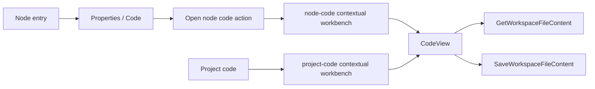
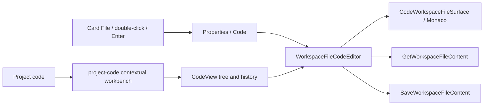

# Node Properties Inline Code Convergence Plan

## Decision

Node code has one product surface: `Node -> Properties -> Code`. The tab embeds the
authoritative workspace file with the existing Monaco editor and the existing
revision-aware save rail. The independent node Code workbench is retired. The
project-wide Code workbench remains because its file tree and history serve a distinct
project intent.

This is a hard cut. No compatibility alias, second editor state, manual Save lifecycle,
new API, or new persistence store is allowed.

## Think First

### Problem and user outcome

The current Code tab explains where code lives and then opens a second contextual
workbench. A user can therefore enter the same node intent through two visual surfaces,
must understand which window owns the file, and can lose context when returning. The
required outcome is direct inspection and editing of the backing file inside Properties,
with the same result from card `File`, double-click, and keyboard Enter.

### Current mechanism



### Target mechanism



### Command and query ownership

| Intent                           | Rail                                              | Type       | Owner                           | Reuse decision                                        |
| -------------------------------- | ------------------------------------------------- | ---------- | ------------------------------- | ----------------------------------------------------- |
| Enter the selected node          | `InspectCanvasNode`                               | Command    | Canvas interaction presentation | Existing rail; Code becomes the preferred section.    |
| Read the backing file            | `GetWorkspaceFileContent`                         | Query      | Workspace file read model       | Existing rail; no parallel loader.                    |
| Persist an editable file         | `SaveWorkspaceFileContent`                        | Command    | Workspace file authority        | Existing optimistic-SHA rail; no manual Save command. |
| Reconcile file truth into Canvas | existing dbt project-file reconciliation callback | Projection | dbt Canvas controller           | Existing callback after a successful save.            |

Authority remains split by the existing architecture: dbt project files are editable
file authority; graph-owned generated files are read-only projections. The UI does not
infer a third authority.

## Fowler Opportunity Matrix

| Signal                        | Evidence in the current mechanism                                              | MVP correction                                                           | Proof                                        |
| ----------------------------- | ------------------------------------------------------------------------------ | ------------------------------------------------------------------------ | -------------------------------------------- |
| Duplicated UI semantics       | Properties Code launches a second node Code window                             | Embed the shared file editor and delete the node workbench variant       | architecture residue test and component test |
| Divergent change              | file loading, edit posture and sync are assembled inside `CodeView`            | Extract one reusable known-file editor used by Properties and `CodeView` | shared component tests                       |
| Data clump / primitive target | node target, return-node ref and workbench id travel together                  | Remove node target/state; keep only project-code workbench state         | store/controller tests and residue search    |
| Message chain                 | card File delegates through node-specific open-code callbacks into shell state | Route through existing `onInspectNode(nodeId, 'code')`                   | renderer and gesture tests                   |
| Temporary field               | `codeWorkbenchReturnNodeIdRef` exists only to recover from the second surface  | Delete it with the second surface                                        | static architecture assertion                |
| Test-only confidence          | unit tests prove launchers, not an inline edit/reload journey                  | Add live dbt edit, graph projection and reload proof                     | Cypress and headed browser evidence          |

## Scope and sequence

1. Specify failing component and architecture tests for an inline Code contribution and
   the absence of the launcher/legacy node workbench.
2. Extract `WorkspaceFileCodeEditor` from the existing `CodeView` composition while
   retaining `CodeWorkspaceFileSurface`, `useCodeWorkingTreeSync`, edit posture,
   revision conflict behavior and navigation protection.
3. Contribute the editor to generic graph and dbt Node Properties. Suppress passive
   explanatory copy when the editor owns the section. Keep the Code contribution mounted
   across tab switches so a debounced edit cannot disappear.
4. Route card `File`, double-click and Enter to `InspectCanvasNode` with Code preferred.
5. Delete node-only workbench targets, return refs, identifiers, copy and tests. Preserve
   the project-wide Code workbench.
6. Prove editable dbt authority, read-only graph authority, conflict/failure behavior,
   ES/EN presentation, keyboard entry, full reload and headed browser acceptance.

## Definition of Ready

- [x] Exact `origin/main` baseline is fixed after #2402.
- [x] #2403 is the bounded implementation issue under #2291.
- [x] Planning DB architecture identities and command/query rails were queried.
- [x] Existing file surface, sync hook, edit-posture policy and node-entry gesture were inventoried.
- [x] Current and target component flows are recorded above.
- [x] Fowler opportunities and removals are explicit.
- [x] No backend, contract, adapter, engine, planner or DB change is required.
- [x] Microcommit and red-green sequence is declared before production edits.

## Definition of Done

- [ ] Node Properties Code displays the selected node's authoritative workspace file inline.
- [ ] Editable dbt files use Monaco and the existing optimistic revision save rail.
- [ ] Successful edits reconcile to Canvas; conflict or failure does not silently switch/close.
- [ ] Graph-owned generated files remain visibly read-only.
- [ ] Card `File`, double-click and Enter converge on Properties Code.
- [ ] No independent node Code launcher, target, workbench id, return ref or orphan copy remains.
- [ ] Project Code keeps its file tree, history and project intent.
- [ ] ES/EN, keyboard, focus and serious/critical accessibility checks pass.
- [ ] Focused unit/architecture tests, web lint/typecheck/build, live E2E and headed proof pass.
- [ ] `pnpm verify:prepush` passes without disabled rules, skipped required checks or new debt.

## Feature Mechanization

```feature-mechanization
version: 1
featureId: W4-NODE-PROPERTIES-INLINE-CODE-20260816
mechanizationStatus: implemented
noHumanDecisionsRemaining: true
implementationPlan: docs/planning/proposals/mandatory/frontend-and-ux/node-properties-inline-code-plan-20260816.md
componentGuides:
  - docs/architecture/components/web/code-workbench-workspace-files-component.md
  - docs/planning/proposals/mandatory/frontend-and-ux/canvas-node-workbench-hardening-plan-20260808.md
  - docs/architecture/command-query-rail-governance.md
  - docs/architecture/fowler-opportunity-planning-governance.md
userStories:
  - As a Canvas author, I inspect and edit a node backing file without leaving Properties.
  - As a keyboard user, Enter reaches the same Code section as double-click and card File.
  - As a project author, I retain the project-wide file tree and history for project navigation.
governingSources:
  - AGENTS.md
  - docs/guides/ai-work-protocol.md
  - docs/architecture/command-query-rail-governance.md
  - docs/architecture/fowler-opportunity-planning-governance.md
  - docs/architecture/components/web/code-workbench-workspace-files-component.md
allowedImplementationSurfaces:
  - apps/web/src/app/components/canvas/**
  - apps/web/src/app/components/inspector/**
  - apps/web/src/app/plugins/dbt/**
  - apps/web/src/app/plugins/graph/**
  - apps/web/src/app/stores/canvasInteractionStore.ts
  - apps/web/src/app/stores/canvasInteractionStore.test.ts
  - apps/web/src/app/views/CodeView.tsx
  - apps/web/src/app/views/canvas/**
  - apps/web/src/app/views/code/**
  - apps/web/src/app/views/dbt-project/**
  - apps/web/src/app/views/sql/**
  - apps/web/cypress/e2e/canvas/**
  - apps/web/cypress/e2e/dbt/**
  - apps/web/cypress/e2e/shell/**
  - docs/architecture/components/web/code-workbench-workspace-files-component.md
  - docs/architecture/components/web/frontend-component-inventory.md
  - docs/planning/proposals/mandatory/frontend-and-ux/node-properties-inline-code-plan-20260816.md
forbiddenImplementationSurfaces:
  - apps/api/**
  - packages/@dvt/contracts/**
  - packages/@dvt/engine/**
  - packages/@dvt/planner/**
  - packages/@dvt/adapter-*/**
  - infra/db/**
commandQueryRails:
  - name: InspectCanvasNode
    type: command
    status: implemented
    dddOwner: Canvas interaction presentation
  - name: GetWorkspaceFileContent
    type: query
    status: implemented
    dddOwner: Workspace file read model
  - name: SaveWorkspaceFileContent
    type: command
    status: implemented
    dddOwner: Workspace file authority
domainObjects:
  - name: NodePropertiesReadModel
    type: read model
    owner: Node Properties presentation
  - name: WorkspaceFileContent
    type: read model
    owner: Code workbench workspace files
  - name: WorkspaceFileCodeEditSession
    type: transient UI state
    owner: Shared known-file editor
symbols:
  - path: apps/web/src/app/stores/canvasInteractionStore.ts
    name: CanvasContextualWorkbenchId
    kind: type
    exported: true
    dddOwner: Canvas interaction presentation
    cqRails: [InspectCanvasNode]
    fowlerSignals: [Duplicated UI semantics, Temporary field]
    architectureGuard: pnpm --filter @dvt/web test:canvas
    cypressCoverage: apps/web/cypress/e2e/shell/canvas-workbench-screen-composition.cy.ts
    unitTests: [pnpm --filter @dvt/web test:canvas]
  - path: apps/web/src/app/views/canvas/dbtWorkspaceFileCodeContribution.tsx
    name: BuildDbtWorkspaceFileCodeContributionsOptions
    kind: type
    exported: true
    dddOwner: Node Properties presentation
    cqRails: [GetWorkspaceFileContent, SaveWorkspaceFileContent]
    fowlerSignals: [Divergent change, Duplicated UI semantics]
    architectureGuard: pnpm --filter @dvt/web test:canvas
    cypressCoverage: apps/web/cypress/e2e/dbt/dbt-project-file-projection-live.cy.ts
    unitTests: [pnpm --filter @dvt/web test:canvas]
  - path: apps/web/src/app/views/canvas/dbtWorkspaceFileCodeContribution.tsx
    name: buildDbtWorkspaceFileCodeContributions
    kind: function
    exported: true
    dddOwner: Node Properties presentation
    cqRails: [GetWorkspaceFileContent, SaveWorkspaceFileContent]
    fowlerSignals: [Divergent change, Duplicated UI semantics]
    architectureGuard: pnpm --filter @dvt/web test:canvas
    cypressCoverage: apps/web/cypress/e2e/dbt/dbt-project-file-projection-live.cy.ts
    unitTests: [pnpm --filter @dvt/web test:canvas]
  - path: apps/web/src/app/views/canvas/graphDraftWorkspaceFileCodeContribution.tsx
    name: BuildGraphDraftWorkspaceFileCodeContributionsOptions
    kind: type
    exported: true
    dddOwner: Node Properties presentation
    cqRails: [GetWorkspaceFileContent]
    fowlerSignals: [Divergent change, Duplicated UI semantics]
    architectureGuard: pnpm --filter @dvt/web test:canvas
    cypressCoverage: apps/web/cypress/e2e/canvas/canvas-dbt-author-code-run-live.cy.ts
    unitTests: [pnpm --filter @dvt/web test:canvas]
  - path: apps/web/src/app/views/canvas/graphDraftWorkspaceFileCodeContribution.tsx
    name: buildGraphDraftWorkspaceFileCodeContributions
    kind: function
    exported: true
    dddOwner: Node Properties presentation
    cqRails: [GetWorkspaceFileContent]
    fowlerSignals: [Divergent change, Duplicated UI semantics]
    architectureGuard: pnpm --filter @dvt/web test:canvas
    cypressCoverage: apps/web/cypress/e2e/canvas/canvas-dbt-author-code-run-live.cy.ts
    unitTests: [pnpm --filter @dvt/web test:canvas]
  - path: apps/web/src/app/views/code/WorkspaceFileCodeEditor.tsx
    name: WorkspaceFileCodeEditor
    kind: component
    exported: true
    dddOwner: Workspace file code presentation
    cqRails: [GetWorkspaceFileContent, SaveWorkspaceFileContent]
    fowlerSignals: [Divergent change, Duplicated UI semantics]
    architectureGuard: pnpm --filter @dvt/web test:canvas
    cypressCoverage: apps/web/cypress/e2e/dbt/dbt-project-file-projection-live.cy.ts
    unitTests: [pnpm --filter @dvt/web test]
  - path: apps/web/src/app/views/code/WorkspaceFileCodeEditor.tsx
    name: WorkspaceFileCodeAuthority
    kind: type
    exported: true
    dddOwner: Workspace file code presentation
    cqRails: [GetWorkspaceFileContent, SaveWorkspaceFileContent]
    fowlerSignals: [Divergent change]
    architectureGuard: pnpm --filter @dvt/web test:canvas
    cypressCoverage: apps/web/cypress/e2e/dbt/dbt-project-file-projection-live.cy.ts
    unitTests: [pnpm --filter @dvt/web test]
  - path: apps/web/src/app/views/code/WorkspaceFileCodeEditor.tsx
    name: WorkspaceFileCodeEditorHandle
    kind: type
    exported: true
    dddOwner: Workspace file code presentation
    cqRails: [SaveWorkspaceFileContent]
    fowlerSignals: [Divergent change]
    architectureGuard: pnpm --filter @dvt/web test:canvas
    cypressCoverage: apps/web/cypress/e2e/dbt/dbt-project-file-projection-live.cy.ts
    unitTests: [pnpm --filter @dvt/web test]
  - path: apps/web/src/app/views/code/WorkspaceFileCodeEditor.tsx
    name: WorkspaceFileCodeEditorProps
    kind: type
    exported: true
    dddOwner: Workspace file code presentation
    cqRails: [GetWorkspaceFileContent, SaveWorkspaceFileContent]
    fowlerSignals: [Divergent change]
    architectureGuard: pnpm --filter @dvt/web test:canvas
    cypressCoverage: apps/web/cypress/e2e/dbt/dbt-project-file-projection-live.cy.ts
    unitTests: [pnpm --filter @dvt/web test]
  - path: apps/web/src/app/views/code/WorkspaceFileCodeEditor.tsx
    name: EMPTY_GRAPH_OWNED_PATHS
    kind: constant
    exported: false
    dddOwner: Workspace file code presentation
    cqRails: [GetWorkspaceFileContent]
    fowlerSignals: [Divergent change]
    architectureGuard: pnpm --filter @dvt/web test:canvas
    cypressCoverage: apps/web/cypress/e2e/canvas/canvas-dbt-author-code-run-live.cy.ts
    unitTests: [pnpm --filter @dvt/web test]
  - path: apps/web/src/app/views/canvas/CanvasNodeWorkbenchPanel.tsx
    name: CanvasNodeWorkbenchPanel
    kind: component
    exported: true
    dddOwner: Node Properties presentation
    cqRails: [InspectCanvasNode]
    fowlerSignals: [Duplicated UI semantics, Message chain]
    architectureGuard: pnpm --filter @dvt/web test:canvas
    cypressCoverage: apps/web/cypress/e2e/canvas/canvas-dbt-author-code-run-live.cy.ts
    unitTests: [pnpm --filter @dvt/web test:canvas]
fowlerSignals:
  - Node Properties delegates its Code intent to a duplicate contextual workbench.
  - Node-only target state and recovery refs couple Canvas selection to workbench navigation.
  - CodeView owns both project navigation and known-file editing responsibilities.
architectureGuards:
  - pnpm docs:feature-mechanization:implementation --feature W4-NODE-PROPERTIES-INLINE-CODE-20260816
cypressFlows:
  - apps/web/cypress/e2e/canvas/canvas-dbt-author-code-run-live.cy.ts
  - apps/web/cypress/e2e/dbt/dbt-project-file-projection-live.cy.ts
  - apps/web/cypress/e2e/dbt/dbt-project-yaml-description-edit-live.cy.ts
completionGate:
  - pnpm --filter @dvt/web test
  - pnpm --filter @dvt/web lint
  - pnpm --filter @dvt/web typecheck
  - pnpm --filter @dvt/web build
  - pnpm docs:feature-mechanization:implementation --feature W4-NODE-PROPERTIES-INLINE-CODE-20260816
  - pnpm governance:refresh
  - pnpm verify:prepush
redGreenCycles:
  - id: shared-known-file-editor
    redTest: apps/web/src/app/views/code/WorkspaceFileCodeEditor.test.tsx
    expectedFailure: No reusable known-file editor exists outside the project CodeView assembly.
    patchSurfaces:
      - apps/web/src/app/views/code/WorkspaceFileCodeEditor.tsx
      - apps/web/src/app/views/code/WorkspaceFileCodeEditor.test.tsx
      - apps/web/src/app/views/CodeView.tsx
    greenTest: apps/web/src/app/views/code/WorkspaceFileCodeEditor.test.tsx
  - id: inline-node-code
    redTest: apps/web/src/app/views/canvas/CanvasNodeWorkbenchPanel.test.tsx
    expectedFailure: Properties Code still renders explanatory content and a launcher instead of the authoritative file.
    patchSurfaces:
      - apps/web/src/app/views/canvas/CanvasNodeWorkbenchPanel.tsx
      - apps/web/src/app/components/inspector/NodePropertiesTabs.tsx
      - apps/web/src/app/views/dbt-project/DbtProjectFileCanvasView.tsx
      - apps/web/src/app/views/canvas/CanvasShell.tsx
    greenTest: apps/web/src/app/views/canvas/CanvasNodeWorkbenchPanel.test.tsx
  - id: legacy-node-workbench-removal
    redTest: apps/web/src/app/views/canvas/canvasNodeWorkbenchHardening.architecture.test.ts
    expectedFailure: Node-only workbench ids, targets, callbacks, copy or tests remain reachable.
    patchSurfaces:
      - apps/web/src/app/stores/canvasInteractionStore.ts
      - apps/web/src/app/views/canvas/**
      - apps/web/src/app/views/dbt-project/**
      - apps/web/src/app/views/sql/**
    greenTest: apps/web/src/app/views/canvas/canvasNodeWorkbenchHardening.architecture.test.ts
  - id: live-authoritative-roundtrip
    redTest: apps/web/cypress/e2e/dbt/dbt-project-file-projection-live.cy.ts
    expectedFailure: Inline Monaco edit is not proven after graph reconciliation and full reload.
    patchSurfaces:
      - apps/web/cypress/e2e/canvas/canvas-dbt-author-code-run-live.cy.ts
      - apps/web/cypress/e2e/dbt/dbt-project-file-projection-live.cy.ts
      - apps/web/cypress/e2e/dbt/dbt-project-yaml-description-edit-live.cy.ts
    greenTest: apps/web/cypress/e2e/dbt/dbt-project-file-projection-live.cy.ts
architectureTests:
  - apps/web/src/app/views/canvas/canvasNodeWorkbenchHardening.architecture.test.ts
  - apps/web/src/app/views/code/WorkspaceFileCodeEditor.test.tsx
```

## Rejected alternatives

- Keep both node surfaces and synchronize them: preserves the duplicated product intent.
- Put a textarea directly in Properties: forks Monaco, language handling and revision sync.
- Add explicit Save/Discard buttons: contradicts the governed autosync file lifecycle.
- Move workspace-file authority into Graph Draft: creates a parallel persistence model.
- Remove the project Code workbench: destroys a distinct project-tree/history workflow.
