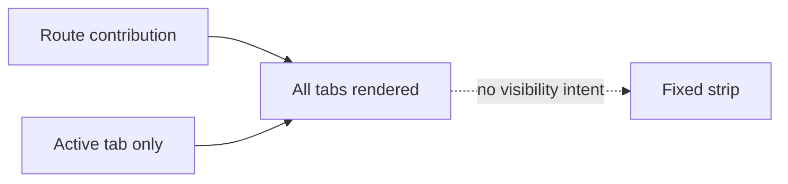
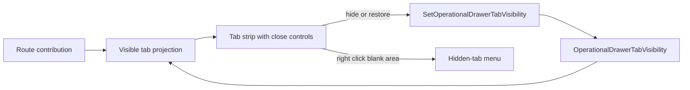

# Operational Drawer Tab Visibility Plan

## Think-First Analysis

The bottom operational drawer currently stores only the active tab. Its static
contribution list is rendered directly, so users cannot remove unused windows
from the strip or recover them later without inventing a second tab catalog.

The selected design adds one route-local visibility authority beside the active
selection. Closing a tab hides its projection only. It does not mutate the
contribution or panel data. The blank strip remains a stable context-menu target
and lists hidden tabs for restoration.





## Decision And Boundaries

- Mode: Full because this adds a visible command.
- One new command rail: `SetOperationalDrawerTabVisibility`.
- Existing contribution tabs remain the only catalog and retain panel state.
- Closing the active tab selects the next visible neighbor, then the previous.
- All tabs may be hidden; the strip remains visible and restorable.
- Selecting a hidden tab through an existing explicit action restores it.
- Mouse and keyboard controls remain valid ARIA tab behavior.
- Session persistence, tab reordering, panel deletion, and drawer closure are
  outside this slice.

## Fowler Opportunities

| Signal                  | Response                                                         |
| ----------------------- | ---------------------------------------------------------------- |
| Hidden authority        | Keep visibility in one store command, not component-local state. |
| Duplicate semantics     | Derive visible/hidden projections from the contributed tabs.     |
| Responsibility overload | Extract the interactive strip from the panel primitives module.  |

## Command Rail

| Rail                                | Owner                            | Port                               | Adapter                                              |
| ----------------------------------- | -------------------------------- | ---------------------------------- | ---------------------------------------------------- |
| `SetOperationalDrawerTabVisibility` | `OperationalDrawerTabVisibility` | operational drawer command surface | Zustand contribution store plus React tab-strip view |

Negative behavior: unknown tab IDs are ignored; closing never deletes data;
closing an inactive tab preserves selection; restoring activates exactly the
requested tab; an empty visible projection remains recoverable.

```feature-mechanization
version: 1
featureId: GH-2887-OPERATIONAL-DRAWER-TAB-VISIBILITY
mechanizationStatus: implemented
noHumanDecisionsRemaining: true
implementationPlan: docs/planning/proposals/mandatory/frontend-and-ux/operational-drawer-tab-visibility-plan-20260903.md
componentGuides:
  - docs/architecture/components/web/graph/canvas-workbench-command-query-catalog.md
userStories:
  - https://github.com/dunay2/dvt/issues/2887
governingSources:
  - AGENTS.md
  - docs/planning/status/governance-document-rule-inventory.md
  - docs/guides/ai-work-protocol.md
  - docs/architecture/command-query-rail-governance.md
  - docs/architecture/fowler-opportunity-planning-governance.md
  - docs/planning/state/github-mvp-issue-workflow.md
allowedImplementationSurfaces:
  - docs/.manifest.json
  - docs/**/index.md
  - docs/architecture/components/web/graph/canvas-workbench-command-query-catalog.md
  - docs/planning/proposals/mandatory/frontend-and-ux/operational-drawer-tab-visibility-plan-20260903.md
  - apps/web/src/app/components/shell/**
  - apps/web/cypress/e2e/shell/canvas-workbench-screen-composition.cy.ts
forbiddenImplementationSurfaces:
  - packages/@dvt/contracts/**
  - packages/@dvt/engine/**
  - packages/@dvt/adapter-*/**
  - apps/api/**
commandQueryRails:
  - name: SetOperationalDrawerTabVisibility
    type: command
    dddOwner: OperationalDrawerTabVisibility
domainObjects:
  - name: OperationalDrawerTabVisibility
    type: value object
    owner: Canvas workbench presentation
fowlerSignals:
  - Hidden authority
  - Duplicate semantics
  - Responsibility overload
architectureGuards:
  - pnpm --filter @dvt/web exec vitest run --config vitest.architecture.config.ts
  - pnpm docs:feature-mechanization:implementation -- --feature GH-2887-OPERATIONAL-DRAWER-TAB-VISIBILITY
cypressFlows:
  - apps/web/cypress/e2e/shell/canvas-workbench-screen-composition.cy.ts
completionGate:
  - pnpm --filter @dvt/web lint
  - pnpm --filter @dvt/web typecheck
  - pnpm --filter @dvt/web exec vitest run --config vitest.unit.config.ts
  - pnpm --filter @dvt/web exec vitest run --config vitest.presentation.config.ts
  - pnpm docs:feature-mechanization:implementation -- --feature GH-2887-OPERATIONAL-DRAWER-TAB-VISIBILITY
  - pnpm governance:refresh
  - pnpm verify:prepush
redGreenCycles:
  - id: canonical-tab-visibility
    redTest: pnpm --filter @dvt/web exec vitest run operationalDrawerContributionStore.test.ts
    expectedFailure: No command can hide, restore, or deterministically reselect a contributed tab.
    patchSurfaces:
      - apps/web/src/app/components/shell/operationalDrawerContributionStore.ts
    greenTest: pnpm --filter @dvt/web exec vitest run operationalDrawerContributionStore.test.ts
  - id: close-and-restore-presentation
    redTest: pnpm --filter @dvt/web exec vitest run OperationalDrawerTabStrip.test.tsx
    expectedFailure: Tabs expose neither close controls nor a hidden-tab context menu.
    patchSurfaces:
      - apps/web/src/app/components/shell/OperationalDrawerTabStrip.tsx
      - apps/web/src/app/components/shell/BottomOperationalDrawer.tsx
    greenTest: pnpm --filter @dvt/web exec vitest run OperationalDrawerTabStrip.test.tsx
symbols:
  - { name: setOperationalDrawerTabVisibility, path: apps/web/src/app/components/shell/operationalDrawerContributionStore.ts, dddOwner: OperationalDrawerTabVisibility, cqRails: [SetOperationalDrawerTabVisibility], fowlerSignals: [Hidden authority], architectureGuard: pnpm docs:feature-mechanization:implementation -- --feature GH-2887-OPERATIONAL-DRAWER-TAB-VISIBILITY, cypressCoverage: apps/web/cypress/e2e/shell/canvas-workbench-screen-composition.cy.ts, unitTests: [apps/web/src/app/components/shell/operationalDrawerContributionStore.test.ts] }
  - { name: OperationalDrawerTabVisibilityCommand, path: apps/web/src/app/components/shell/operationalDrawerContributionStore.ts, dddOwner: OperationalDrawerTabVisibility, cqRails: [SetOperationalDrawerTabVisibility], fowlerSignals: [Replace primitive with object], architectureGuard: pnpm docs:feature-mechanization:implementation -- --feature GH-2887-OPERATIONAL-DRAWER-TAB-VISIBILITY, cypressCoverage: apps/web/cypress/e2e/shell/canvas-workbench-screen-composition.cy.ts, unitTests: [apps/web/src/app/components/shell/operationalDrawerContributionStore.test.ts] }
  - { name: OperationalDrawerTabVisibilityState, path: apps/web/src/app/components/shell/operationalDrawerContributionStore.ts, dddOwner: OperationalDrawerTabVisibility, cqRails: [SetOperationalDrawerTabVisibility], fowlerSignals: [Hidden authority], architectureGuard: pnpm docs:feature-mechanization:implementation -- --feature GH-2887-OPERATIONAL-DRAWER-TAB-VISIBILITY, cypressCoverage: apps/web/cypress/e2e/shell/canvas-workbench-screen-composition.cy.ts, unitTests: [apps/web/src/app/components/shell/operationalDrawerContributionStore.test.ts] }
  - { name: OperationalDrawerTabStrip, path: apps/web/src/app/components/shell/OperationalDrawerTabStrip.tsx, dddOwner: OperationalDrawerTabVisibility presentation, cqRails: [SetOperationalDrawerTabVisibility], fowlerSignals: [Responsibility overload], architectureGuard: pnpm docs:feature-mechanization:implementation -- --feature GH-2887-OPERATIONAL-DRAWER-TAB-VISIBILITY, cypressCoverage: apps/web/cypress/e2e/shell/canvas-workbench-screen-composition.cy.ts, unitTests: [apps/web/src/app/components/shell/OperationalDrawerTabStrip.test.tsx] }
  - { name: classes, path: apps/web/src/app/components/shell/OperationalDrawerTabStrip.tsx, dddOwner: OperationalDrawerTabVisibility presentation, cqRails: [SetOperationalDrawerTabVisibility], fowlerSignals: [Presentation Model], architectureGuard: pnpm docs:feature-mechanization:implementation -- --feature GH-2887-OPERATIONAL-DRAWER-TAB-VISIBILITY, cypressCoverage: apps/web/cypress/e2e/shell/canvas-workbench-screen-composition.cy.ts, unitTests: [apps/web/src/app/components/shell/OperationalDrawerTabStrip.test.tsx] }
```

## Definition Of Done

- [x] Issue #2887 owns the change and records the decision.
- [x] The command rail and negative behavior are declared before code.
- [x] Behavioral RED/GREEN tests cover canonical state and interaction.
- [x] Headed browser proves close, empty strip, and contextual restoration.
- [ ] Governance, Web, pre-push, PR review, and CI pass cleanly.
