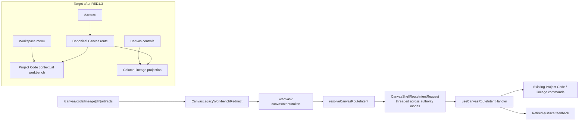
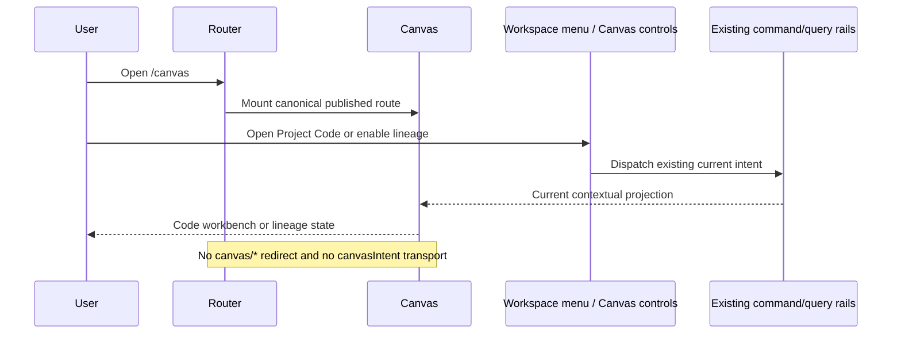

# RED1.3 Canvas Legacy Route Intent Retirement Plan

## Intent

[GitHub issue #2591](https://github.com/dunay2/dvt/issues/2591) owns this
bounded hardening slice under RED1 and Web hardening. The current application
still translates exhausted `/canvas/*` workbench URLs into a one-shot
`canvasIntent` query parameter, threads that request through both Canvas
authority modes, and invokes already-existing Project Code or column-lineage
commands.

The slice retires that translation protocol completely. Canonical `/canvas`,
Project Code from the workspace menu, Node Properties > Code, column-lineage
controls, `runId`, and dbt-file authority parameters remain unchanged. No
replacement redirect, query parameter, route adapter, workbench, or command is
introduced.

## Exact-Head Evidence

- Implementation baseline: `main@1ef936023457eefb730e1ba2e577f25e70f66f07`.
- `CanvasLegacyWorkbenchRedirect.tsx`, `canvasLegacyRouteIntent.ts`, and
  `useCanvasRouteIntentHandler.ts` form one closed compatibility chain.
- `routes.ts` registers `canvas/*` only for
  `dbt.canvas.retired-workbench-redirect`.
- `/canvas/code` has one repository caller: a Cypress case whose owned concern
  explicitly names the retired route. The same spec separately proves the
  surviving `/canvas` Project Code workflow and working-tree synchronization.
- `/canvas/lineage`, `/canvas/diff`, and `/canvas/artifacts` have no current
  production producer. Their remaining active references are compatibility
  code/tests and current-document drift.
- `canvasIntent` has no independent producer or consumer outside the legacy
  protocol and its tests.
- Repository search found no deployment/router configuration, product help
  link, telemetry policy, or supported external deep-link contract for these
  URLs. Historical proposals, closeouts, evidence, and reviews remain
  historical and do not establish a supported caller.
- Open PR #2537 touches `canvasShell.types.ts` and
  `DbtProjectFileCanvasView.tsx` for node-authoring authority. Its semantic
  changes are independent; this cut removes only legacy route-intent fields.
  Final integration must recheck those two files if #2537 lands first.
- The first full Canvas validation exposed a pre-existing Windows-only test
  blocker: `canvasGraphSearchPresentation.test.ts` compares a multiline CSS
  literal using LF while the governed checkout supplies CRLF. The stylesheet
  and visual contract are unchanged. The test must normalize line endings
  before its exact semantic assertion so the same contract runs on Windows and
  Linux without relaxing the expected selector or token.

## Governing Rail And Surviving Authorities

The Planning DB already records `ResolveLegacyCanvasRouteIntent` as an
implemented query owned by Web Canvas navigation. This task retires that query;
it does not invent a synonym. The final architecture catalog will record the
retired disposition and the absence of an adapter surface.

Surviving behavior continues through existing rails and owners:

- `ListShellNavigationItems` and `ResolveShellNavigationDisposition` own
  canonical shell navigation to `/canvas`.
- `RenderCanvasContextualGraphSurface` owns Canvas screen composition.
- `ListWorkspaceFiles`, `GetWorkspaceFileContent`, and
  `SaveWorkspaceFileContent` own Project Code and working-tree synchronization.
- `ConfigureCanvasViewportPreferences` owns the directly accessible
  column-lineage display preference.
- ADR-0060 keeps graph-draft and dbt-project-files authority mutually
  exclusive; this retirement changes neither authority binding.

## Think-First Analysis

### Problem summary and root cause

The compatibility chain was introduced when Code, Lineage, Diff, and Artifacts
were treated as peer workbench routes. Current Canvas already owns Code and
lineage contextually, while Diff and Artifacts have no current product surface.
The original topology was retired, but its route, query transport, handler,
prop chain, copy, and topology tests survived. The root problem is an exhausted
compatibility authority, not a missing redirect implementation.

### Constraints and invariants

- `/canvas` remains the only canonical Canvas route.
- `runId` and current authority query parameters must remain untouched.
- Project Code must still open through the workspace command and synchronize
  through revision-guarded workspace-file rails.
- Node Properties > Code and the direct column-lineage control remain usable.
- Graph Draft and dbt-project-files authority semantics from ADR-0060 remain
  unchanged.
- Historical documents remain historical. Current architecture and manuals
  must not advertise the retired URLs as supported behavior.
- File deletions require generated governance and fingerprint refresh under
  ADR-0053.
- PR #2537's node-authoring authority changes must not be duplicated or
  reverted.

### Options considered

1. Keep redirects indefinitely for hypothetical bookmarks. Rejected because
   no supported caller, owner, telemetry evidence, or sunset contract exists.
2. Keep `/canvas/*` but return a generic unavailable page. Rejected because it
   preserves the same dead route authority and provides no product capability.
3. Rename `canvasIntent` or move the mapping into the shell. Rejected because
   that replaces one compatibility protocol with another.
4. Retire the route, query transport, handler, props, copy, compatibility-only
   tests, and current-doc claims together. Selected because current Code and
   lineage entry points already have direct owners and executable evidence.

No library is evaluated or adopted: this is deletion of exhausted routing
topology, not a custom routing problem.

## Current State And Target





## Fowler Opportunity Matrix

<!-- markdownlint-disable MD060 -->

| scenario                                | opportunity                                        | Fowler pattern                        | DDD owner                         | command/query rail                                                          | implementation surfaces                                         | unit or presentation test                                        | architecture test                                                     | user-flow test                                      | out of scope                            |
| --------------------------------------- | -------------------------------------------------- | ------------------------------------- | --------------------------------- | --------------------------------------------------------------------------- | --------------------------------------------------------------- | ---------------------------------------------------------------- | --------------------------------------------------------------------- | --------------------------------------------------- | --------------------------------------- |
| Retire exhausted Canvas URL translation | Middle Man, Speculative Generality                 | Remove Middle Man / Inline and Delete | Web Canvas navigation             | retire `ResolveLegacyCanvasRouteIntent`                                     | route registration, redirect, resolver, handler, props and copy | delete compatibility-only suites; keep canonical Canvas behavior | canonical-route guard rejects legacy files, tokens and wildcard route | canonical `/canvas` Project Code Cypress case       | route redesign, new deep-link framework |
| Preserve Project Code                   | Alternative Classes with Different Interfaces risk | Preserve Existing Authority           | Project workspace I/O             | `ListWorkspaceFiles`, `GetWorkspaceFileContent`, `SaveWorkspaceFileContent` | surviving Cypress spec and Code architecture evidence           | Code presentation tests                                          | Code rail architecture guards                                         | workspace menu -> Project Code -> synchronized edit | Git lifecycle, manual Save              |
| Preserve column lineage                 | Feature Envy risk                                  | Preserve Existing Authority           | Canvas viewport presentation      | `ConfigureCanvasViewportPreferences`                                        | Canvas settings and projection modules                          | existing settings/projection tests                               | Canvas projection architecture tests                                  | direct current Canvas control                       | lineage redesign or persistence         |
| Correct current route documentation     | Documentation Drift                                | Single Source of Truth                | Web route bootstrap documentation | retired rail disposition plus canonical Canvas rails                        | graph route matrix, screen manual, C&Q catalog                  | documentation checks                                             | governance and rail checks                                            | not applicable                                      | historical evidence rewrite             |

<!-- markdownlint-enable MD060 -->

## Pre-Implementation Brief

- Mode: delete-first hardening with user-visible compatibility retirement.
- Scope: one legacy route family, its one-shot query protocol, propagated
  fields, compatibility-only tests/copy, current route docs, and generated
  governance.
- Expected outcome: current Canvas code knows only current navigation concepts.
- Risk: an undocumented supported deep link could exist outside the repository.
  Mitigation: exact-head source/config/help/telemetry search and the explicit
  issue disposition; no such supported contract was found.
- Risk: canonical Project Code or lineage behavior could be accidentally tied
  to the handler. Mitigation: preserve and execute direct current entry tests,
  including the canonical Cypress working-tree case.
- Risk: #2537 may merge first. Mitigation: restrict edits to the legacy fields
  and recheck the two overlapping files before push.
- Test posture: first add a failing canonical-route architecture guard and
  change the route contract expectation to absence; then delete the mechanism,
  repair independent evidence, and run focused plus full Web gates.

## Feature Mechanization

```feature-mechanization
version: 1
featureId: RED1-3-CANVAS-LEGACY-ROUTE-RETIREMENT
mechanizationStatus: implemented
noHumanDecisionsRemaining: true
implementationPlan: docs/planning/proposals/mandatory/frontend-and-ux/red1-3-canvas-legacy-route-retirement-plan-20260822.md
componentGuides:
  - docs/architecture/components/web/graph/graph-route-bootstrap-architecture.md
  - docs/architecture/components/web/graph/canvas-workbench-command-query-catalog.md
  - docs/architecture/components/web/screen-manuals-and-user-stories.md
  - docs/architecture/components/web/code-workbench-workspace-files-component.md
userStories:
  - docs/planning/proposals/mandatory/frontend-and-ux/red1-3-canvas-legacy-route-retirement-plan-20260822.md
governingSources:
  - AGENTS.md
  - docs/planning/status/governance-document-rule-inventory.md
  - docs/guides/ai-work-protocol.md
  - docs/architecture/command-query-rail-governance.md
  - docs/architecture/fowler-opportunity-planning-governance.md
  - docs/adr/ADR-0053-file-state-fingerprint-governance.md
  - docs/adr/ADR-0060-dbt-project-authoring-authority.md
  - docs/adr/ADR-0061-github-mvp-task-authority-and-planning-db-architecture-boundary.md
allowedImplementationSurfaces:
  - docs/planning/proposals/mandatory/frontend-and-ux/red1-3-canvas-legacy-route-retirement-plan-20260822.md
  - docs/planning/closeouts/20260822-red1-3-canvas-legacy-route-retirement-closeout.md
  - docs/architecture/components/web/graph/graph-route-bootstrap-architecture.md
  - docs/architecture/components/web/graph/canvas-workbench-command-query-catalog.md
  - docs/architecture/components/web/screen-manuals-and-user-stories.md
  - docs/.manifest.json
  - docs/**/index.md
  - docs/planning/status/**
  - apps/web/src/app/routes.ts
  - apps/web/src/app/routes.test.tsx
  - apps/web/src/app/routes/CanvasLegacyWorkbenchRedirect.tsx
  - apps/web/src/app/routes/CanvasLegacyWorkbenchRedirect.test.tsx
  - apps/web/src/app/routes/internalAlphaRouteGate.architecture.test.ts
  - apps/web/src/app/routes/internalAlphaRouteGate.test.fixtures.ts
  - apps/web/src/app/shell/shellNavigationDisposition.test.ts
  - apps/web/src/app/views/Canvas.tsx
  - apps/web/src/app/views/Canvas.routeIntent.integration.test.tsx
  - apps/web/src/app/views/canvas/CanvasShell.tsx
  - apps/web/src/app/views/canvas/CanvasShell.contextualDialogs.test.tsx
  - apps/web/src/app/views/canvas/CanvasShell.testHarness.tsx
  - apps/web/src/app/views/canvas/DbtProjectFileCanvas.tsx
  - apps/web/src/app/views/canvas/DbtProjectFileCanvasView.tsx
  - apps/web/src/app/views/canvas/canvasShell.types.ts
  - apps/web/src/app/views/canvas/canvasCopy.types.ts
  - apps/web/src/app/views/canvas/canvasCopyCatalog.route.ts
  - apps/web/src/app/views/canvas/canvasCopyCatalog.route.es.ts
  - apps/web/src/app/views/canvas/canvasLegacyRouteIntent.ts
  - apps/web/src/app/views/canvas/canvasLegacyRouteIntent.test.ts
  - apps/web/src/app/views/canvas/useCanvasRouteIntentHandler.ts
  - apps/web/src/app/views/canvas/useCanvasRouteIntentHandler.test.tsx
  - apps/web/src/app/views/canvas/canvasCanonicalRouteAuthority.architecture.test.ts
  - apps/web/src/app/views/canvas/canvasGraphSearchPresentation.test.ts
  - apps/web/src/app/views/code/codeMonacoEditableAccess.architecture.test.ts
  - apps/web/cypress/e2e/canvas/code-workbench-workspace-files.cy.ts
  - tools/planning-db/state/**
  - traceability.manifest.json
forbiddenImplementationSurfaces:
  - apps/api/**
  - packages/**
  - specs/contracts/**
  - .github/workflows/**
  - apps/web/src/app/views/canvas/canvasAuthorityBinding.ts
commandQueryRails:
  - name: ResolveLegacyCanvasRouteIntent
    type: query
    dddOwner: Web Canvas navigation - retire with no replacement
  - name: ListShellNavigationItems
    type: query
    dddOwner: ShellNavigationReadModel
  - name: RenderCanvasContextualGraphSurface
    type: query
    dddOwner: CanvasViewportSurfaceView
  - name: SaveWorkspaceFileContent
    type: command
    dddOwner: Project workspace I/O
  - name: ConfigureCanvasViewportPreferences
    type: command
    dddOwner: CanvasViewportPreferences
domainObjects:
  - name: CanvasCanonicalRouteAuthority
    type: policy
    owner: Web Canvas navigation
  - name: ShellNavigationReadModel
    type: read model
    owner: Frontend shell
  - name: CanvasViewportPreferences
    type: value object
    owner: Canvas viewport presentation
  - name: ProjectCodeWorkingTreeSync
    type: application projection
    owner: Project workspace I/O
fowlerSignals:
  - Middle Man
  - Speculative Generality
  - Documentation Drift
  - Topology-Only Test
architectureGuards:
  - pnpm --filter @dvt/web exec vitest run --config vitest.architecture.config.ts src/app/views/canvas/canvasCanonicalRouteAuthority.architecture.test.ts
  - pnpm --filter @dvt/web exec vitest run --config vitest.presentation.config.ts src/app/routes.test.tsx
cypressFlows:
  - pnpm --filter @dvt/web test:e2e:native -- --spec cypress/e2e/canvas/code-workbench-workspace-files.cy.ts
completionGate:
  - pnpm --filter @dvt/web test:canvas
  - pnpm --filter @dvt/web test:monaco
  - pnpm --filter @dvt/web test
  - pnpm --filter @dvt/web typecheck
  - pnpm --filter @dvt/web lint
  - pnpm --filter @dvt/web build
  - pnpm --filter @dvt/web test:e2e:native -- --spec cypress/e2e/canvas/code-workbench-workspace-files.cy.ts
  - pnpm docs:status:generate
  - pnpm governance:refresh
  - pnpm docs:feature-mechanization -- --feature RED1-3-CANVAS-LEGACY-ROUTE-RETIREMENT
  - pnpm docs:feature-mechanization:implementation
  - pnpm verify:prepush
redGreenCycles:
  - id: canvas-legacy-route-authority-retirement
    redTest: pnpm --filter @dvt/web exec vitest run --config vitest.architecture.config.ts src/app/views/canvas/canvasCanonicalRouteAuthority.architecture.test.ts
    expectedFailure: Canonical-route guard finds the wildcard redirect, legacy modules, and canvasIntent production references.
    patchSurfaces:
      - apps/web/src/app/routes.ts
      - apps/web/src/app/routes/CanvasLegacyWorkbenchRedirect.tsx
      - apps/web/src/app/views/Canvas.tsx
      - apps/web/src/app/views/canvas/CanvasShell.tsx
      - apps/web/src/app/views/canvas/canvasShell.types.ts
      - apps/web/src/app/views/canvas/DbtProjectFileCanvas.tsx
      - apps/web/src/app/views/canvas/DbtProjectFileCanvasView.tsx
      - apps/web/src/app/views/canvas/canvasLegacyRouteIntent.ts
      - apps/web/src/app/views/canvas/useCanvasRouteIntentHandler.ts
    greenTest: pnpm --filter @dvt/web exec vitest run --config vitest.architecture.config.ts src/app/views/canvas/canvasCanonicalRouteAuthority.architecture.test.ts
  - id: canonical-canvas-code-evidence
    redTest: pnpm --filter @dvt/web exec vitest run --config vitest.architecture.config.ts src/app/routes/internalAlphaRouteGate.architecture.test.ts src/app/views/code/codeMonacoEditableAccess.architecture.test.ts
    expectedFailure: Architecture evidence still requires the retired /canvas/code redirect instead of only the canonical workspace-menu flow.
    patchSurfaces:
      - apps/web/cypress/e2e/canvas/code-workbench-workspace-files.cy.ts
      - apps/web/src/app/routes/internalAlphaRouteGate.architecture.test.ts
      - apps/web/src/app/routes/internalAlphaRouteGate.test.fixtures.ts
      - apps/web/src/app/views/code/codeMonacoEditableAccess.architecture.test.ts
    greenTest: pnpm --filter @dvt/web exec vitest run --config vitest.architecture.config.ts src/app/routes/internalAlphaRouteGate.architecture.test.ts src/app/views/code/codeMonacoEditableAccess.architecture.test.ts
  - id: current-canvas-route-documentation
    redTest: rg -n '/canvas/(code|lineage|diff|artifacts)|retired-workbench-redirect|canvasIntent' docs/architecture/components/web/graph/graph-route-bootstrap-architecture.md docs/architecture/components/web/screen-manuals-and-user-stories.md
    expectedFailure: Current architecture and screen manuals still describe the retired redirect protocol as active.
    patchSurfaces:
      - docs/architecture/components/web/graph/graph-route-bootstrap-architecture.md
      - docs/architecture/components/web/graph/canvas-workbench-command-query-catalog.md
      - docs/architecture/components/web/screen-manuals-and-user-stories.md
    greenTest: rg -n '/canvas/(code|lineage|diff|artifacts)|retired-workbench-redirect|canvasIntent' docs/architecture/components/web/graph/graph-route-bootstrap-architecture.md docs/architecture/components/web/screen-manuals-and-user-stories.md
  - id: canvas-css-contract-cross-platform-line-endings
    redTest: pnpm --filter @dvt/web exec vitest run --config vitest.canvas-unit.config.ts src/app/views/canvas/canvasGraphSearchPresentation.test.ts
    expectedFailure: Windows CRLF prevents the unchanged multiline CSS selector assertion from matching the canonical stylesheet.
    patchSurfaces:
      - apps/web/src/app/views/canvas/canvasGraphSearchPresentation.test.ts
    greenTest: pnpm --filter @dvt/web exec vitest run --config vitest.canvas-unit.config.ts src/app/views/canvas/canvasGraphSearchPresentation.test.ts
symbols:
  - name: createAppRoutes
    path: apps/web/src/app/routes.ts
    dddOwner: Web Canvas navigation
    cqRails:
      - ListShellNavigationItems
      - ResolveLegacyCanvasRouteIntent
    fowlerSignals:
      - Middle Man
      - Speculative Generality
    architectureGuard: apps/web/src/app/views/canvas/canvasCanonicalRouteAuthority.architecture.test.ts
    cypressCoverage: apps/web/cypress/e2e/canvas/code-workbench-workspace-files.cy.ts
    unitTests:
      - apps/web/src/app/routes.test.tsx
  - name: CanvasWorkspaceMenuControls
    path: apps/web/src/app/views/canvas/CanvasWorkspaceMenuControls.tsx
    dddOwner: Canvas workspace command presentation
    cqRails:
      - ListWorkspaceFiles
      - GetWorkspaceFileContent
      - SaveWorkspaceFileContent
    fowlerSignals:
      - Preserve Existing Authority
    architectureGuard: apps/web/src/app/views/code/codeMonacoEditableAccess.architecture.test.ts
    cypressCoverage: apps/web/cypress/e2e/canvas/code-workbench-workspace-files.cy.ts
    unitTests:
      - apps/web/src/app/views/canvas/CanvasWorkspaceMenuControls.test.tsx
```

## Completion Rule

The slice is complete only when the wildcard route, three compatibility
modules, one-shot query protocol, propagated props, retired copy, and
compatibility-only tests are absent; current docs record only surviving route
authority; canonical Project Code and lineage evidence remains green;
generated governance is refreshed; and the exact final head passes
`pnpm verify:prepush` without bypasses or replacement compatibility debt.
