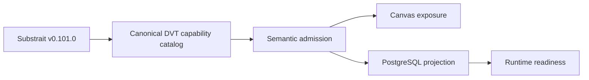
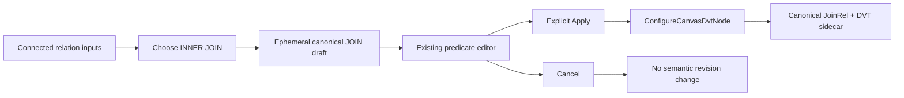
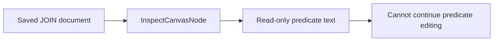
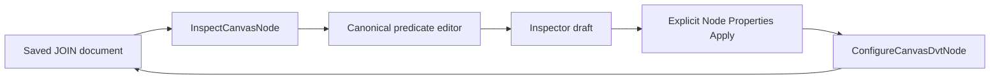
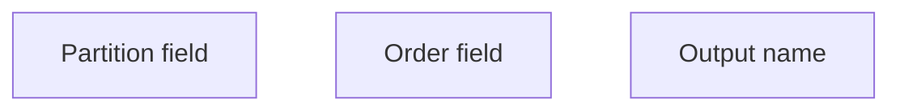
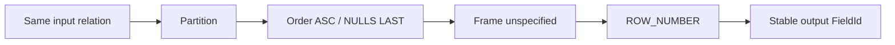

# Relational Composition Laboratory

Issue [#3228](https://github.com/dunay2/dvt/issues/3228) freezes the capability
input for the REL1 laboratory at `main@0c848e3e5` and pinned Substrait
`v0.101.0`. The interactive route remains:

```text
/lab/relational-composition
```

This document is a source-backed reasoning map. It is not another capability
catalog, relational IR, persisted model, or product route.

## Governing Sources

- [ADR-0064](../../../../adr/ADR-0064-substrait-semantic-reference-and-bounded-logical-profile.md)
- [Fowler opportunity planning governance](../../../../architecture/fowler-opportunity-planning-governance.md)
- [Pinned DVT profile](../../../../../packages/@dvt/contracts/src/contracts/planner/DvtSubstraitProfile.v1.ts)
- [Canonical capability catalog](../../../../../packages/@dvt/contracts/src/contracts/planner/DvtSubstraitCapabilityCatalog.v1.ts)
- [Standard candidates](../../../../../packages/@dvt/contracts/src/contracts/planner/DvtSubstraitStandardCandidates.v1.ts)
- [Admission evidence](../../../../../packages/@dvt/contracts/src/contracts/planner/DvtSubstraitSupportedCapabilities.v1.ts)
- [Substrait v0.101.0 algebra.proto](https://github.com/substrait-io/substrait/blob/v0.101.0/proto/substrait/algebra.proto)
- Existing Canvas authorities for
  [JOIN](../../../../../apps/web/src/app/views/canvas/canvasDvtSubstraitJoinComposition.ts),
  [SetRel](../../../../../apps/web/src/app/views/canvas/canvasDvtSubstraitSetComposition.ts),
  [AggregateRel](../../../../../apps/web/src/app/views/canvas/canvasDvtSubstraitAggregation.ts),
  and
  [WindowFunction](../../../../../apps/web/src/app/views/canvas/canvasDvtSubstraitWindow.ts)

## Authority Boundary



The arrows are dependencies, not equivalences. Upstream presence does not imply
DVT admission; admission does not imply Canvas exposure, PostgreSQL projection,
or executable runtime readiness.

## Current Admission Snapshot

| State                                                                       | Relational capability                                                                                                                                      |
| --------------------------------------------------------------------------- | ---------------------------------------------------------------------------------------------------------------------------------------------------------- |
| `supported-profile`                                                         | `JoinRel(INNER)`, `SetRel(UNION_ALL)`, `AggregateRel + count`, `Expression.WindowFunction + row_number`, `ProjectRel`, `FilterRel`, `RelCommon.Emit`       |
| `candidate-standard` in the DVT catalog                                     | `JoinRel(LEFT)`, `SetRel(UNION_DISTINCT)`, `SetRel(INTERSECTION_MULTISET)`, `SetRel(MINUS_PRIMARY)`, `SortRel`, `FetchRel`, aggregate `sum`                |
| `candidate-standard` identified by #3228, not registered in the DVT catalog | `JoinRel` right/outer/semi/anti/single/mark variants, `CrossRel`, `LateralJoinRel`, remaining `SetRel` variants, `TopNRel`, `ConsistentPartitionWindowRel` |
| `gap`                                                                       | recursive/fixpoint or transitive-closure relation: no pinned core relation                                                                                 |

The current admitted JOIN predicate vocabulary is `=`, `<>`, `>`, `>=`, `<`,
`<=`, `IS NULL`, `IS NOT NULL`, `AND`, and `OR`, with field/literal operands and
the already admitted operand functions. It supports non-equality and range
predicates; equality is not privileged semantic truth.

## A–J Classification

| Family                          | Exact pinned representation and current DVT state                                                                                                                                                                                                                                                                                                                                  | Consequence for REL1                                                                                                                                          |
| ------------------------------- | ---------------------------------------------------------------------------------------------------------------------------------------------------------------------------------------------------------------------------------------------------------------------------------------------------------------------------------------------------------------------------------- | ------------------------------------------------------------------------------------------------------------------------------------------------------------- |
| **A. Whole set/bag**            | `SetRel(UNION_ALL)` is supported. `UNION_DISTINCT`, `INTERSECTION_MULTISET`, and `MINUS_PRIMARY` are catalog candidates. Other `SetOp` variants and `CrossRel` are unregistered `candidate-standard` concepts. Symmetric difference and set equality/subset/disjoint/cardinality comparisons are `candidate-standard` compositions whose required primitives are not all admitted. | Offer only `UNION ALL` after exact ordered-schema compatibility. Do not offer `CROSS`, intersection, difference, symmetric difference, or set predicates yet. |
| **B. Pair relation `P(a,b)`**   | `JoinRel(INNER).expression` plus admitted boolean functions is supported. This covers equality, inequality, band/range, boolean grouping, null tests, literals, and comparisons over supported timestamp/type operands. Interval-specific, spatial, and similarity functions are `out-of-scope` for the current DVT catalog.                                                       | A predicate is an editable expression independent from the chosen relation operation. Unsupported function families remain unavailable.                       |
| **C. Match quantification**     | Semi, anti, single, and mark variants are unregistered `candidate-standard` `JoinRel` selectors. `count` is supported only through the admitted aggregate path; correlated cardinality composition is not admitted.                                                                                                                                                                | `EXISTS`, `NOT EXISTS`, `SEMI`, `ANTI`, exactly-one, `ANY/ALL`, and relational division are candidate compositions, not available actions.                    |
| **D. Unmatched preservation**   | Preserve none is the supported `INNER` case. `LEFT` is a catalog candidate. `RIGHT` and `OUTER` exist upstream but are uncataloged.                                                                                                                                                                                                                                                | Show no LEFT/RIGHT/FULL chooser action until each exact join type is admitted and projected.                                                                  |
| **E. Emission shape**           | `RelCommon.Emit` is supported. Current proven shapes are both sides for INNER JOIN, common aligned schema for UNION ALL, aggregate `count`, and projected `row_number`. Semi/anti/mark shapes exist upstream only.                                                                                                                                                                 | Output shape follows the selected canonical relation; connecting an input never appends its fields automatically.                                             |
| **F. Ordered/neighborhood**     | `SortRel` and `FetchRel` are catalog candidates; `TopNRel` is an unregistered `candidate-standard`. ASOF/nearest/best-match are `candidate-standard` compositions rather than admitted operations.                                                                                                                                                                                 | Do not expose ASOF, nearest, first-match, or top-k as operations.                                                                                             |
| **G. Self-relations/windows**   | `Expression.WindowFunction(row_number)` is supported and projected without a synthetic second graph input. Grouped `count` is supported; `sum` is a candidate. Other window functions are not in the DVT catalog.                                                                                                                                                                  | #3230 may reuse the grammar, but the graph must not fabricate a self-edge or a Window-specific catalog.                                                       |
| **H. Correlated/dependent**     | `LateralJoinRel` and outer references are unregistered `candidate-standard` concepts and are absent from current authoring/projection paths.                                                                                                                                                                                                                                       | Correlated/LATERAL choices stay unavailable.                                                                                                                  |
| **I. Related-subset reduction** | `AggregateRel + count` is supported and `sum` is a candidate. `a -> M(a) -> f(M(a))` additionally requires correlation or another exact composition that is not admitted.                                                                                                                                                                                                          | Keep ordinary grouping available through its existing editor; do not present correlated aggregates as REL1 operations.                                        |
| **J. Composition/closure**      | Nested admitted relation trees already express composition and N-input JOIN/Set authoring. Pinned `Rel` has no recursive/fixpoint relation.                                                                                                                                                                                                                                        | Compose admitted primitives only. Classify transitive/reflexive closure as a pinned-profile gap, never a local recursive node.                                |

## Bounded Input For #3229

The first chooser needs only two positive operation projections:

| Operation    | Semantic state      | Applicability                                                                                                                     | PostgreSQL target       |
| ------------ | ------------------- | --------------------------------------------------------------------------------------------------------------------------------- | ----------------------- |
| `INNER JOIN` | `supported-profile` | two or more authoritative relation inputs plus a valid admitted boolean predicate; missing predicate is `NEEDS_PREDICATE`         | catalog status `mapped` |
| `UNION ALL`  | `supported-profile` | two or more authoritative relation inputs with the exact compatible ordered schema required by the existing SetRel authoring path | catalog status `mapped` |

Candidate capabilities may be shown only as explicit unavailable explanations
if #3229 needs that product affordance. Upstream-only capabilities absent from the
canonical catalog must not appear in the chooser at all.

Runtime readiness is not inferred from the `mapped` target status. It remains a
separate query over the current #2524/#2723 execution corridor.

## Initial JOIN Predicate Grammar For #3226

The first `INNER JOIN` currently narrows the admitted predicate grammar to two
string-field selectors even though the canonical JOIN model already carries
typed operands:


That entry surface is inconsistent with the existing canonical JOIN editor,
which already admits comparisons, null tests, literals, unary function chains,
boolean combinations, and grouping. The bounded correction reuses that editor
and its existing mutation functions over an ephemeral canonical draft:



| Concern                  | Reused authority                                                            |
| ------------------------ | --------------------------------------------------------------------------- |
| comparisons and booleans | admitted JOIN condition operators and grouping model                        |
| fields, literals, nulls  | canonical JOIN operand model                                                |
| unary function chains    | provider-filtered admitted JOIN operand functions                           |
| stable identity          | inspected `RelationId` / `FieldId` sidecar projected by the ephemeral draft |
| semantic commit          | existing `ConfigureCanvasDvtNode` authoring command after explicit Apply    |
| inspection/presentation  | existing `InspectCanvasNode` projection and JOIN condition editor           |

The ephemeral draft is not a second IR or persisted proposal. Cancel discards
it, and only Apply publishes its existing Substrait document and DVT sidecar.

Initial predicate admission is derived once from physical input metadata and
reuses only types already carried by the canonical JOIN model:

| PostgreSQL input metadata                                | Canonical JOIN type    | Initial pair admitted |
| -------------------------------------------------------- | ---------------------- | --------------------- |
| text/string/varchar/character variants                   | `string`               | yes, with same type   |
| bool/boolean                                             | `bool`                 | yes, with same type   |
| bigint/int8/i64                                          | `i64`                  | yes, with same type   |
| double precision/double/float8/fp64                      | `fp64`                 | yes, with same type   |
| timestamp with time zone/timestamptz/timestamp_tz        | `precisionTimestampTz` | yes, with same type   |
| integer/smallint/numeric/date/json and unrecognised type | none                   | no                    |

This broadens only the first predicate's admission to existing canonical type
capabilities. It does not widen provider semantics, coerce unlike types, add a
new relation capability, or change the explicit Apply boundary. Once seeded,
the existing editor remains the single authority for comparisons, null tests,
literals, unary function chains, boolean combinations, and grouping.

### Persisted JOIN predicate editing

After the first Apply, the canonical Substrait document and DVT sidecar already
survive save and reload. The remaining inconsistency is in presentation: Node
Properties decodes that authority but reduces each persisted predicate to
read-only text while exposing unrelated output-field controls.



The bounded correction projects every inspected JOIN relation back through the
same condition editor used before the first Apply. It uses persisted
`RelationId` and `FieldId` values; it never reconstructs operands from display
names, graph geometry, or current field order.



One repeatable projection covers binary and N-input JOIN relations. This slice
does not change the selected relation operation, append or reconnect inputs,
admit coercion, or add another expression model. Cancel continues to leave the
persisted semantic revision unchanged.

## Contextual Window Projection For #3230

The selected product surface is the existing single-source Window section in
Canvas Node Properties. Its current controls expose partition, order, and output
as adjacent fields without showing that they define one contextual self-relation:



The bounded projection groups the same admitted authority into one readable
sequence:



| Relational grammar dimension | Existing canonical Window authority                        |
| ---------------------------- | ---------------------------------------------------------- |
| operands/self-relation       | the inspected input relation; no persisted self-edge       |
| partition/relation predicate | the admitted partition FieldId                             |
| order                        | the admitted order FieldId, ascending with nulls last      |
| frame/neighborhood           | `boundsType = UNSPECIFIED`, with no lower or upper bound   |
| selection/reduction          | admitted `row_number` relative-position function           |
| emission                     | the existing result FieldId and user-editable display name |

This is a presentation change over `InspectCanvasNode` and the existing
`ConfigureCanvasDvtNode` command. It does not change Substrait, invent a Window
catalog, persist graph geometry, or imply additional provider/runtime support.

## Laboratory Limits

- synthetic presentation data only;
- no backend, draft/CAS persistence, or Substrait mutation;
- the composition glyph is an ephemeral projection, never a Workspace Graph node;
- no SQL keyword list or Web-owned operation registry;
- no merge to the product Canvas without a separate integration issue and browser proof.
