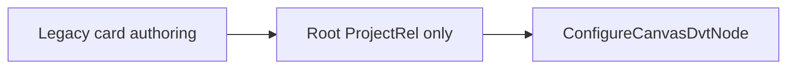
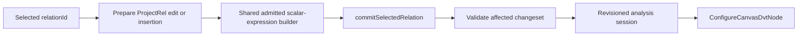

# Semantic Derived Output Authoring Plan

## Outcome

Issue #3419 adds scalar-derived fields at an exact selected relation while
preserving stable FieldIds. It reuses `ConfigureCanvasDvtNode`, the admitted
Substrait function catalogue and the revision-bound relation analysis session.

It does not add an expression IR, a visual-stage identity, a runtime step or a
second output owner. The Transform instance `Output` tab remains authoritative
for final inclusion, alias and order.

## Current Constraint

The existing calculated-output adapter is correct for a connected-source
projection whose root is `ProjectRel`. It cannot place a derived output before
or after an arbitrary JOIN without rebuilding the whole document.



## Target



- Selecting `ReadRel`, JOIN or another relation inserts one `ProjectRel` above
  that relation.
- Selecting an existing field-transformation `ProjectRel` appends to it.
- `commitSelectedRelation` reconnects consumers and rebinds downstream field
  references by stable identity.
- The relation analysis session locates indexed relations and invalidates the
  affected changeset; the UI does not traverse the complete graph.
- Window authoring continues through the existing selected-relation Window
  command. Scalar and Window outputs converge only in the disposable stage
  projection.

## Fowler Decisions

| Smell                               | Refactoring                  | Result                                                           |
| ----------------------------------- | ---------------------------- | ---------------------------------------------------------------- |
| Root-only calculated-output adapter | Extract function             | Scalar expression construction works for any admitted ProjectRel |
| Duplicate relation mutation         | Reuse command boundary       | One revision, validation and reconnection path                   |
| Component knows Substrait placement | Introduce presentation model | Component receives fields, capabilities and a command            |
| Edit mode by default                | Separate query from command  | Inspection is default; Add/Edit is explicit                      |

## Delivery Cuts

1. Extract and prove one provider-aware scalar-expression builder from the
   current projection implementation.
2. TDD `applySelectedRelationDerivedOutput` for insertion, edit, stable identity,
   stale revision and unsupported capability.
3. Project a small authoring model from the selected relation and admitted
   capabilities.
4. Reuse one focused expression form in the Semantic Editor Properties tab;
   keep the existing read-only expression summary visible outside edit mode.
5. Prove save/reload and downstream reuse before adding normalization of JOIN
   predicates from #3420.

## Rails And Negative Proof

- Command: `ConfigureCanvasDvtNode`.
- Query: `ProjectCanvasRelationalTree`.
- Draft persistence: `SaveWorkspaceGraphDraft`.
- Reject missing relation, stale revision, duplicate alias, unavailable field,
  unsupported capability and failed downstream rebind. Repeated operands remain
  valid because admitted scalar signatures, not UI convenience, govern them.
- A cancelled editor writes nothing.
- No provider query is allowed during inspection or composition.

## Scope Guard

Allowed implementation surfaces are the Canvas relation command, its focused
tests, the existing expression form extraction and Semantic Editor composition.
Engine, planner, adapter and API packages are out of scope. PostgreSQL supplies
current admitted capability evidence; the persisted meaning remains Substrait.

```feature-mechanization
version: 1
featureId: GH-3419-SELECTED-RELATION-DERIVED-OUTPUT
mechanizationStatus: implemented
noHumanDecisionsRemaining: true
implementationPlan: docs/planning/proposals/mandatory/frontend-and-ux/semantic-derived-output-authoring-plan-20260925.md
componentGuides:
  - docs/architecture/components/web/graph/canvas-workbench-command-query-catalog.md
userStories:
  - https://github.com/dunay2/dvt/issues/3416
  - https://github.com/dunay2/dvt/issues/3419
governingSources:
  - AGENTS.md
  - docs/planning/status/governance-document-rule-inventory.md
  - docs/architecture/command-query-rail-governance.md
  - docs/architecture/fowler-opportunity-planning-governance.md
  - docs/adr/ADR-0064-substrait-semantic-reference-and-bounded-logical-profile.md
allowedImplementationSurfaces:
  - apps/web/src/app/views/canvas/**
  - apps/web/src/app/plugins/graph/GraphNodeExpressionComposer.tsx
  - docs/planning/proposals/mandatory/frontend-and-ux/semantic-derived-output-authoring-plan-20260925.md
  - docs/planning/status/**
forbiddenImplementationSurfaces:
  - packages/@dvt/engine/**
  - packages/@dvt/planner/**
  - packages/@dvt/adapter-*/**
  - apps/api/**
domainObjects:
  - CanvasRelationAnalysisSession
  - SelectedRelationDerivedOutput
  - DerivedOutputForm
commandQueryRails:
  - name: ConfigureCanvasDvtNode
    type: command
    referenceOnly: true
    authorityRef: docs/planning/proposals/mandatory/frontend-and-ux/vtx2-web-vtx1-authoring-hardcut-plan-20260903.md
    dddOwner: Canvas relational authoring
  - name: ProjectCanvasRelationalTree
    type: query
    referenceOnly: true
    authorityRef: https://github.com/dunay2/dvt/issues/3266#issuecomment-5703815399
    dddOwner: CanvasRelationalTreeProjection
fowlerSignals:
  - Root-only authoring
  - Duplicate form state
  - Feature envy
  - Parallel change
architectureGuards:
  - pnpm docs:feature-mechanization:implementation -- --feature GH-3419-SELECTED-RELATION-DERIVED-OUTPUT
cypressFlows:
  - N/A - browser convergence and accessibility belong to GH-3422
completionGate:
  - pnpm --filter @dvt/web test:canvas
  - pnpm --filter @dvt/web lint
  - pnpm --filter @dvt/web typecheck
  - pnpm docs:feature-mechanization:implementation -- --feature GH-3419-SELECTED-RELATION-DERIVED-OUTPUT
  - pnpm verify:prepush
redGreenCycles:
  - id: selected-relation-derived-output
    redTest: apps/web/src/app/views/canvas/canvasSelectedRelationDerivedOutput.test.ts
    expectedFailure: Scalar outputs can only be appended to the root projection.
    patchSurfaces:
      - apps/web/src/app/views/canvas/canvasSelectedRelationDerivedOutput.ts
      - apps/web/src/app/views/canvas/canvasDvtSubstraitScalarFunction.ts
    greenTest: apps/web/src/app/views/canvas/canvasSelectedRelationDerivedOutput.test.ts
  - id: read-first-derived-output-form
    redTest: apps/web/src/app/views/canvas/CanvasDerivedOutputSection.test.tsx
    expectedFailure: The selected relation has no explicit derived-output action.
    patchSurfaces:
      - apps/web/src/app/views/canvas/DerivedOutputForm.tsx
      - apps/web/src/app/views/canvas/CanvasDerivedOutputSection.tsx
    greenTest: apps/web/src/app/views/canvas/CanvasDerivedOutputSection.test.tsx
symbols:
  - &commandSymbol
    name: applySelectedRelationDerivedOutput
    path: apps/web/src/app/views/canvas/canvasSelectedRelationDerivedOutput.ts
    dddOwner: SelectedRelationDerivedOutput
    cqRails: [ConfigureCanvasDvtNode]
    fowlerSignals: [Replace conditional with command, Feature envy]
    architectureGuard: pnpm docs:feature-mechanization:implementation -- --feature GH-3419-SELECTED-RELATION-DERIVED-OUTPUT
    cypressCoverage: N/A - browser convergence and accessibility belong to GH-3422
    unitTests: [apps/web/src/app/views/canvas/canvasSelectedRelationDerivedOutput.test.ts]
  - <<: *commandSymbol
    name: buildDvtSubstraitScalarFunction
    path: apps/web/src/app/views/canvas/canvasDvtSubstraitScalarFunction.ts
  - <<: *commandSymbol
    name: SelectedRelationDerivedOutputRequest
  - <<: *commandSymbol
    name: rootFields
  - <<: *commandSymbol
    name: resolveOperandExpression
  - <<: *commandSymbol
    name: reject
  - &formSymbol
    <<: *commandSymbol
    name: DerivedOutputForm
    path: apps/web/src/app/views/canvas/DerivedOutputForm.tsx
    dddOwner: DerivedOutputForm
    unitTests:
      - apps/web/src/app/views/canvas/CanvasDerivedOutputSection.test.tsx
      - apps/web/src/app/plugins/graph/GraphNodeExpressionComposer.test.tsx
  - <<: *formSymbol
    name: CanvasDerivedOutputSection
    path: apps/web/src/app/views/canvas/CanvasDerivedOutputSection.tsx
  - <<: *formSymbol
    name: useCanvasDerivedOutputAuthoring
    path: apps/web/src/app/views/canvas/useCanvasDerivedOutputAuthoring.ts
  - <<: *formSymbol
    name: DerivedOutputFunction
    path: apps/web/src/app/views/canvas/DerivedOutputForm.tsx
  - <<: *formSymbol
    name: DerivedOutputFunctionResolver
    path: apps/web/src/app/views/canvas/DerivedOutputForm.tsx
  - <<: *formSymbol
    name: DerivedOutputRequest
    path: apps/web/src/app/views/canvas/DerivedOutputForm.tsx
  - <<: *formSymbol
    name: bounds
    path: apps/web/src/app/views/canvas/DerivedOutputForm.tsx
  - <<: *formSymbol
    name: normalize
    path: apps/web/src/app/views/canvas/DerivedOutputForm.tsx
  - <<: *formSymbol
    name: DerivedOutputField
    path: apps/web/src/app/views/canvas/DerivedOutputOperands.tsx
  - <<: *formSymbol
    name: DerivedOutputOperands
    path: apps/web/src/app/views/canvas/DerivedOutputOperands.tsx
  - &legacyFormSymbol
    <<: *formSymbol
    name: GraphNodeExpressionComposer
    path: apps/web/src/app/plugins/graph/GraphNodeExpressionComposer.tsx
  - <<: *legacyFormSymbol
    name: GraphNodeExpressionComposerFunction
  - <<: *legacyFormSymbol
    name: Rejection
  - <<: *legacyFormSymbol
    name: rejectionLabel
  - <<: *legacyFormSymbol
    name: createResolver
```
