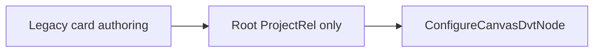
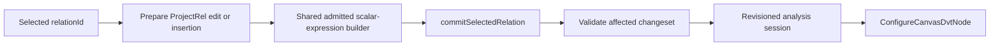

# Semantic Derived Output Authoring Plan

## Outcome

Issue #3419 adds scalar-derived fields at an exact selected relation while
preserving stable FieldIds. It reuses `ConfigureCanvasDvtNode`, the admitted
Substrait function catalogue and the revision-bound relation analysis session.

It does not add an expression IR, a visual-stage identity, a runtime step or a
second output owner. The Transform instance `Output` tab remains authoritative
for final inclusion, alias and order.

## Current Constraint

The existing calculated-output adapter is correct for a connected-source
projection whose root is `ProjectRel`. It cannot place a derived output before
or after an arbitrary JOIN without rebuilding the whole document.

## Target

- Selecting `ReadRel`, JOIN or another relation inserts one `ProjectRel` above
  that relation.
- Selecting an existing field-transformation `ProjectRel` appends to it.
- `commitSelectedRelation` reconnects consumers and rebinds downstream field
  references by stable identity.
- The relation analysis session locates indexed relations and invalidates the
  affected changeset; the UI does not traverse the complete graph.
- Window authoring continues through the existing selected-relation Window
  command. Scalar and Window outputs converge only in the disposable stage
  projection.

## Fowler Decisions

| Smell                               | Refactoring                  | Result                                                           |
| ----------------------------------- | ---------------------------- | ---------------------------------------------------------------- |
| Root-only calculated-output adapter | Extract function             | Scalar expression construction works for any admitted ProjectRel |
| Duplicate relation mutation         | Reuse command boundary       | One revision, validation and reconnection path                   |
| Component knows Substrait placement | Introduce presentation model | Component receives fields, capabilities and a command            |
| Edit mode by default                | Separate query from command  | Inspection is default; Add/Edit is explicit                      |

## Delivery Cuts

1. Extract and prove one provider-aware scalar-expression builder from the
   current projection implementation.
2. TDD `applySelectedRelationDerivedOutput` for insertion, edit, stable identity,
   stale revision and unsupported capability.
3. Project a small authoring model from the selected relation and admitted
   capabilities.
4. Reuse one focused expression form in the Semantic Editor Properties tab;
   keep the existing read-only expression summary visible outside edit mode.
5. Prove save/reload and downstream reuse before adding normalization of JOIN
   predicates from #3420.

## Rails And Negative Proof

- Command: `ConfigureCanvasDvtNode`.
- Query: `ProjectCanvasRelationalTree`.
- Draft persistence: `SaveWorkspaceGraphDraft`.
- Reject missing relation, stale revision, duplicate alias, repeated operands,
  unavailable field, unsupported capability and failed downstream rebind.
- A cancelled editor writes nothing.
- No provider query is allowed during inspection or composition.

## Scope Guard

Allowed implementation surfaces are the Canvas relation command, its focused
tests, the existing expression form extraction and Semantic Editor composition.
Engine, planner, adapter and API packages are out of scope. PostgreSQL supplies
current admitted capability evidence; the persisted meaning remains Substrait.
