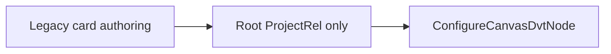
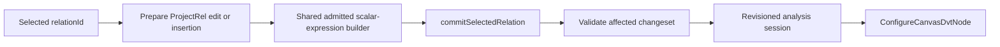
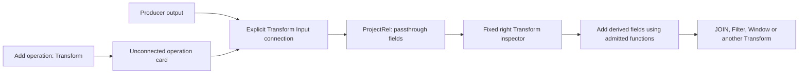
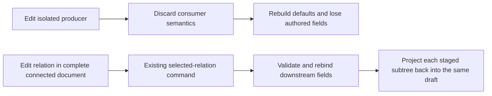

# Semantic Derived Output Authoring Plan

## Outcome

Issue #3419 adds scalar-derived fields at an exact selected relation while
preserving stable FieldIds. It reuses `ConfigureCanvasDvtNode`, the admitted
Substrait function catalogue and the revision-bound relation analysis session.

It does not add an expression IR, a visual-stage identity, a runtime step or a
second output owner. The Transform instance inside the semantic editor owns
final inclusion, alias and order. The outer Canvas model card's `Output` tab is
only a passive projection: it neither authors fields nor receives mappings.
External mappings terminate at the consumer `Input`.

## Current Constraint

The existing calculated-output adapter is correct for a connected-source
projection whose root is `ProjectRel`. It cannot place a derived output before
or after an arbitrary JOIN without rebuilding the whole document.

```mermaid
flowchart LR
  Card[Legacy card authoring] --> Root[Root ProjectRel only]
  Root --> Command[ConfigureCanvasDvtNode]
```

## Target

```mermaid
flowchart LR
  Selection[Selected relationId] --> Prepare[Prepare ProjectRel edit or insertion]
  Prepare --> Builder[Shared admitted scalar-expression builder]
  Builder --> Commit[commitSelectedRelation]
  Commit --> Validate[Validate affected changeset]
  Validate --> Cache[Revisioned analysis session]
  Cache --> Command[ConfigureCanvasDvtNode]
```

- Selecting `ReadRel`, JOIN or another relation inserts one `ProjectRel` above
  that relation.
- Selecting an existing field-transformation `ProjectRel` appends to it.
- `commitSelectedRelation` reconnects consumers and rebinds downstream field
  references by stable identity.
- The relation analysis session locates indexed relations and invalidates the
  affected changeset; the UI does not traverse the complete graph.
- Window authoring continues through the existing selected-relation Window
  command. Scalar and Window outputs converge only in the disposable stage
  projection.

## Fowler Decisions

| Smell                               | Refactoring                  | Result                                                           |
| ----------------------------------- | ---------------------------- | ---------------------------------------------------------------- |
| Root-only calculated-output adapter | Extract function             | Scalar expression construction works for any admitted ProjectRel |
| Duplicate relation mutation         | Reuse command boundary       | One revision, validation and reconnection path                   |
| Component knows Substrait placement | Introduce presentation model | Component receives fields, capabilities and a command            |
| Edit mode by default                | Separate query from command  | Inspection is default; Add/Edit is explicit                      |

## Delivery Cuts

### Transform card interaction

The Semantic Editor exposes **Transform** in Add operation. The card is staged
independently of selection. An explicit producer-to-Input connection creates
one owned identity `ProjectRel`; no existing consumer is rewired implicitly.
Its initial output is the full input dataset, a valid passthrough transformation.
The author connects its output to a downstream operation or the passive terminal.

```mermaid
flowchart LR
  Add[Add operation: Transform] --> Card[Unconnected operation card]
  Dataset[Producer output] --> Input[Explicit Transform Input connection]
  Card --> Input
  Input --> Project[ProjectRel: passthrough fields]
  Project --> Inspector[Fixed right Transform inspector]
  Inspector --> Fields[Add derived fields using admitted functions]
  Fields --> Consumer[JOIN, Filter, Window or another Transform]
```

Transform owns dataset field derivation. Remove that action from generic
relation properties. Scalar and Window fields share the Transform card and
the existing output controls; Window parameters retain their existing editor.
Inspection remains read-first, and the function form opens only on Add field.
Insertion, field authoring and output changes use the existing revision-bound
command and downstream rebinding boundary. Prove insertion on either JOIN
operand, passthrough preservation, stale rejection and the production Workbench
interaction without a floating editor.

Acceptance includes editing output inclusion and derived fields, explicitly
connecting the terminal, applying and reopening without lost selections or
duplicate operations. Checkbox updates must retain focus and viewport geometry.
Keep row identity and presentation order stable while toggling inclusion. Busy
commands use accessible busy state and reject duplicate gestures without
temporarily disabling the focused checkbox. Reordering remains an explicit
gesture; inclusion follows the displayed order rather than moving its row.
Staged and applied Transform use the same fixed inspector frame. Do not wrap
that frame in another width-constrained properties panel: nested widths clip
the controls beyond the viewport and duplicate ownership of the inspector layout.
The producer-consumer browser proof must not create output semantics by connecting
outer cards or by dropping fields on the passive Output tab.

The focused browser proof saves and reopens Transform through the real Canvas
UI with the existing stateful draft API transport. This is a frontend
integration proof, not evidence of live PostgreSQL execution. Function argument
order and repetitions belong to Substrait expressions; lineage records unique
field dependencies.

1. Extract and prove one provider-aware scalar-expression builder from the
   current projection implementation.
2. TDD `applySelectedRelationDerivedOutput` for insertion, edit, stable identity,
   stale revision and unsupported capability.
3. Project a small authoring model from the selected relation and admitted
   capabilities.
4. Reuse one focused expression form in the Semantic Editor Properties tab;
   keep the existing read-only expression summary visible outside edit mode.
5. Prove save/reload and downstream reuse before adding normalization of JOIN
   predicates from #3420.

## Rails And Negative Proof

### Preserve pending consumers during producer edits

The pending graph currently edits each operation's embedded document in
isolation and discards configured consumers after a producer change. Rebuilding
an identity Transform cannot recover a consumer's authored expressions or
output selections. This is an authority-boundary defect, not a rendering issue.

```mermaid
flowchart LR
  Before[Edit isolated producer] --> Discard[Discard consumer semantics]
  Discard --> Loss[Rebuild defaults and lose authored fields]
  After[Edit relation in complete connected document] --> Commit[Existing selected-relation command]
  Commit --> Rebind[Validate and rebind downstream fields]
  Rebind --> Project[Project each staged subtree back into the same draft]
```

Select the complete configured consumer document for editing any staged
ancestor. Reuse the existing selected-relation command and validation boundary;
do not implement another expression rewriter. After a successful command,
project the affected staged subtrees atomically using their stable relation
identities. Removing a required producer field rejects the command rather than
silently resetting a consumer. Disconnection remains a distinct explicit action.

Regression proof must preserve an authored consumer alias or derived field
after an upstream rename and reject a producer-field removal used downstream.
The read projection belongs to `ProjectCanvasRelationalTree`; publication of
the updated snapshots remains `ConfigureCanvasDvtNode` and the existing draft.

- Command: `ConfigureCanvasDvtNode`.
- Query: `ProjectCanvasRelationalTree`.
- Draft persistence: `SaveWorkspaceGraphDraft`.
- Reject missing relation, stale revision, duplicate alias, unavailable field,
  unsupported capability and failed downstream rebind. Repeated operands remain
  valid because admitted scalar signatures, not UI convenience, govern them.
- A cancelled editor writes nothing.
- No provider query is allowed during inspection or composition.

## Scope Guard

Allowed implementation surfaces are the Canvas relation command, its focused
tests, the existing expression form extraction and Semantic Editor composition.
Engine, planner, adapter and API packages are out of scope. PostgreSQL supplies
current admitted capability evidence; the persisted meaning remains Substrait.

## Mechanization Authority

Planning DB owns the current `GH-3419-SELECTED-RELATION-DERIVED-OUTPUT` declaration,
including its existing command/query references, implementation symbols,
negative tests and allowed surfaces. Update it through
`RecordFeatureMechanizationRail`; do not duplicate it as an imported Markdown
manifest. The diagrams, design decisions and acceptance criteria above remain
the source rationale.

Before integration, validate this feature against the existing Planning DB with
`pnpm docs:feature-mechanization:implementation -- --feature GH-3419-SELECTED-RELATION-DERIVED-OUTPUT`
and explicit `GIT_BASE` / `GIT_HEAD` commit identities. Record the evidence in
the governing issue and PR under the approved single-team validation boundary.
