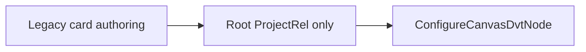
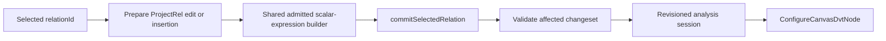
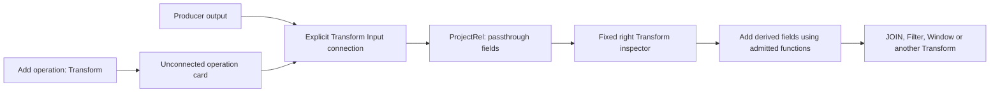
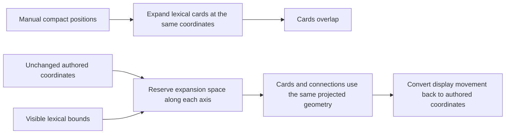
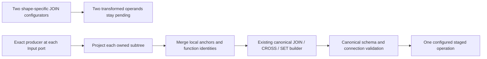
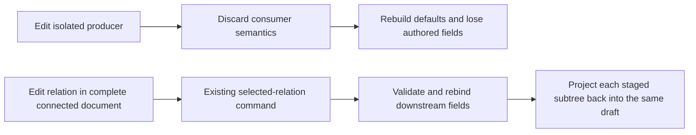

# Semantic Derived Output Authoring Plan

## Outcome

Issue #3419 adds scalar-derived fields at an exact selected relation while
preserving stable FieldIds. It reuses `ConfigureCanvasDvtNode`, the admitted
Substrait function catalogue and the revision-bound relation analysis session.

It does not add an expression IR, a visual-stage identity, a runtime step or a
second output owner. The Transform instance inside the semantic editor owns
final inclusion, alias and order. The outer Canvas model card's `Output` tab is
only a passive projection: it neither authors fields nor receives mappings.
External mappings terminate at the consumer `Input`.

## Current Constraint

The existing calculated-output adapter is correct for a connected-source
projection whose root is `ProjectRel`. It cannot place a derived output before
or after an arbitrary JOIN without rebuilding the whole document.


```mermaid
flowchart LR
  Card[Legacy card authoring] --> Root[Root ProjectRel only]
  Root --> Command[ConfigureCanvasDvtNode]
```

## Target


```mermaid
flowchart LR
  Selection[Selected relationId] --> Prepare[Prepare ProjectRel edit or insertion]
  Prepare --> Builder[Shared admitted scalar-expression builder]
  Builder --> Commit[commitSelectedRelation]
  Commit --> Validate[Validate affected changeset]
  Validate --> Cache[Revisioned analysis session]
  Cache --> Command[ConfigureCanvasDvtNode]
```

- Selecting `ReadRel`, JOIN or another relation inserts one `ProjectRel` above
  that relation.
- Selecting an existing field-transformation `ProjectRel` appends to it.
- `commitSelectedRelation` reconnects consumers and rebinds downstream field
  references by stable identity.
- The relation analysis session locates indexed relations and invalidates the
  affected changeset; the UI does not traverse the complete graph.
- Window authoring continues through the existing selected-relation Window
  command. Scalar and Window outputs converge only in the disposable stage
  projection.

## Fowler Decisions

| Smell                               | Refactoring                  | Result                                                           |
| ----------------------------------- | ---------------------------- | ---------------------------------------------------------------- |
| Root-only calculated-output adapter | Extract function             | Scalar expression construction works for any admitted ProjectRel |
| Duplicate relation mutation         | Reuse command boundary       | One revision, validation and reconnection path                   |
| Component knows Substrait placement | Introduce presentation model | Component receives fields, capabilities and a command            |
| Edit mode by default                | Separate query from command  | Inspection is default; Add/Edit is explicit                      |

## Delivery Cuts

### Transform card interaction

The Semantic Editor exposes **Transform** in Add operation. The card is staged
independently of selection. An explicit producer-to-Input connection creates
one owned identity `ProjectRel`; no existing consumer is rewired implicitly.
Its initial output is the full input dataset, a valid passthrough transformation.
The author connects its output to a downstream operation or the passive terminal.


```mermaid
flowchart LR
  Add[Add operation: Transform] --> Card[Unconnected operation card]
  Dataset[Producer output] --> Input[Explicit Transform Input connection]
  Card --> Input
  Input --> Project[ProjectRel: passthrough fields]
  Project --> Inspector[Fixed right Transform inspector]
  Inspector --> Fields[Add derived fields using admitted functions]
  Fields --> Consumer[JOIN, Filter, Window or another Transform]
```

Transform owns dataset field derivation. Remove that action from generic
relation properties. Scalar and Window fields share the Transform card and
the existing output controls; Window parameters retain their existing editor.
Inspection remains read-first, and the function form opens only on Add field.
Insertion, field authoring and output changes use the existing revision-bound
command and downstream rebinding boundary. Prove insertion on either JOIN
operand, passthrough preservation, stale rejection and the production Workbench
interaction without a floating editor.

Acceptance includes editing output inclusion and derived fields, explicitly
connecting the terminal, applying and reopening without lost selections or
duplicate operations. Checkbox updates must retain focus and viewport geometry.
Keep row identity and presentation order stable while toggling inclusion. Busy
commands use accessible busy state and reject duplicate gestures without
temporarily disabling the focused checkbox. Reordering remains an explicit
gesture; inclusion follows the displayed order rather than moving its row.
Staged and applied Transform use the same fixed inspector frame. Do not wrap
that frame in another width-constrained properties panel: nested widths clip
the controls beyond the viewport and duplicate ownership of the inspector layout.
The producer-consumer browser proof must not create output semantics by connecting
outer cards or by dropping fields on the passive Output tab.

The focused browser proof saves and reopens Transform through the real Canvas
UI with the existing stateful draft API transport. This is a frontend
integration proof, not evidence of live PostgreSQL execution. Function argument
order and repetitions belong to Substrait expressions; lineage records unique
field dependencies.

This stability rule applies to every operation, including Filter. Re-querying
an operand after output selection or reorder must not unmount the inspector
frame, reset its active tab or replace the focused output control. Keep the
frame keyed by relation identity, independently of asynchronous property-form
availability; never retain stale command authority just to keep it visible.
Prove that inclusion, pointer drag and keyboard reorder preserve the exact DOM
frame, active Output tab and focus while advancing the real semantic revision.
A configured staged unary operation uses that same inspector; only its initial
configuration needs the insertion form.

### Semantic zoom without card collisions

The current layout expands lexical detail while keeping manual compact-card
coordinates unchanged. The expanded rectangles consequently cover neighboring
cards. Do not remove lexical disclosure or reset the author's saved positions.


```mermaid
flowchart LR
  Before[Manual compact positions] --> Grow[Expand lexical cards at the same coordinates]
  Grow --> Collision[Cards overlap]
  Positions[Unchanged authored coordinates] --> Reserve[Reserve expansion space along each axis]
  Sizes[Visible lexical bounds] --> Reserve
  Reserve --> View[Cards and connections use the same projected geometry]
  View --> Drag[Convert display movement back to authored coordinates]
```

Within `ProjectCanvasRelationalTree`, project additional spacing from the
compact layout whenever manually positioned cards reveal detail. Preserve the
relative separation and gaps of nonoverlapping cards along each axis, including
the passive terminal and pending cards. Collapsing detail restores the authored
coordinates. Rendered movement must subtract the presentation-only expansion
offset, avoiding accumulated drift. This is not another persisted layout or a
semantic mutation. No draft save, provider query, tab switch or selection reset
is allowed on zoom. Tests must cover restored/manual positions, uneven detail,
repeated zoom, movement while expanded, terminal edges and unchanged node identity.

1. Extract and prove one provider-aware scalar-expression builder from the
   current projection implementation.
2. TDD `applySelectedRelationDerivedOutput` for insertion, edit, stable identity,
   stale revision and unsupported capability.
3. Project a small authoring model from the selected relation and admitted
   capabilities.
4. Reuse one focused expression form in the Semantic Editor Properties tab;
   keep the existing read-only expression summary visible outside edit mode.
5. Prove save/reload and downstream reuse before adding normalization of JOIN
   predicates from #3420.

## Rails And Negative Proof

### One binary composition path

The staged JOIN currently has separate Read/Read and relation-tree/Read
configurators. Two transformed producers never enter either path. CROSS and
SET cards can consequently remain pending despite complete ports. These shape
restrictions are not algebraic rules and must be removed, not retained as fallbacks.


```mermaid
flowchart LR
  Before[Two shape-specific JOIN configurators] --> Gap[Two transformed operands stay pending]
  Ports[Exact producer at each Input port] --> Subtree[Project each owned subtree]
  Subtree --> Merge[Merge local anchors and function identities]
  Merge --> Builder[Existing canonical JOIN / CROSS / SET builder]
  Builder --> Validate[Canonical schema and connection validation]
  Validate --> Draft[One configured staged operation]
```

Use `ConfigureCanvasDvtNode` for the existing editable draft and
`ProjectCanvasRelationalTree` for its exact operand projection. No provider
execution, new command, schema or expression language is introduced. Preserve
stable relation and field identities, aliases, port order and all operand
operations. Rebase document-local relation and function anchors on cloned
protobuf messages; resolve function identities by their declared URN and name,
not by coincident numeric anchors. Reject shared occurrences, cross-connection
operands, malformed documents and incompatible SET schemas without publishing
partial semantics. A JOIN still needs its admitted typed equality, editable in
the existing predicate inspector; CROSS has no fabricated predicate.

Retire `canvasStagedJoinConfiguration.ts` and
`canvasStagedJoinProducerConfiguration.ts`, their special decoder and the
duplicate synchronous configuration effect. Migrate their behavioral tests to
the common configurator rather than discarding coverage. Reuse the existing
operation inspector and output editor for configured binary operations. Keep
the passive terminal and explicit Input connection contract unchanged.

| Signal                                      | Decision                                           | Required proof                                                         |
| ------------------------------------------- | -------------------------------------------------- | ---------------------------------------------------------------------- |
| Shape-dependent parallel commands           | One typed operand compositor and canonical builder | Read/Read, transformed/Read and transformed/transformed on either port |
| Local numeric identity collisions           | Rebase only cloned protobuf anchors                | Different functions sharing an anchor retain distinct meaning          |
| Whole-document lookup for an inner producer | Project exact owned subtree                        | No accidental ancestor or sibling copied into the operand              |
| Pending binary property placeholder         | Reuse the existing canonical inspector             | JOIN equality, CROSS and SET outputs remain editable                   |

Negative proof includes incomplete ports, duplicate occurrences, cross-connection
composition and incompatible SET fields. Browser proof must apply and reopen a
binary operation fed by two configured producers, without layout reset or copied
upstream model internals. Retired source-specific configuration symbols must
have no production references.

The same review found that modern Transform authoring reused the legacy
nullable-only projection inspector. Select Transform operands from the admitted
analysis schema independently of nullability; preserve their original type and
nullability in the semantic document. Share that type-label projection between
the authoring query and command. Do not broaden the old projection reader's
contract or treat a NOT NULL field as nullable to make it pass.

### Preserve pending consumers during producer edits

The pending graph currently edits each operation's embedded document in
isolation and discards configured consumers after a producer change. Rebuilding
an identity Transform cannot recover a consumer's authored expressions or
output selections. This is an authority-boundary defect, not a rendering issue.


```mermaid
flowchart LR
  Before[Edit isolated producer] --> Discard[Discard consumer semantics]
  Discard --> Loss[Rebuild defaults and lose authored fields]
  After[Edit relation in complete connected document] --> Commit[Existing selected-relation command]
  Commit --> Rebind[Validate and rebind downstream fields]
  Rebind --> Project[Project each staged subtree back into the same draft]
```

Select the complete configured consumer document for editing any staged
ancestor. Reuse the existing selected-relation command and validation boundary;
do not implement another expression rewriter. After a successful command,
project the affected staged subtrees atomically using their stable relation
identities. Removing a required producer field rejects the command rather than
silently resetting a consumer. Disconnection remains a distinct explicit action.

Regression proof must preserve an authored consumer alias or derived field
after an upstream rename and reject a producer-field removal used downstream.
The read projection belongs to `ProjectCanvasRelationalTree`; publication of
the updated snapshots remains `ConfigureCanvasDvtNode` and the existing draft.

- Command: `ConfigureCanvasDvtNode`.
- Query: `ProjectCanvasRelationalTree`.
- Draft persistence: `SaveWorkspaceGraphDraft`.
- Reject missing relation, stale revision, duplicate alias, unavailable field,
  unsupported capability and failed downstream rebind. Repeated operands remain
  valid because admitted scalar signatures, not UI convenience, govern them.
- A cancelled editor writes nothing.
- No provider query is allowed during inspection or composition.

## Scope Guard

### Name and formula editing

The accepted interaction for Transform is a named output and a formula, not a
function selector that requires a physical field. The current form excludes
literal-only outputs and the read-only expression summary does not provide an
edit action. Arithmetic also requires capability admission; UI availability
alone is not proof of executable support.

```text
Current: field -> function chooser -> append output; existing formulas read-only
Target: name + formula -> admitted Substrait expression -> revision-bound edit
        -> same ProjectRel and stable FieldId -> passive Output projection
```

Properties lists each derived output with its name, formula and explicit Edit
action. Add opens the same form with empty name and formula. The expression tree
remains available in Tree, without duplicating it in Properties. Empty text is
written as `''` and is distinct from an unfinished empty formula and from NULL.
Examples include `hola = ''`, `greeting = 'hola'`,
`full_name = CONCAT(first_name, ' ', last_name)` and `total = price * quantity`.
The formula is input syntax, never another persisted AST or SQL authority.
Compile directly into the pinned Substrait expressions and retain the existing
stable identity, validation, Apply/Cancel and persistence boundaries.
An open formula draft participates in the existing pending-relation-edit guard,
for both staged and applied Transform cards. Switching cards must require the
same explicit discard decision as other unfinished operation properties.

| Scenario                                | Opportunity                                 | Pattern / owner                                 | Rail                                      | Required proof                                                                             |
| --------------------------------------- | ------------------------------------------- | ----------------------------------------------- | ----------------------------------------- | ------------------------------------------------------------------------------------------ |
| Literal-only and compound outputs       | UI restricts the admitted expression model  | Syntax adapter / Substrait expression           | ConfigureCanvasDvtNode                    | Empty string, escaping, constants, nested calls, unknown fields, invalid syntax            |
| Edit an existing formula                | Read-only projection has no command gesture | Existing selected-relation command / ProjectRel | ConfigureCanvasDvtNode                    | Stable FieldId, unchanged neighbors, downstream references, stale rejection                |
| Arithmetic between fields and constants | Missing profile/provider admission          | Standard-first capability / bounded profile     | Existing capability and projection owners | Exact signatures, types, nullability, overflow, canonical round-trip and PostgreSQL result |

The arithmetic cut must use the pinned official `functions_arithmetic` extension
and explicitly admitted overloads. Do not infer support from the upstream name,
coerce text columns into numbers, or display executable arithmetic before target
conformance is proved. No JavaScript evaluation, handwritten SQL execution,
provider query during editing, silent cast, or parallel command is permitted.

This extension includes the scalar catalog schema and admission in
`packages/@dvt/contracts`, the function resolver and scalar bindings in
`packages/@dvt/postgres-projection`, and their focused tests. It does not
authorize changes to execution, planner, API or physical data. Arithmetic
admission covers matching i64 and fp64 operands with explicit signatures;
incompatible or mixed types reject without implicit conversion. PostgreSQL
proof is read-only, using constants rather than user tables.
The shared typed-literal SQL emitter must preserve i64/fp64 even without an
enclosing arithmetic function. PostgreSQL numeric inference cannot become the
output type authority; fp64 negative zero must survive provider rendering.

Before production changes, update the existing Planning DB declarations for the
affected Canvas, Contracts and PostgreSQL projection surfaces. Prove the full
browser create/edit/apply/reload path and negative cases. Runtime proofs must use
an explicitly isolated database; never seed the application's local database.

Allowed implementation surfaces include the Canvas relation command, its focused
tests, the expression form and Semantic Editor composition, plus the exact
catalog and PostgreSQL scalar surfaces declared above.
Engine, planner, adapter and API packages are out of scope. PostgreSQL supplies
current admitted capability evidence; the persisted meaning remains Substrait.

## Mechanization Authority

Planning DB owns the current `GH-3419-SELECTED-RELATION-DERIVED-OUTPUT` declaration,
including its existing command/query references, implementation symbols,
negative tests and allowed surfaces. Update it through
`RecordFeatureMechanizationRail`; do not duplicate it as an imported Markdown
manifest. The diagrams, design decisions and acceptance criteria above remain
the source rationale.

Before integration, validate this feature against the existing Planning DB with
`pnpm docs:feature-mechanization:implementation -- --feature GH-3419-SELECTED-RELATION-DERIVED-OUTPUT`
and explicit `GIT_BASE` / `GIT_HEAD` commit identities. Record the evidence in
the governing issue and PR under the approved single-team validation boundary.
