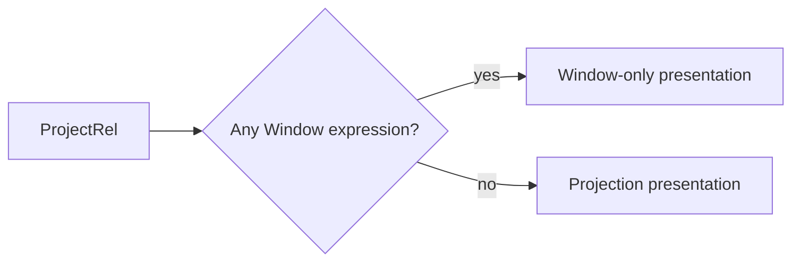
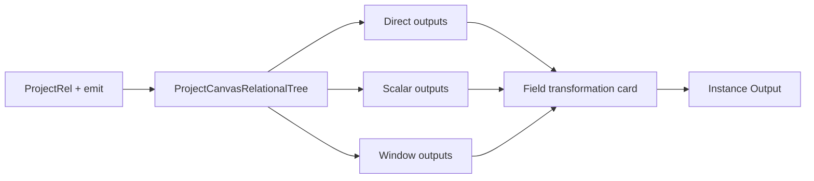
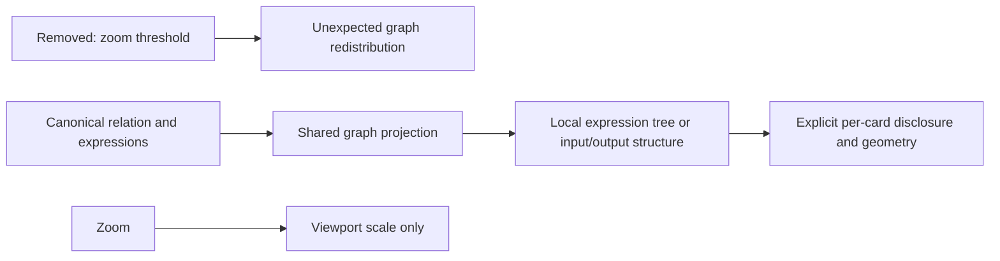

# Semantic Field Transformation Stage Plan

## Intent

Issue #3416 makes field-producing `ProjectRel` semantics visible inside the
Semantic Editor. One disposable card summarizes emitted direct, scalar-derived
and Window-derived fields. It does not add a relation, expression AST, runtime
step, persisted visual stage or final-output editor.

The Transform instance `Output` tab remains the sole owner of final inclusion,
alias and ordering. This stage only explains and authors fields that may later
be selected there.

## Current And Target

Canonical authority is the pinned Substrait plan plus the DVT identity sidecar.
Existing Window authoring from #3230/#2764 and expression authoring from #2919
are reused. An un-emitted authored expression is invalid under the current DVT
projection authority and fails closed.

## Fowler Matrix

| Scenario                              | Opportunity             | Pattern                       | DDD owner                        | Rail                          | Proof                                 | Out of scope                |
| ------------------------------------- | ----------------------- | ----------------------------- | -------------------------------- | ----------------------------- | ------------------------------------- | --------------------------- |
| Classify direct/scalar/Window outputs | Primitive obsession     | Presentation Model            | `CanvasRelationalTreeProjection` | `ProjectCanvasRelationalTree` | canonical classification tests        | new relation/IR             |
| Render the classification             | Responsibility overload | Move decision to presenter    | Canvas relation presentation     | `ProjectCanvasRelationalTree` | component consumes projected identity | semantic React conditionals |
| Add scalar fields                     | Duplicate semantics     | Reuse canonical command       | `DvtNodeAuthoringMetadata`       | `ConfigureCanvasDvtNode`      | FieldId/reload/negative tests         | JOIN-specific expressions   |
| Expose Window fields                  | Feature envy            | Reuse contextual Window owner | canonical Window expression      | existing rails                | partition/order/identity tests        | `DvtWindow`                 |
| Preview transformed rows              | Boundary drift          | Reuse query adapter           | `CanvasTransformDataSample`      | `PreviewCanvasTransformRows`  | row/schema oracle                     | new runtime step            |

## Delivery Boundaries

### Card detail convergence (#3422)

Every admitted relational card exposes an explicitly collapsible read-only
tree, not only JOIN and scalar/Window ProjectRel. Filter shows its predicate;
Aggregate shows grouping and measures; Sort shows ordered keys with direction
and null placement; Fetch shows count and offset, including canonical defaults.
Read, direct Project, Cross and Set show their local input/output structure when
they have no expression tree. No upstream subtree is copied into each card.

The query remains `ProjectCanvasRelationalTree` in Web/Canvas. Projection reads
the already-scoped semantic document, performs no writes/provider calls and
does not grant mutation permission. Expansion and zoom are presentation only.
Unsupported operations do not acquire fabricated supported detail. Sorting
priority and argument order must survive graph slicing and rendering.

| Scenario           | Opportunity                   | Fowler pattern                                       | DDD owner                      | Rail                        | Implementation surfaces                                                       | Unit/package test                                                                       | Architecture test                                        | User-flow test                                                   | Out of scope                                             |
| ------------------ | ----------------------------- | ---------------------------------------------------- | ------------------------------ | --------------------------- | ----------------------------------------------------------------------------- | --------------------------------------------------------------------------------------- | -------------------------------------------------------- | ---------------------------------------------------------------- | -------------------------------------------------------- |
| Inspect every card | Hidden presentation authority | Remove operation whitelist; reuse Presentation Model | CanvasRelationalTreeProjection | ProjectCanvasRelationalTree | semanticWorkbench projection/layout, relational card details and compact tree | canonical Sort/Fetch/Filter/Aggregate and structural details; order; unchanged document | existing read-only boundary and bounded component checks | explicitly open and close Sort/Fetch/source trees without saving | new commands, editors, IR, execution, JOIN normalization |

### Stable zoom and truthful gestures (#3422)

Zoom must not change card bounds, graph coordinates, edge paths or disclosure
state. Remove the semantic-zoom threshold and its names/tests; reuse the same
canonical detail projection under an explicit card toggle. Clicking the card
continues to select its existing inspector; disclosure does not open an editor.

The existing disposable Model layout session owns manual positions and expanded
relation identities, shared by inspection and draft views. Expanding a card can
adjust automatic spacing to its new bounds; manually placed cards remain where
the user put them. Arrange clears manual positions and applies the existing
layout to current bounds. Fit only frames the drawing. Neither action persists
semantic changes or fetches data.

Background cursor is the normal arrow and primary-button background dragging
does nothing in selection mode. Cards show grab/grabbing and retain existing
pointer and Alt+Arrow movement. An explicit Hand tool enables primary-button
viewport panning and disables card dragging; the viewport then shows grab and
grabbing while panning. Middle-button panning remains available. Controls,
portalled menus, cancellation and lost capture keep their own interaction
boundaries. These are presentation interactions inside ProjectCanvasRelationalTree,
not new command/query rails or mutation permissions.

| Scenario                                 | Opportunity                  | Fowler pattern                                  | DDD owner                    | Rail                        | Implementation surfaces                                                                               | Unit/package test                                                                            | Architecture test                                           | User-flow test                                                 | Out of scope                                     |
| ---------------------------------------- | ---------------------------- | ----------------------------------------------- | ---------------------------- | --------------------------- | ----------------------------------------------------------------------------------------------------- | -------------------------------------------------------------------------------------------- | ----------------------------------------------------------- | -------------------------------------------------------------- | ------------------------------------------------ |
| Zoom, disclose and arrange independently | Responsibility overload      | Separate presentation state from viewport scale | Canvas relation presentation | ProjectCanvasRelationalTree | existing relational View/DraftViewport/Layout/GraphNode/controls, detail projector and layout session | compare geometry and edge paths across scales; per-card disclosure and shared state          | existing projection boundary plus behavioral zoom invariant | open tree, zoom both directions, move card, arrange; no writes | new layout algorithm, persisted visual state     |
| Match cursors to actual gestures         | Hidden interaction authority | One gesture owner per interaction               | Canvas relation presentation | ProjectCanvasRelationalTree | existing viewport pan and card movement hooks, card button and viewport controls                      | background no-op; card drag; pan mode; middle button; cancel/lost capture/control boundaries | no semantic write dependency                                | computed cursors, primary/middle drag, no selection after pan  | new pointer framework, global keyboard shortcuts |

Extract the oversized existing Workbench projector by projection versus layout
responsibility only where needed for this change. Delete the moved bodies;
retain one expression projector and one compact renderer, with bounded files.

- Read path: `ProjectCanvasRelationalTree`.
- Write path: `ConfigureCanvasDvtNode`, then `SaveWorkspaceGraphDraft`.
- Data path: `PreviewCanvasTransformRows`; Preview/Run ignore visual-stage state.
- No provider call during projection or inspection.
- No per-function cards, column edges, second editor or capability catalogue.
- UI components remain below 200 lines; large pre-existing copy catalogues are
  not broadened beyond the localized keys required by this slice.

## Mechanization Authority

Planning DB owns the current `GH-3418-SEMANTIC-FIELD-TRANSFORMATION-PROJECTION` declaration,
including its existing command/query references, implementation symbols,
negative tests and allowed surfaces. Update it through
`RecordFeatureMechanizationRail`; do not duplicate it as an imported Markdown
manifest. The diagrams, design decisions and acceptance criteria above remain
the source rationale.

Before integration, validate this feature against the existing Planning DB with
`pnpm docs:feature-mechanization:implementation -- --feature GH-3418-SEMANTIC-FIELD-TRANSFORMATION-PROJECTION`
and explicit `GIT_BASE` / `GIT_HEAD` commit identities. Record the evidence in
the governing issue and PR under the approved single-team validation boundary.

## Completion

The slice is complete only when classification, authoring, identity, downstream
reuse, save/reload, lineage, Preview/Run and one browser flow consume the same
canonical semantics without a visual-stage authority.
