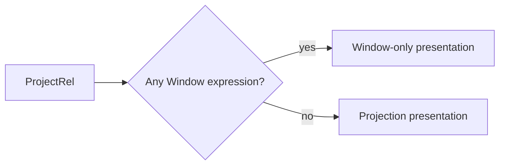
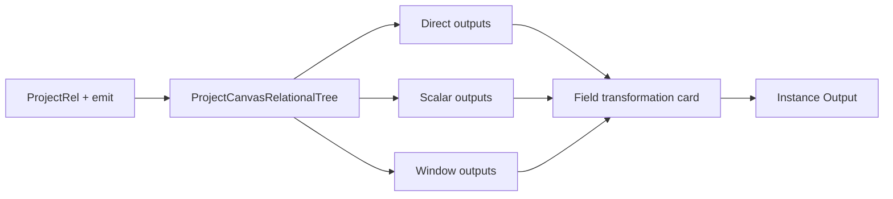

# Semantic Field Transformation Stage Plan

## Intent

Issue #3416 makes field-producing `ProjectRel` semantics visible inside the
Semantic Editor. One disposable card summarizes emitted direct, scalar-derived
and Window-derived fields. It does not add a relation, expression AST, runtime
step, persisted visual stage or final-output editor.

The Transform instance `Output` tab remains the sole owner of final inclusion,
alias and ordering. This stage only explains and authors fields that may later
be selected there.

## Current And Target





Canonical authority is the pinned Substrait plan plus the DVT identity sidecar.
Existing Window authoring from #3230/#2764 and expression authoring from #2919
are reused. An un-emitted authored expression is invalid under the current DVT
projection authority and fails closed.

## Fowler Matrix

| Scenario                              | Opportunity             | Pattern                       | DDD owner                        | Rail                          | Proof                                 | Out of scope                |
| ------------------------------------- | ----------------------- | ----------------------------- | -------------------------------- | ----------------------------- | ------------------------------------- | --------------------------- |
| Classify direct/scalar/Window outputs | Primitive obsession     | Presentation Model            | `CanvasRelationalTreeProjection` | `ProjectCanvasRelationalTree` | canonical classification tests        | new relation/IR             |
| Render the classification             | Responsibility overload | Move decision to presenter    | Canvas relation presentation     | `ProjectCanvasRelationalTree` | component consumes projected identity | semantic React conditionals |
| Add scalar fields                     | Duplicate semantics     | Reuse canonical command       | `DvtNodeAuthoringMetadata`       | `ConfigureCanvasDvtNode`      | FieldId/reload/negative tests         | JOIN-specific expressions   |
| Expose Window fields                  | Feature envy            | Reuse contextual Window owner | canonical Window expression      | existing rails                | partition/order/identity tests        | `DvtWindow`                 |
| Preview transformed rows              | Boundary drift          | Reuse query adapter           | `CanvasTransformDataSample`      | `PreviewCanvasTransformRows`  | row/schema oracle                     | new runtime step            |

## Delivery Boundaries

- Read path: `ProjectCanvasRelationalTree`.
- Write path: `ConfigureCanvasDvtNode`, then `SaveWorkspaceGraphDraft`.
- Data path: `PreviewCanvasTransformRows`; Preview/Run ignore visual-stage state.
- No provider call during projection or inspection.
- No per-function cards, column edges, second editor or capability catalogue.
- UI components remain below 200 lines; large pre-existing copy catalogues are
  not broadened beyond the localized keys required by this slice.

```feature-mechanization
version: 1
featureId: GH-3418-SEMANTIC-FIELD-TRANSFORMATION-PROJECTION
mechanizationStatus: implemented
noHumanDecisionsRemaining: true
implementationPlan: docs/planning/proposals/mandatory/frontend-and-ux/semantic-field-transformation-stage-plan-20260925.md
componentGuides:
  - docs/architecture/components/web/graph/canvas-workbench-command-query-catalog.md
userStories:
  - https://github.com/dunay2/dvt/issues/3416
  - https://github.com/dunay2/dvt/issues/3418
governingSources:
  - AGENTS.md
  - docs/planning/status/governance-document-rule-inventory.md
  - docs/guides/ai-work-protocol.md
  - docs/architecture/command-query-rail-governance.md
  - docs/architecture/fowler-opportunity-planning-governance.md
  - docs/adr/ADR-0064-substrait-semantic-reference-and-bounded-logical-profile.md
allowedImplementationSurfaces:
  - apps/web/src/app/views/canvas/**
  - apps/web/cypress/e2e/canvas/**
  - docs/architecture/components/web/graph/canvas-workbench-command-query-catalog.md
  - docs/planning/proposals/mandatory/frontend-and-ux/semantic-field-transformation-stage-plan-20260925.md
  - docs/evidence/**
  - docs/risk-register/quality/**
  - docs/.manifest.json
  - docs/**/index.md
  - docs/planning/status/**
forbiddenImplementationSurfaces:
  - packages/@dvt/engine/**
  - packages/@dvt/planner/**
  - packages/@dvt/adapter-*/**
  - apps/api/**
domainObjects:
  - CanvasRelationalTreeProjection
  - CanvasRelationPresentation
commandQueryRails:
  - name: ProjectCanvasRelationalTree
    type: query
    referenceOnly: true
    authorityRef: https://github.com/dunay2/dvt/issues/3266#issuecomment-5703815399
    dddOwner: CanvasRelationalTreeProjection
fowlerSignals:
  - Primitive obsession
  - Responsibility overload
  - Duplicate semantics
  - Boundary drift
architectureGuards:
  - pnpm docs:feature-mechanization:implementation -- --feature GH-3418-SEMANTIC-FIELD-TRANSFORMATION-PROJECTION
cypressFlows:
  - N/A - deterministic projection and component contract; browser authoring belongs to GH-3422
completionGate:
  - pnpm --filter @dvt/web test:canvas
  - pnpm --filter @dvt/web lint
  - pnpm --filter @dvt/web typecheck
  - pnpm docs:feature-mechanization:implementation -- --feature GH-3418-SEMANTIC-FIELD-TRANSFORMATION-PROJECTION
  - pnpm verify:prepush
redGreenCycles:
  - id: canonical-field-stage-classification
    redTest: apps/web/src/app/views/canvas/canvasRelationalExpressionStage.test.ts
    expectedFailure: ProjectRel outputs collapse to projection or Window-only presentation.
    patchSurfaces:
      - apps/web/src/app/views/canvas/canvasRelationalProjectStage.ts
      - apps/web/src/app/views/canvas/canvasRelationalTreeRelationProjection.ts
    greenTest: apps/web/src/app/views/canvas/canvasRelationalExpressionStage.test.ts
symbols:
  - &stageSymbol
    name: projectCanvasRelationalProjectStage
    path: apps/web/src/app/views/canvas/canvasRelationalProjectStage.ts
    dddOwner: CanvasRelationalTreeProjection
    cqRails: [ProjectCanvasRelationalTree]
    fowlerSignals: [Presentation Model, Primitive obsession]
    architectureGuard: pnpm docs:feature-mechanization:implementation -- --feature GH-3418-SEMANTIC-FIELD-TRANSFORMATION-PROJECTION
    cypressCoverage: N/A - deterministic projection and component contract; browser authoring belongs to GH-3422
    unitTests: [apps/web/src/app/views/canvas/canvasRelationalExpressionStage.test.ts]
  - <<: *stageSymbol
    name: CanvasRelationalProjectStage
  - &presentationSymbol
    <<: *stageSymbol
    name: resolveCanvasRelationalNodeCopy
    path: apps/web/src/app/views/canvas/canvasRelationalNodePresentation.ts
    dddOwner: Canvas relation presentation
    unitTests:
      - apps/web/src/app/views/canvas/canvasRelationalExpressionStagePresentation.test.tsx
  - <<: *presentationSymbol
    name: canvasPresentationOperationForRel
    path: apps/web/src/app/views/canvas/canvasRelationalOperationSelector.ts
  - <<: *presentationSymbol
    name: canvasPresentationOperationForRel
    path: apps/web/src/app/views/canvas/canvasRelationalOperationPresentation.ts
  - <<: *presentationSymbol
    name: setPresentationOperation
    path: apps/web/src/app/views/canvas/canvasRelationalOperationSelector.ts
  - &supportSymbol
    <<: *stageSymbol
    name: expressionStageDraft
    path: apps/web/src/app/views/canvas/canvasRelationalExpressionStage.test-support.ts
  - <<: *supportSymbol
    name: projectExpressionStage
  - <<: *supportSymbol
    name: withScalarOutput
  - <<: *supportSymbol
    name: withWindowOutput
  - <<: *supportSymbol
    name: withoutLastOutput
  - <<: *supportSymbol
    name: source
  - <<: *supportSymbol
    name: edge
```

## Completion

The slice is complete only when classification, authoring, identity, downstream
reuse, save/reload, lineage, Preview/Run and one browser flow consume the same
canonical semantics without a visual-stage authority.
