# Semantic Field Transformation Stage Plan

## Intent

Issue #3416 makes field-producing `ProjectRel` semantics visible inside the
Semantic Editor. One disposable card summarizes emitted direct, scalar-derived
and Window-derived fields. It does not add a relation, expression AST, runtime
step, persisted visual stage or final-output editor.

The Transform instance owns final inclusion, alias and ordering. Its `Output`
tab and card trees are adapters to that same owner, not separate selections.

## Current And Target

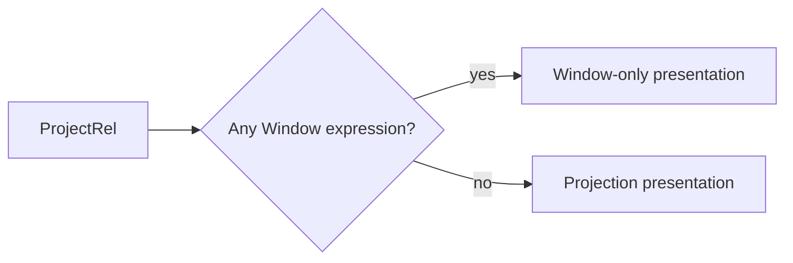
```mermaid
flowchart LR
  P[ProjectRel] --> W{Any Window expression?}
  W -->|yes| WV[Window-only presentation]
  W -->|no| PV[Projection presentation]
```

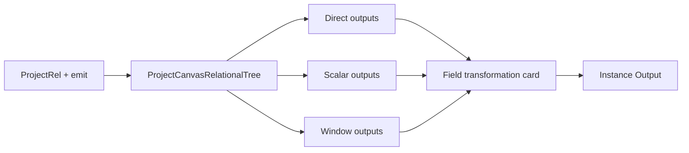
```mermaid
flowchart LR
  P[ProjectRel + emit] --> Q[ProjectCanvasRelationalTree]
  Q --> D[Direct outputs]
  Q --> S[Scalar outputs]
  Q --> W[Window outputs]
  D --> C[Field transformation card]
  S --> C
  W --> C
  C --> O[Instance Output]
```

Canonical authority is the pinned Substrait plan plus the DVT identity sidecar.
Existing Window authoring from #3230/#2764 and expression authoring from #2919
are reused. An un-emitted authored expression is invalid under the current DVT
projection authority and fails closed.

## Fowler Matrix

| Scenario                              | Opportunity             | Pattern                       | DDD owner                        | Rail                          | Proof                                 | Out of scope                |
| ------------------------------------- | ----------------------- | ----------------------------- | -------------------------------- | ----------------------------- | ------------------------------------- | --------------------------- |
| Classify direct/scalar/Window outputs | Primitive obsession     | Presentation Model            | `CanvasRelationalTreeProjection` | `ProjectCanvasRelationalTree` | canonical classification tests        | new relation/IR             |
| Render the classification             | Responsibility overload | Move decision to presenter    | Canvas relation presentation     | `ProjectCanvasRelationalTree` | component consumes projected identity | semantic React conditionals |
| Add scalar fields                     | Duplicate semantics     | Reuse canonical command       | `DvtNodeAuthoringMetadata`       | `ConfigureCanvasDvtNode`      | FieldId/reload/negative tests         | JOIN-specific expressions   |
| Expose Window fields                  | Feature envy            | Reuse contextual Window owner | canonical Window expression      | existing rails                | partition/order/identity tests        | `DvtWindow`                 |
| Preview transformed rows              | Boundary drift          | Reuse query adapter           | `CanvasTransformDataSample`      | `PreviewCanvasTransformRows`  | row/schema oracle                     | new runtime step            |

## Delivery Boundaries

### Withdrawn input publication (#3422 regression)

Reconnecting a Source with fewer admitted columns must not revive its physical
schema inside a retained Transform. Keep the authored Substrait document and
stable identities for repair; do not silently remove expressions or insert a
Project into JOIN. An unavailable dependency is not a published output.

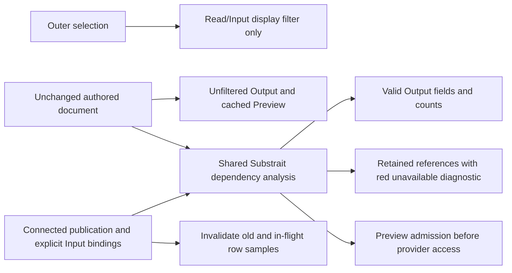
```mermaid
flowchart LR
  Before[Outer selection] --> Display[Read/Input display filter only]
  Saved[Unchanged authored document] --> Wrong[Unfiltered Output and cached Preview]
  Publication[Connected publication and explicit Input bindings] --> Analysis[Shared Substrait dependency analysis]
  Saved --> Analysis
  Analysis --> Valid[Valid Output fields and counts]
  Analysis --> Broken[Retained references with red unavailable diagnostic]
  Analysis --> Query[Preview admission before provider access]
  Publication --> Revision[Invalidate old and in-flight row samples]
```

Reuse `ProjectCanvasRelationalTree` (Canvas semantic inspection) and
`PreviewCanvasTransformRows` (protected Canvas data query), including their
current authorization and draft-save ports. Dependency facts belong to
`@dvt/substrait-analysis`, not React, a second DTO, or a second expression AST.
Value lineage comes from canonical schema derivation. Missing predicate,
grouping, ordering or other row dependencies invalidate the relation; an
independent constant does not acquire an invented field dependency.

Output excludes unavailable fields. A separate diagnostic retains their names
in red for repair, with no draggable published-field reference. Counters use
valid outputs. Preview of an authored operation with unavailable dependencies
fails closed; it does not silently execute a rewritten partial operation.
Changing admitted inputs invalidates existing and in-flight samples even when
the semantic plan hash is unchanged. Restoring the same input repairs the read
model without authoring writes or identity changes.

| Scenario                                   | Opportunity                              | Pattern                                   | Owner / rail                                           | Proof                                                                         | Excluded                                     |
| ------------------------------------------ | ---------------------------------------- | ----------------------------------------- | ------------------------------------------------------ | ----------------------------------------------------------------------------- | -------------------------------------------- |
| Source publication shrinks after reconnect | Presentation filter hides semantic drift | Shared dependency projection              | Substrait analysis / ProjectCanvasRelationalTree       | Direct, derived, constant, row-dependency and restore cases                   | Persisted validity flags; hidden projections |
| Old sample survives unchanged plan hash    | Incomplete query identity                | Input-revision invalidation and admission | CanvasTransformDataSample / PreviewCanvasTransformRows | Old and in-flight samples rejected; provider not called for invalid operation | New endpoint; database mutation              |

### Advanced field-flow editor (#3422)

The accepted interaction supersedes the read-only-only card detail below and
the isolated formula-selector cut #3451. Do not integrate the latter on its own.
Replace the parallel visual-formula draft with name plus formula, using the
existing compiler and canonical Substrait expressions. A published derived field
is also an available operand; dragging it references its stable field identity,
not a copied expression from an untrusted drag payload.

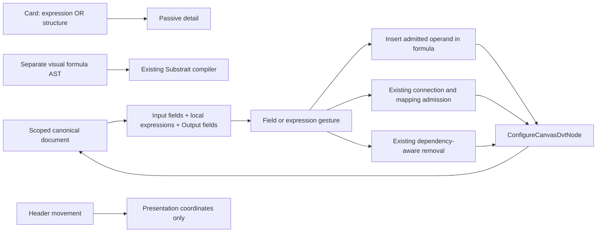
```mermaid
flowchart LR
  Before[Card: expression OR structure] --> Passive[Passive detail]
  Separate[Separate visual formula AST] --> Compiler[Existing Substrait compiler]
  Document[Scoped canonical document] --> Projection[Input fields + local expressions + Output fields]
  Projection --> Gesture[Field or expression gesture]
  Gesture --> Formula[Insert admitted operand in formula]
  Gesture --> Mapping[Existing connection and mapping admission]
  Gesture --> Removal[Existing dependency-aware removal]
  Formula --> Command[ConfigureCanvasDvtNode]
  Mapping --> Command
  Removal --> Command
  Command --> Document
  Header[Header movement] --> Layout[Presentation coordinates only]
```

Every supported card shows local Input and Output fields alongside its owned
expression tree. Input groups contain the exact child publication, never a
physical schema or a copied upstream expression subtree. Apply the outer source
publication boundary to both a Read card and any Input group referencing it.
Use names and aliases for labels and titles; keep technical identities only in
machine-readable references or explicitly secondary technical disclosure.
Display identities are namespaced by group so Input and Output can reference
the same field without duplicate visual nodes.
The complete local tree remains available in a keyboard-scrollable detail area.
Bound that area's height in the geometry projection; adding Input/Output rows
must not grow a single card beyond the viewport or detach its ports from its
rendered bounds. The component consumes that height rather than recalculating it.

Drag transport carries scoped references only. Resolve operands against the
target's current admitted field model; reject foreign, stale, malformed or
unavailable references. Dropping into a formula replaces the current text
selection and does not save, move a card or navigate. Published expressions
remain named field references; arithmetic, composition and constants are still
compiled by the one admitted expression compiler. JOIN owns predicates, not
field transformations.

A field drop into Input adds only the dragged column, not the producer's entire
schema. Repeating the drop is idempotent; further columns require explicit adds.
The main Canvas Source-properties column list uses the same field-transfer
adapter as card Output. Its transfer candidates come from the current published
column read model, not from the physical schema scanner. List reordering remains
presentation only. Dropping onto the Model body or its Input list invokes the
same input-binding command. When the producer is not connected, that command
first uses existing edge admission inside the same draft transaction and creates
an explicitly empty binding before adding the one column. A rejected column,
cycle, incompatible port, readonly or stale command commits neither edge nor
binding. Output and model operations remain untouched; no hidden projection.
This does not change relational dataset ports into scalar ports. Partial inputs
must obey the existing explicit Transform boundary before composition; never
insert a hidden Project inside JOIN or silently widen a partial selection.

A compatible Input drop uses the existing relation/mapping command and its
algebra, arity, cycle, type and dependency checks. Do not persist visual column
edges. A selected output dropped explicitly on the Canvas background invokes
removal; a successful target drop consumes the gesture first. Invalid targets,
Escape, drag cancellation or lost capture never imply removal. Explicit add and
remove actions remain keyboard accessible. The Output inspector uses named
add/remove buttons instead of selection checkboxes, retaining focus and the
existing dependency-aware output command after each action.
Header movement and field dragging must have disjoint interaction boundaries.

Staged unary forms must retain their query inputs while only presentation state
changes. The authoring presenter currently reconstructs a producer document on
every pending-edit update; the new analysis snapshot briefly clears its field
query and unmounts the form. Memoize that existing subtree projection against
its semantic inputs, not the pending UI flag. Do not add another draft store,
delay input events or accept stale semantic revisions. Prove DOM identity,
focus and typed LIMIT through pending-state renders, then Apply and reopen.

Main Canvas left-click opens the existing fixed inspector. Source inspection
starts at Output; Model double-click retains semantic-editor navigation.
Embedded controls, Preview and drag must not trigger card navigation.
This explicitly supersedes the selection-only click and floating node Properties
policy in `canvas-node-workbench-hardening-plan-20260808.md`. Reuse
`InspectCanvasNode`, the existing panel and draft controller; no new inspector
DTO, store or command. The shell owns its fixed right slot. Retire only the
node inspector's position controller and draggable header; the independent
contextual Code workbench retains its movement behavior.

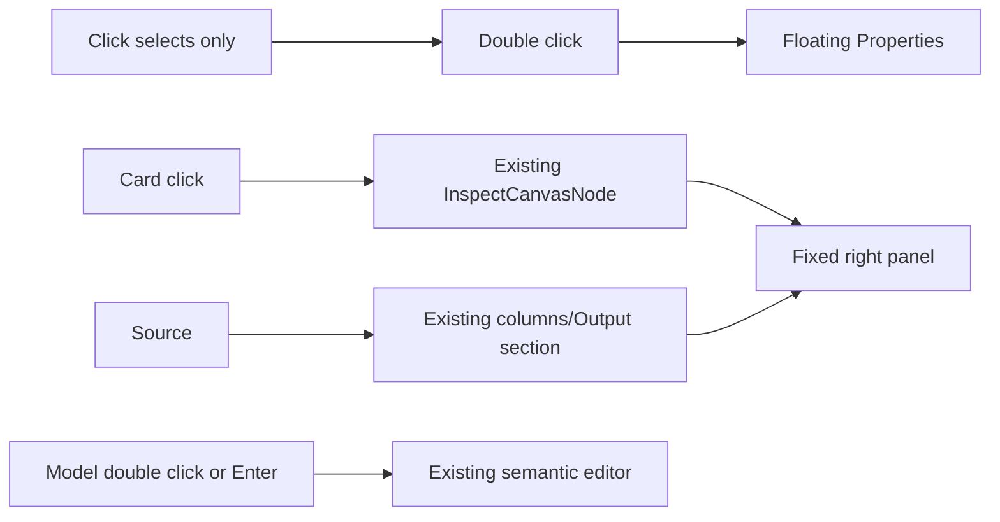
```mermaid
flowchart LR
  Before[Click selects only] --> Double[Double click] --> Floating[Floating Properties]
  Click[Card click] --> Inspect[Existing InspectCanvasNode] --> Right[Fixed right panel]
  Source[Source] --> Output[Existing columns/Output section] --> Right
  Model[Model double click or Enter] --> Editor[Existing semantic editor]
```

Opening Properties must not remount the Canvas, mutate execution selection,
request data or steal focus from the card or an embedded control. Explicit Code
and Properties section requests still win over the initial Source preference.
Escape closes Properties only from inside that panel, never from another editor.
Closing restores card focus unless a newer interaction has already moved focus.
Replace node-overlay movement tests with fixed-slot, focus, keyboard, readonly
and unchanged-viewport proof; retain contextual Code movement coverage.

The existing `CanvasNodeWorkbenchPanel` combines node reconciliation, authority
reads, section policy, tab synchronization effects and editor markup. Split at
those boundaries before adding another gesture: one controller coordinates the
existing read-model and draft owners, a sections component composes their editors,
and the panel renders the header and container. Reuse the existing section policy
and contribution resolver; do not add a DTO, semantic rule, store or command.
Resolve the active tab from the current node and explicit section request plus
the user's last choice, without effects mirroring derived tab state. Changing
unrelated props must preserve the selected tab and mounted editor.

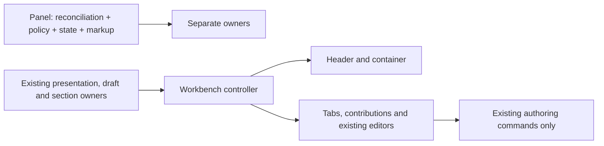
```mermaid
flowchart LR
  Before[Panel: reconciliation + policy + state + markup] --> Split[Separate owners]
  Owners[Existing presentation, draft and section owners] --> Controller[Workbench controller]
  Controller --> Panel[Header and container]
  Controller --> Sections[Tabs, contributions and existing editors]
  Sections --> Commands[Existing authoring commands only]
```

Keep each new React component below 200 lines. Guard the panel against importing
authority readers, stores or reconciliation services; retain behavior tests for
Source, native Model, dbt Model, Sink, readonly, contributions and explicit tab
requests. This refactor changes no authoring or publication rule.

| Scenario                                      | Opportunity                          | Fowler pattern / owner                                       | Rail                                     | Tests and allowed surfaces                                                                                                                                             |
| --------------------------------------------- | ------------------------------------ | ------------------------------------------------------------ | ---------------------------------------- | ---------------------------------------------------------------------------------------------------------------------------------------------------------------------- |
| Input fields disappear when expressions exist | Alternate read projections hide flow | Compose local presentation in CanvasRelationalTreeProjection | ProjectCanvasRelationalTree              | Existing detail/structure projectors; canonical projection tests and card-detail browser flow; no upstream tree copy or unpublished field                              |
| Two formula trees drift                       | Duplicate representation             | Remove parallel draft; syntax adapter to Substrait           | ConfigureCanvasDvtNode                   | Existing formula form/compiler/authoring model, compact tree and drag transport; constants, compound fields, edit identity, malformed/stale/foreign drop, cancellation |
| Drag changes flow or removes output           | UI mutation authority                | Existing revision-bound command and input mapping owners     | ConfigureCanvasDvtNode; CreateCanvasEdge | Existing output and staged-operation commands; connected consumer, cycle, arity, type, dependency and readonly tests; browser apply/save/reopen                        |
| Card click differs between canvases           | Gesture ambiguity                    | Reuse fixed inspector adapter                                | Existing Canvas inspection query         | Existing card interaction adapter and tests; left-click, embedded controls, drag and double-click separation                                                           |

Allowed surfaces are existing Canvas views/components/graph plugins and their
unit, architecture and Cypress tests. No engine, planner, API, provider execution
or application database changes. Refresh the existing feature mechanization
declarations before implementation. Do not claim completion of the editor from
the read-projection or formula-operand cut alone: cross-card mapping, removal,
dependency feedback and complete save/reopen proof remain acceptance gates.

### Assisted expression workspace (#3422)

The isolated name/textarea form is not the advanced editor. Replace its text
surface with the existing lazy Monaco editor, with scoped completions and
selection-preserving insertion. Beside the formula, expose searchable admitted
fields (names and types, click or drag), catalog-derived function signatures and
literal/operator insertion. Functions come from the existing provider capability
resolver, not an independently maintained UI catalog. Function insertion wraps
the selected expression; field insertion replaces the selection. All gestures
edit only the disposable text draft until the existing explicit submit command.

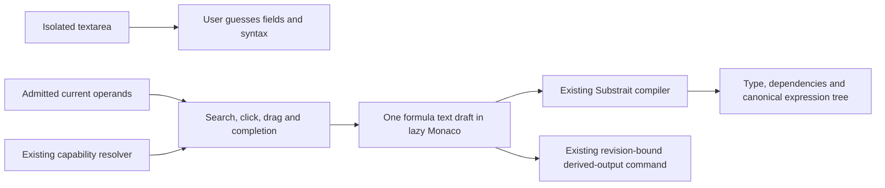
```mermaid
flowchart LR
  Before[Isolated textarea] --> Guess[User guesses fields and syntax]
  Fields[Admitted current operands] --> Palette[Search, click, drag and completion]
  Catalog[Existing capability resolver] --> Palette
  Palette --> Draft[One formula text draft in lazy Monaco]
  Draft --> Compiler[Existing Substrait compiler]
  Compiler --> Feedback[Type, dependencies and canonical expression tree]
  Draft --> Submit[Existing revision-bound derived-output command]
```

Compiler diagnostics, not a second parser or JavaScript evaluation, determine
whether saving is allowed. The existing scalar tree renderer can show the
compiled draft as read-only feedback alongside its result type and dependencies;
it is not a second editable expression tree or persisted model. This supersedes
the older Properties-only textual summary restriction while preserving one
compiler and one renderer. Local validity is not provider execution readiness.
Completions are scoped to the editor model and disposed on close. Opening a
second editor cannot leak field names across models. Monaco remains lazily
loaded with existing local workers; no new dependency, CDN or backend is needed.

`DerivedOutputFormulaEditor` is the sole editable Monaco host in Canvas. This
explicitly supersedes the earlier blanket Canvas-host prohibition for that leaf
only; it does not grant Code/workspace-file authority to the shell or formulas.
Artifacts and Templates continue through `MonacoCodeViewer`, whose API has no
mount callback or change handler. The shared surface must suppress an editable
mount callback when `readOnly` is true. Architecture tests distinguish erased
type imports from runtime hosting, reject other Canvas hosts, and behavior tests
prove a readonly caller never receives the mutable editor handle.

| Scenario                                           | Opportunity                                  | Owner / pattern                                                 | Rail                        | Proof                                                                                                    |
| -------------------------------------------------- | -------------------------------------------- | --------------------------------------------------------------- | --------------------------- | -------------------------------------------------------------------------------------------------------- |
| Build a compound expression without guessing names | Isolated text presentation                   | Existing authoring model and compiler / assisted syntax adapter | ConfigureCanvasDvtNode      | Field click/drop, nested function insertion, constants, completion, edit/save/reopen                     |
| Show useful feedback without duplicated semantics  | Boolean validation hides the compiler result | Canonical expression projection / presentation model            | ProjectCanvasRelationalTree | Type and dependency feedback, invalid/stale/foreign inputs, no provider call or publication while typing |

Allowed surfaces add only the existing shared Monaco wrapper's optional mount
callback, Canvas formula presentation/adapter files and their tests. No new
command, DTO or AST. Negative tests retain self-reference rejection, explicit
cancel, unchanged authoring during insertion, and revision-bound submission.
Cross-card mapping and drag-out removal remain separate acceptance obligations;
this workspace alone does not close the complete field-flow editor.

### NULL literals and reachable formula actions (#3422)

The formula adapter must recognize case-insensitive `NULL` as a literal, not
as a field. Quoted `"null"` remains a field and `'null'` remains text. Reuse
Substrait's typed nullable literal and the existing schema analysis; no null
sentinel may be persisted as a field or a second expression representation.
Resolve a bare NULL operand against the existing admitted function signatures.
A standalone NULL (or an all-NULL text expression) defaults to nullable text.
`CAST(NULL AS TEXT|BIGINT|DOUBLE PRECISION|BOOLEAN)` makes the type explicit and
preserves typed literal edit/reopen. This is bounded null-literal syntax, not
admission of arbitrary casts or new function signatures. Incompatible operands,
unsupported casts, unknown functions and malformed types still fail closed.

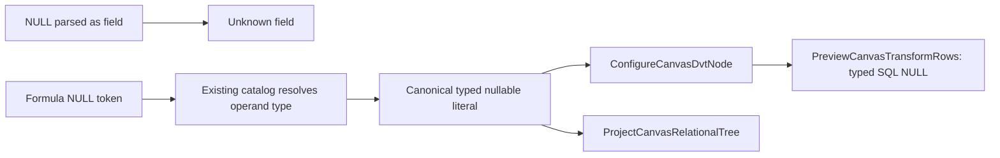
```mermaid
flowchart LR
  Before[NULL parsed as field] --> Error[Unknown field]
  Formula[Formula NULL token] --> Bind[Existing catalog resolves operand type]
  Bind --> Literal[Canonical typed nullable literal]
  Literal --> Command[ConfigureCanvasDvtNode]
  Literal --> Tree[ProjectCanvasRelationalTree]
  Command --> Preview[PreviewCanvasTransformRows: typed SQL NULL]
```

The PostgreSQL renderer must preserve the declared nullable type with a typed
NULL cast, rejecting unbound, required or unsupported types and variations.
Null is distinct from empty text throughout tree display, save/reopen and Preview.
The existing explicit formula submit/cancel actions remain visible within the
inspector while its content scrolls. The model-level Apply action does not
silently submit an unfinished formula. Missing names, conflicts and invalid
formulas expose the blocking reason alongside those actions. Prove the user's
named TRIM field and COALESCE with NULL at a short viewport, then Apply/reopen.
This extends the existing formula and PostgreSQL expression adapters, not the
inspector's semantic responsibilities or the set of command/query rails.

### Catalog SQL reachability and progressive verticals (#3456)

Complete formula reachability for admitted scalar capabilities before widening
the semantic profile. Comparisons, boolean composition and null predicates must
use the existing shared capability resolver and PostgreSQL bindings. COALESCE
accepts homogeneous text, bigint, fp64 and boolean operands, preserving typed NULL and rejecting
implicit mixed-type coercion. UTC year extraction must round-trip its canonical
enum and timezone arguments; it must not become session-timezone-dependent.
SQL comparison and boolean syntax is a disposable input adapter to the same
Substrait expressions, not an alternate AST, SQL engine or persistence format.

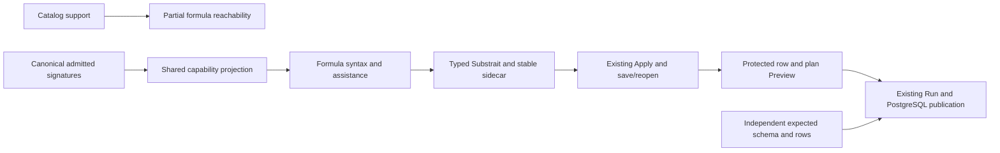
```mermaid
flowchart LR
  Current[Catalog support] --> Gap[Partial formula reachability]
  Catalog[Canonical admitted signatures] --> Resolver[Shared capability projection]
  Resolver --> Formula[Formula syntax and assistance]
  Formula --> Canonical[Typed Substrait and stable sidecar]
  Canonical --> Save[Existing Apply and save/reopen]
  Save --> Preview[Protected row and plan Preview]
  Preview --> Run[Existing Run and PostgreSQL publication]
  Oracle[Independent expected schema and rows] --> Run
```

The pre-implementation Fowler matrix and permitted surfaces are recorded in
[issue #3456](https://github.com/dunay2/dvt/issues/3456#issuecomment-5888153013).
Use the existing scalar resolver, builder, compiler/formatter, assistance and
target binding owners. No new command, DTO, function registry or JOIN-owned
calculation is introduced. Candidate functions such as CONCAT_WS and SUM require
their exact pinned Substrait signature, type/null/error behavior and independent
PostgreSQL conformance before visual exposure. Catalog presence alone is not
support, and this work does not promise all PostgreSQL builtins.

Prove progressive verticals: a named expression/constant/NULL over one Source;
multiple composed fields and selected outputs; pre- and post-JOIN Transforms;
then grouped, ordered and Window composition where admitted. Each level must
cover canonical persistence/reopen, row/schema oracles and applicable protected
Preview/Run. Imported fixture proof must be distinguished from user authoring
through the actual editor. Prepare reproducible review scenarios with expected
results. Use a newly allocated database for fixture seeding: existing user
tables are never disposable test fixtures. Do not relax validation or replace
provider execution with mock success to close a vertical.

The first protected Run exposed a physical/logical schema boundary: Substrait
correctly marks `''` and non-null predicates as required, but PostgreSQL
`CREATE TABLE AS` creates nullable columns. Preserve that logical information
for analysis and Preview. The existing physical output-schema projection must
fingerprint the actual nullable CTAS columns, rather than inventing NOT NULL
constraints. ADR-0066 candidate and target digest checks remain exact; no
automatic migration or adapter bypass is introduced. Regression evidence must
compare projected nullability with PostgreSQL catalog metadata and complete a
protected Run containing an empty-string and a NULL output.

### Card detail convergence (#3422)

Every admitted relational card exposes an explicitly collapsible read-only
tree, not only JOIN and scalar/Window ProjectRel. Filter shows its predicate;
Aggregate shows grouping and measures; Sort shows ordered keys with direction
and null placement; Fetch shows count and offset, including canonical defaults.
Read, direct Project, Cross and Set show their local input/output structure when
they have no expression tree. No upstream subtree is copied into each card.

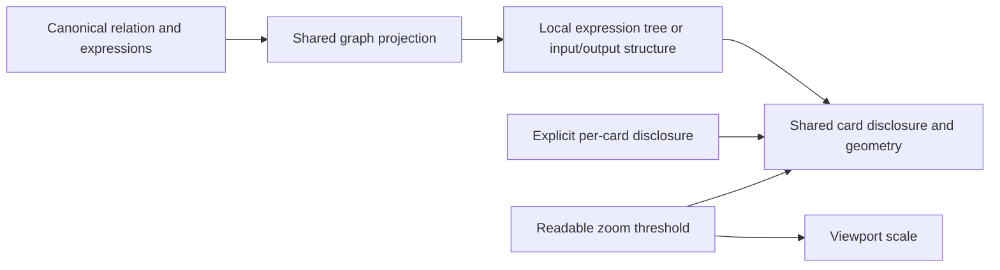
```mermaid
flowchart LR
  C[Canonical relation and expressions] --> D[Shared graph projection]
  D --> E[Local expression tree or input/output structure]
  E --> F[Shared card disclosure and geometry]
  T[Explicit per-card disclosure] --> F
  Z[Readable zoom threshold] --> F
  Z --> V[Viewport scale]
```

The query remains `ProjectCanvasRelationalTree` in Web/Canvas. Projection reads
the already-scoped semantic document, performs no writes/provider calls and
does not grant mutation permission. Expansion and zoom are presentation only.
Unsupported operations do not acquire fabricated supported detail. Sorting
priority and argument order must survive graph slicing and rendering.

| Scenario           | Opportunity                   | Fowler pattern                                       | DDD owner                      | Rail                        | Implementation surfaces                                                       | Unit/package test                                                                       | Architecture test                                        | User-flow test                                                   | Out of scope                                             |
| ------------------ | ----------------------------- | ---------------------------------------------------- | ------------------------------ | --------------------------- | ----------------------------------------------------------------------------- | --------------------------------------------------------------------------------------- | -------------------------------------------------------- | ---------------------------------------------------------------- | -------------------------------------------------------- |
| Inspect every card | Hidden presentation authority | Remove operation whitelist; reuse Presentation Model | CanvasRelationalTreeProjection | ProjectCanvasRelationalTree | semanticWorkbench projection/layout, relational card details and compact tree | canonical Sort/Fetch/Filter/Aggregate and structural details; order; unchanged document | existing read-only boundary and bounded component checks | explicitly open and close Sort/Fetch/source trees without saving | new commands, editors, IR, execution, JOIN normalization |

### Stable zoom and truthful gestures (#3422)

Zoom within one detail regime changes scale only. Crossing the readable detail
threshold reveals the same canonical lexical tree as explicit disclosure, as
requested subsequently for #3298. Preserve card identity, focus and authored
coordinates across that transition. Clicking the card continues to select its
existing inspector; disclosure does not open an editor.

The existing disposable Model layout session owns manual positions and expanded
relation identities, shared by inspection and draft views. Expanding a card can
adjust displayed spacing to its new bounds without rewriting authored compact
coordinates. Arrange clears manual positions and applies the existing
layout to current bounds. Fit only frames the drawing. Neither action persists
semantic changes or fetches data.

Background cursor is the normal arrow and primary-button background dragging
does nothing in selection mode. Cards show grab/grabbing and retain existing
pointer and Alt+Arrow movement. An explicit Hand tool enables primary-button
viewport panning and disables card dragging; the viewport then shows grab and
grabbing while panning. Middle-button panning remains available. Controls,
portalled menus, cancellation and lost capture keep their own interaction
boundaries. These are presentation interactions inside ProjectCanvasRelationalTree,
not new command/query rails or mutation permissions.

| Scenario                                 | Opportunity                  | Fowler pattern                                  | DDD owner                    | Rail                        | Implementation surfaces                                                                               | Unit/package test                                                                            | Architecture test                                           | User-flow test                                                 | Out of scope                                     |
| ---------------------------------------- | ---------------------------- | ----------------------------------------------- | ---------------------------- | --------------------------- | ----------------------------------------------------------------------------------------------------- | -------------------------------------------------------------------------------------------- | ----------------------------------------------------------- | -------------------------------------------------------------- | ------------------------------------------------ |
| Zoom, disclose and arrange independently | Responsibility overload      | Separate presentation state from viewport scale | Canvas relation presentation | ProjectCanvasRelationalTree | existing relational View/DraftViewport/Layout/GraphNode/controls, detail projector and layout session | compare geometry and edge paths across scales; per-card disclosure and shared state          | existing projection boundary plus behavioral zoom invariant | open tree, zoom both directions, move card, arrange; no writes | new layout algorithm, persisted visual state     |
| Match cursors to actual gestures         | Hidden interaction authority | One gesture owner per interaction               | Canvas relation presentation | ProjectCanvasRelationalTree | existing viewport pan and card movement hooks, card button and viewport controls                      | background no-op; card drag; pan mode; middle button; cancel/lost capture/control boundaries | no semantic write dependency                                | computed cursors, primary/middle drag, no selection after pan  | new pointer framework, global keyboard shortcuts |

Extract the oversized existing Workbench projector by projection versus layout
responsibility only where needed for this change. Delete the moved bodies;
retain one expression projector and one compact renderer, with bounded files.

- Read path: `ProjectCanvasRelationalTree`.
- Write path: `ConfigureCanvasDvtNode`, then `SaveWorkspaceGraphDraft`.
- Data path: `PreviewCanvasTransformRows`; Preview/Run ignore visual-stage state.
- No provider call during projection or inspection.
- No per-function cards, column edges, second editor or capability catalogue.
- UI components remain below 200 lines; large pre-existing copy catalogues are
  not broadened beyond the localized keys required by this slice.

### Stable expansion coordinates during movement (#3298)

The reproduced drag flicker is a coordinate feedback loop, not a reload: moving
the pointer one pixel alternates a card between positions approximately 176 pixels
apart, without removing its DOM node. Expansion spacing is recalculated from the
same manual coordinate that the gesture just obtained by subtracting that spacing.

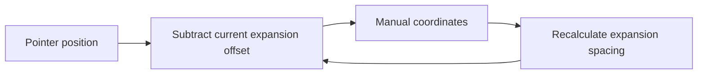
```mermaid
flowchart LR
  P[Pointer position] --> I[Subtract current expansion offset]
  I --> M[Manual coordinates]
  M --> E[Recalculate expansion spacing]
  E --> I
```

Keep one disposable expansion frame in the existing relational layout session.
Its offsets depend on card identities, topology and visible bounds, not pointer
coordinates. Movement changes authored coordinates through that stable frame;
disclosure, a zoom detail transition, topology changes or Arrange invalidate it.
The frame survives inspection/editor view changes, is not persisted and grants
no semantic authority. Edges continue to derive from displayed card bounds.
The frame must also have an inverse down to the drawable origin: a fixed positive
translation alone would prevent dragging an expanded card to x=0 or y=0 because
authored coordinates cannot be negative. Preserve the initial reservation, scale
it linearly toward zero below its anchor, and invert that same mapping in the
gesture owner. This keeps all coordinates nonnegative without rebasing on each
move, changing contracts or breaking cancellation.

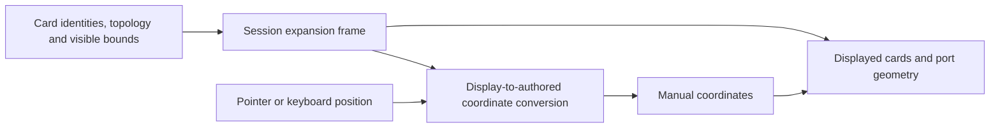
```mermaid
flowchart LR
  B[Card identities, topology and visible bounds] --> F[Session expansion frame]
  F --> I[Display-to-authored coordinate conversion]
  P[Pointer or keyboard position] --> I
  I --> M[Manual coordinates]
  M --> V[Displayed cards and port geometry]
  F --> V
```

Freezing only the gesture's original offset is insufficient: the next layout
would still move the displayed card at the spacing boundary. Removing detail or
debouncing renders would hide the symptom. Stable presentation offsets remove
the feedback loop for pointer, keyboard, cancellation and release together.

| Scenario                          | Opportunity                   | Fowler pattern                               | DDD owner                      | Command/query rail                       | Implementation surfaces                                                                             | Unit or package test                                                                  | Architecture test                          | User-flow test                                                               | Out of scope                                                                   |
| --------------------------------- | ----------------------------- | -------------------------------------------- | ------------------------------ | ---------------------------------------- | --------------------------------------------------------------------------------------------------- | ------------------------------------------------------------------------------------- | ------------------------------------------ | ---------------------------------------------------------------------------- | ------------------------------------------------------------------------------ |
| Move across expanded-card spacing | Hidden presentation authority | One coordinate frame per presentation regime | CanvasRelationalTreeProjection | ProjectCanvasRelationalTree; no new rail | Existing relational layout session, geometry, expansion, movable-card projection and movement tests | Repeated one-pixel crossings, release, cancellation, keyboard, zoom and view identity | Existing bounded read-only Workbench guard | Real drag across expanded bounds; no remount, data request or semantic write | Database data, operations, formula authoring, new persistence or editor routes |

## Mechanization Authority

Planning DB owns the current `GH-3418-SEMANTIC-FIELD-TRANSFORMATION-PROJECTION` declaration,
including its existing command/query references, implementation symbols,
negative tests and allowed surfaces. Update it through
`RecordFeatureMechanizationRail`; do not duplicate it as an imported Markdown
manifest. The diagrams, design decisions and acceptance criteria above remain
the source rationale.

Before integration, validate this feature against the existing Planning DB with
`pnpm docs:feature-mechanization:implementation -- --feature GH-3418-SEMANTIC-FIELD-TRANSFORMATION-PROJECTION`
and explicit `GIT_BASE` / `GIT_HEAD` commit identities. Record the evidence in
the governing issue and PR under the approved single-team validation boundary.

## Completion

The slice is complete only when classification, authoring, identity, downstream
reuse, save/reload, lineage, Preview/Run and one browser flow consume the same
canonical semantics without a visual-stage authority.
