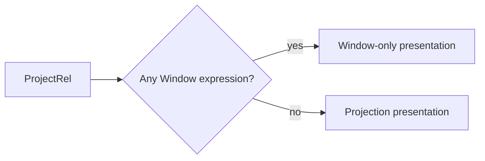
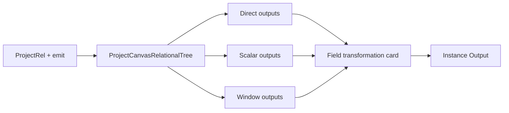
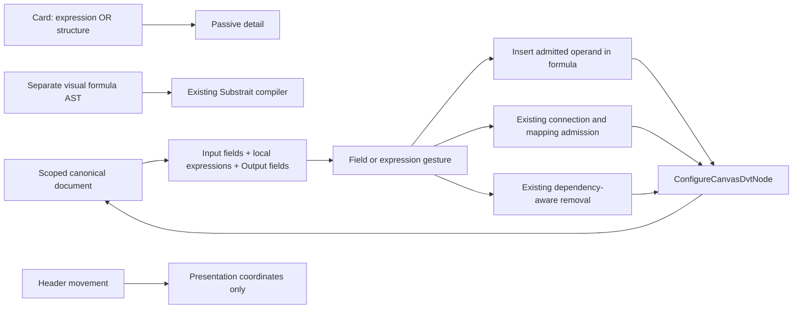
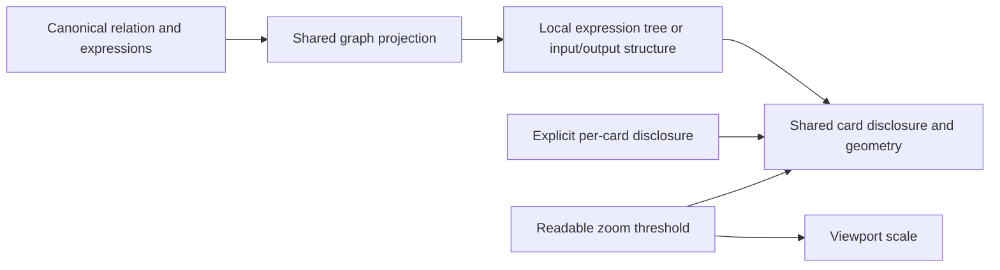
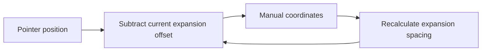
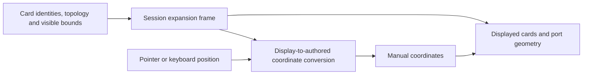

# Semantic Field Transformation Stage Plan

## Intent

Issue #3416 makes field-producing `ProjectRel` semantics visible inside the
Semantic Editor. One disposable card summarizes emitted direct, scalar-derived
and Window-derived fields. It does not add a relation, expression AST, runtime
step, persisted visual stage or final-output editor.

The Transform instance owns final inclusion, alias and ordering. Its `Output`
tab and card trees are adapters to that same owner, not separate selections.

## Current And Target

```mermaid
flowchart LR
  P[ProjectRel] --> W{Any Window expression?}
  W -->|yes| WV[Window-only presentation]
  W -->|no| PV[Projection presentation]
```

```mermaid
flowchart LR
  P[ProjectRel + emit] --> Q[ProjectCanvasRelationalTree]
  Q --> D[Direct outputs]
  Q --> S[Scalar outputs]
  Q --> W[Window outputs]
  D --> C[Field transformation card]
  S --> C
  W --> C
  C --> O[Instance Output]
```

Canonical authority is the pinned Substrait plan plus the DVT identity sidecar.
Existing Window authoring from #3230/#2764 and expression authoring from #2919
are reused. An un-emitted authored expression is invalid under the current DVT
projection authority and fails closed.

## Fowler Matrix

| Scenario                              | Opportunity             | Pattern                       | DDD owner                        | Rail                          | Proof                                 | Out of scope                |
| ------------------------------------- | ----------------------- | ----------------------------- | -------------------------------- | ----------------------------- | ------------------------------------- | --------------------------- |
| Classify direct/scalar/Window outputs | Primitive obsession     | Presentation Model            | `CanvasRelationalTreeProjection` | `ProjectCanvasRelationalTree` | canonical classification tests        | new relation/IR             |
| Render the classification             | Responsibility overload | Move decision to presenter    | Canvas relation presentation     | `ProjectCanvasRelationalTree` | component consumes projected identity | semantic React conditionals |
| Add scalar fields                     | Duplicate semantics     | Reuse canonical command       | `DvtNodeAuthoringMetadata`       | `ConfigureCanvasDvtNode`      | FieldId/reload/negative tests         | JOIN-specific expressions   |
| Expose Window fields                  | Feature envy            | Reuse contextual Window owner | canonical Window expression      | existing rails                | partition/order/identity tests        | `DvtWindow`                 |
| Preview transformed rows              | Boundary drift          | Reuse query adapter           | `CanvasTransformDataSample`      | `PreviewCanvasTransformRows`  | row/schema oracle                     | new runtime step            |

## Delivery Boundaries

### Advanced field-flow editor (#3422)

The accepted interaction supersedes the read-only-only card detail below and
the isolated formula-selector cut #3451. Do not integrate the latter on its own.
Replace the parallel visual-formula draft with name plus formula, using the
existing compiler and canonical Substrait expressions. A published derived field
is also an available operand; dragging it references its stable field identity,
not a copied expression from an untrusted drag payload.

```mermaid
flowchart LR
  Before[Card: expression OR structure] --> Passive[Passive detail]
  Separate[Separate visual formula AST] --> Compiler[Existing Substrait compiler]
  Document[Scoped canonical document] --> Projection[Input fields + local expressions + Output fields]
  Projection --> Gesture[Field or expression gesture]
  Gesture --> Formula[Insert admitted operand in formula]
  Gesture --> Mapping[Existing connection and mapping admission]
  Gesture --> Removal[Existing dependency-aware removal]
  Formula --> Command[ConfigureCanvasDvtNode]
  Mapping --> Command
  Removal --> Command
  Command --> Document
  Header[Header movement] --> Layout[Presentation coordinates only]
```

Every supported card shows local Input and Output fields alongside its owned
expression tree. Input groups contain the exact child publication, never a
physical schema or a copied upstream expression subtree. Apply the outer source
publication boundary to both a Read card and any Input group referencing it.
Use names and aliases for labels and titles; keep technical identities only in
machine-readable references or explicitly secondary technical disclosure.
Display identities are namespaced by group so Input and Output can reference
the same field without duplicate visual nodes.
The complete local tree remains available in a keyboard-scrollable detail area.
Bound that area's height in the geometry projection; adding Input/Output rows
must not grow a single card beyond the viewport or detach its ports from its
rendered bounds. The component consumes that height rather than recalculating it.

Drag transport carries scoped references only. Resolve operands against the
target's current admitted field model; reject foreign, stale, malformed or
unavailable references. Dropping into a formula replaces the current text
selection and does not save, move a card or navigate. Published expressions
remain named field references; arithmetic, composition and constants are still
compiled by the one admitted expression compiler. JOIN owns predicates, not
field transformations.

A field drop into Input adds only the dragged column, not the producer's entire
schema. Repeating the drop is idempotent; further columns require explicit adds.
This does not change relational dataset ports into scalar ports. Partial inputs
must obey the existing explicit Transform boundary before composition; never
insert a hidden Project inside JOIN or silently widen a partial selection.

A compatible Input drop uses the existing relation/mapping command and its
algebra, arity, cycle, type and dependency checks. Do not persist visual column
edges. A selected output dropped explicitly on the Canvas background invokes
removal; a successful target drop consumes the gesture first. Invalid targets,
Escape, drag cancellation or lost capture never imply removal. Explicit add and
remove actions remain keyboard accessible. The Output inspector uses named
add/remove buttons instead of selection checkboxes, retaining focus and the
existing dependency-aware output command after each action.
Header movement and field dragging must have disjoint interaction boundaries.

Main Canvas left-click opens the existing fixed inspector. Source inspection
starts at Output; Model double-click retains semantic-editor navigation.
Embedded controls, Preview and drag must not trigger card navigation.

| Scenario                                      | Opportunity                          | Fowler pattern / owner                                       | Rail                                     | Tests and allowed surfaces                                                                                                                                             |
| --------------------------------------------- | ------------------------------------ | ------------------------------------------------------------ | ---------------------------------------- | ---------------------------------------------------------------------------------------------------------------------------------------------------------------------- |
| Input fields disappear when expressions exist | Alternate read projections hide flow | Compose local presentation in CanvasRelationalTreeProjection | ProjectCanvasRelationalTree              | Existing detail/structure projectors; canonical projection tests and card-detail browser flow; no upstream tree copy or unpublished field                              |
| Two formula trees drift                       | Duplicate representation             | Remove parallel draft; syntax adapter to Substrait           | ConfigureCanvasDvtNode                   | Existing formula form/compiler/authoring model, compact tree and drag transport; constants, compound fields, edit identity, malformed/stale/foreign drop, cancellation |
| Drag changes flow or removes output           | UI mutation authority                | Existing revision-bound command and input mapping owners     | ConfigureCanvasDvtNode; CreateCanvasEdge | Existing output and staged-operation commands; connected consumer, cycle, arity, type, dependency and readonly tests; browser apply/save/reopen                        |
| Card click differs between canvases           | Gesture ambiguity                    | Reuse fixed inspector adapter                                | Existing Canvas inspection query         | Existing card interaction adapter and tests; left-click, embedded controls, drag and double-click separation                                                           |

Allowed surfaces are existing Canvas views/components/graph plugins and their
unit, architecture and Cypress tests. No engine, planner, API, provider execution
or application database changes. Refresh the existing feature mechanization
declarations before implementation. Do not claim completion of the editor from
the read-projection or formula-operand cut alone: cross-card mapping, removal,
dependency feedback and complete save/reopen proof remain acceptance gates.

### Card detail convergence (#3422)

Every admitted relational card exposes an explicitly collapsible read-only
tree, not only JOIN and scalar/Window ProjectRel. Filter shows its predicate;
Aggregate shows grouping and measures; Sort shows ordered keys with direction
and null placement; Fetch shows count and offset, including canonical defaults.
Read, direct Project, Cross and Set show their local input/output structure when
they have no expression tree. No upstream subtree is copied into each card.

```mermaid
flowchart LR
  C[Canonical relation and expressions] --> D[Shared graph projection]
  D --> E[Local expression tree or input/output structure]
  E --> F[Shared card disclosure and geometry]
  T[Explicit per-card disclosure] --> F
  Z[Readable zoom threshold] --> F
  Z --> V[Viewport scale]
```

The query remains `ProjectCanvasRelationalTree` in Web/Canvas. Projection reads
the already-scoped semantic document, performs no writes/provider calls and
does not grant mutation permission. Expansion and zoom are presentation only.
Unsupported operations do not acquire fabricated supported detail. Sorting
priority and argument order must survive graph slicing and rendering.

| Scenario           | Opportunity                   | Fowler pattern                                       | DDD owner                      | Rail                        | Implementation surfaces                                                       | Unit/package test                                                                       | Architecture test                                        | User-flow test                                                   | Out of scope                                             |
| ------------------ | ----------------------------- | ---------------------------------------------------- | ------------------------------ | --------------------------- | ----------------------------------------------------------------------------- | --------------------------------------------------------------------------------------- | -------------------------------------------------------- | ---------------------------------------------------------------- | -------------------------------------------------------- |
| Inspect every card | Hidden presentation authority | Remove operation whitelist; reuse Presentation Model | CanvasRelationalTreeProjection | ProjectCanvasRelationalTree | semanticWorkbench projection/layout, relational card details and compact tree | canonical Sort/Fetch/Filter/Aggregate and structural details; order; unchanged document | existing read-only boundary and bounded component checks | explicitly open and close Sort/Fetch/source trees without saving | new commands, editors, IR, execution, JOIN normalization |

### Stable zoom and truthful gestures (#3422)

Zoom within one detail regime changes scale only. Crossing the readable detail
threshold reveals the same canonical lexical tree as explicit disclosure, as
requested subsequently for #3298. Preserve card identity, focus and authored
coordinates across that transition. Clicking the card continues to select its
existing inspector; disclosure does not open an editor.

The existing disposable Model layout session owns manual positions and expanded
relation identities, shared by inspection and draft views. Expanding a card can
adjust displayed spacing to its new bounds without rewriting authored compact
coordinates. Arrange clears manual positions and applies the existing
layout to current bounds. Fit only frames the drawing. Neither action persists
semantic changes or fetches data.

Background cursor is the normal arrow and primary-button background dragging
does nothing in selection mode. Cards show grab/grabbing and retain existing
pointer and Alt+Arrow movement. An explicit Hand tool enables primary-button
viewport panning and disables card dragging; the viewport then shows grab and
grabbing while panning. Middle-button panning remains available. Controls,
portalled menus, cancellation and lost capture keep their own interaction
boundaries. These are presentation interactions inside ProjectCanvasRelationalTree,
not new command/query rails or mutation permissions.

| Scenario                                 | Opportunity                  | Fowler pattern                                  | DDD owner                    | Rail                        | Implementation surfaces                                                                               | Unit/package test                                                                            | Architecture test                                           | User-flow test                                                 | Out of scope                                     |
| ---------------------------------------- | ---------------------------- | ----------------------------------------------- | ---------------------------- | --------------------------- | ----------------------------------------------------------------------------------------------------- | -------------------------------------------------------------------------------------------- | ----------------------------------------------------------- | -------------------------------------------------------------- | ------------------------------------------------ |
| Zoom, disclose and arrange independently | Responsibility overload      | Separate presentation state from viewport scale | Canvas relation presentation | ProjectCanvasRelationalTree | existing relational View/DraftViewport/Layout/GraphNode/controls, detail projector and layout session | compare geometry and edge paths across scales; per-card disclosure and shared state          | existing projection boundary plus behavioral zoom invariant | open tree, zoom both directions, move card, arrange; no writes | new layout algorithm, persisted visual state     |
| Match cursors to actual gestures         | Hidden interaction authority | One gesture owner per interaction               | Canvas relation presentation | ProjectCanvasRelationalTree | existing viewport pan and card movement hooks, card button and viewport controls                      | background no-op; card drag; pan mode; middle button; cancel/lost capture/control boundaries | no semantic write dependency                                | computed cursors, primary/middle drag, no selection after pan  | new pointer framework, global keyboard shortcuts |

Extract the oversized existing Workbench projector by projection versus layout
responsibility only where needed for this change. Delete the moved bodies;
retain one expression projector and one compact renderer, with bounded files.

- Read path: `ProjectCanvasRelationalTree`.
- Write path: `ConfigureCanvasDvtNode`, then `SaveWorkspaceGraphDraft`.
- Data path: `PreviewCanvasTransformRows`; Preview/Run ignore visual-stage state.
- No provider call during projection or inspection.
- No per-function cards, column edges, second editor or capability catalogue.
- UI components remain below 200 lines; large pre-existing copy catalogues are
  not broadened beyond the localized keys required by this slice.

### Stable expansion coordinates during movement (#3298)

The reproduced drag flicker is a coordinate feedback loop, not a reload: moving
the pointer one pixel alternates a card between positions approximately 176 pixels
apart, without removing its DOM node. Expansion spacing is recalculated from the
same manual coordinate that the gesture just obtained by subtracting that spacing.

```mermaid
flowchart LR
  P[Pointer position] --> I[Subtract current expansion offset]
  I --> M[Manual coordinates]
  M --> E[Recalculate expansion spacing]
  E --> I
```

Keep one disposable expansion frame in the existing relational layout session.
Its offsets depend on card identities, topology and visible bounds, not pointer
coordinates. Movement changes authored coordinates through that stable frame;
disclosure, a zoom detail transition, topology changes or Arrange invalidate it.
The frame survives inspection/editor view changes, is not persisted and grants
no semantic authority. Edges continue to derive from displayed card bounds.
The frame must also have an inverse down to the drawable origin: a fixed positive
translation alone would prevent dragging an expanded card to x=0 or y=0 because
authored coordinates cannot be negative. Preserve the initial reservation, scale
it linearly toward zero below its anchor, and invert that same mapping in the
gesture owner. This keeps all coordinates nonnegative without rebasing on each
move, changing contracts or breaking cancellation.

```mermaid
flowchart LR
  B[Card identities, topology and visible bounds] --> F[Session expansion frame]
  F --> I[Display-to-authored coordinate conversion]
  P[Pointer or keyboard position] --> I
  I --> M[Manual coordinates]
  M --> V[Displayed cards and port geometry]
  F --> V
```

Freezing only the gesture's original offset is insufficient: the next layout
would still move the displayed card at the spacing boundary. Removing detail or
debouncing renders would hide the symptom. Stable presentation offsets remove
the feedback loop for pointer, keyboard, cancellation and release together.

| Scenario                          | Opportunity                   | Fowler pattern                               | DDD owner                      | Command/query rail                       | Implementation surfaces                                                                             | Unit or package test                                                                  | Architecture test                          | User-flow test                                                               | Out of scope                                                                   |
| --------------------------------- | ----------------------------- | -------------------------------------------- | ------------------------------ | ---------------------------------------- | --------------------------------------------------------------------------------------------------- | ------------------------------------------------------------------------------------- | ------------------------------------------ | ---------------------------------------------------------------------------- | ------------------------------------------------------------------------------ |
| Move across expanded-card spacing | Hidden presentation authority | One coordinate frame per presentation regime | CanvasRelationalTreeProjection | ProjectCanvasRelationalTree; no new rail | Existing relational layout session, geometry, expansion, movable-card projection and movement tests | Repeated one-pixel crossings, release, cancellation, keyboard, zoom and view identity | Existing bounded read-only Workbench guard | Real drag across expanded bounds; no remount, data request or semantic write | Database data, operations, formula authoring, new persistence or editor routes |

## Mechanization Authority

Planning DB owns the current `GH-3418-SEMANTIC-FIELD-TRANSFORMATION-PROJECTION` declaration,
including its existing command/query references, implementation symbols,
negative tests and allowed surfaces. Update it through
`RecordFeatureMechanizationRail`; do not duplicate it as an imported Markdown
manifest. The diagrams, design decisions and acceptance criteria above remain
the source rationale.

Before integration, validate this feature against the existing Planning DB with
`pnpm docs:feature-mechanization:implementation -- --feature GH-3418-SEMANTIC-FIELD-TRANSFORMATION-PROJECTION`
and explicit `GIT_BASE` / `GIT_HEAD` commit identities. Record the evidence in
the governing issue and PR under the approved single-team validation boundary.

## Completion

The slice is complete only when classification, authoring, identity, downstream
reuse, save/reload, lineage, Preview/Run and one browser flow consume the same
canonical semantics without a visual-stage authority.
