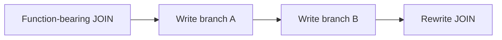
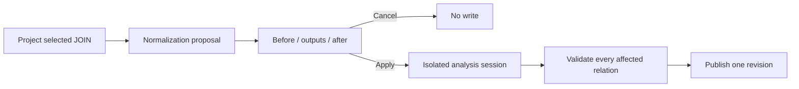

# Semantic Join Normalization Plan

## Outcome

Issue #3420 offers an explicit refactoring when a selected JOIN predicate embeds
scalar functions. The user sees which derived outputs will be created or reused
and the resulting predicate before accepting one guarded change.

Canonical authority remains the Substrait document and its stable DVT
RelationId/FieldId sidecar. This slice adds neither an expression IR nor a
function-specific Canvas operation.

## Current State

The JOIN condition editor can preserve recursive unary functions inside either
operand. Selected-relation authoring can add a derived output on any relation.
Calling those commands independently would publish partial work if a later
operation failed.

## Target State

The proposal is a disposable read model. Each function-bearing operand records:

- the condition key and left/right position;
- the exact input relation and base FieldId;
- the ordered admitted capability chain;
- a proposed output alias;
- `create` or `reuse`, where reuse requires exact expression structure and
  stable input identity rather than matching display text.

## Command And Query Rails

- Query: `ProjectCanvasRelationalTree`, owned by
  `CanvasRelationalTreeProjection`.
- Command: `ConfigureCanvasDvtNode`, owned by `DvtNodeAuthoringMetadata`.
- Persistence remains `SaveWorkspaceGraphDraft`; preview and renderer behavior
  remain downstream consumers of canonical Substrait.

No new rail is required because normalization is an explicit composition edit
inside the existing selected-relation query and DVT configuration command.

## Fowler Decisions

| Smell                        | Refactoring                            | Result                                                   |
| ---------------------------- | -------------------------------------- | -------------------------------------------------------- |
| Three observable writes      | Unit of Work                           | Stage all relation changes and publish once              |
| JSX interpreting expressions | Introduce Presentation Model           | UI renders a complete proposal                           |
| Name-based reuse             | Replace Primitive with Stable Identity | Reuse requires FieldId plus expression equivalence       |
| Provider logic in UI         | Move Function                          | Existing admitted Substrait catalogue decides support    |
| Shape-specific branches      | Polymorphic recursive traversal        | Both operands and nested condition groups share one walk |

## Delivery Cuts

1. TDD a pure proposal projector for left, right, nested and two-sided function
   operands. Plain predicates return no proposal.
2. Add a general isolated transaction to the existing relation-analysis session
   and prove failure publishes no intermediate revision.
3. Apply `create` proposals by reusing selected-relation derived-output and JOIN
   predicate commands inside that transaction.
4. Detect reusable outputs by exact canonical operand structure and stable base
   FieldId. Alias collisions remain explicit user decisions.
5. Add one read-first proposal panel to JOIN Properties. Apply emits one
   `onChange`; Cancel emits none.
6. Prove save/reload and the first PostgreSQL preview path from canonical
   semantics, without putting SQL in the proposal.

## Rejection Rules

- stale selected-relation revision;
- unsupported or uninspectable scalar function;
- function whose terminal operand is not a field;
- field outside the exact JOIN input occurrence;
- alias absent, invalid or colliding;
- claimed reuse without exact stable identity and semantic equivalence;
- any derivation or rewritten predicate that fails affected-path validation.

Null behavior, collation, casts and options are never guessed. An operand that
cannot be proven equivalent remains embedded in the JOIN and produces no apply
command.

## Test Strategy

Domain tests assert semantic structure and stable identities, not rendered copy
or serialized protobuf literals. Component tests cover only proposal visibility,
explicit apply and zero-write cancel. Existing command tests continue to own
derived-output placement and JOIN predicate persistence.

## Scope Guard

Allowed implementation surfaces are the Canvas relation query/command session,
focused Semantic Editor components and this plan. Engine, planner, adapters,
API, SQL parsing and runtime step kinds are outside this slice.
