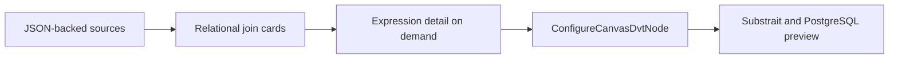

# Semantic Workbench main convergence plan

## Intent

Issues #3067, #3068, #3069, #3070, #3074, #3087, and #3109 converge the experimental Workbench into
one reviewable product slice. JSON fixtures feed production Canvas cards; source projections stay
stable; multi-source joins use the existing typed Substrait authority; and the shared Transform Focus
panel is opened from the DVT Canvas bottom drawer.



No new command or query rail is added. Read models use `ProjectGraphNodeCardReadModel`; mutations use
`ConfigureCanvasDvtNode`. The full semantic AST remains in the model and is expanded only for the
selected join.

```feature-mechanization
version: 1
featureId: SEMANTIC-WORKBENCH-MAIN-CONVERGENCE-20260911
mechanizationStatus: implemented
noHumanDecisionsRemaining: true
implementationPlan: docs/planning/proposals/mandatory/frontend-and-ux/semantic-workbench-main-convergence-plan-20260911.md
componentGuides:
  - docs/architecture/components/web/graph/canvas-workbench-command-query-catalog.md
  - docs/architecture/system/subsystems/semantic-transformation/index.md
userStories:
  - https://github.com/dunay2/dvt/issues/3068
  - https://github.com/dunay2/dvt/issues/3069
  - https://github.com/dunay2/dvt/issues/3070
  - https://github.com/dunay2/dvt/issues/3074
  - https://github.com/dunay2/dvt/issues/3087
  - https://github.com/dunay2/dvt/issues/3109
governingSources:
  - AGENTS.md
  - docs/planning/status/governance-document-rule-inventory.md
  - docs/guides/ai-work-protocol.md
  - docs/architecture/command-query-rail-governance.md
  - docs/architecture/fowler-opportunity-planning-governance.md
  - docs/adr/ADR-0064-substrait-semantic-reference-and-bounded-logical-profile.md
allowedImplementationSurfaces:
  - apps/web/package.json
  - apps/web/src/app/components/canvas/**
  - apps/web/src/app/components/metrics/**
  - apps/web/src/app/labs/**
  - apps/web/src/app/plugins/graph/**
  - apps/web/src/app/routes.ts
  - apps/web/src/app/views/canvas/**
  - packages/@dvt/contracts/src/contracts/planner/DvtSubstraitStandardCandidates.v1.ts
  - packages/@dvt/contracts/src/contracts/planner/DvtSubstraitSupportedCapabilities.v1.ts
  - packages/@dvt/contracts/test/dvt-substrait-capability-catalog.contract.test.ts
  - package.json
  - docs/evidence/**
  - docs/risk-register/quality/**
  - docs/planning/proposals/mandatory/frontend-and-ux/semantic-workbench-main-convergence-plan-20260911.md
  - docs/.manifest.json
  - docs/**/index.md
  - docs/planning/status/**
forbiddenImplementationSurfaces:
  - apps/api/**
  - packages/@dvt/engine/**
  - packages/@dvt/adapter-*/**
commandQueryRails:
  - name: ProjectGraphNodeCardReadModel
    type: query
    dddOwner: CanvasGraphPresentation
    referenceOnly: true
    authorityRef: docs/planning/proposals/mandatory/frontend-and-ux/canvas-node-workbench-hardening-plan-20260808.md
  - name: ConfigureCanvasDvtNode
    type: command
    dddOwner: DvtSubstraitAuthoringSidecarV1
    referenceOnly: true
    authorityRef: docs/planning/proposals/mandatory/frontend-and-ux/vtx2-opaque-authoring-identity-plan-20260906.md
domainObjects:
  - name: DvtSubstraitJoinCondition
    type: value object
    owner: Web Canvas semantic authoring
  - name: SemanticWorkbenchGraph
    type: read model
    owner: Web Semantic Workbench
fowlerSignals:
  - Duplicate semantics
  - Hidden authority
  - Boundary drift
  - Presentation Model
architectureGuards:
  - pnpm docs:feature-mechanization:implementation -- --feature GH-3067-SEMANTIC-WORKBENCH-JSON-FIXTURES --feature SEMANTIC-WORKBENCH-MAIN-CONVERGENCE-20260911
cypressFlows:
  - Manual browser verification of /lab/semantic-workbench
  - apps/web/src/app/views/canvas/CanvasShell.operationalDrawer.test.tsx
completionGate:
  - pnpm test:web:semantic-lab
  - pnpm --filter @dvt/contracts test -- dvt-substrait-capability-catalog.contract.test.ts
  - pnpm --filter @dvt/web lint
  - pnpm --filter @dvt/web typecheck
  - pnpm docs:feature-mechanization:implementation -- --feature GH-3067-SEMANTIC-WORKBENCH-JSON-FIXTURES --feature SEMANTIC-WORKBENCH-MAIN-CONVERGENCE-20260911
  - pnpm verify:prepush
redGreenCycles:
  - id: deterministic-relational-flow
    redTest: pnpm test:web:semantic-lab
    expectedFailure: The lab cannot project and edit a deterministic multi-source join.
    patchSurfaces:
      - apps/web/src/app/labs/**
      - apps/web/src/app/views/canvas/canvasDvtSubstraitJoin*.ts
    greenTest: pnpm test:web:semantic-lab
symbols:
  - &semanticSymbol
    name: SemanticWorkbenchLab
    path: apps/web/src/app/labs/SemanticWorkbenchLab.tsx
    dddOwner: Web Semantic Workbench
    cqRails: [ProjectGraphNodeCardReadModel, ConfigureCanvasDvtNode]
    fowlerSignals: [Presentation Model, Hidden authority]
    architectureGuard: pnpm docs:feature-mechanization:implementation -- --feature GH-3067-SEMANTIC-WORKBENCH-JSON-FIXTURES --feature SEMANTIC-WORKBENCH-MAIN-CONVERGENCE-20260911
    cypressCoverage: Manual browser verification of /lab/semantic-workbench
    unitTests:
      - pnpm test:web:semantic-lab
  - <<: *semanticSymbol
    name: projectSemanticWorkbenchGraph
    path: apps/web/src/app/views/canvas/semanticWorkbenchProjection.ts
  - <<: *semanticSymbol
    name: SemanticWorkbenchJoinConditionEditor
    path: apps/web/src/app/views/canvas/SemanticWorkbenchJoinConditionEditor.tsx
  - <<: *semanticSymbol
    name: SemanticWorkbenchJoinOperandEditor
    path: apps/web/src/app/views/canvas/SemanticWorkbenchJoinOperandEditor.tsx
  - <<: *semanticSymbol
    name: editDvtSubstraitJoinPredicateConditions
    path: apps/web/src/app/views/canvas/canvasDvtSubstraitJoinComposition.ts
  - <<: *semanticSymbol
    name: DvtSubstraitJoinCondition
    path: apps/web/src/app/views/canvas/canvasDvtSubstraitJoinCondition.ts
  - <<: *semanticSymbol
    name: DvtSubstraitJoinOperand
    path: apps/web/src/app/views/canvas/canvasDvtSubstraitJoinOperand.ts
  - <<: *semanticSymbol
    name: BASE_TRANSFORM
    path: apps/web/src/app/labs/semanticWorkbenchFixture.ts
  - <<: *semanticSymbol
    name: SUBSTRAIT_TYPE_BY_DATASET_TYPE
    path: apps/web/src/app/labs/semanticWorkbenchFixture.ts
  - <<: *semanticSymbol
    name: accent
    path: apps/web/src/app/views/canvas/SemanticWorkbenchJoinConditionEditor.tsx
  - <<: *semanticSymbol
    name: border
    path: apps/web/src/app/views/canvas/SemanticWorkbenchJoinConditionEditor.tsx
  - <<: *semanticSymbol
    name: COMPARISON_LABEL
    path: apps/web/src/app/views/canvas/SemanticWorkbenchJoinConditionEditor.tsx
  - <<: *semanticSymbol
    name: ConditionDraft
    path: apps/web/src/app/views/canvas/SemanticWorkbenchJoinConditionEditor.tsx
  - <<: *semanticSymbol
    name: ConditionFieldOption
    path: apps/web/src/app/views/canvas/SemanticWorkbenchJoinConditionEditor.tsx
  - <<: *semanticSymbol
    name: IconAction
    path: apps/web/src/app/views/canvas/SemanticWorkbenchJoinConditionEditor.tsx
  - <<: *semanticSymbol
    name: literalText
    path: apps/web/src/app/views/canvas/SemanticWorkbenchJoinConditionEditor.tsx
  - <<: *semanticSymbol
    name: mapDataTypeToFunctionEntries
    path: apps/web/src/app/views/canvas/SemanticWorkbenchJoinConditionEditor.tsx
  - <<: *semanticSymbol
    name: muted
    path: apps/web/src/app/views/canvas/SemanticWorkbenchJoinConditionEditor.tsx
  - <<: *semanticSymbol
    name: operandDraft
    path: apps/web/src/app/views/canvas/SemanticWorkbenchJoinConditionEditor.tsx
  - <<: *semanticSymbol
    name: operandText
    path: apps/web/src/app/views/canvas/SemanticWorkbenchJoinConditionEditor.tsx
  - <<: *semanticSymbol
    name: panel
    path: apps/web/src/app/views/canvas/SemanticWorkbenchJoinConditionEditor.tsx
  - <<: *semanticSymbol
    name: predicateOperandKey
    path: apps/web/src/app/views/canvas/SemanticWorkbenchJoinConditionEditor.tsx
  - <<: *semanticSymbol
    name: projectSemanticWorkbenchJoinConditionRows
    path: apps/web/src/app/views/canvas/SemanticWorkbenchJoinConditionEditor.tsx
  - <<: *semanticSymbol
    name: rawLiteralValue
    path: apps/web/src/app/views/canvas/SemanticWorkbenchJoinConditionEditor.tsx
  - <<: *semanticSymbol
    name: SELECT_STYLE
    path: apps/web/src/app/views/canvas/SemanticWorkbenchJoinConditionEditor.tsx
  - <<: *semanticSymbol
    name: SemanticWorkbenchJoinConditionRow
    path: apps/web/src/app/views/canvas/SemanticWorkbenchJoinConditionEditor.tsx
  - <<: *semanticSymbol
    name: buildSemanticWorkbenchJoinOperand
    path: apps/web/src/app/views/canvas/SemanticWorkbenchJoinOperandEditor.tsx
  - <<: *semanticSymbol
    name: defaultSemanticWorkbenchJoinLiteralValue
    path: apps/web/src/app/views/canvas/SemanticWorkbenchJoinOperandEditor.tsx
  - <<: *semanticSymbol
    name: JoinOperandFunctionChain
    path: apps/web/src/app/views/canvas/SemanticWorkbenchJoinOperandEditor.tsx
  - <<: *semanticSymbol
    name: parseJoinLiteral
    path: apps/web/src/app/views/canvas/SemanticWorkbenchJoinOperandEditor.tsx
  - <<: *semanticSymbol
    name: selectStyle
    path: apps/web/src/app/views/canvas/SemanticWorkbenchJoinOperandEditor.tsx
  - <<: *semanticSymbol
    name: SemanticWorkbenchJoinFieldOption
    path: apps/web/src/app/views/canvas/SemanticWorkbenchJoinOperandEditor.tsx
  - <<: *semanticSymbol
    name: SemanticWorkbenchJoinOperandDraft
    path: apps/web/src/app/views/canvas/SemanticWorkbenchJoinOperandEditor.tsx
  - <<: *semanticSymbol
    name: accent
    path: apps/web/src/app/labs/SemanticWorkbenchLab.tsx
  - <<: *semanticSymbol
    name: border
    path: apps/web/src/app/labs/SemanticWorkbenchLab.tsx
  - <<: *semanticSymbol
    name: buildCanvasProcess
    path: apps/web/src/app/labs/SemanticWorkbenchLab.tsx
  - <<: *semanticSymbol
    name: DVT_EDGE_TYPES
    path: apps/web/src/app/labs/SemanticWorkbenchLab.tsx
  - <<: *semanticSymbol
    name: DVT_NODE_TYPES
    path: apps/web/src/app/labs/SemanticWorkbenchLab.tsx
  - <<: *semanticSymbol
    name: EditableJoinCondition
    path: apps/web/src/app/labs/SemanticWorkbenchLab.tsx
  - <<: *semanticSymbol
    name: InspectNode
    path: apps/web/src/app/labs/SemanticWorkbenchLab.tsx
  - <<: *semanticSymbol
    name: inspectSemanticWorkbenchJoin
    path: apps/web/src/app/labs/SemanticWorkbenchLab.tsx
  - <<: *semanticSymbol
    name: isRecord
    path: apps/web/src/app/labs/SemanticWorkbenchLab.tsx
  - <<: *semanticSymbol
    name: JOIN_COMPARISON_LABEL
    path: apps/web/src/app/labs/SemanticWorkbenchLab.tsx
  - <<: *semanticSymbol
    name: JOIN_OPERATION_SELECT_STYLE
    path: apps/web/src/app/labs/SemanticWorkbenchLab.tsx
  - <<: *semanticSymbol
    name: muted
    path: apps/web/src/app/labs/SemanticWorkbenchLab.tsx
  - <<: *semanticSymbol
    name: panel
    path: apps/web/src/app/labs/SemanticWorkbenchLab.tsx
  - <<: *semanticSymbol
    name: PendingJoinPredicate
    path: apps/web/src/app/labs/SemanticWorkbenchLab.tsx
  - <<: *semanticSymbol
    name: projectSelectedFieldsBySourceId
    path: apps/web/src/app/labs/SemanticWorkbenchLab.tsx
  - <<: *semanticSymbol
    name: projectSourceSample
    path: apps/web/src/app/labs/SemanticWorkbenchLab.tsx
  - <<: *semanticSymbol
    name: READ_ONLY_SEMANTIC_WORKBENCH_AUTHORING
    path: apps/web/src/app/labs/SemanticWorkbenchLab.tsx
  - <<: *semanticSymbol
    name: SEMANTIC_WORKBENCH_NODE_IDS
    path: apps/web/src/app/labs/SemanticWorkbenchLab.tsx
  - <<: *semanticSymbol
    name: SEMANTIC_WORKBENCH_REGISTERED_PLUGINS
    path: apps/web/src/app/labs/SemanticWorkbenchLab.tsx
  - <<: *semanticSymbol
    name: SEMANTIC_WORKBENCH_SOURCE_SAMPLE_IDS
    path: apps/web/src/app/labs/SemanticWorkbenchLab.tsx
  - <<: *semanticSymbol
    name: SEMANTIC_WORKBENCH_SOURCE_SAMPLES
    path: apps/web/src/app/labs/SemanticWorkbenchLab.tsx
  - <<: *semanticSymbol
    name: SemanticWorkbenchFixture
    path: apps/web/src/app/labs/SemanticWorkbenchLab.tsx
  - <<: *semanticSymbol
    name: SemanticWorkbenchSourceSample
    path: apps/web/src/app/labs/SemanticWorkbenchLab.tsx
  - <<: *semanticSymbol
    name: surface
    path: apps/web/src/app/labs/SemanticWorkbenchLab.tsx
  - <<: *semanticSymbol
    name: text
    path: apps/web/src/app/labs/SemanticWorkbenchLab.tsx
  - <<: *semanticSymbol
    name: WorkbenchRequest
    path: apps/web/src/app/labs/SemanticWorkbenchLab.tsx
  - <<: *semanticSymbol
    name: EXPRESSION_STYLE
    path: apps/web/src/app/views/canvas/semanticWorkbenchProjection.ts
  - <<: *semanticSymbol
    name: expressionsOwnedByRelation
    path: apps/web/src/app/views/canvas/semanticWorkbenchProjection.ts
  - <<: *semanticSymbol
    name: FIELD_STYLE
    path: apps/web/src/app/views/canvas/semanticWorkbenchProjection.ts
  - <<: *semanticSymbol
    name: functionNames
    path: apps/web/src/app/views/canvas/semanticWorkbenchProjection.ts
  - <<: *semanticSymbol
    name: layoutGraph
    path: apps/web/src/app/views/canvas/semanticWorkbenchProjection.ts
  - <<: *semanticSymbol
    name: LITERAL_STYLE
    path: apps/web/src/app/views/canvas/semanticWorkbenchProjection.ts
  - <<: *semanticSymbol
    name: literalLabel
    path: apps/web/src/app/views/canvas/semanticWorkbenchProjection.ts
  - <<: *semanticSymbol
    name: operatorLabel
    path: apps/web/src/app/views/canvas/semanticWorkbenchProjection.ts
  - <<: *semanticSymbol
    name: RELATION_STYLE
    path: apps/web/src/app/views/canvas/semanticWorkbenchProjection.ts
  - <<: *semanticSymbol
    name: relationAnchor
    path: apps/web/src/app/views/canvas/semanticWorkbenchProjection.ts
  - <<: *semanticSymbol
    name: relationDisplayName
    path: apps/web/src/app/views/canvas/semanticWorkbenchProjection.ts
  - <<: *semanticSymbol
    name: relationFieldNames
    path: apps/web/src/app/views/canvas/semanticWorkbenchProjection.ts
  - <<: *semanticSymbol
    name: relationInputs
    path: apps/web/src/app/views/canvas/semanticWorkbenchProjection.ts
  - <<: *semanticSymbol
    name: relationSourceCount
    path: apps/web/src/app/views/canvas/semanticWorkbenchProjection.ts
  - <<: *semanticSymbol
    name: routeEdgesByTransition
    path: apps/web/src/app/views/canvas/semanticWorkbenchProjection.ts
  - <<: *semanticSymbol
    name: SemanticWorkbenchEdge
    path: apps/web/src/app/views/canvas/semanticWorkbenchProjection.ts
  - <<: *semanticSymbol
    name: SemanticWorkbenchEdgeData
    path: apps/web/src/app/views/canvas/semanticWorkbenchProjection.ts
  - <<: *semanticSymbol
    name: SemanticWorkbenchGraph
    path: apps/web/src/app/views/canvas/semanticWorkbenchProjection.ts
  - <<: *semanticSymbol
    name: SemanticWorkbenchGroup
    path: apps/web/src/app/views/canvas/semanticWorkbenchProjection.ts
  - <<: *semanticSymbol
    name: SemanticWorkbenchNodeData
    path: apps/web/src/app/views/canvas/semanticWorkbenchProjection.ts
  - <<: *semanticSymbol
    name: compactRemainderClassName
    path: apps/web/src/app/plugins/graph/GraphNodeColumnSection.tsx
  - <<: *semanticSymbol
    name: SemanticWorkbenchLab
    path: apps/web/src/app/routes.ts
  - <<: *semanticSymbol
    name: dvtSubstraitExpression
    path: apps/web/src/app/views/canvas/canvasDvtSubstraitExpression.ts
  - <<: *semanticSymbol
    name: DvtSubstraitLiteralValue
    path: apps/web/src/app/views/canvas/canvasDvtSubstraitExpression.ts
  - <<: *semanticSymbol
    name: nextFunctionAnchor
    path: apps/web/src/app/views/canvas/canvasDvtSubstraitExpression.ts
  - <<: *semanticSymbol
    name: nextUrnAnchor
    path: apps/web/src/app/views/canvas/canvasDvtSubstraitExpression.ts
  - <<: *semanticSymbol
    name: resolvedFunction
    path: apps/web/src/app/views/canvas/canvasDvtSubstraitExpression.ts
  - <<: *semanticSymbol
    name: ScalarFunctionIdentity
    path: apps/web/src/app/views/canvas/canvasDvtSubstraitExpression.ts
  - <<: *semanticSymbol
    name: addDvtSubstraitJoinPredicateCondition
    path: apps/web/src/app/views/canvas/canvasDvtSubstraitJoinComposition.ts
  - <<: *semanticSymbol
    name: AND_FUNCTION_IDENTITY
    path: apps/web/src/app/views/canvas/canvasDvtSubstraitJoinComposition.ts
  - <<: *semanticSymbol
    name: AND_FUNCTION_NAME
    path: apps/web/src/app/views/canvas/canvasDvtSubstraitJoinComposition.ts
  - <<: *semanticSymbol
    name: BOOLEAN_FUNCTION_URN
    path: apps/web/src/app/views/canvas/canvasDvtSubstraitJoinComposition.ts
  - <<: *semanticSymbol
    name: booleanFunctionIdentity
    path: apps/web/src/app/views/canvas/canvasDvtSubstraitJoinComposition.ts
  - <<: *semanticSymbol
    name: buildOperandKey
    path: apps/web/src/app/views/canvas/canvasDvtSubstraitJoinComposition.ts
  - <<: *semanticSymbol
    name: comparisonFunctionIdentity
    path: apps/web/src/app/views/canvas/canvasDvtSubstraitJoinComposition.ts
  - <<: *semanticSymbol
    name: DvtSubstraitJoinDataType
    path: apps/web/src/app/views/canvas/canvasDvtSubstraitJoinComposition.ts
  - <<: *semanticSymbol
    name: InspectedJoinComparison
    path: apps/web/src/app/views/canvas/canvasDvtSubstraitJoinComposition.ts
  - <<: *semanticSymbol
    name: InspectedJoinCondition
    path: apps/web/src/app/views/canvas/canvasDvtSubstraitJoinComposition.ts
  - <<: *semanticSymbol
    name: InspectedJoinPredicateOperand
    path: apps/web/src/app/views/canvas/canvasDvtSubstraitJoinComposition.ts
  - <<: *semanticSymbol
    name: inspectJoinComparison
    path: apps/web/src/app/views/canvas/canvasDvtSubstraitJoinComposition.ts
  - <<: *semanticSymbol
    name: inspectJoinConditionChain
    path: apps/web/src/app/views/canvas/canvasDvtSubstraitJoinComposition.ts
  - <<: *semanticSymbol
    name: inspectJoinConditionList
    path: apps/web/src/app/views/canvas/canvasDvtSubstraitJoinComposition.ts
  - <<: *semanticSymbol
    name: inspectJoinConditionTerm
    path: apps/web/src/app/views/canvas/canvasDvtSubstraitJoinComposition.ts
  - <<: *semanticSymbol
    name: inspectJoinPredicateOperand
    path: apps/web/src/app/views/canvas/canvasDvtSubstraitJoinComposition.ts
  - <<: *semanticSymbol
    name: JOIN_DATA_TYPE_CAPABILITY_SELECTOR
    path: apps/web/src/app/views/canvas/canvasDvtSubstraitJoinComposition.ts
  - <<: *semanticSymbol
    name: JoinBuildPredicateOperand
    path: apps/web/src/app/views/canvas/canvasDvtSubstraitJoinComposition.ts
  - <<: *semanticSymbol
    name: joinDataType
    path: apps/web/src/app/views/canvas/canvasDvtSubstraitJoinComposition.ts
  - <<: *semanticSymbol
    name: joinFieldType
    path: apps/web/src/app/views/canvas/canvasDvtSubstraitJoinComposition.ts
  - <<: *semanticSymbol
    name: OR_FUNCTION_IDENTITY
    path: apps/web/src/app/views/canvas/canvasDvtSubstraitJoinComposition.ts
  - <<: *semanticSymbol
    name: OR_FUNCTION_NAME
    path: apps/web/src/app/views/canvas/canvasDvtSubstraitJoinComposition.ts
  - <<: *semanticSymbol
    name: projectedJoinOperandKey
    path: apps/web/src/app/views/canvas/canvasDvtSubstraitJoinComposition.ts
  - <<: *semanticSymbol
    name: removeDvtSubstraitJoinPredicateCondition
    path: apps/web/src/app/views/canvas/canvasDvtSubstraitJoinComposition.ts
  - <<: *semanticSymbol
    name: requireInnerJoinCapabilities
    path: apps/web/src/app/views/canvas/canvasDvtSubstraitJoinComposition.ts
  - <<: *semanticSymbol
    name: resolveJoinFieldTypes
    path: apps/web/src/app/views/canvas/canvasDvtSubstraitJoinComposition.ts
  - <<: *semanticSymbol
    name: setDvtSubstraitJoinConnectionFieldSelected
    path: apps/web/src/app/views/canvas/canvasDvtSubstraitJoinComposition.ts
  - <<: *semanticSymbol
    name: setDvtSubstraitJoinPredicateFields
    path: apps/web/src/app/views/canvas/canvasDvtSubstraitJoinComposition.ts
  - <<: *semanticSymbol
    name: updateDvtSubstraitJoinPredicateCondition
    path: apps/web/src/app/views/canvas/canvasDvtSubstraitJoinComposition.ts
  - <<: *semanticSymbol
    name: appendDvtSubstraitJoinComparison
    path: apps/web/src/app/views/canvas/canvasDvtSubstraitJoinCondition.ts
  - <<: *semanticSymbol
    name: collectDvtSubstraitJoinConditionCombinations
    path: apps/web/src/app/views/canvas/canvasDvtSubstraitJoinCondition.ts
  - <<: *semanticSymbol
    name: collectDvtSubstraitJoinConditionComparisons
    path: apps/web/src/app/views/canvas/canvasDvtSubstraitJoinCondition.ts
  - <<: *semanticSymbol
    name: compactDvtSubstraitJoinConditionDefaults
    path: apps/web/src/app/views/canvas/canvasDvtSubstraitJoinCondition.ts
  - <<: *semanticSymbol
    name: countDvtSubstraitJoinConditionComparisons
    path: apps/web/src/app/views/canvas/canvasDvtSubstraitJoinCondition.ts
  - <<: *semanticSymbol
    name: countMatchingComparisons
    path: apps/web/src/app/views/canvas/canvasDvtSubstraitJoinCondition.ts
  - <<: *semanticSymbol
    name: DVT_SUBSTRAIT_JOIN_COMPARISON_OPERATORS
    path: apps/web/src/app/views/canvas/canvasDvtSubstraitJoinCondition.ts
  - <<: *semanticSymbol
    name: DVT_SUBSTRAIT_JOIN_CONDITION_COMBINATIONS
    path: apps/web/src/app/views/canvas/canvasDvtSubstraitJoinCondition.ts
  - <<: *semanticSymbol
    name: DvtSubstraitJoinComparisonCondition
    path: apps/web/src/app/views/canvas/canvasDvtSubstraitJoinCondition.ts
  - <<: *semanticSymbol
    name: DvtSubstraitJoinComparisonOperator
    path: apps/web/src/app/views/canvas/canvasDvtSubstraitJoinCondition.ts
  - <<: *semanticSymbol
    name: DvtSubstraitJoinConditionCombination
    path: apps/web/src/app/views/canvas/canvasDvtSubstraitJoinCondition.ts
  - <<: *semanticSymbol
    name: dvtSubstraitJoinConditionKey
    path: apps/web/src/app/views/canvas/canvasDvtSubstraitJoinCondition.ts
  - <<: *semanticSymbol
    name: DvtSubstraitJoinPredicateCondition
    path: apps/web/src/app/views/canvas/canvasDvtSubstraitJoinCondition.ts
  - <<: *semanticSymbol
    name: hasValidDvtSubstraitJoinConditionGroups
    path: apps/web/src/app/views/canvas/canvasDvtSubstraitJoinCondition.ts
  - <<: *semanticSymbol
    name: isDvtSubstraitJoinConditionGroup
    path: apps/web/src/app/views/canvas/canvasDvtSubstraitJoinCondition.ts
  - <<: *semanticSymbol
    name: JoinFieldOperand
    path: apps/web/src/app/views/canvas/canvasDvtSubstraitJoinCondition.ts
  - <<: *semanticSymbol
    name: mapDvtSubstraitJoinConditionOperands
    path: apps/web/src/app/views/canvas/canvasDvtSubstraitJoinCondition.ts
  - <<: *semanticSymbol
    name: reduceDvtSubstraitJoinConditions
    path: apps/web/src/app/views/canvas/canvasDvtSubstraitJoinCondition.ts
  - <<: *semanticSymbol
    name: removeDvtSubstraitJoinComparison
    path: apps/web/src/app/views/canvas/canvasDvtSubstraitJoinCondition.ts
  - <<: *semanticSymbol
    name: updateDvtSubstraitJoinComparison
    path: apps/web/src/app/views/canvas/canvasDvtSubstraitJoinCondition.ts
  - <<: *semanticSymbol
    name: withCombination
    path: apps/web/src/app/views/canvas/canvasDvtSubstraitJoinCondition.ts
  - <<: *semanticSymbol
    name: withoutCombination
    path: apps/web/src/app/views/canvas/canvasDvtSubstraitJoinCondition.ts
  - <<: *semanticSymbol
    name: buildDvtSubstraitJoinOperandExpression
    path: apps/web/src/app/views/canvas/canvasDvtSubstraitJoinOperand.ts
  - <<: *semanticSymbol
    name: collectDvtSubstraitJoinOperandFields
    path: apps/web/src/app/views/canvas/canvasDvtSubstraitJoinOperand.ts
  - <<: *semanticSymbol
    name: DvtSubstraitInspectedJoinOperand
    path: apps/web/src/app/views/canvas/canvasDvtSubstraitJoinOperand.ts
  - <<: *semanticSymbol
    name: dvtSubstraitJoinOperandCapabilityIds
    path: apps/web/src/app/views/canvas/canvasDvtSubstraitJoinOperand.ts
  - <<: *semanticSymbol
    name: dvtSubstraitJoinOperandContainsLiteral
    path: apps/web/src/app/views/canvas/canvasDvtSubstraitJoinOperand.ts
  - <<: *semanticSymbol
    name: dvtSubstraitJoinOperandKey
    path: apps/web/src/app/views/canvas/canvasDvtSubstraitJoinOperand.ts
  - <<: *semanticSymbol
    name: DvtSubstraitJoinPredicateOperand
    path: apps/web/src/app/views/canvas/canvasDvtSubstraitJoinOperand.ts
  - <<: *semanticSymbol
    name: DvtSubstraitJoinUnaryFunction
    path: apps/web/src/app/views/canvas/canvasDvtSubstraitJoinOperand.ts
  - <<: *semanticSymbol
    name: functionIdentity
    path: apps/web/src/app/views/canvas/canvasDvtSubstraitJoinOperand.ts
  - <<: *semanticSymbol
    name: inspectDvtSubstraitJoinOperandExpression
    path: apps/web/src/app/views/canvas/canvasDvtSubstraitJoinOperand.ts
  - <<: *semanticSymbol
    name: JoinFieldOperand
    path: apps/web/src/app/views/canvas/canvasDvtSubstraitJoinOperand.ts
  - <<: *semanticSymbol
    name: mapDvtSubstraitJoinOperandFields
    path: apps/web/src/app/views/canvas/canvasDvtSubstraitJoinOperand.ts
  - <<: *semanticSymbol
    name: resolveDvtSubstraitJoinOperandDataType
    path: apps/web/src/app/views/canvas/canvasDvtSubstraitJoinOperand.ts
  - <<: *semanticSymbol
    name: resolveDvtSubstraitJoinUnaryFunction
    path: apps/web/src/app/views/canvas/canvasDvtSubstraitJoinOperand.ts
  - <<: *semanticSymbol
    name: resolveDvtSubstraitJoinUnaryFunctions
    path: apps/web/src/app/views/canvas/canvasDvtSubstraitJoinOperand.ts
  - <<: *semanticSymbol
    name: pgAnd
    path: apps/web/src/app/views/canvas/canvasDvtSubstraitPostgresAst.ts
  - <<: *semanticSymbol
    name: pgBooleanLiteral
    path: apps/web/src/app/views/canvas/canvasDvtSubstraitPostgresAst.ts
  - <<: *semanticSymbol
    name: pgComparison
    path: apps/web/src/app/views/canvas/canvasDvtSubstraitPostgresAst.ts
  - <<: *semanticSymbol
    name: pgEquals
    path: apps/web/src/app/views/canvas/canvasDvtSubstraitPostgresAst.ts
  - <<: *semanticSymbol
    name: pgFp64Literal
    path: apps/web/src/app/views/canvas/canvasDvtSubstraitPostgresAst.ts
  - <<: *semanticSymbol
    name: pgI64Literal
    path: apps/web/src/app/views/canvas/canvasDvtSubstraitPostgresAst.ts
  - <<: *semanticSymbol
    name: pgOr
    path: apps/web/src/app/views/canvas/canvasDvtSubstraitPostgresAst.ts
  - <<: *semanticSymbol
    name: PostgresComparisonOperator
    path: apps/web/src/app/views/canvas/canvasDvtSubstraitPostgresAst.ts
  - <<: *semanticSymbol
    name: POSTGRES_JOIN_COMPARISON
    path: apps/web/src/app/views/canvas/canvasDvtSubstraitPostgresProjection.ts
  - <<: *semanticSymbol
    name: IDENTITY
    path: apps/web/src/app/views/canvas/canvasDvtSubstraitTextEquality.ts
  - <<: *semanticSymbol
    name: DEFAULT_NODE_SIZE
    path: apps/web/src/app/views/canvas/canvasGraphUtils.ts
```
