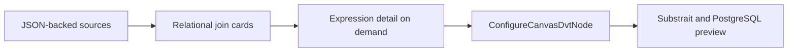

# Semantic Workbench main convergence plan

## Intent

Issues #3067, #3068, #3069, #3070, #3074, and #3087 converge the experimental Workbench into one
reviewable product slice. JSON fixtures feed production Canvas cards; source projections stay stable;
and multi-source joins use the existing typed Substrait authority.



No new command or query rail is added. Read models use `ProjectGraphNodeCardReadModel`; mutations use
`ConfigureCanvasDvtNode`. The full semantic AST remains in the model and is expanded only for the
selected join.

```feature-mechanization
version: 1
featureId: SEMANTIC-WORKBENCH-MAIN-CONVERGENCE-20260911
mechanizationStatus: implemented
noHumanDecisionsRemaining: true
implementationPlan: docs/planning/proposals/mandatory/frontend-and-ux/semantic-workbench-main-convergence-plan-20260911.md
componentGuides:
  - docs/architecture/components/web/graph/canvas-workbench-command-query-catalog.md
  - docs/architecture/system/subsystems/semantic-transformation/index.md
userStories:
  - https://github.com/dunay2/dvt/issues/3068
  - https://github.com/dunay2/dvt/issues/3069
  - https://github.com/dunay2/dvt/issues/3070
  - https://github.com/dunay2/dvt/issues/3074
  - https://github.com/dunay2/dvt/issues/3087
governingSources:
  - AGENTS.md
  - docs/planning/status/governance-document-rule-inventory.md
  - docs/guides/ai-work-protocol.md
  - docs/architecture/command-query-rail-governance.md
  - docs/architecture/fowler-opportunity-planning-governance.md
  - docs/adr/ADR-0064-substrait-semantic-reference-and-bounded-logical-profile.md
allowedImplementationSurfaces:
  - apps/web/package.json
  - apps/web/src/app/components/canvas/**
  - apps/web/src/app/components/metrics/**
  - apps/web/src/app/labs/**
  - apps/web/src/app/plugins/graph/**
  - apps/web/src/app/routes.ts
  - apps/web/src/app/views/canvas/**
  - packages/@dvt/contracts/src/contracts/planner/DvtSubstraitStandardCandidates.v1.ts
  - packages/@dvt/contracts/src/contracts/planner/DvtSubstraitSupportedCapabilities.v1.ts
  - packages/@dvt/contracts/test/dvt-substrait-capability-catalog.contract.test.ts
  - package.json
  - docs/evidence/**
  - docs/risk-register/quality/**
  - docs/planning/proposals/mandatory/frontend-and-ux/semantic-workbench-main-convergence-plan-20260911.md
  - docs/.manifest.json
  - docs/**/index.md
  - docs/planning/status/**
forbiddenImplementationSurfaces:
  - apps/api/**
  - packages/@dvt/engine/**
  - packages/@dvt/adapter-*/**
commandQueryRails:
  - name: ProjectGraphNodeCardReadModel
    type: query
    dddOwner: CanvasGraphPresentation
  - name: ConfigureCanvasDvtNode
    type: command
    dddOwner: DvtNodeAuthoringMetadata
domainObjects:
  - name: DvtSubstraitJoinCondition
    type: value object
    owner: Web Canvas semantic authoring
  - name: SemanticWorkbenchGraph
    type: read model
    owner: Web Semantic Workbench
fowlerSignals:
  - Duplicate semantics
  - Hidden authority
  - Boundary drift
  - Presentation Model
architectureGuards:
  - pnpm docs:feature-mechanization:implementation -- --feature GH-3067-SEMANTIC-WORKBENCH-JSON-FIXTURES --feature SEMANTIC-WORKBENCH-MAIN-CONVERGENCE-20260911
cypressFlows:
  - Manual browser verification of /lab/semantic-workbench
completionGate:
  - pnpm test:web:semantic-lab
  - pnpm --filter @dvt/contracts test -- dvt-substrait-capability-catalog.contract.test.ts
  - pnpm --filter @dvt/web lint
  - pnpm --filter @dvt/web typecheck
  - pnpm docs:feature-mechanization:implementation -- --feature GH-3067-SEMANTIC-WORKBENCH-JSON-FIXTURES --feature SEMANTIC-WORKBENCH-MAIN-CONVERGENCE-20260911
  - pnpm verify:prepush
redGreenCycles:
  - id: deterministic-relational-flow
    redTest: pnpm test:web:semantic-lab
    expectedFailure: The lab cannot project and edit a deterministic multi-source join.
    patchSurfaces:
      - apps/web/src/app/labs/**
      - apps/web/src/app/views/canvas/canvasDvtSubstraitJoin*.ts
    greenTest: pnpm test:web:semantic-lab
symbols:
  - &semanticSymbol
    name: SemanticWorkbenchLab
    path: apps/web/src/app/labs/SemanticWorkbenchLab.tsx
    dddOwner: Web Semantic Workbench
    cqRails: [ProjectGraphNodeCardReadModel, ConfigureCanvasDvtNode]
    fowlerSignals: [Presentation Model, Hidden authority]
    architectureGuard: pnpm docs:feature-mechanization:implementation -- --feature GH-3067-SEMANTIC-WORKBENCH-JSON-FIXTURES --feature SEMANTIC-WORKBENCH-MAIN-CONVERGENCE-20260911
    cypressCoverage: Manual browser verification of /lab/semantic-workbench
    unitTests:
      - pnpm test:web:semantic-lab
  - <<: *semanticSymbol
    name: projectSemanticWorkbenchGraph
    path: apps/web/src/app/labs/semanticWorkbenchProjection.ts
  - <<: *semanticSymbol
    name: SemanticWorkbenchJoinConditionEditor
    path: apps/web/src/app/labs/SemanticWorkbenchJoinConditionEditor.tsx
  - <<: *semanticSymbol
    name: SemanticWorkbenchJoinOperandEditor
    path: apps/web/src/app/labs/SemanticWorkbenchJoinOperandEditor.tsx
  - <<: *semanticSymbol
    name: editDvtSubstraitJoinPredicateConditions
    path: apps/web/src/app/views/canvas/canvasDvtSubstraitJoinComposition.ts
  - <<: *semanticSymbol
    name: DvtSubstraitJoinCondition
    path: apps/web/src/app/views/canvas/canvasDvtSubstraitJoinCondition.ts
  - <<: *semanticSymbol
    name: DvtSubstraitJoinOperand
    path: apps/web/src/app/views/canvas/canvasDvtSubstraitJoinOperand.ts
```
