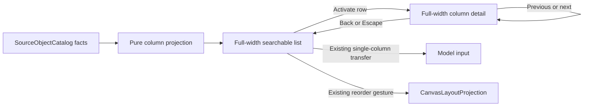

# Source Columns Drill-in

## Decision and scope

The user's supplied image replaces the old simultaneous 40/60 Columns layout
and one-line rows in issue #2974. It describes two states of one inspector, not
two panels. Reuse the existing Source workbench, provider header and tab rail.
No versioned replacement, new DTO, source store or backend query is needed.

Current state:

Target:

Rows show a type cue, name, physical type / nullability, factual PK/UK/NN badges
and a chevron. Search and a real constraint filter narrow the list. Activation
opens detail; keyboard movement and dragging do not. Back preserves search,
filter, order and focus. Previous/next follow the filtered presentation order.
Switching Source scopes navigation to that Source. Detail replaces the tabs
with a back action; no second selection authority is persisted.

The shared header stacks name, kind/provider and connection. Physical relation
identity stays available as secondary context, not a competing heading.

Only name, type, nullable, primary-key and independently-unique facts exist in
the current SourceObjectColumn contract. Do not fabricate defaults, collation,
comments, sample values, statistics or column tags. Those sections need an
authoritative read model before they can be offered; this cut does not expand
the provider contract. Screenshot viewer edit/share overlays are not controls.

Real retained graph drafts can contain column name/type without nullability.
Inspection must preserve those known facts and show nullability as unavailable;
it must not discard the entire list or invent NN/nullable semantics. The pure
projection admits absent nullability only; the import contract is unchanged.

## Existing rails and boundaries

- Query: `InspectCanvasNode`, owner `CanvasNodeInspector`; existing
  `nodePropertiesReadModel` port and Source workbench adapter, current workspace
  access. No new network request for navigating columns.
- Presentation ordering: reuse `GetCanvasLayout` / `PersistCanvasLayout`, owner
  `CanvasLayoutProjection`; existing hydrated workspace-scoped order store.
- Column transfer: preserve the existing published-column transfer into Model
  input. No selection or semantic mutation on list navigation or drag start.
- Non-Source Columns and Inputs / Outputs retain their existing behavior.

## Fowler opportunity matrix

| Signal                       | Decision / owner                                                                   | Proof                                                 | Rejected expansion                             |
| ---------------------------- | ---------------------------------------------------------------------------------- | ----------------------------------------------------- | ---------------------------------------------- |
| Mixed responsibilities       | Pure Source column facts, passive list/detail views, small interaction coordinator | Architecture guard and projection tests               | New service, DTO or parallel schema store      |
| Competing presentation state | One transient detail identity scoped to Source                                     | Back, source change, removed-column tests             | Persisting UI navigation in graph metadata     |
| Test-only confidence         | Existing Canvas flows exercise real workbench and transfer transport               | Native Chrome order/drill-in and column mapping specs | New mock-only route or duplicate browser suite |

## Validation and negative evidence

Start with failing tests for drill-in/back, narrow full-width rows, filtered
previous/next and keyboard focus. Keep drag/reorder and unsupported-metadata
negative coverage. Assert no graph PUT on inspection; only a dropped published
column may enter Model input. Cover empty results, removed columns and Source
changes. Run affected presentation and architecture tests, Web tests, lint,
typecheck, native Chrome flows and `pnpm verify:prepush`. Record commands and
results on #2974. Classify the complete diff with the ARC evaluator; do not
invent ARC-specific artifacts for a confirmed ARC-0 result.

## Governing sources

- `docs/architecture/command-query-rail-governance.md`
- `docs/architecture/fowler-opportunity-planning-governance.md`
- `docs/planning/proposals/mandatory/frontend-and-ux/source-inspector-alias-deduplication-plan-20260904.md`
- `docs/planning/proposals/mandatory/frontend-and-ux/source-inspector-list-order-plan-20260909.md`
- `docs/architecture/components/web/graph/canvas-workbench-command-query-catalog.md`
- `packages/@dvt/contracts/src/contracts/source-import/SourceObjectCatalog.ts`
- GitHub #2974 and the user's replacement image
