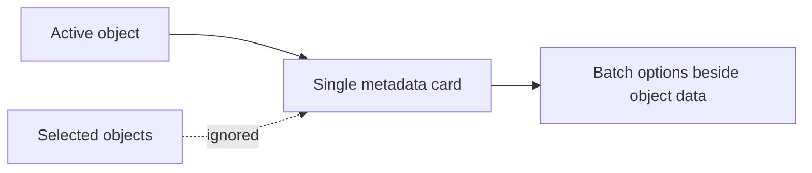
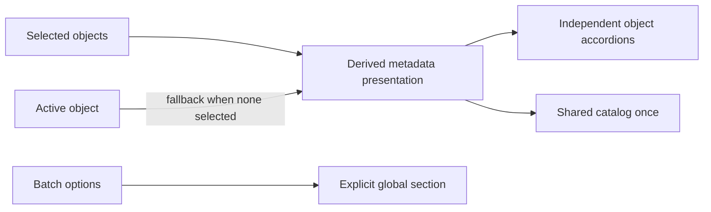

# Source Import Multi-Object Metadata Plan

## Think-First Analysis: Problem And Root Cause

The Source Import metadata step rendered only `activeSourceObject`. Selecting or
inspecting another table replaced that reference, so a multi-object selection
looked like metadata for the last table only. The same layout placed batch
import options beside this single-object projection and repeated the database
inside each fully-qualified table identity.

### Invariants

- Every selected source object keeps an independently expandable metadata view.
- Browsing an unselected object still exposes its metadata before selection.
- Catalog/database context appears once when it is common to every selected
  relational object; table identity remains unambiguous as `schema.table`.
- Batch options and grouping remain global and are visually separated from
  object-specific metadata.
- Non-relational or mixed-catalog selections fail closed to full identities.
- The browser neither imports database metadata nor creates a second query or
  command rail.

### Options and decision

1. Keep the active-object panel and add previous/next navigation. Rejected:
   selection state would remain invisible and serial.
2. Copy metadata into a second selected-object store. Rejected: it creates a
   parallel model and stale synchronization risk.
3. Selected: derive a presentation list from the existing selected objects,
   use the active object only as the zero-selection fallback, and separate
   batch controls into their own section.





## Pre-Implementation Brief

- **Mode:** Slim bug fix.
- **Scope:** Source Import Web presentation only.
- **Expected outcome:** selecting two tables shows two independent metadata
  accordions, one shared database context, and one separately labelled global
  options region.
- **Risks:** losing pre-selection inspection, hiding identity for mixed
  catalogs, or replacing behavioral coverage with copy assertions.
- **Mitigations:** active fallback, relational-only shared-context guard,
  structural selectors, full Web unit/presentation/architecture suites, and a
  headed browser proof against the live local API.
- **Out of scope:** warehouse discovery, import persistence, metadata schema,
  source creation, and new command/query rails.
- **Corrective note:** implementation began from the issue and rail brief; this
  file-backed manifest is being added before PR because the mechanization gate
  requires symbol-level traceability.

## Command And Query Rails

| Intent                                                   | Rail                                   | Type  | Owner                                  |
| -------------------------------------------------------- | -------------------------------------- | ----- | -------------------------------------- |
| Discover source objects and metadata                     | `ListWarehouseConnectionSourceObjects` | query | provider-neutral source-object catalog |
| No new rail is introduced; import behavior is unchanged. |

## Fowler Opportunities

| Signal                  | Response                                                                |
| ----------------------- | ----------------------------------------------------------------------- |
| Duplicate semantics     | Reuse selected and active controller state instead of copying metadata. |
| Responsibility overload | Separate object metadata from batch options and grouping.               |
| Test-only confidence    | Prove multiple objects and independent expansion in a headed browser.   |

## Definition Of Done

- [x] Issue #2269 owns the bounded change and records progress.
- [x] Existing query and command rails are reused.
- [x] Every selected object has independent metadata.
- [x] Active-object inspection works before selection.
- [x] Shared database context is shown once and only when safe.
- [x] Global options are explicitly separated from object metadata.
- [x] Tests assert behavior and structure rather than visual literals.
- [ ] Mechanization, governance, lint, type-check, test, and pre-push gates pass.
- [ ] PR review and CI pass without debt, stubs, or disabled rules.

```feature-mechanization
version: 1
featureId: GH-2269-SOURCE-IMPORT-MULTI-OBJECT-METADATA
mechanizationStatus: closed
noHumanDecisionsRemaining: true
implementationPlan: docs/planning/proposals/mandatory/frontend-and-ux/source-import-multi-object-metadata-plan-20260903.md
componentGuides:
  - docs/architecture/components/web/frontend-component-inventory.md
userStories:
  - https://github.com/dunay2/dvt/issues/2269
governingSources:
  - AGENTS.md
  - docs/planning/status/governance-document-rule-inventory.md
  - docs/architecture/command-query-rail-governance.md
  - docs/architecture/fowler-opportunity-planning-governance.md
  - docs/planning/state/github-mvp-issue-workflow.md
allowedImplementationSurfaces:
  - docs/.manifest.json
  - docs/planning/proposals/mandatory/frontend-and-ux/source-import-multi-object-metadata-plan-20260903.md
  - docs/**/index.md
  - apps/web/src/app/components/SourceImportWizard.metadata.test.tsx
  - apps/web/src/app/components/SourceImportWizard.pluginOptions.test.tsx
  - apps/web/src/app/components/sourceImportWizard/**
forbiddenImplementationSurfaces:
  - packages/@dvt/contracts/**
  - packages/@dvt/engine/**
  - packages/@dvt/adapter-*/**
  - apps/api/**
commandQueryRails:
  - name: ListWarehouseConnectionSourceObjects
    type: query
    dddOwner: SourceObjectCatalog
domainObjects:
  - name: SourceImportObjectReadModel
    type: read model
    owner: Source Import
  - name: SourceImportMetadataPresentation
    type: presentation model
    owner: Source Import Web
fowlerSignals:
  - Duplicate semantics
  - Responsibility overload
  - Test-only confidence
architectureGuards:
  - pnpm --filter @dvt/web exec vitest run --config vitest.architecture.config.ts
  - pnpm docs:feature-mechanization:implementation
cypressFlows:
  - apps/web/cypress/e2e/canvas/canvas-source-import-live-clean.cy.ts
completionGate:
  - pnpm --filter @dvt/web lint
  - pnpm --filter @dvt/web typecheck
  - pnpm --filter @dvt/web exec vitest run --config vitest.unit.config.ts
  - pnpm --filter @dvt/web exec vitest run --config vitest.presentation.config.ts
  - pnpm --filter @dvt/web exec vitest run --config vitest.architecture.config.ts
  - pnpm docs:feature-mechanization:implementation
  - pnpm governance:refresh
  - pnpm verify:prepush
redGreenCycles:
  - id: multi-object-metadata
    redTest: pnpm --filter @dvt/web exec vitest run SourceImportObjectsMetadata.test.tsx
    expectedFailure: Only the last active table is represented in metadata.
    patchSurfaces:
      - apps/web/src/app/components/sourceImportWizard/SourceImportObjectsMetadata.tsx
      - apps/web/src/app/components/sourceImportWizard/sourceImportMetadataModel.ts
    greenTest: pnpm --filter @dvt/web exec vitest run SourceImportObjectsMetadata.test.tsx
  - id: separate-global-options
    redTest: pnpm --filter @dvt/web exec vitest run SourceImportMetadataPanel.test.tsx
    expectedFailure: Batch options are mixed into object-specific metadata.
    patchSurfaces:
      - apps/web/src/app/components/sourceImportWizard/SourceImportMetadataPanel.tsx
      - apps/web/src/app/components/sourceImportWizard/OptionsStep.tsx
    greenTest: pnpm --filter @dvt/web exec vitest run SourceImportMetadataPanel.test.tsx
  - id: preserve-active-inspection
    redTest: pnpm --filter @dvt/web exec vitest run SourceImportWizard.metadata.test.tsx
    expectedFailure: An unselected active object has no metadata view.
    patchSurfaces:
      - apps/web/src/app/components/sourceImportWizard/WizardStepContent.tsx
    greenTest: pnpm --filter @dvt/web exec vitest run SourceImportWizard.metadata.test.tsx
symbols:
  - name: SourceImportObjectsMetadata
    path: apps/web/src/app/components/sourceImportWizard/SourceImportObjectsMetadata.tsx
    dddOwner: SourceImportMetadataPresentation
    cqRails: [ListWarehouseConnectionSourceObjects]
    fowlerSignals: [Responsibility overload]
    architectureGuard: pnpm docs:feature-mechanization:implementation
    cypressCoverage: apps/web/cypress/e2e/canvas/canvas-source-import-live-clean.cy.ts
    unitTests: [apps/web/src/app/components/sourceImportWizard/SourceImportObjectsMetadata.test.tsx]
  - { name: SourceImportObjectsMetadataProps, path: apps/web/src/app/components/sourceImportWizard/SourceImportObjectsMetadata.tsx, dddOwner: SourceImportMetadataPresentation, cqRails: [ListWarehouseConnectionSourceObjects], fowlerSignals: [Responsibility overload], architectureGuard: pnpm docs:feature-mechanization:implementation, cypressCoverage: apps/web/cypress/e2e/canvas/canvas-source-import-live-clean.cy.ts, unitTests: [apps/web/src/app/components/sourceImportWizard/SourceImportObjectsMetadata.test.tsx] }
  - { name: SourceObjectMetadataBody, path: apps/web/src/app/components/sourceImportWizard/SourceImportObjectsMetadata.tsx, dddOwner: SourceImportMetadataPresentation, cqRails: [ListWarehouseConnectionSourceObjects], fowlerSignals: [Responsibility overload], architectureGuard: pnpm docs:feature-mechanization:implementation, cypressCoverage: apps/web/cypress/e2e/canvas/canvas-source-import-live-clean.cy.ts, unitTests: [apps/web/src/app/components/sourceImportWizard/SourceImportObjectsMetadata.test.tsx] }
  - { name: sourceImportSelectedMetadataClassNames, path: apps/web/src/app/components/sourceImportWizard/SourceImportObjectsMetadata.tsx, dddOwner: SourceImportMetadataPresentation, cqRails: [ListWarehouseConnectionSourceObjects], fowlerSignals: [Duplicate semantics], architectureGuard: pnpm docs:feature-mechanization:implementation, cypressCoverage: apps/web/cypress/e2e/canvas/canvas-source-import-live-clean.cy.ts, unitTests: [apps/web/src/app/components/sourceImportWizard/SourceImportObjectsMetadata.test.tsx] }
  - { name: resolveSourceImportContextualName, path: apps/web/src/app/components/sourceImportWizard/sourceImportMetadataModel.ts, dddOwner: SourceImportMetadataPresentation, cqRails: [ListWarehouseConnectionSourceObjects], fowlerSignals: [Duplicate semantics], architectureGuard: pnpm docs:feature-mechanization:implementation, cypressCoverage: apps/web/cypress/e2e/canvas/canvas-source-import-live-clean.cy.ts, unitTests: [apps/web/src/app/components/sourceImportWizard/SourceImportObjectsMetadata.test.tsx] }
  - { name: resolveSourceImportSharedCatalog, path: apps/web/src/app/components/sourceImportWizard/sourceImportMetadataModel.ts, dddOwner: SourceImportMetadataPresentation, cqRails: [ListWarehouseConnectionSourceObjects], fowlerSignals: [Duplicate semantics], architectureGuard: pnpm docs:feature-mechanization:implementation, cypressCoverage: apps/web/cypress/e2e/canvas/canvas-source-import-live-clean.cy.ts, unitTests: [apps/web/src/app/components/sourceImportWizard/SourceImportObjectsMetadata.test.tsx] }
```
