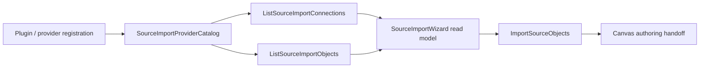

# Source Import Provider Extensibility Debt Plan

## Purpose

This plan records a product and architecture debt discovered during the
TF-E2-A Canvas authoring draft work: source-import provider identity is modeled
as a closed warehouse vendor union in the web workspace port. The current slice
does not fix that debt. It documents the gap so the future implementation has a
single canonical rail, DDD owner, Fowler diagnosis, and validation route.

## Governing Sources

- `AGENTS.md`
- `docs/planning/status/governance-document-rule-inventory.md`
- `docs/guides/ai-work-protocol.md`
- `docs/architecture/command-query-rail-governance.md`
- `docs/architecture/fowler-opportunity-planning-governance.md`
- `docs/planning/reviews/architecture-and-governance/20260503-source-import-provider-extensibility-debt-review.md`

## Current Debt

The current web workspace contract exposes source-import connections through a
closed provider type:

```ts
type: 'snowflake' | 'bigquery' | 'redshift' | 'postgres';
```

That shape makes a generic workspace boundary own concrete provider vendors.
Adding `sql`, `duckdb`, `databricks`, `s3`, an API source, or any plugin-owned
provider would require editing the core web port instead of registering
provider metadata and capabilities.

## Desired Future Shape

The future implementation should replace provider literals with a provider
reference and read model owned by the source-import bounded context.

```ts
export type SourceImportProviderRef = {
  pluginId: string;
  providerId: string;
  displayName: string;
  kind: 'warehouse' | 'lakehouse' | 'database' | 'object-store' | 'api';
};

export type SourceImportConnectionReadModel = {
  id: string;
  name: string;
  provider: SourceImportProviderRef;
  database?: string;
  capabilities: {
    canListObjects: boolean;
    canImportColumns: boolean;
    canGenerateFreshness: boolean;
    canGenerateTests: boolean;
  };
};
```

## Command And Query Rails

| Rail                                     | Type    | Owning bounded context  | DDD owner                         | Purpose                                                                |
| ---------------------------------------- | ------- | ----------------------- | --------------------------------- | ---------------------------------------------------------------------- |
| `ListSourceImportConnections`            | query   | Workspace source import | `SourceImportConnectionReadModel` | Return connection read models with provider metadata and capabilities. |
| `ListSourceImportObjects`                | query   | Workspace source import | `SourceImportObjectReadModel`     | Return provider objects available for import.                          |
| `ImportSourceObjects`                    | command | Workspace source import | `SourceImportRequest`             | Import selected provider objects into the authoring surface.           |
| `CheckSourceImportProviderExtensibility` | query   | Architecture governance | `SourceImportProviderCatalog`     | Reject closed vendor unions and UI/provider branching drift.           |

## Fowler And DDD Diagnosis

| Signal               | Finding                                                                        | Target pattern                                      |
| -------------------- | ------------------------------------------------------------------------------ | --------------------------------------------------- |
| Primitive obsession  | Provider identity is a string literal union owned by the broad workspace port. | Replace Type Code with a value object.              |
| Boundary drift       | UI and mock services know concrete providers instead of provider capabilities. | Presentation Model plus Gateway.                    |
| Duplicate semantics  | Warehouse naming leaks into generic source-import behavior.                    | Service Layer with a source-import bounded context. |
| Test-only confidence | Current tests prove listed vendors, not provider extensibility.                | Semantic architecture test.                         |

## Target Architecture



## Future Closure Criteria

- `apps/web/src/app/ports/workspace.ts` no longer lists concrete provider
  vendors as a closed source-import union.
- Source-import UI renders provider display metadata and gates options through
  capability flags.
- Mock, service, and adapter behavior are documented under the same C&Q rails.
- Tests include at least one non-warehouse provider fixture.
- An architecture guard rejects reintroducing provider literal drift.
- No compatibility alias keeps the old warehouse-shaped contract alive.

## Scope Of This Slice

This slice only adds the canonical debt review and the mechanization wrapper
that allows the documentation and generated governance indexes to exist. It
does not implement the future source-import provider model.

```feature-mechanization
version: 1
featureId: SOURCE-IMPORT-PROVIDER-EXTENSIBILITY-DEBT
mechanizationStatus: closed
noHumanDecisionsRemaining: true
implementationPlan: docs/planning/proposals/mandatory/frontend-and-ux/source-import-provider-extensibility-debt-plan-20260503.md
componentGuides:
  - docs/planning/reviews/architecture-and-governance/20260503-source-import-provider-extensibility-debt-review.md
userStories:
  - docs/planning/reviews/architecture-and-governance/20260503-source-import-provider-extensibility-debt-review.md
governingSources:
  - AGENTS.md
  - docs/planning/status/governance-document-rule-inventory.md
  - docs/guides/ai-work-protocol.md
  - docs/architecture/command-query-rail-governance.md
  - docs/architecture/fowler-opportunity-planning-governance.md
allowedImplementationSurfaces:
  - docs/.manifest.json
  - docs/**/index.md
  - docs/planning/proposals/mandatory/frontend-and-ux/source-import-provider-extensibility-debt-plan-20260503.md
  - docs/planning/proposals/portfolio-map-20260403.md
  - docs/planning/reviews/architecture-and-governance/20260503-source-import-provider-extensibility-debt-review.md
  - docs/planning/status/**
forbiddenImplementationSurfaces:
  - .github/**
  - apps/**
  - packages/**
  - scripts/**
  - specs/**
commandQueryRails:
  - name: ListSourceImportConnections
    type: query
    dddOwner: SourceImportConnectionReadModel
  - name: ListSourceImportObjects
    type: query
    dddOwner: SourceImportObjectReadModel
  - name: ImportSourceObjects
    type: command
    dddOwner: SourceImportRequest
  - name: CheckSourceImportProviderExtensibility
    type: query
    dddOwner: SourceImportProviderCatalog architecture policy
domainObjects:
  - name: SourceImportProviderRef
    type: value object
    owner: Workspace source import
  - name: SourceImportConnectionReadModel
    type: read model
    owner: Workspace source import
  - name: SourceImportProviderCatalog
    type: provider catalog policy
    owner: Workspace source import
fowlerSignals:
  - Primitive obsession
  - Boundary drift
  - Duplicate semantics
  - Test-only confidence
architectureGuards:
  - pnpm docs:feature-mechanization:implementation
  - Planned source-import architecture test forbids closed provider vendor unions.
cypressFlows:
  - N/A - documentation debt registration only; no user flow changes.
completionGate:
  - pnpm exec markdownlint-cli2 docs/planning/reviews/architecture-and-governance/20260503-source-import-provider-extensibility-debt-review.md docs/planning/proposals/mandatory/frontend-and-ux/source-import-provider-extensibility-debt-plan-20260503.md --config .markdownlint-cli2.jsonc
  - pnpm docs:sync
  - pnpm docs:governance:document-unit-map
  - pnpm docs:governance:coverage-report
  - pnpm docs:governance:remediation-queue
  - pnpm docs:governance:file-component-index
  - pnpm docs:governance:file-fingerprint-baseline
  - pnpm docs:governance:file-fingerprint-impact
  - pnpm docs:feature-mechanization:implementation
  - pnpm verify:prepush
redGreenCycles:
  - id: source-import-provider-debt-mechanization
    redTest: pnpm docs:feature-mechanization:implementation
    expectedFailure: Source import provider debt review is outside allowedImplementationSurfaces before this plan declares it.
    patchSurfaces:
      - docs/planning/proposals/mandatory/frontend-and-ux/source-import-provider-extensibility-debt-plan-20260503.md
      - docs/planning/reviews/architecture-and-governance/20260503-source-import-provider-extensibility-debt-review.md
      - docs/planning/status/**
    greenTest: pnpm docs:feature-mechanization:implementation
symbols:
  - name: SourceImportProviderExtensibilityDebtPlan
    path: docs/planning/proposals/mandatory/frontend-and-ux/source-import-provider-extensibility-debt-plan-20260503.md
    dddOwner: SourceImportProviderCatalog planning debt
    cqRails:
      - ListSourceImportConnections
      - ListSourceImportObjects
      - ImportSourceObjects
      - CheckSourceImportProviderExtensibility
    fowlerSignals:
      - Primitive obsession
      - Boundary drift
      - Duplicate semantics
      - Test-only confidence
    architectureGuard: pnpm docs:feature-mechanization:implementation
    cypressCoverage: N/A - documentation debt registration only.
    unitTests:
      - pnpm docs:feature-mechanization:implementation
  - name: SourceImportProviderExtensibilityDebtReview
    path: docs/planning/reviews/architecture-and-governance/20260503-source-import-provider-extensibility-debt-review.md
    dddOwner: SourceImportProviderCatalog planning debt
    cqRails:
      - ListSourceImportConnections
      - ListSourceImportObjects
      - ImportSourceObjects
      - CheckSourceImportProviderExtensibility
    fowlerSignals:
      - Primitive obsession
      - Boundary drift
      - Duplicate semantics
      - Test-only confidence
    architectureGuard: pnpm docs:feature-mechanization:implementation
    cypressCoverage: N/A - documentation debt registration only.
    unitTests:
      - pnpm docs:feature-mechanization:implementation
```
