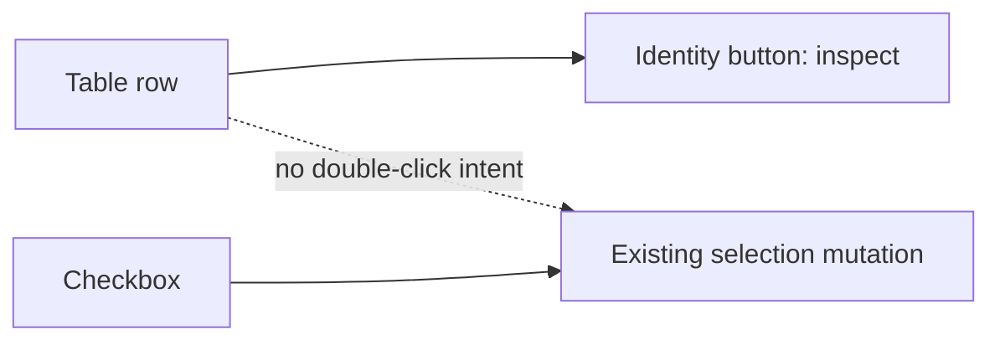
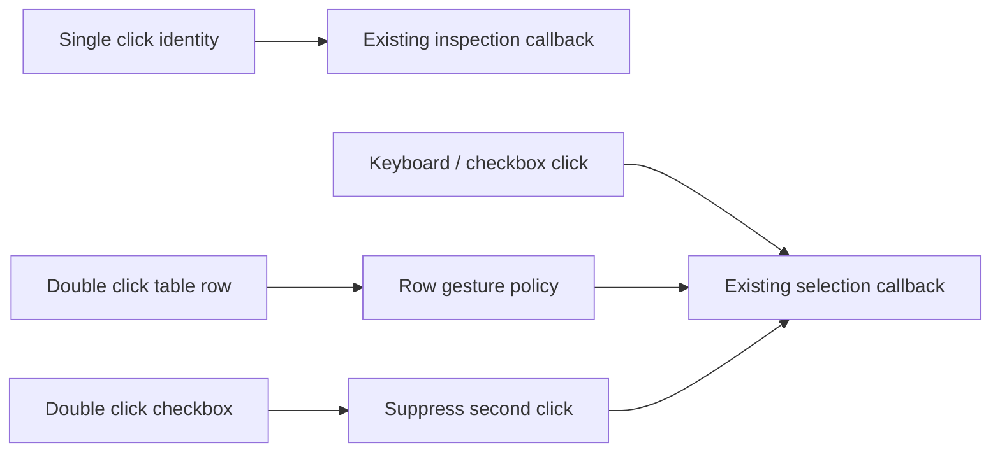

# Source Import Row Double-Click Selection Plan

## Think-First Analysis

### Problem and root cause

The Add Source catalog presents each table as one visual row, but selection is
only wired to its small checkbox. The larger identity area owns inspection and
the row container has no double-click intent, so double-clicking the table does
not reach the existing selection mutation.

### Constraints and invariants

- `ImportWarehouseSources` remains the single command rail; this slice changes
  only ephemeral `AddSourceDialogPresentation` interaction.
- The existing `onToggleSourceObject` callback remains the only selection
  mutation. No second store, selected-object model, command, or query is added.
- One click continues to inspect; one checkbox activation continues to select.
- One physical double click anywhere in a selectable table row produces one
  net selection toggle, including when it starts on the checkbox.
- Unsupported objects remain inspectable and cannot be selected.
- Keyboard checkbox behavior remains native and accessible.

### Current state



### Options considered

1. Add selection state to the row. Rejected: it duplicates controller state.
2. Replace inspection with row selection. Rejected: it removes the established
   single-click inspection path.
3. Selected: delegate row double click to the existing toggle callback and
   suppress the checkbox's second physical click so the gesture has one net
   effect.

No library was evaluated because React and Radix already expose the required
event semantics; adding a gesture dependency would widen the surface without
removing custom logic.

### Solution state



## Pre-Implementation Brief

- **Mode:** Full, because this adds visible pointer behavior.
- **Scope:** table-object rows inside Add Source catalog only.
- **Allowed implementation:** catalog primitive, its presentation test, the
  existing live Cypress source-import driver, this plan, and closeout evidence.
- **Expected outcome:** double clicking a selectable row toggles its checkbox
  on or off exactly once while single-click inspection and keyboard behavior
  remain unchanged.
- **Risks:** double toggling when the target is the checkbox, selecting an
  unsupported object, or breaking inspection.
- **Mitigations:** event-detail guard, propagation boundary, controlled
  presentation tests, and the existing live source-import flow.
- **Out of scope:** database/schema bulk selection, import persistence,
  metadata loading, copy, and Source semantic operations.
- **Command/query impact:** reuse `ImportWarehouseSources`; no rail contract
  change and no new rail.

## Fowler Opportunity Matrix

| Scenario                                  | Opportunity               | Fowler pattern                                   | DDD owner                     | Command/query rail       | Implementation surfaces                 | Unit or package test               | Architecture test                  | User-flow test                           | Out of scope                        |
| ----------------------------------------- | ------------------------- | ------------------------------------------------ | ----------------------------- | ------------------------ | --------------------------------------- | ---------------------------------- | ---------------------------------- | ---------------------------------------- | ----------------------------------- |
| Double click on table row does not select | Duplicate semantics       | Replace duplicated gesture state with delegation | `AddSourceDialogPresentation` | `ImportWarehouseSources` | Catalog primitive and presentation test | `SourceImportCatalogView.test.tsx` | Existing catalog architecture test | Existing live source-import Cypress flow | Bulk database/schema gestures       |
| Double click starts on checkbox           | Primitive event ambiguity | Encapsulate event boundary                       | `AddSourceDialogPresentation` | `ImportWarehouseSources` | Catalog primitive and presentation test | `SourceImportCatalogView.test.tsx` | Existing catalog architecture test | Existing live source-import Cypress flow | Changing native keyboard activation |

## Definition Of Done

- [x] Double click on a selectable table row toggles on and off.
- [x] Double click on its checkbox has one net toggle.
- [x] Unsupported rows do not toggle.
- [x] Single-click inspection and keyboard checkbox behavior remain intact.
- [x] Targeted presentation, architecture, lint, type-check, mechanization,
      governance, pre-push, and visible browser evidence pass.
- [x] Issue #2906 contains the human change journal and PR evidence.

```feature-mechanization
version: 1
featureId: GH-2906-SOURCE-ROW-DOUBLE-CLICK
mechanizationStatus: closed
noHumanDecisionsRemaining: true
implementationPlan: docs/planning/proposals/mandatory/frontend-and-ux/source-import-row-double-click-plan-20260904.md
componentGuides:
  - docs/architecture/components/web/frontend-component-inventory.md
userStories:
  - https://github.com/dunay2/dvt/issues/2906
governingSources:
  - AGENTS.md
  - docs/planning/status/governance-document-rule-inventory.md
  - docs/architecture/command-query-rail-governance.md
  - docs/architecture/fowler-opportunity-planning-governance.md
  - docs/planning/state/github-mvp-issue-workflow.md
allowedImplementationSurfaces:
  - docs/.manifest.json
  - docs/planning/proposals/mandatory/frontend-and-ux/source-import-row-double-click-plan-20260904.md
  - docs/planning/closeouts/20260904-2906-source-import-row-double-click-closeout.md
  - docs/**/index.md
  - apps/web/src/app/components/sourceImportWizard/SourceImportCatalogPrimitives.tsx
  - apps/web/src/app/components/sourceImportWizard/SourceImportCatalogView.test.tsx
  - apps/web/cypress/support/liveWarehouseSourceImport.ts
forbiddenImplementationSurfaces:
  - packages/@dvt/contracts/**
  - packages/@dvt/engine/**
  - packages/@dvt/adapter-*/**
  - apps/api/**
commandQueryRails:
  - name: ImportWarehouseSources
    type: command
    dddOwner: AddSourceDialogPresentation
domainObjects:
  - name: AddSourceDialogPresentation
    type: presentation model
    owner: Canvas source discovery
fowlerSignals:
  - Duplicate semantics
  - Test-only confidence
architectureGuards:
  - pnpm --filter @dvt/web exec vitest run --config vitest.architecture.config.ts SourceImportCatalogView.architecture.test.ts
cypressFlows:
  - apps/web/cypress/e2e/canvas/canvas-source-import-live-clean.cy.ts
completionGate:
  - pnpm --filter @dvt/web lint
  - pnpm --filter @dvt/web typecheck
  - pnpm --filter @dvt/web exec vitest run --config vitest.presentation.config.ts SourceImportCatalogView.test.tsx
  - pnpm --filter @dvt/web exec vitest run --config vitest.architecture.config.ts SourceImportCatalogView.architecture.test.ts
  - pnpm docs:feature-mechanization:implementation
  - pnpm governance:refresh
  - pnpm verify:prepush
redGreenCycles:
  - id: table-row-double-click-toggle
    redTest: pnpm --filter @dvt/web exec vitest run --config vitest.presentation.config.ts SourceImportCatalogView.test.tsx
    expectedFailure: A double click on the table row never reaches the existing selection callback.
    patchSurfaces:
      - apps/web/src/app/components/sourceImportWizard/SourceImportCatalogPrimitives.tsx
      - apps/web/src/app/components/sourceImportWizard/SourceImportCatalogView.test.tsx
      - apps/web/cypress/support/liveWarehouseSourceImport.ts
    greenTest: pnpm --filter @dvt/web exec vitest run --config vitest.presentation.config.ts SourceImportCatalogView.test.tsx
symbols:
  - name: SourceImportObjectCard
    path: apps/web/src/app/components/sourceImportWizard/SourceImportCatalogPrimitives.tsx
    dddOwner: AddSourceDialogPresentation
    cqRails: [ImportWarehouseSources]
    fowlerSignals: [Duplicate semantics]
    architectureGuard: pnpm --filter @dvt/web exec vitest run --config vitest.architecture.config.ts SourceImportCatalogView.architecture.test.ts
    cypressCoverage: apps/web/cypress/e2e/canvas/canvas-source-import-live-clean.cy.ts
    unitTests: [apps/web/src/app/components/sourceImportWizard/SourceImportCatalogView.test.tsx]
```
