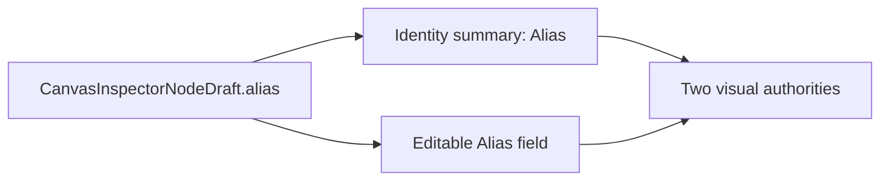
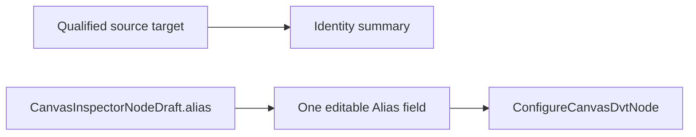

# Source Inspector Alias Deduplication Plan

## Think-First Analysis

### Problem and root cause

The DVT Source section in Node Properties renders `draft.alias` twice. The
identity summary presents the qualified source target and Alias as read-only
facts, while the authoring grid presents Alias again as the authoritative
editable field. Both values come from the same transient draft, so the defect
is not duplicated state; it is a duplicated presentation of one property.

### Constraints and invariants

- ADR-0060 keeps one Canvas authoring authority and one contextual Properties
  surface.
- `InspectCanvasNode` remains the query rail for presenting the inspector.
- `ConfigureCanvasDvtNode` remains the command rail for applying Alias edits.
- `CanvasInspectorNodeDraft` remains the sole transient authoring DTO.
- The qualified source target remains visible as non-editable identity.
- Alias remains editable once and keeps its current value and validation.
- Connection, Schema, Table, description, and source metrics are unaffected.

### Current state



### Options considered

1. Remove the editable field. Rejected because Alias is governed authoring
   behavior through `ConfigureCanvasDvtNode`.
2. Keep both and rename the summary row. Rejected because both rows still
   expose the same value and remain duplicate semantics.
3. Selected: remove only Alias from the identity summary and retain the
   qualified target plus the single editable Alias field.

No library was evaluated because this is deletion of duplicated JSX within the
existing presentation component.

### Solution state



## Pre-Implementation Brief

- **Mode:** Slim bug fix; no API, contract, artifact, or new product operation.
- **Scope:** DVT Source authoring section inside Node Properties.
- **Allowed implementation:** the source authoring renderer, its existing
  presentation test, the existing Canvas authoring Cypress flow, this plan, and
  closeout evidence.
- **Expected outcome:** the General section contains exactly one visible Alias
  label and one Alias value editor.
- **Risks:** accidentally removing authoring, hiding source target identity, or
  fixing only imported sources while leaving manually authored sources
  duplicated.
- **Mitigations:** exercise the shared renderer, count Alias labels, preserve
  the input assertion and draft-edit assertion, and validate a real imported
  Source in the visible application.
- **Out of scope:** Alias generation rules, connection naming, source metrics,
  persistence, other node kinds, or global inspector layout.
- **Command/query impact:** reuse `InspectCanvasNode` and
  `ConfigureCanvasDvtNode`; no rail is added or changed.

## Fowler Opportunity Matrix

| Scenario                              | Opportunity         | Fowler pattern                | DDD owner                               | Command/query rail                            | Implementation surfaces                | Unit or package test          | Architecture test                   | User-flow test                                             | Out of scope                    |
| ------------------------------------- | ------------------- | ----------------------------- | --------------------------------------- | --------------------------------------------- | -------------------------------------- | ----------------------------- | ----------------------------------- | ---------------------------------------------------------- | ------------------------------- |
| Source Alias appears twice in General | Duplicate semantics | Remove duplicate presentation | `CanvasInspectorNodeDraft` presentation | `InspectCanvasNode`; `ConfigureCanvasDvtNode` | DVT Source renderer and existing tests | `DvtAuthoringFields.test.tsx` | Existing one-authority Canvas guard | Existing Canvas authoring Cypress flow and visible browser | Alias derivation or persistence |

## Definition Of Done

- [x] Alias appears exactly once for an imported Source.
- [x] The remaining Alias field retains editing and validation behavior.
- [x] Qualified target, Connection, Schema, and Table remain visible once.
- [x] Presentation, architecture, lint, type-check, mechanization, governance,
      pre-push, and visible-browser evidence pass.
- [x] The Cypress flow reaches and passes the Source Alias assertion and Source
      roundtrip; its later independent Sink clipping failure is tracked in #2909.
- [x] Issue #2908 contains the human change journal and PR evidence.

```feature-mechanization
version: 1
featureId: GH-2908-SOURCE-INSPECTOR-ALIAS-DEDUPLICATION
mechanizationStatus: closed
noHumanDecisionsRemaining: true
implementationPlan: docs/planning/proposals/mandatory/frontend-and-ux/source-inspector-alias-deduplication-plan-20260904.md
componentGuides:
  - docs/planning/proposals/mandatory/frontend-and-ux/canvas-node-properties-authoring-roundtrip-plan-20260812.md
  - docs/planning/proposals/mandatory/frontend-and-ux/canvas-inspector-plugin-authoring-fields-plan-20260604.md
userStories:
  - https://github.com/dunay2/dvt/issues/2908
governingSources:
  - AGENTS.md
  - docs/planning/status/governance-document-rule-inventory.md
  - docs/guides/ai-work-protocol.md
  - docs/architecture/command-query-rail-governance.md
  - docs/architecture/fowler-opportunity-planning-governance.md
  - docs/adr/ADR-0060-dbt-project-authoring-authority.md
allowedImplementationSurfaces:
  - docs/.manifest.json
  - docs/**/index.md
  - docs/planning/proposals/mandatory/frontend-and-ux/source-inspector-alias-deduplication-plan-20260904.md
  - docs/planning/closeouts/20260904-2908-source-inspector-alias-deduplication-closeout.md
  - apps/web/src/app/views/canvas/DvtSourceAuthoringSection.tsx
  - apps/web/src/app/views/canvas/DvtAuthoringFields.test.tsx
  - apps/web/cypress/e2e/canvas/canvas-ready-node-authoring.cy.ts
forbiddenImplementationSurfaces:
  - apps/api/**
  - packages/@dvt/contracts/**
  - packages/@dvt/engine/**
  - packages/@dvt/planner/**
  - packages/@dvt/adapter-*/**
  - infra/db/**
commandQueryRails:
  - name: InspectCanvasNode
    type: query
    dddOwner: CanvasNodeInspector
  - name: ConfigureCanvasDvtNode
    type: command
    dddOwner: DvtNodeAuthoringMetadata
domainObjects:
  - name: CanvasInspectorNodeDraft
    type: transient DTO
    owner: Node Properties presentation
fowlerSignals:
  - Duplicate semantics
  - Test-only confidence
architectureGuards:
  - pnpm --filter @dvt/web exec vitest run --config vitest.architecture.config.ts CanvasNodeWorkbenchDraftController.architecture.test.ts
cypressFlows:
  - apps/web/cypress/e2e/canvas/canvas-ready-node-authoring.cy.ts
completionGate:
  - pnpm --filter @dvt/web lint
  - pnpm --filter @dvt/web typecheck
  - pnpm --filter @dvt/web exec vitest run --config vitest.presentation.config.ts DvtAuthoringFields.test.tsx
  - pnpm --filter @dvt/web exec vitest run --config vitest.architecture.config.ts CanvasNodeWorkbenchDraftController.architecture.test.ts
  - pnpm docs:feature-mechanization:implementation
  - pnpm governance:refresh
  - pnpm verify:prepush
redGreenCycles:
  - id: source-inspector-single-alias
    redTest: pnpm --filter @dvt/web exec vitest run --config vitest.presentation.config.ts DvtAuthoringFields.test.tsx
    expectedFailure: The imported Source renders two Alias labels from one draft value.
    patchSurfaces:
      - apps/web/src/app/views/canvas/DvtSourceAuthoringSection.tsx
      - apps/web/src/app/views/canvas/DvtAuthoringFields.test.tsx
      - apps/web/cypress/e2e/canvas/canvas-ready-node-authoring.cy.ts
    greenTest: pnpm --filter @dvt/web exec vitest run --config vitest.presentation.config.ts DvtAuthoringFields.test.tsx
symbols:
  - name: DvtSourceAuthoringSection
    path: apps/web/src/app/views/canvas/DvtSourceAuthoringSection.tsx
    dddOwner: CanvasInspectorNodeDraft presentation
    cqRails: [InspectCanvasNode, ConfigureCanvasDvtNode]
    fowlerSignals: [Duplicate semantics]
    architectureGuard: pnpm --filter @dvt/web exec vitest run --config vitest.architecture.config.ts CanvasNodeWorkbenchDraftController.architecture.test.ts
    cypressCoverage: apps/web/cypress/e2e/canvas/canvas-ready-node-authoring.cy.ts
    unitTests: [apps/web/src/app/views/canvas/DvtAuthoringFields.test.tsx]
```
