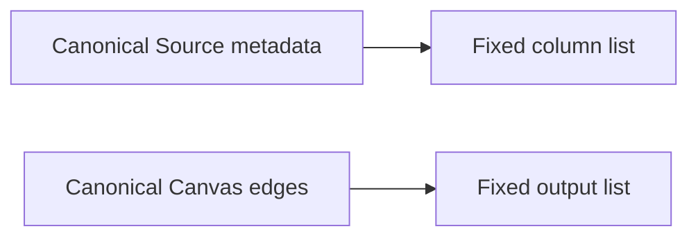
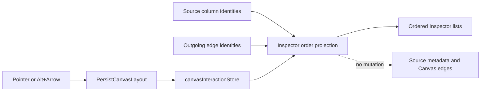

# Source Inspector List Order Plan

## Problem And Root Cause

Source Inspector columns and outgoing Canvas relationships are selectable lists,
but their rows have no ordering interaction. Reintroducing the deleted semantic
Source-column command would violate the Source hard cut, while adding edge
ordinals would turn presentation into graph authority.



## Target And Decision

Reuse `PersistCanvasLayout`. Store column and output identity order by workspace
and Source after local-store hydration. Reconcile stale or duplicate identities,
append new identities canonically, and persist the cleaned projection. Pointer
drag and `Alt+ArrowUp/Down` share one gesture policy. Inputs remain canonical.



## Invariants

- Source metadata, column semantics, graph edges, and input order never change.
- No write occurs before `canvasInteractionStore` hydration or without edit
  permission and workspace scope.
- Missing and duplicate persisted identities are removed durably; new identities
  append in canonical order.
- The moved row remains selected and focused, with a visible drop indicator and
  an accessible movement announcement.
- No new command, query, backend store, contract, or legacy compatibility path is
  introduced.

## Fowler Opportunity Matrix

| Scenario                       | Opportunity          | Pattern / DDD owner                           | Rail                                     | Proof                            | Out of scope                  |
| ------------------------------ | -------------------- | --------------------------------------------- | ---------------------------------------- | -------------------------------- | ----------------------------- |
| Reorder Source columns         | Duplicate semantics  | Presentation Model / `CanvasLayoutProjection` | `PersistCanvasLayout`, `GetCanvasLayout` | panel, store, Chrome E2E         | semantic Source column order  |
| Reorder outgoing relationships | Hidden authority     | Presentation Model / `CanvasLayoutProjection` | `PersistCanvasLayout`, `GetCanvasLayout` | panel and Chrome E2E             | edge ordinals or graph writes |
| Hydrate and reconcile          | Test-only confidence | Policy Object / Inspector order policy        | same rails                               | pre-hydration and stale-ID tests | backend preference sync       |

```feature-mechanization
version: 1
featureId: GH-3078-SOURCE-INSPECTOR-LIST-ORDER
mechanizationStatus: implemented
noHumanDecisionsRemaining: true
implementationPlan: docs/planning/proposals/mandatory/frontend-and-ux/source-inspector-list-order-plan-20260909.md
componentGuides:
  - docs/architecture/components/web/graph/canvas-layout-persistence-component.md
  - docs/architecture/components/web/graph/canvas-layout-persistence-user-stories.md
  - docs/architecture/components/web/graph/canvas-workbench-command-query-catalog.md
userStories:
  - https://github.com/dunay2/dvt/issues/3078
governingSources:
  - AGENTS.md
  - docs/planning/status/governance-document-rule-inventory.md
  - docs/guides/ai-work-protocol.md
  - docs/architecture/command-query-rail-governance.md
  - docs/architecture/fowler-opportunity-planning-governance.md
  - docs/adr/ADR-0000-Code-generation-with-normative-traceability-required.en.md
  - docs/adr/ADR-0061-github-mvp-task-authority-and-planning-db-architecture-boundary.md
allowedImplementationSurfaces:
  - docs/.manifest.json
  - docs/**/index.md
  - docs/architecture/components/web/graph/canvas-layout-persistence-component.md
  - docs/architecture/components/web/graph/canvas-layout-persistence-user-stories.md
  - docs/architecture/components/web/graph/canvas-workbench-command-query-catalog.md
  - docs/planning/proposals/mandatory/frontend-and-ux/source-inspector-list-order-plan-20260909.md
  - apps/web/cypress/e2e/canvas/canvas-source-inspector-order.cy.ts
  - apps/web/cypress/support/canvasDraftAuthoring.ts
  - apps/web/src/app/components/inspector/NodePropertiesTabs.tsx
  - apps/web/src/app/components/inspector/SourceColumnsPanel.tsx
  - apps/web/src/app/components/inspector/SourceColumnsPanel.test.tsx
  - apps/web/src/app/components/inspector/SourceInputsOutputsPanel.tsx
  - apps/web/src/app/components/inspector/SourceInputsOutputsPanel.test.tsx
  - apps/web/src/app/components/inspector/useCanvasInspectorListOrder.ts
  - apps/web/src/app/components/inspector/useCanvasInspectorListOrder.test.ts
  - apps/web/src/app/components/inspector/useInspectorListReorder.ts
  - apps/web/src/app/stores/canvasInteractionStore.ts
  - apps/web/src/app/stores/canvasInteractionStore.test.ts
  - apps/web/src/app/views/canvas/CanvasNodeWorkbenchPanel.tsx
  - apps/web/src/app/views/canvas/CanvasNodeWorkbenchPanel.test.tsx
forbiddenImplementationSurfaces:
  - packages/@dvt/contracts/**
  - packages/@dvt/engine/**
  - packages/@dvt/adapter-*/**
  - apps/api/**
  - apps/web/src/app/views/canvas/canvasDvtSourceSemanticAuthoring.ts
commandQueryRails:
  - name: PersistCanvasLayout
    type: command
    dddOwner: CanvasLayoutProjection
  - name: GetCanvasLayout
    type: query
    dddOwner: CanvasLayoutProjection
domainObjects:
  - name: CanvasLayoutProjection
    type: value object
    owner: Canvas Web
  - name: SourceInspectorListOrder
    type: presentation model
    owner: Canvas Web
fowlerSignals:
  - Duplicate semantics
  - Hidden authority
  - Test-only confidence
architectureGuards:
  - pnpm docs:feature-mechanization:implementation
  - pnpm --filter @dvt/web exec vitest run --config vitest.architecture.config.ts
cypressFlows:
  - apps/web/cypress/e2e/canvas/canvas-source-inspector-order.cy.ts
completionGate:
  - pnpm --filter @dvt/web lint
  - pnpm --filter @dvt/web typecheck
  - pnpm --filter @dvt/web test
  - node ../../tools/ci/run-web-cypress-native.mjs run --headed --browser chrome --spec cypress/e2e/canvas/canvas-source-inspector-order.cy.ts
  - pnpm docs:feature-mechanization:implementation
  - pnpm governance:refresh
  - pnpm verify:prepush
redGreenCycles:
  - id: inspector-list-order
    redTest: pnpm --filter @dvt/web exec vitest run --config vitest.presentation.config.ts src/app/components/inspector/SourceColumnsPanel.test.tsx src/app/components/inspector/SourceInputsOutputsPanel.test.tsx
    expectedFailure: Pointer order remains canonical and Alt+Arrow changes selection instead of presentation order.
    patchSurfaces:
      - apps/web/src/app/components/inspector/SourceColumnsPanel.tsx
      - apps/web/src/app/components/inspector/SourceInputsOutputsPanel.tsx
      - apps/web/src/app/components/inspector/useCanvasInspectorListOrder.ts
      - apps/web/src/app/components/inspector/useInspectorListReorder.ts
      - apps/web/src/app/stores/canvasInteractionStore.ts
    greenTest: pnpm --filter @dvt/web exec vitest run --config vitest.presentation.config.ts src/app/components/inspector/SourceColumnsPanel.test.tsx src/app/components/inspector/SourceInputsOutputsPanel.test.tsx
symbols:
  - { name: stubCanvas, path: apps/web/cypress/e2e/canvas/canvas-source-inspector-order.cy.ts, dddOwner: SourceInspectorListOrder, cqRails: [GetCanvasLayout], fowlerSignals: [Test-only confidence], architectureGuard: pnpm docs:feature-mechanization:implementation, cypressCoverage: apps/web/cypress/e2e/canvas/canvas-source-inspector-order.cy.ts, unitTests: [apps/web/src/app/views/canvas/CanvasNodeWorkbenchPanel.test.tsx] }
  - { name: visitCanvas, path: apps/web/cypress/e2e/canvas/canvas-source-inspector-order.cy.ts, dddOwner: SourceInspectorListOrder, cqRails: [GetCanvasLayout], fowlerSignals: [Test-only confidence], architectureGuard: pnpm docs:feature-mechanization:implementation, cypressCoverage: apps/web/cypress/e2e/canvas/canvas-source-inspector-order.cy.ts, unitTests: [apps/web/src/app/views/canvas/CanvasNodeWorkbenchPanel.test.tsx] }
  - { name: openSourceSection, path: apps/web/cypress/e2e/canvas/canvas-source-inspector-order.cy.ts, dddOwner: SourceInspectorListOrder, cqRails: [GetCanvasLayout], fowlerSignals: [Test-only confidence], architectureGuard: pnpm docs:feature-mechanization:implementation, cypressCoverage: apps/web/cypress/e2e/canvas/canvas-source-inspector-order.cy.ts, unitTests: [apps/web/src/app/views/canvas/CanvasNodeWorkbenchPanel.test.tsx] }
  - { name: expectOrder, path: apps/web/cypress/e2e/canvas/canvas-source-inspector-order.cy.ts, dddOwner: SourceInspectorListOrder, cqRails: [GetCanvasLayout], fowlerSignals: [Test-only confidence], architectureGuard: pnpm docs:feature-mechanization:implementation, cypressCoverage: apps/web/cypress/e2e/canvas/canvas-source-inspector-order.cy.ts, unitTests: [apps/web/src/app/views/canvas/CanvasNodeWorkbenchPanel.test.tsx] }
  - { name: dragBefore, path: apps/web/cypress/e2e/canvas/canvas-source-inspector-order.cy.ts, dddOwner: SourceInspectorListOrder, cqRails: [PersistCanvasLayout], fowlerSignals: [Test-only confidence], architectureGuard: pnpm docs:feature-mechanization:implementation, cypressCoverage: apps/web/cypress/e2e/canvas/canvas-source-inspector-order.cy.ts, unitTests: [apps/web/src/app/components/inspector/SourceColumnsPanel.test.tsx] }
  - { name: reconcileCanvasInspectorListOrder, path: apps/web/src/app/components/inspector/useCanvasInspectorListOrder.ts, dddOwner: CanvasLayoutProjection, cqRails: [PersistCanvasLayout, GetCanvasLayout], fowlerSignals: [Hidden authority], architectureGuard: pnpm docs:feature-mechanization:implementation, cypressCoverage: apps/web/cypress/e2e/canvas/canvas-source-inspector-order.cy.ts, unitTests: [apps/web/src/app/components/inspector/useCanvasInspectorListOrder.test.ts] }
  - { name: reorderCanvasInspectorList, path: apps/web/src/app/components/inspector/useCanvasInspectorListOrder.ts, dddOwner: CanvasLayoutProjection, cqRails: [PersistCanvasLayout], fowlerSignals: [Duplicate semantics], architectureGuard: pnpm docs:feature-mechanization:implementation, cypressCoverage: apps/web/cypress/e2e/canvas/canvas-source-inspector-order.cy.ts, unitTests: [apps/web/src/app/components/inspector/useCanvasInspectorListOrder.test.ts] }
  - { name: useCanvasInspectorListOrder, path: apps/web/src/app/components/inspector/useCanvasInspectorListOrder.ts, dddOwner: CanvasLayoutProjection, cqRails: [PersistCanvasLayout, GetCanvasLayout], fowlerSignals: [Hidden authority], architectureGuard: pnpm docs:feature-mechanization:implementation, cypressCoverage: apps/web/cypress/e2e/canvas/canvas-source-inspector-order.cy.ts, unitTests: [apps/web/src/app/components/inspector/SourceColumnsPanel.test.tsx] }
  - { name: DropTarget, path: apps/web/src/app/components/inspector/useInspectorListReorder.ts, dddOwner: SourceInspectorListOrder, cqRails: [PersistCanvasLayout], fowlerSignals: [Primitive obsession], architectureGuard: pnpm docs:feature-mechanization:implementation, cypressCoverage: apps/web/cypress/e2e/canvas/canvas-source-inspector-order.cy.ts, unitTests: [apps/web/src/app/components/inspector/SourceInputsOutputsPanel.test.tsx] }
  - { name: useInspectorListReorder, path: apps/web/src/app/components/inspector/useInspectorListReorder.ts, dddOwner: SourceInspectorListOrder, cqRails: [PersistCanvasLayout], fowlerSignals: [Duplicate semantics], architectureGuard: pnpm docs:feature-mechanization:implementation, cypressCoverage: apps/web/cypress/e2e/canvas/canvas-source-inspector-order.cy.ts, unitTests: [apps/web/src/app/components/inspector/SourceColumnsPanel.test.tsx, apps/web/src/app/components/inspector/SourceInputsOutputsPanel.test.tsx] }
  - { name: CanvasInspectorListId, path: apps/web/src/app/stores/canvasInteractionStore.ts, dddOwner: CanvasLayoutProjection, cqRails: [PersistCanvasLayout, GetCanvasLayout], fowlerSignals: [Primitive obsession], architectureGuard: pnpm docs:feature-mechanization:implementation, cypressCoverage: apps/web/cypress/e2e/canvas/canvas-source-inspector-order.cy.ts, unitTests: [apps/web/src/app/stores/canvasInteractionStore.test.ts] }
  - { name: CanvasInspectorListOrders, path: apps/web/src/app/stores/canvasInteractionStore.ts, dddOwner: CanvasLayoutProjection, cqRails: [PersistCanvasLayout, GetCanvasLayout], fowlerSignals: [Data clump], architectureGuard: pnpm docs:feature-mechanization:implementation, cypressCoverage: apps/web/cypress/e2e/canvas/canvas-source-inspector-order.cy.ts, unitTests: [apps/web/src/app/stores/canvasInteractionStore.test.ts] }
  - { name: areOrderedIdsEqual, path: apps/web/src/app/stores/canvasInteractionStore.ts, dddOwner: CanvasLayoutProjection, cqRails: [PersistCanvasLayout], fowlerSignals: [Test-only confidence], architectureGuard: pnpm docs:feature-mechanization:implementation, cypressCoverage: apps/web/cypress/e2e/canvas/canvas-source-inspector-order.cy.ts, unitTests: [apps/web/src/app/stores/canvasInteractionStore.test.ts] }
```
