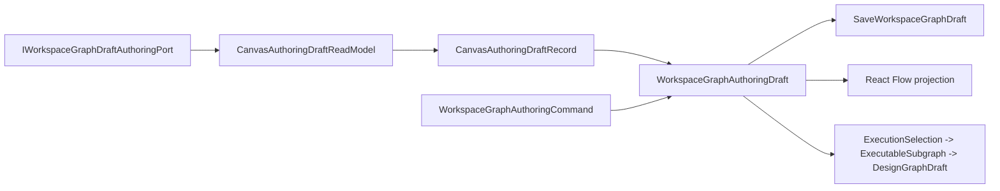

# TF-E2-A Authoring Draft Hard Cut Implementation Plan

> **For agentic workers:** REQUIRED SUB-SKILL: Use
> superpowers:subagent-driven-development or superpowers:executing-plans to
> implement this plan task-by-task. Steps use checkbox (`- [ ]`) syntax for
> tracking.

**Goal:** Make Canvas consume and save `WorkspaceGraphAuthoringDraft` directly
as editable authoring truth, while keeping `DesignGraphDraft` as a derived
preview/run artifact only.

**Architecture:** This is a hexagonal boundary hard cut inside `apps/web`.
The protected contract, API, and web authoring port already speak
`WorkspaceGraphAuthoringDraft`; the remaining work removes the route-local
`WorkspaceGraphDraft` projection from the active save path and adds semantic
architecture tests that prevent the projection detour from returning.

**Tech Stack:** React 18, TypeScript, Vitest, Cypress, TanStack Query,
React Flow, `@dvt/contracts` workspace graph draft contracts, existing Canvas
authoring modules, and repository feature-mechanization guards.

---

## Governing Sources

- `AGENTS.md`
- `docs/planning/status/governance-document-rule-inventory.md`
- `docs/guides/ai-work-protocol.md`
- `docs/architecture/command-query-rail-governance.md`
- `docs/architecture/fowler-opportunity-planning-governance.md`
- `docs/contracts/planner/workspace-graph-draft-persistence-v1.md`
- `docs/architecture/components/planner/workspace-authoring-draft-aggregate.md`
- `apps/api/docs/workspace-graph-draft-application-component.md`
- `docs/architecture/components/web/graph/canvas-authoring-draft-boundary-component.md`
- `docs/planning/state/agent-lane-e.yaml`

## Review Result For Steps 1 And 2

The repository has already moved the contract and API boundary to the right
shape:

- `WorkspaceGraphDraft.v1.ts` persists `WorkspaceGraphAuthoringDraft`.
- `WorkspaceGraphAuthoringDraft.v1.ts` allows incomplete authoring states.
- `IWorkspaceGraphDraftAuthoringPort` reads and saves boundary-native
  authoring envelopes.
- `workspaceGraphDraftProjection.ts` projects authoring truth into route-facing
  draft and semantic graph views.
- `canvasDraftRepository.ts` calls the authoring port.

The remaining drift is web-local:

- `apps/web/src/app/ports/workspace.ts` still defines a route-local
  `WorkspaceGraphDraft` DTO.
- `apps/web/src/app/ports/workspace.ts` still defines
  `WorkspaceGraphDraftRecord`, `SaveWorkspaceGraphDraftInput`, and
  `SaveWorkspaceGraphDraftResult`, even though the protected authoring port is
  already the write boundary.
- `apps/web/src/app/services/workspace/workspaceService.ts` still re-exports
  those route-local draft types as a service barrel, so deleting the port
  exports alone would not close the public import surface.
- `canvasDraftAuthoring.ts` receives that projection plus `canonicalNodes` and
  `canonicalEdges`, then reconstructs `WorkspaceGraphAuthoringDraft`.
- `canvasDraftRepository.ts` reports saved records from the projection instead
  of a boundary-native authoring read model.
- Canvas cache, session, working-set, host-cycle, and tab-state modules still
  import projected draft records from the generic workspace port.
- Canvas active-graph, create-canvas save result, autosave, center-surface,
  lifecycle snapshot, authoring graph projection, local-node catalog, and
  affected test fixtures still name the route-local DTO or semantic projection.
- Several tests still build projected `WorkspaceGraphDraft` objects, making
  the projection look like aggregate truth.

## Root Cause

The active Canvas route still carries a Transitional Data Transfer Object. That
DTO was useful while the protected contract was being introduced, but it now
creates three mature-system problems:

| Problem                                             | Fowler signal        | Consequence                                                          |
| --------------------------------------------------- | -------------------- | -------------------------------------------------------------------- |
| Projection masquerades as aggregate                 | Hidden authority     | A lossy shape can look like the persistence model.                   |
| Semantic nodes are reconstructed from side channels | Data clump           | Save needs `projectedDraft`, `canonicalNodes`, and `canonicalEdges`. |
| Tests can pass on projected state                   | Test-only confidence | The protected authoring aggregate is not always the proof target.    |

## Closed Scope

In scope:

- web-side `TF-E2-A` hard cut only;
- active Canvas save path consumes `WorkspaceGraphAuthoringDraft` directly;
- route-local `WorkspaceGraphDraft` and `WorkspaceGraphDraftRecord` exports are
  deleted from `apps/web/src/app/ports/workspace.ts` and from
  `apps/web/src/app/services/workspace/workspaceService.ts` re-exports;
- Canvas projections stay only under Canvas-owned type names such as
  `CanvasAuthoringDraftRecord`, `CanvasAuthoringSemanticGraph`, and
  `CanvasViewportGraphModel`;
- semantic architecture tests guard against `WorkspaceGraphDraft` save input
  drift and `DesignGraphDraft` persistence drift;
- negative tests for forbidden, read-only, stale revision, idempotency
  mismatch, unsupported schema, and missing semantic-node projection;
- Cypress smoke proof that first authoring still uses the UI flow and does not
  seed `/workspace/graph/draft`.

Out of scope:

- new backend routes;
- new contract versions;
- planner compile changes;
- collaboration merge semantics beyond reject-on-stale;
- visual redesign;
- compatibility aliases for route-local `WorkspaceGraphDraft` saves or records.

## Command And Query Catalog

| Rail                                  | Type    | Owning bounded context      | DDD owner                                     | Application port                                     | Adapter surface               | Scope/auth rules                                             | Negative tests                                                                 |
| ------------------------------------- | ------- | --------------------------- | --------------------------------------------- | ---------------------------------------------------- | ----------------------------- | ------------------------------------------------------------ | ------------------------------------------------------------------------------ |
| `GetWorkspaceGraphDraft`              | query   | Workspace authoring         | `WorkspaceGraphDraftReadResponse` read model  | `IWorkspaceGraphDraftAuthoringPort.readGraphDraft()` | API or mock authoring adapter | tenant/project/environment scoped, read capability required  | unauthenticated, forbidden, not found, unsupported schema, corrupt payload     |
| `SaveWorkspaceGraphDraft`             | command | Workspace authoring         | `WorkspaceGraphAuthoringDraft` aggregate      | `IWorkspaceGraphDraftAuthoringPort.saveGraphDraft()` | API or mock authoring adapter | tenant/project/environment scoped, write capability required | read-only, forbidden, stale revision, idempotency mismatch, unsupported schema |
| `ApplyWorkspaceGraphAuthoringCommand` | command | Canvas authoring            | `WorkspaceGraphAuthoringCommand` value object | Canvas authoring application service                 | Canvas controller             | admitted only when draft posture is writable                 | duplicate node id, missing node ref, invalid edge ref, non-writable posture    |
| `ProjectCanvasAuthoringViewportGraph` | query   | Canvas presentation         | `CanvasViewportGraphModel` projection         | Canvas viewport mapper                               | React Flow adapter            | browser-local projection; no backend authority               | projection cannot mutate draft, missing semantic node fails closed             |
| `ProjectSelectedExecutableSubgraph`   | query   | Planner execution selection | `ExecutableSubgraph` read model               | preview/run query boundary                           | planner API adapter           | explicit selected scope, authorized preview/run              | loose unselected nodes do not block selected executable closure                |

No implementation in this slice may add a command, query, service method,
route-local helper, Cypress workflow, or architecture test outside this table
without updating the plan first.

## DDD Object Map

| Object                            | Kind                    | Owner                                    | Invariant                                                                              |
| --------------------------------- | ----------------------- | ---------------------------------------- | -------------------------------------------------------------------------------------- |
| `WorkspaceGraphAuthoringDraft`    | aggregate               | planner/contracts shared authoring model | editable graph truth supports incomplete authoring states                              |
| `WorkspaceGraphAuthoringCommand`  | command value object    | Canvas authoring                         | mutations are serializable and aggregate-oriented                                      |
| `WorkspaceGraphDraftReadResponse` | read model              | protected draft boundary                 | preserves capability, audit, format, revision, and record                              |
| `WorkspaceGraphDraftSaveResponse` | command receipt         | protected draft boundary                 | saved/conflict/denied outcomes stay typed                                              |
| `CanvasAuthoringDraftRecord`      | route record            | Canvas authoring boundary                | wraps revision, saved time, and `WorkspaceGraphAuthoringDraft` without projection loss |
| `CanvasAuthoringDraftReadModel`   | presentation read model | Canvas authoring boundary                | route keeps authoring draft and metadata together                                      |
| `CanvasAuthoringSemanticGraph`    | projection              | Canvas presentation                      | canonical graph view is derived from authoring truth and never saved                   |
| `CanvasViewportGraphModel`        | projection              | Canvas presentation                      | React Flow state is derived from authoring truth                                       |
| `ExecutableSubgraph`              | read model              | planner execution selection              | preview/run sees selected executable closure, not the whole loose draft                |

## Target Topology



## Allowed Implementation Surfaces

- `apps/web/src/app/ports/workspaceGraphDraftAuthoring.ts`
- `apps/web/src/app/ports/workspace.ts`
- `apps/web/src/app/services/workspace/workspaceService.ts`
- `apps/web/src/app/services/workspace/workspaceGraphDraftProjection.ts`
- `apps/web/src/app/services/workspace/workspaceGraphDraftProjection.test.ts`
- `apps/web/src/app/services/workspace/workspaceGraphDraftProjectionExpected.test.fixtures.ts`
- `apps/web/src/app/views/canvas/canvasActiveGraphStrategy.test.ts`
- `apps/web/src/app/views/canvas/canvasAuthoringGraphProjection.ts`
- `apps/web/src/app/views/canvas/canvasAuthoringProjection.architecture.test.ts`
- `apps/web/src/app/views/canvas/canvasCenterSurface.types.ts`
- `apps/web/src/app/views/canvas/canvasCreateCanvasDocumentCommand.test.ts`
- `apps/web/src/app/views/canvas/canvasCreateCanvasDocumentCommandPolicy.ts`
- `apps/web/src/app/views/canvas/canvasCreateCanvasDocumentSaveResult.ts`
- `apps/web/src/app/views/canvas/canvasDraftAuthoringComponent.architecture.test.ts`
- `apps/web/src/app/views/canvas/canvasDraftAutosaveExecution.ts`
- `apps/web/src/app/views/canvas/canvasDraftAutosaveScheduling.ts`
- `apps/web/src/app/views/canvas/canvasDraftLifecycleSnapshot.ts`
- `apps/web/src/app/views/canvas/canvasDraftLocalNodeCatalog.ts`
- `apps/web/src/app/views/canvas/canvasDraftReadModel.ts`
- `apps/web/src/app/views/canvas/canvasDraftReadModel.test.ts`
- `apps/web/src/app/views/canvas/canvasDraftRepository.ts`
- `apps/web/src/app/views/canvas/canvasDraftRepository.architecture.test.ts`
- `apps/web/src/app/views/canvas/canvasDraftRepository.conflict.test.ts`
- `apps/web/src/app/views/canvas/canvasDraftRepository.readWrite.test.ts`
- `apps/web/src/app/views/canvas/canvasDraftRepository.test.fixtures.ts`
- `apps/web/src/app/views/canvas/canvasDraftAuthoring.ts`
- `apps/web/src/app/views/canvas/canvasDraftAuthoring.test.ts`
- `apps/web/src/app/views/canvas/canvasDraftQueryCache.ts`
- `apps/web/src/app/views/canvas/canvasDraftSession.ts`
- `apps/web/src/app/views/canvas/canvasDraftSession.architecture.test.ts`
- `apps/web/src/app/views/canvas/canvasDraftSession.test.ts`
- `apps/web/src/app/views/canvas/canvasDraftSession.types.ts`
- `apps/web/src/app/views/canvas/canvasDraftSessionBaseline.ts`
- `apps/web/src/app/views/canvas/canvasDraftSessionMachine.ts`
- `apps/web/src/app/views/canvas/canvasDraftStructuralSignature.ts`
- `apps/web/src/app/views/canvas/canvasDraftSessionWorkingSet.ts`
- `apps/web/src/app/views/canvas/canvasHostCycleState.ts`
- `apps/web/src/app/views/canvas/canvasPlaygroundTabState.architecture.test.ts`
- `apps/web/src/app/views/canvas/canvasPlaygroundTabState.test.ts`
- `apps/web/src/app/views/canvas/canvasPlaygroundTabState.ts`
- `apps/web/src/app/views/canvas/useCanvasController.ts`
- `apps/web/src/app/views/canvas/useCanvasController.activeDraftMutations.test.tsx`
- `apps/web/src/app/views/canvas/useCanvasController.architecture.test.ts`
- `apps/web/src/app/views/canvas/useCanvasController.core.test.tsx`
- `apps/web/src/app/views/canvas/useCanvasController.draftLifecycle.conflictState.test.tsx`
- `apps/web/src/app/views/canvas/useCanvasController.draftLifecycle.scopeAndProjection.test.tsx`
- `apps/web/src/app/views/canvas/useCanvasController.draftLifecycle.test.support.ts`
- `apps/web/src/app/views/canvas/useCanvasController.missingRemote.test.tsx`
- `apps/web/src/app/views/canvas/useCanvasController.negative.test.tsx`
- `apps/web/src/app/views/canvas/useCanvasController.persistence.test.tsx`
- `apps/web/src/app/views/canvas/useCanvasController.reloadConflictRecovery.test.tsx`
- `apps/web/src/app/views/canvas/useCanvasController.reloadHydrationGuards.test.tsx`
- `apps/web/src/app/views/canvas/useCanvasController.reloadRecovery.test.support.ts`
- `apps/web/src/app/views/canvas/useCanvasController.test.draftAuthoring.ts`
- `apps/web/src/app/views/canvas/useCanvasController.test.draftRecord.ts`
- `apps/web/src/app/views/canvas/useCanvasController.test.draftSave.ts`
- `apps/web/src/app/views/canvas/useCanvasController.test.fixtures.ts`
- `apps/web/src/app/views/canvas/useCanvasController.test.graphQuery.ts`
- `apps/web/src/app/views/canvas/useCanvasController.test.harness.tsx`
- `apps/web/src/app/views/canvas/useCanvasController.test.mockSetup.ts`
- `apps/web/src/app/views/canvas/useCanvasController.test.mockWiring.ts`
- `apps/web/src/app/views/canvas/useCanvasController.test.projectionMocks.ts`
- `apps/web/src/app/views/canvas/useCanvasController.test.queryClientMocks.ts`
- `apps/web/src/app/views/canvas/useCanvasController.test.serviceDefaults.ts`
- `apps/web/src/app/views/canvas/useCanvasController.test.stateFactory.ts`
- `apps/web/src/app/views/canvas/useCanvasController.test.types.ts`
- `apps/web/src/app/views/canvas/useCanvasCurrentDraftPayload.ts`
- `apps/web/src/app/views/canvas/useCanvasDraftAttemptRefs.ts`
- `apps/web/src/app/views/canvas/useCanvasDraftAutosave.architecture.test.ts`
- `apps/web/src/app/views/canvas/useCanvasDraftAutosave.ts`
- `apps/web/src/app/views/canvas/useCanvasDraftBaseline.ts`
- `apps/web/src/app/views/canvas/useCanvasDraftBootstrapSync.architecture.test.ts`
- `apps/web/src/app/views/canvas/useCanvasDraftBootstrapSync.ts`
- `apps/web/src/app/views/canvas/useCanvasDraftBootstrapping.architecture.test.ts`
- `apps/web/src/app/views/canvas/useCanvasDraftBootstrapping.ts`
- `apps/web/src/app/views/canvas/useCanvasDraftCanonicalReconcile.ts`
- `apps/web/src/app/views/canvas/useCanvasDraftInitialBootstrap.ts`
- `apps/web/src/app/views/canvas/useCanvasDraftLifecycle.architecture.test.ts`
- `apps/web/src/app/views/canvas/useCanvasDraftLifecycle.ts`
- `apps/web/src/app/views/canvas/useCanvasDraftMissingRemoteSync.ts`
- `apps/web/src/app/views/canvas/useCanvasDraftPersistence.architecture.test.ts`
- `apps/web/src/app/views/canvas/useCanvasDraftPersistence.ts`
- `apps/web/src/app/views/canvas/useCanvasDraftRecoveryActions.ts`
- `apps/web/src/app/views/canvas/useCanvasDraftReloadHydration.ts`
- `apps/web/src/app/views/canvas/useCanvasViewportGraphModel.ts`
- `apps/web/src/app/views/canvas/useCanvasViewportGraphModel.test.tsx`
- `apps/web/src/app/views/canvas/canvasStartupAndDraftRecovery.architecture.test.ts`
- `apps/web/src/app/views/canvas/useCanvasAuthoringProjection.architecture.test.ts`
- `apps/web/src/app/views/canvas/useCanvasAuthoringProjection.ts`
- `apps/web/cypress/e2e/canvas/canvas-first-authoring-live.cy.ts`
- `apps/web/cypress/e2e/canvas/canvas-draft-access-posture.cy.ts`
- `buzon/20260503-tf-e2-a-authoring-draft-hard-cut-fowler-review.md`
- `docs/architecture/components/web/graph/canvas-authoring-draft-boundary-component.md`
- `docs/architecture/components/web/graph/index.md`
- `docs/planning/closeouts/20260503-tf-e2-a-authoring-draft-hard-cut-closeout.md`
- `docs/planning/closeouts/index.md`
- `docs/planning/proposals/mandatory/frontend-and-ux/tf-e2-a-authoring-draft-hard-cut-implementation-plan-20260503.md`
- `docs/planning/proposals/portfolio-map-20260403.md`
- `docs/planning/state/agent-lane-e.md`
- `docs/planning/state/agent-lane-e.yaml`
- `docs/planning/state/execution-workboard.md`
- `docs/planning/state/open-task-route.md`
- `docs/planning/status/generated-code-state.md`
- `docs/planning/status/system-governance-component-index-20260501.md`
- `docs/planning/status/system-governance-component-index.components.yaml`
- `docs/planning/status/system-governance-coverage-report-20260502.md`
- `docs/planning/status/system-governance-coverage-report.coverage.yaml`
- `docs/planning/status/system-governance-document-unit-map-20260501.md`
- `docs/planning/status/system-governance-document-unit-map.docs.yaml`
- `docs/planning/status/system-governance-file-fingerprint-baseline.yaml`
- `docs/planning/status/system-governance-file-index-20260501.md`
- `docs/planning/status/system-governance-file-index.files.yaml`
- `docs/planning/status/system-governance-remediation-queue-20260502.md`
- `docs/planning/status/system-governance-remediation-queue.queue.yaml`

Forbidden surfaces:

- `packages/@dvt/contracts/**`;
- `apps/api/**`;
- `apps/web/src/app/views/canvas/previewDesignGraphArtifact.ts` for draft
  persistence behavior;
- any new route-local type named `WorkspaceGraphDraft`,
  `WorkspaceGraphDraftRecord`, or `DesignGraphDraft` for protected draft state.

Reviewed matches intentionally excluded from implementation surfaces:

- `apps/web/src/app/services/workspace/workspaceGraphDraftAuthoring.test.fixtures.ts`
  imports protected `WorkspaceGraphDraftRecord` and `WorkspaceGraphDraftScope`
  from `@dvt/contracts`; those are boundary contract terms, not route-local
  DTOs.
- `apps/web/src/app/views/canvas/CanvasEmptyAuthoringEntrypoint.architecture.test.ts`
  only asserts the empty-authoring node creation handler does not contain
  `WorkspaceGraphDraft`; no change is required solely for the route-local draft
  hard cut.

Planned new files:

- `apps/web/src/app/views/canvas/canvasDraftReadModel.test.ts` is created in
  Task 2 to prove `ok`, `not_found`, `denied`, and `format_error` read model
  outcomes.
- `docs/planning/closeouts/20260503-tf-e2-a-authoring-draft-hard-cut-closeout.md`
  is created in Task 7 after implementation evidence exists.

## Symbol Replacement Map

This is the mechanical placement map for TF-E2-A. Every implementation change
must follow these rows exactly. If an engineer finds a row impossible to apply,
the correct action is to stop and update this plan before changing code;
inventing a parallel symbol, compatibility branch, or route-local replacement is
out of scope.

| File                                                                                         | Current element                                                                                    | Required action                                                                                         | Target element                                                                                                                | Proof                                                                                             |
| -------------------------------------------------------------------------------------------- | -------------------------------------------------------------------------------------------------- | ------------------------------------------------------------------------------------------------------- | ----------------------------------------------------------------------------------------------------------------------------- | ------------------------------------------------------------------------------------------------- |
| `apps/web/src/app/ports/workspace.ts`                                                        | `WorkspaceGraphDraft`                                                                              | Delete the route-local draft DTO export.                                                                | No replacement in the generic workspace port. Canvas uses `WorkspaceGraphAuthoringDraft` through the authoring port.          | `canvasStartupAndDraftRecovery.architecture.test.ts` asserts the generic port does not export it. |
| `apps/web/src/app/ports/workspace.ts`                                                        | `WorkspaceGraphDraftRecord`                                                                        | Delete the route-local record DTO export.                                                               | `CanvasAuthoringDraftRecord` in the Canvas authoring boundary.                                                                | Architecture guard plus `canvasDraftReadModel.test.ts`.                                           |
| `apps/web/src/app/ports/workspace.ts`                                                        | `SaveWorkspaceGraphDraftInput`, `SaveWorkspaceGraphDraftResult`                                    | Delete both save DTO exports.                                                                           | `SaveCanvasDraftInput` and `CanvasDraftSaveResult` remain Canvas-owned and accept authoring truth.                            | Architecture guard plus `canvasDraftRepository.readWrite.test.ts`.                                |
| `apps/web/src/app/services/workspace/workspaceService.ts`                                    | Re-exported route-local draft DTOs from `../../ports/workspace`                                    | Remove those re-exports.                                                                                | No service-level draft DTO compatibility alias.                                                                               | Architecture guard checks the re-export text is absent.                                           |
| `apps/web/src/app/services/workspace/workspaceGraphDraftProjection.ts`                       | Canvas-facing `WorkspaceGraphDraftSemanticGraph` import path                                       | Stop making Canvas consume the generic workspace projection name.                                       | `CanvasAuthoringSemanticGraph` owned by the Canvas read model/projection layer.                                               | `useCanvasAuthoringProjection.architecture.test.ts` and read-model tests.                         |
| `apps/web/src/app/services/workspace/workspaceGraphDraftProjectionExpected.test.fixtures.ts` | Expected fixture names that imply route-local workspace draft authority                            | Rename the Canvas-facing semantic expectation export.                                                   | `expectedCanvasAuthoringSemanticGraphFixture`.                                                                                | Projection tests remain green without Canvas importing route-local DTOs.                          |
| `apps/web/src/app/views/canvas/canvasDraftReadModel.ts`                                      | `CanvasDraftReadModel` carrying `WorkspaceGraphDraftRecord` and `WorkspaceGraphDraftSemanticGraph` | Rename the public read model and replace both imported types.                                           | `CanvasAuthoringDraftReadModel`, `CanvasAuthoringDraftRecord`, `CanvasAuthoringSemanticGraph`.                                | `canvasDraftReadModel.test.ts` covers `ok`, `not_found`, `denied`, and `format_error`.            |
| `apps/web/src/app/views/canvas/canvasDraftReadModel.test.ts`                                 | Missing dedicated read-model negative proof                                                        | Create this file.                                                                                       | Explicit tests for present draft, missing draft, denied draft, and malformed draft.                                           | Red-green cycle in Task 2.                                                                        |
| `apps/web/src/app/views/canvas/canvasDraftRepository.ts`                                     | `SaveCanvasDraftInput.draft: CanvasDraftAuthoringPayload`                                          | Change save input to accept the authoring aggregate directly.                                           | `SaveCanvasDraftInput.draft: WorkspaceGraphAuthoringDraft`.                                                                   | Repository read/write and conflict tests.                                                         |
| `apps/web/src/app/views/canvas/canvasDraftRepository.ts`                                     | Save path call to `buildCanvasDraftAuthoringGraph({ payload })`                                    | Remove the conversion from projected payload during save.                                               | Save `input.draft` directly through `IWorkspaceGraphDraftAuthoringPort.saveDraft`.                                            | `canvasDraftRepository.readWrite.test.ts` asserts saved draft identity and revisions.             |
| `apps/web/src/app/views/canvas/canvasDraftRepository.ts`                                     | `CanvasDraftSaveResult.record/current: WorkspaceGraphDraftRecord`                                  | Replace result record types.                                                                            | `CanvasAuthoringDraftRecord`.                                                                                                 | `canvasDraftRepository.conflict.test.ts` covers stale write semantics.                            |
| `apps/web/src/app/views/canvas/canvasDraftAuthoring.ts`                                      | `CanvasDraftAuthoringPayload` and `projectedDraft` input                                           | Delete projected payload as a save boundary concept.                                                    | Aggregate-native `WorkspaceGraphAuthoringDraft` signature and normalization helpers.                                          | `canvasDraftAuthoring.test.ts` and architecture guard.                                            |
| `apps/web/src/app/views/canvas/canvasDraftAuthoring.ts`                                      | `WorkspaceGraphDraft['edges'][number]` and projected edge mapping                                  | Replace projected edge typing with authoring aggregate edge typing.                                     | `WorkspaceGraphAuthoringDraft['edges'][number]`.                                                                              | `canvasDraftAuthoring.test.ts` proves edge signature stability.                                   |
| `apps/web/src/app/views/canvas/canvasDraftStructuralSignature.ts`                            | Structural signature over route-local `WorkspaceGraphDraft`                                        | Move signature authority to authoring truth.                                                            | Signature input is `WorkspaceGraphAuthoringDraft`.                                                                            | `canvasDraftAuthoring.test.ts` and session tests.                                                 |
| `apps/web/src/app/views/canvas/canvasDraftSession.ts`                                        | Session state containing `WorkspaceGraphDraftRecord`                                               | Replace session draft record type.                                                                      | `CanvasAuthoringDraftRecord`.                                                                                                 | `canvasDraftSession.test.ts`.                                                                     |
| `apps/web/src/app/views/canvas/canvasDraftSessionLifecycle.ts`                               | Lifecycle transition input/output typed as route-local draft record                                | Replace transition types.                                                                               | `CanvasAuthoringDraftRecord` and `WorkspaceGraphAuthoringDraft` structural signatures.                                        | `canvasDraftSession.test.ts`.                                                                     |
| `apps/web/src/app/views/canvas/canvasDraftSessionState.ts`                                   | State slots typed as route-local draft record                                                      | Replace state slots.                                                                                    | `CanvasAuthoringDraftRecord`.                                                                                                 | `canvasDraftSession.test.ts`.                                                                     |
| `apps/web/src/app/views/canvas/canvasDraftQueryCache.ts`                                     | Cached `WorkspaceGraphDraftRecord` / `WorkspaceGraphDraftSemanticGraph`                            | Replace cached draft/read graph names.                                                                  | `CanvasAuthoringDraftRecord` / `CanvasAuthoringSemanticGraph`.                                                                | Query cache tests and architecture guard.                                                         |
| `apps/web/src/app/views/canvas/canvasDraftSessionWorkingSet.ts`                              | Working-set draft typed as projected `WorkspaceGraphDraft`                                         | Replace working-set truth.                                                                              | `WorkspaceGraphAuthoringDraft` from the Canvas authoring aggregate.                                                           | Session working-set tests.                                                                        |
| `apps/web/src/app/views/canvas/canvasHostCycleState.ts`                                      | `WorkspaceGraphDraft['canvas']`                                                                    | Replace canvas document type.                                                                           | `CanvasAuthoringCanvasDocument`.                                                                                              | Existing host-cycle tests plus architecture guard.                                                |
| `apps/web/src/app/views/canvas/canvasPlaygroundTabState.ts`                                  | `WorkspaceGraphDraft['canvas']`                                                                    | Replace tab-state document type.                                                                        | `CanvasAuthoringCanvasDocument`.                                                                                              | `canvasPlaygroundTabState.architecture.test.ts`.                                                  |
| `apps/web/src/app/views/canvas/canvasCenterSurface.types.ts`                                 | `WorkspaceGraphDraft['canvas']`                                                                    | Replace view surface document type.                                                                     | `CanvasAuthoringCanvasDocument`.                                                                                              | Type-check and view model tests.                                                                  |
| `apps/web/src/app/views/canvas/canvasCreateCanvasDocumentCommandPolicy.ts`                   | Policy result with projected draft literal                                                         | Return command output in authoring aggregate terms.                                                     | `CanvasCreateCanvasDocumentCommandResult` wrapping `WorkspaceGraphAuthoringDraft`.                                            | Command policy tests and architecture guard.                                                      |
| `apps/web/src/app/views/canvas/canvasCreateCanvasDocumentSaveResult.ts`                      | `projectedDraft: result.record.draft`                                                              | Remove projected-draft naming from save result normalization.                                           | `CanvasAuthoringDraftRecord`.                                                                                                 | Save-result tests.                                                                                |
| `apps/web/src/app/views/canvas/canvasDraftAutosaveExecution.ts`                              | Autosave receives `CanvasDraftAuthoringPayload`                                                    | Pass an aggregate-native save command.                                                                  | `WorkspaceGraphAuthoringDraft` inside `SaveCanvasDraftInput`.                                                                 | Autosave execution tests.                                                                         |
| `apps/web/src/app/views/canvas/canvasDraftAutosaveScheduling.ts`                             | Scheduler builds/compares projected payload state                                                  | Compare aggregate-native draft signature.                                                               | Authoring draft signature from `WorkspaceGraphAuthoringDraft`.                                                                | Autosave scheduling tests.                                                                        |
| `apps/web/src/app/views/canvas/useCanvasCurrentDraftPayload.ts`                              | Hook name and output imply projected payload                                                       | Keep the file path, remove the payload export, and expose the aggregate builder.                        | `useCanvasCurrentAuthoringDraft` returning `WorkspaceGraphAuthoringDraft`.                                                    | Hook tests and architecture guard.                                                                |
| `apps/web/src/app/views/canvas/useCanvasAuthoringProjection.ts`                              | `WorkspaceGraphDraftSemanticGraph`                                                                 | Replace with Canvas-owned projection name.                                                              | `CanvasAuthoringSemanticGraph`.                                                                                               | `useCanvasAuthoringProjection.architecture.test.ts`.                                              |
| `apps/web/src/app/views/canvas/canvasAuthoringGraphProjection.ts`                            | Projection output named through workspace draft semantics                                          | Keep projection local to Canvas authoring vocabulary.                                                   | `CanvasAuthoringSemanticGraph`.                                                                                               | `canvasAuthoringProjection.architecture.test.ts`.                                                 |
| `apps/web/src/app/views/canvas/useCanvasDraftBootstrapping.ts`                               | Bootstrapping state consumes generic semantic graph                                                | Replace consumed read graph name.                                                                       | `CanvasAuthoringSemanticGraph`.                                                                                               | Startup/recovery tests.                                                                           |
| `apps/web/src/app/views/canvas/useCanvasDraftBootstrapSync.ts`                               | Bootstrap sync consumes generic semantic graph                                                     | Replace consumed read graph name.                                                                       | `CanvasAuthoringSemanticGraph`.                                                                                               | Startup/recovery tests.                                                                           |
| `apps/web/src/app/views/canvas/useCanvasDraftMissingRemoteSync.ts`                           | Missing-remote sync consumes generic semantic graph                                                | Replace consumed read graph name.                                                                       | `CanvasAuthoringSemanticGraph`.                                                                                               | Startup/recovery tests.                                                                           |
| `apps/web/src/app/views/canvas/useCanvasDraftReloadHydration.ts`                             | Reload hydration consumes generic semantic graph                                                   | Replace consumed read graph name.                                                                       | `CanvasAuthoringSemanticGraph`.                                                                                               | Startup/recovery tests.                                                                           |
| `apps/web/src/app/views/canvas/useCanvasDraftPersistence.ts`                                 | Persistence hook passes projected payload                                                          | Pass aggregate-native save input only.                                                                  | `SaveCanvasDraftInput` with `WorkspaceGraphAuthoringDraft`.                                                                   | Persistence tests and architecture guard.                                                         |
| `apps/web/src/app/views/canvas/useCanvasDraftAutosave.ts`                                    | Autosave hook passes projected payload                                                             | Pass aggregate-native save input only.                                                                  | `SaveCanvasDraftInput` with `WorkspaceGraphAuthoringDraft`.                                                                   | Autosave tests.                                                                                   |
| `apps/web/src/app/views/canvas/useCanvasDraftLifecycle.ts`                                   | Lifecycle composes projected payload semantics                                                     | Compose authoring aggregate semantics only.                                                             | `CanvasAuthoringDraftRecord`, `CanvasAuthoringSemanticGraph`, and `WorkspaceGraphAuthoringDraft`.                             | Lifecycle architecture and unit tests.                                                            |
| `apps/web/src/app/views/canvas/useCanvasController.test.draftRecord.ts`                      | Test helper fabricates route-local draft record                                                    | Convert protected contract fixture into Canvas-owned read record.                                       | `CanvasAuthoringDraftRecord` helper.                                                                                          | Controller tests stay green with no workspace-port draft DTO.                                     |
| `apps/web/src/app/views/canvas/canvasActiveGraphStrategy.test.ts`                            | Expectations accepting generic draft record/read graph names                                       | Update expectations to Canvas-owned authoring names.                                                    | `CanvasAuthoringDraftRecord` / `CanvasAuthoringSemanticGraph`.                                                                | Test remains green and fails on old names.                                                        |
| `apps/web/src/app/views/canvas/canvasDraftAuthoringComponent.architecture.test.ts`           | Thinness-only guard                                                                                | Add semantic guard for no projected payload and no route-local draft DTO.                               | Canvas authoring aggregate ownership guard.                                                                                   | Architecture test red-green cycle.                                                                |
| `apps/web/src/app/views/canvas/canvasPlaygroundTabState.architecture.test.ts`                | Guard allows projected canvas document type                                                        | Assert Canvas-owned canvas document type.                                                               | `CanvasAuthoringCanvasDocument`.                                                                                              | Architecture test red-green cycle.                                                                |
| `apps/web/src/app/views/canvas/canvasAuthoringProjection.architecture.test.ts`               | Guard checks projection shape but not naming authority                                             | Assert Canvas-owned semantic graph naming.                                                              | `CanvasAuthoringSemanticGraph`.                                                                                               | Architecture test red-green cycle.                                                                |
| `apps/web/src/app/views/canvas/canvasStartupAndDraftRecovery.architecture.test.ts`           | Existing startup/recovery guard                                                                    | Extend as the hard-cut semantic gate.                                                                   | No generic workspace draft exports/imports, no projected save payload, `DesignGraphDraft` confined to preview/run projection. | Task 1 red-green cycle.                                                                           |
| `apps/web/cypress/e2e/canvas/canvas-first-authoring-live.cy.ts`                              | UI proof may rely on seeded draft shortcuts                                                        | Keep only user-flow creation/save/reload proof.                                                         | UI creates first canvas/node, saves through the app, reloads, and sees the same state.                                        | Cypress flow without `cy.intercept()` for `/workspace/graph/draft`.                               |
| `apps/web/cypress/e2e/canvas/canvas-draft-access-posture.cy.ts`                              | Direct PUT seed risk                                                                               | No direct `PUT /workspace/graph/draft` before UI action; responder stubs may only record real UI saves. | Negative access posture plus UI-save proof.                                                                                   | `docs:feature-mechanization:implementation` and Cypress.                                          |
| `docs/planning/status/generated-code-state.md`                                               | Stale after new source/test file                                                                   | Regenerate after adding `canvasDraftReadModel.test.ts`.                                                 | Current generated source/test inventory.                                                                                      | `pnpm docs:status:generate` and `pnpm verify:prepush`.                                            |
| `docs/planning/status/system-governance-*.{md,yaml}`                                         | Stale after source/doc ownership changes                                                           | Regenerate governance maps and fingerprint baseline.                                                    | Accepted file/component/document ownership projections.                                                                       | Governance generator commands and `pnpm verify:prepush`.                                          |

## Mechanical Implementation Tasks

### Task 1: Add The Semantic Architecture Guard

- [ ] Add a failing test in
      `apps/web/src/app/views/canvas/canvasStartupAndDraftRecovery.architecture.test.ts`
      that asserts:
  - `apps/web/src/app/ports/workspace.ts` does not export
    `WorkspaceGraphDraft`, `WorkspaceGraphDraftRecord`,
    `SaveWorkspaceGraphDraftInput`, or `SaveWorkspaceGraphDraftResult`;
  - `apps/web/src/app/services/workspace/workspaceService.ts` does not
    re-export `WorkspaceGraphDraft`, `WorkspaceGraphDraftRecord`,
    `SaveWorkspaceGraphDraftInput`, or `SaveWorkspaceGraphDraftResult`;
  - `canvasDraftRepository.ts` does not import `WorkspaceGraphDraft` from
    `../../ports/workspace`;
  - Canvas route modules do not import `WorkspaceGraphDraft` or
    `WorkspaceGraphDraftRecord` from
    `../../ports/workspace`;
  - `canvasDraftAuthoring.ts` does not accept a `projectedDraft` input;
  - `DesignGraphDraft` imports exist only in preview/run projection modules.
- [ ] Run:
      `pnpm --filter @dvt/web test -- canvasStartupAndDraftRecovery.architecture.test.ts`
- [ ] Expected red failure: repository and authoring modules still use the
      route-local projection DTO and projected record exports.

### Task 2: Introduce Canvas-Named Authoring Read Types

- [ ] Add `CanvasAuthoringDraftReadModel` beside `canvasDraftReadModel.ts`.
- [ ] Add `CanvasAuthoringDraftRecord` for revision, saved timestamp, and
      `WorkspaceGraphAuthoringDraft`.
- [ ] Add `CanvasAuthoringSemanticGraph` for canonical graph projection derived
      from authoring truth.
- [ ] Keep capability, audit, format metadata, revision, and
      `WorkspaceGraphAuthoringDraft` in one object.
- [ ] Add tests proving `ok`, `not_found`, `denied`, and `format_error`
      outcomes.
- [ ] Run:
      `pnpm --filter @dvt/web test -- canvasDraftReadModel.test.ts`
- [ ] Expected green: route read model can represent protected authoring truth
      without a projected save DTO.

### Task 3: Hard-Cut Save Input To Authoring Draft

- [ ] Change `SaveCanvasDraftInput.draft` from `CanvasDraftAuthoringPayload`
      to `WorkspaceGraphAuthoringDraft`.
- [ ] Delete `CanvasDraftAuthoringPayload` and the `projectedDraft` field from
      active save/signature inputs.
- [ ] Delete `WorkspaceGraphDraft`, `WorkspaceGraphDraftRecord`,
      `SaveWorkspaceGraphDraftInput`, and `SaveWorkspaceGraphDraftResult` from
      `apps/web/src/app/ports/workspace.ts`.
- [ ] Delete matching route-local draft re-exports from
      `apps/web/src/app/services/workspace/workspaceService.ts`.
- [ ] Delete the `projectedDraft + canonicalNodes + canonicalEdges` save
      input path from `canvasDraftRepository.ts`.
- [ ] Replace create-canvas save-result and autosave execution/scheduling
      payloads with aggregate-native `WorkspaceGraphAuthoringDraft`.
- [ ] Replace Canvas cache, session, and working-set imports with
      `CanvasAuthoringDraftRecord`.
- [ ] Replace host-cycle, tab-state, center-surface, lifecycle snapshot, and
      local-node catalog canvas document imports with `CanvasAuthoringCanvasDocument`.
- [ ] Replace Canvas active-graph, authoring graph projection, and affected
      test fixtures with `CanvasAuthoringSemanticGraph`.
- [ ] Replace create-canvas policy output with
      `CanvasCreateCanvasDocumentCommandResult` wrapping
      `WorkspaceGraphAuthoringDraft`.
- [ ] Keep projection helpers for view/read paths only and expose them under
      Canvas-owned type names.
- [ ] Run:
      `pnpm --filter @dvt/web test -- canvasDraftRepository.readWrite.test.ts canvasDraftRepository.conflict.test.ts canvasDraftAuthoring.test.ts`
- [ ] Expected red then green: save no longer reconstructs aggregate truth from
      route-local projection pieces.

### Task 4: Move Authoring Mutations To Aggregate Commands

- [ ] Ensure create canvas, add node, move node, connect, disconnect, update,
      duplicate, and remove produce or apply `WorkspaceGraphAuthoringCommand`
      semantics before save. Node duplication must be represented as an `add_node`
      command with a new node id; it must not add a parallel duplicate-specific
      command.
- [ ] Keep existing user-visible command names, but make their output authoring
      aggregate-native.
- [ ] Run the focused Canvas command tests:
      `pnpm --filter @dvt/web test -- canvasCreateCanvasDocumentCommand.test.ts useCanvasController.core.test.tsx useCanvasController.persistence.test.tsx`

### Task 5: Preserve Preview/Run Projection Boundary

- [ ] Verify `DesignGraphDraft` remains only in preview/run artifact modules.
- [ ] Add a negative unit test proving an incomplete one-node authoring draft
      can be saved but cannot be compiled unless the selected executable subgraph
      is valid.
- [ ] Run:
      `pnpm --filter @dvt/web test -- useCanvasExecutionActions.planPreview.freshness.test.tsx useCanvasExecutionActions.planPreview.provenance.test.tsx`

### Task 6: Browser Regression Proof

- [ ] Run the first-authoring live proof if protected runtime is available:
      `pnpm --filter @dvt/web test:e2e:first-authoring:live`
- [ ] Run the draft posture Cypress spec:
      `pnpm --filter @dvt/web test:e2e:native -- --spec cypress/e2e/canvas/canvas-draft-access-posture.cy.ts`
- [ ] Neither spec may use `cy.intercept()` for `/workspace/graph/draft`.
- [ ] Neither spec may issue a direct `PUT /workspace/graph/draft` before the
      UI flow. Registering a `stubE2eApi('PUT', '/workspace/graph/draft', ...)`
      responder is allowed only as a call recorder or UI-flow response; it must not
      seed the draft without a user action.

### Task 7: Close Docs, Lane, And Generated State

- [ ] Update this plan from `Proposed` to `Accepted`.
- [ ] Update
      `docs/architecture/components/web/graph/canvas-authoring-draft-boundary-component.md`
      from `Proposed` to `Active`.
- [ ] Update `docs/planning/state/agent-lane-e.yaml` for `TF-E2-A`.
- [ ] Run:
      `pnpm docs:sync`
- [ ] Run:
      `pnpm docs:workboard:generate`
- [ ] Run:
      `pnpm docs:status:generate`
- [ ] Run:
      `pnpm docs:governance:document-unit-map`
- [ ] Run:
      `pnpm docs:governance:coverage-report`
- [ ] Run:
      `pnpm docs:governance:remediation-queue`
- [ ] Run:
      `pnpm docs:governance:file-component-index`
- [ ] Run:
      `pnpm docs:governance:file-fingerprint-baseline`
- [ ] Run:
      `pnpm verify:prepush`

## Completion Gate

The implementation cannot be called complete until all of these pass:

```powershell
pnpm --filter @dvt/web test -- canvasStartupAndDraftRecovery.architecture.test.ts
pnpm --filter @dvt/web test -- canvasDraftReadModel.test.ts canvasDraftRepository.readWrite.test.ts canvasDraftRepository.conflict.test.ts canvasDraftAuthoring.test.ts
pnpm --filter @dvt/web test -- canvasCreateCanvasDocumentCommand.test.ts useCanvasController.core.test.tsx useCanvasController.persistence.test.tsx
pnpm --filter @dvt/web test -- useCanvasExecutionActions.planPreview.freshness.test.tsx useCanvasExecutionActions.planPreview.provenance.test.tsx
pnpm --filter @dvt/web typecheck
pnpm --filter @dvt/web test:e2e:first-authoring:live
pnpm --filter @dvt/web test:e2e:native -- --spec cypress/e2e/canvas/canvas-draft-access-posture.cy.ts
pnpm docs:status:generate
pnpm docs:feature-mechanization:implementation
pnpm verify:prepush
```

If local Cypress cannot run, the closeout must say so explicitly and the PR
must rely on a named CI or live-proof check before the task can be marked done.

## Planning Mechanization Manifest

This manifest closes the design-and-planning slice only. It does not mark the
`TF-E2-A` implementation complete; it makes the current documentation, lane
state, Fowler review, generated governance files, and allowed implementation
surfaces mechanically checkable before code changes begin.

```feature-mechanization
version: 1
featureId: TF-E2-A-PLAN
mechanizationStatus: closed
noHumanDecisionsRemaining: true
implementationPlan: docs/planning/proposals/mandatory/frontend-and-ux/tf-e2-a-authoring-draft-hard-cut-implementation-plan-20260503.md
componentGuides:
  - docs/architecture/components/web/graph/canvas-authoring-draft-boundary-component.md
userStories:
  - docs/architecture/components/web/graph/canvas-startup-and-draft-recovery-user-stories.md
  - docs/planning/proposals/mandatory/frontend-and-ux/tf-e2-a-authoring-draft-hard-cut-implementation-plan-20260503.md
governingSources:
  - AGENTS.md
  - docs/planning/status/governance-document-rule-inventory.md
  - docs/guides/ai-work-protocol.md
  - docs/architecture/command-query-rail-governance.md
  - docs/architecture/fowler-opportunity-planning-governance.md
  - docs/contracts/planner/workspace-graph-draft-persistence-v1.md
  - docs/architecture/components/planner/workspace-authoring-draft-aggregate.md
  - apps/api/docs/workspace-graph-draft-application-component.md
allowedImplementationSurfaces:
  - buzon/20260503-tf-e2-a-authoring-draft-hard-cut-fowler-review.md
  - buzon/20260503-tf-e2-a-fowler-hard-qa-review-followup.md
  - docs/architecture/components/web/graph/canvas-authoring-draft-boundary-component.md
  - docs/architecture/components/web/graph/index.md
  - docs/planning/closeouts/20260503-tf-e2-m-b-canvas-draft-access-posture-closeout.md
  - docs/planning/closeouts/20260503-tf-e2-m-d-startup-route-readiness-closeout.md
  - docs/planning/closeouts/index.md
  - docs/planning/proposals/mandatory/frontend-and-ux/tf-e2-a-authoring-draft-hard-cut-implementation-plan-20260503.md
  - docs/planning/proposals/portfolio-map-20260403.md
  - docs/planning/state/agent-lane-e.yaml
  - docs/planning/state/agent-lane-e.md
  - docs/planning/state/execution-workboard.md
  - docs/planning/state/open-task-route.md
  - docs/planning/status/**
forbiddenImplementationSurfaces:
  - .github/**
  - apps/**
  - packages/**
  - scripts/**
  - specs/**
commandQueryRails:
  - name: ClosePlanningLaneState
    type: command
    dddOwner: LaneEPlanningState aggregate
  - name: PlanCanvasAuthoringDraftHardCut
    type: command
    dddOwner: TF-E2-A implementation plan
  - name: ReviewCanvasAuthoringDraftBoundary
    type: query
    dddOwner: TF-E2-A Fowler review
  - name: CheckFeatureMechanizationDiffSurface
    type: query
    dddOwner: Repository feature-mechanization guard
  - name: AcceptGovernanceFileFingerprintBaseline
    type: command
    dddOwner: Repository governance file fingerprint baseline
domainObjects:
  - name: LaneEPlanningState
    type: planning aggregate
    owner: Frontend / Architecture
  - name: CanvasAuthoringDraftBoundaryComponent
    type: architecture component guide
    owner: Frontend / Architecture
  - name: TFE2AAuthoringDraftHardCutPlan
    type: implementation plan
    owner: Frontend / Architecture / Product
  - name: TFE2AFowlerReview
    type: architecture review
    owner: Frontend / Architecture
  - name: GovernanceFileFingerprintBaseline
    type: accepted fingerprint baseline
    owner: SYS-DOCS-GOVERNANCE-ROOT
fowlerSignals:
  - Documentation drift
  - Hidden authority
  - Boundary drift
  - Data clump
  - Test-only confidence
architectureGuards:
  - pnpm docs:gov:links
  - pnpm docs:workboard:generate
  - pnpm docs:feature-mechanization:implementation
  - pnpm docs:governance:document-unit-map:check
  - pnpm docs:governance:file-component-index:check
  - pnpm docs:governance:file-fingerprint-baseline:check
  - pnpm verify:prepush
cypressFlows:
  - N/A - planning slice only; implementation plan requires first-authoring and draft-posture Cypress flows.
completionGate:
  - pnpm docs:sync
  - pnpm docs:workboard:generate
  - pnpm docs:status:generate
  - pnpm docs:governance:document-unit-map:check
  - pnpm docs:governance:file-component-index:check
  - pnpm docs:governance:file-fingerprint-baseline:check
  - pnpm docs:feature-mechanization:implementation
  - pnpm verify:prepush
redGreenCycles:
  - id: lane-closeout-canonical-state
    redTest: pnpm docs:workboard:generate
    expectedFailure: Lane E still marks TF-E2-M-B and TF-E2-M-D as active and lacks TF-E2-A design evidence.
    patchSurfaces:
      - docs/planning/state/agent-lane-e.yaml
      - docs/planning/state/agent-lane-e.md
      - docs/planning/state/execution-workboard.md
      - docs/planning/state/open-task-route.md
    greenTest: pnpm docs:workboard:generate
  - id: authoring-draft-boundary-design
    redTest: pnpm docs:gov:links
    expectedFailure: TF-E2-A lacks one linked component guide, implementation plan, and Fowler review.
    patchSurfaces:
      - docs/architecture/components/web/graph/canvas-authoring-draft-boundary-component.md
      - docs/architecture/components/web/graph/index.md
      - docs/planning/proposals/mandatory/frontend-and-ux/tf-e2-a-authoring-draft-hard-cut-implementation-plan-20260503.md
      - docs/planning/proposals/portfolio-map-20260403.md
      - buzon/20260503-tf-e2-a-authoring-draft-hard-cut-fowler-review.md
    greenTest: pnpm docs:gov:links
  - id: planning-slice-mechanization
    redTest: pnpm docs:feature-mechanization:implementation
    expectedFailure: TF-E2-A planning files are outside allowedImplementationSurfaces until this manifest declares them.
    patchSurfaces:
      - docs/planning/proposals/mandatory/frontend-and-ux/tf-e2-a-authoring-draft-hard-cut-implementation-plan-20260503.md
      - docs/planning/status/**
    greenTest: pnpm docs:feature-mechanization:implementation
symbols:
  - name: CanvasAuthoringDraftBoundaryComponent
    path: docs/architecture/components/web/graph/canvas-authoring-draft-boundary-component.md
    dddOwner: CanvasAuthoringDraftBoundaryComponent architecture component
    cqRails:
      - PlanCanvasAuthoringDraftHardCut
      - ReviewCanvasAuthoringDraftBoundary
    fowlerSignals:
      - Hidden authority
      - Boundary drift
      - Data clump
    architectureGuard: docs:gov:links
    cypressCoverage: N/A - implementation plan requires Cypress proof before TF-E2-A closure.
    unitTests:
      - pnpm docs:feature-mechanization:implementation
  - name: TFE2AAuthoringDraftHardCutPlan
    path: docs/planning/proposals/mandatory/frontend-and-ux/tf-e2-a-authoring-draft-hard-cut-implementation-plan-20260503.md
    dddOwner: TFE2AAuthoringDraftHardCutPlan implementation plan
    cqRails:
      - PlanCanvasAuthoringDraftHardCut
      - CheckFeatureMechanizationDiffSurface
    fowlerSignals:
      - Documentation drift
      - Test-only confidence
    architectureGuard: docs:feature-mechanization:implementation
    cypressCoverage: N/A - planning slice only.
    unitTests:
      - pnpm docs:feature-mechanization:implementation
  - name: LaneEPlanningState
    path: docs/planning/state/agent-lane-e.yaml
    dddOwner: LaneEPlanningState planning aggregate
    cqRails:
      - ClosePlanningLaneState
      - AcceptGovernanceFileFingerprintBaseline
    fowlerSignals:
      - Documentation drift
    architectureGuard: pnpm docs:workboard:generate
    cypressCoverage: N/A - planning state only.
    unitTests:
      - pnpm docs:workboard:generate
```

## Implementation Mechanization Manifest

This manifest closes the code implementation slice. It is intentionally
separate from `TF-E2-A-PLAN` so the planning-only manifest can keep `apps/**`
forbidden while this implementation manifest allows only the concrete Canvas
authoring draft boundary files.

```feature-mechanization
version: 1
featureId: TF-E2-A-IMPLEMENTATION
mechanizationStatus: implemented
noHumanDecisionsRemaining: true
implementationPlan: docs/planning/proposals/mandatory/frontend-and-ux/tf-e2-a-authoring-draft-hard-cut-implementation-plan-20260503.md
componentGuides:
  - docs/architecture/components/web/graph/canvas-authoring-draft-boundary-component.md
userStories:
  - docs/architecture/components/web/graph/canvas-startup-and-draft-recovery-user-stories.md
  - docs/planning/proposals/mandatory/frontend-and-ux/tf-e2-a-authoring-draft-hard-cut-implementation-plan-20260503.md
governingSources:
  - AGENTS.md
  - docs/planning/status/governance-document-rule-inventory.md
  - docs/guides/ai-work-protocol.md
  - docs/architecture/command-query-rail-governance.md
  - docs/architecture/fowler-opportunity-planning-governance.md
  - docs/contracts/planner/workspace-graph-draft-persistence-v1.md
  - docs/architecture/components/planner/workspace-authoring-draft-aggregate.md
  - docs/architecture/components/web/graph/canvas-authoring-draft-boundary-component.md
allowedImplementationSurfaces:
  - apps/web/src/app/ports/workspace.ts
  - apps/web/src/app/services/workspace/workspaceGraphDraftProjection*.ts
  - apps/web/src/app/services/workspace/workspaceService.ts
  - apps/web/src/app/views/canvas/**
  - docs/planning/proposals/mandatory/frontend-and-ux/tf-e2-a-authoring-draft-hard-cut-implementation-plan-20260503.md
forbiddenImplementationSurfaces:
  - .github/**
  - apps/api/**
  - apps/web/cypress/**
  - packages/**
  - scripts/**
  - specs/**
commandQueryRails:
  - name: ReadCanvasAuthoringDraft
    type: query
    dddOwner: CanvasAuthoringDraftBoundaryComponent read model
  - name: SaveCanvasAuthoringDraft
    type: command
    dddOwner: WorkspaceGraphAuthoringDraft aggregate
  - name: ProjectCanvasAuthoringDraft
    type: query
    dddOwner: CanvasAuthoringSemanticGraph projection
  - name: CheckCanvasAuthoringDraftBoundary
    type: query
    dddOwner: Canvas authoring architecture guard
domainObjects:
  - name: WorkspaceGraphAuthoringDraft
    type: protected aggregate
    owner: Planner contracts
  - name: CanvasAuthoringDraftRecord
    type: route record
    owner: Canvas authoring draft boundary
  - name: CanvasAuthoringDraftReadModel
    type: presentation read model
    owner: Canvas authoring draft boundary
  - name: CanvasAuthoringSemanticGraph
    type: semantic projection
    owner: Workspace draft projection adapter
  - name: CanvasDraftRepository
    type: application repository port adapter
    owner: Canvas authoring draft boundary
  - name: CanvasDraftSession
    type: session aggregate
    owner: Canvas authoring draft boundary
  - name: CanvasAuthoringSignaturePolicy
    type: value-object policy
    owner: Canvas authoring draft boundary
fowlerSignals:
  - Hidden authority
  - Boundary drift
  - Data clump
  - Parallel model
  - Test-only confidence
architectureGuards:
  - pnpm --filter @dvt/web test -- canvasStartupAndDraftRecovery.architecture.test.ts
  - pnpm --filter @dvt/web test -- canvasAuthoringProjection.architecture.test.ts
  - pnpm docs:feature-mechanization:implementation
cypressFlows:
  - Existing first-authoring live Cypress flow remains the product proof; this slice changes the draft model only and the mechanization guard blocks direct Cypress draft PUT/intercept shortcuts.
completionGate:
  - pnpm --filter @dvt/web typecheck
  - pnpm --filter @dvt/web test -- canvasDraftReadModel.test.ts canvasDraftRepository.readWrite.test.ts canvasDraftRepository.conflict.test.ts canvasDraftAuthoring.test.ts canvasDraftSession.test.ts canvasCreateCanvasDocumentCommand.test.ts canvasStartupAndDraftRecovery.architecture.test.ts canvasAuthoringProjection.architecture.test.ts workspaceGraphDraftFixtureBoundaries.architecture.test.ts
  - pnpm docs:status:generate
  - pnpm docs:feature-mechanization:implementation
  - pnpm verify:prepush
redGreenCycles:
  - id: authoring-read-model-hard-cut
    redTest: pnpm --filter @dvt/web test -- canvasDraftReadModel.test.ts
    expectedFailure: projectCanvasAuthoringDraftReadModel does not exist and the read model still depends on route-local draft DTOs.
    patchSurfaces:
      - apps/web/src/app/views/canvas/canvasDraftReadModel.ts
      - apps/web/src/app/views/canvas/canvasDraftReadModel.test.ts
    greenTest: pnpm --filter @dvt/web test -- canvasDraftReadModel.test.ts
  - id: aggregate-native-persistence-guard
    redTest: pnpm --filter @dvt/web test -- canvasStartupAndDraftRecovery.architecture.test.ts
    expectedFailure: Canvas code still imports workspace-port draft DTOs and repository save semantics still mention projectedDraft.
    patchSurfaces:
      - apps/web/src/app/ports/workspace.ts
      - apps/web/src/app/services/workspace/workspaceService.ts
      - apps/web/src/app/views/canvas/**
    greenTest: pnpm --filter @dvt/web test -- canvasStartupAndDraftRecovery.architecture.test.ts
  - id: authoring-repository-green
    redTest: pnpm --filter @dvt/web typecheck
    expectedFailure: repository, session, and create-canvas code still expected projected edges instead of WorkspaceGraphAuthoringDraft.
    patchSurfaces:
      - apps/web/src/app/services/workspace/workspaceGraphDraftProjection*.ts
      - apps/web/src/app/views/canvas/**
    greenTest: pnpm --filter @dvt/web typecheck
symbols:
  - name: CanvasAuthoringSemanticGraph
    path: apps/web/src/app/services/workspace/workspaceGraphDraftProjection.ts
    dddOwner: CanvasAuthoringSemanticGraph projection
    cqRails: [ProjectCanvasAuthoringDraft]
    fowlerSignals: [Boundary drift, Parallel model]
    architectureGuard: pnpm --filter @dvt/web test -- canvasAuthoringProjection.architecture.test.ts
    cypressCoverage: Existing first-authoring live proof; no Cypress direct draft seed allowed.
    unitTests: [pnpm --filter @dvt/web test -- workspaceGraphDraftProjection.test.ts]
  - name: buildExpectedCanvasAuthoringSemanticGraph
    path: apps/web/src/app/services/workspace/workspaceGraphDraftProjectionExpected.test.fixtures.ts
    dddOwner: Workspace draft projection fixture boundary
    cqRails: [ProjectCanvasAuthoringDraft]
    fowlerSignals: [Test-only confidence]
    architectureGuard: pnpm --filter @dvt/web test -- workspaceGraphDraftFixtureBoundaries.architecture.test.ts
    cypressCoverage: N/A - fixture only.
    unitTests: [pnpm --filter @dvt/web test -- workspaceGraphDraftProjection.test.ts]
  - name: CanvasAuthoringCanvasDocument
    path: apps/web/src/app/views/canvas/canvasDraftReadModel.ts
    dddOwner: Canvas authoring draft read model
    cqRails: [ReadCanvasAuthoringDraft]
    fowlerSignals: [Boundary drift]
    architectureGuard: pnpm --filter @dvt/web test -- canvasStartupAndDraftRecovery.architecture.test.ts
    cypressCoverage: Existing first-authoring live proof.
    unitTests: [pnpm --filter @dvt/web test -- canvasDraftReadModel.test.ts]
  - name: CanvasAuthoringDraftRecord
    path: apps/web/src/app/views/canvas/canvasDraftReadModel.ts
    dddOwner: Canvas authoring draft read model
    cqRails: [ReadCanvasAuthoringDraft]
    fowlerSignals: [Data clump, Parallel model]
    architectureGuard: pnpm --filter @dvt/web test -- canvasStartupAndDraftRecovery.architecture.test.ts
    cypressCoverage: Existing first-authoring live proof.
    unitTests: [pnpm --filter @dvt/web test -- canvasDraftReadModel.test.ts]
  - name: CanvasAuthoringDraftReadModel
    path: apps/web/src/app/views/canvas/canvasDraftReadModel.ts
    dddOwner: Canvas authoring draft read model
    cqRails: [ReadCanvasAuthoringDraft]
    fowlerSignals: [Hidden authority, Data clump]
    architectureGuard: pnpm --filter @dvt/web test -- canvasAuthoringProjection.architecture.test.ts
    cypressCoverage: Existing first-authoring live proof.
    unitTests: [pnpm --filter @dvt/web test -- canvasDraftReadModel.test.ts]
  - name: createUnknownCanvasAuthoringDraftReadModel
    path: apps/web/src/app/views/canvas/canvasDraftReadModel.ts
    dddOwner: Canvas authoring draft read model
    cqRails: [ReadCanvasAuthoringDraft]
    fowlerSignals: [Hidden authority]
    architectureGuard: pnpm --filter @dvt/web test -- canvasStartupAndDraftRecovery.architecture.test.ts
    cypressCoverage: Existing first-authoring live proof.
    unitTests: [pnpm --filter @dvt/web test -- canvasDraftReadModel.test.ts]
  - name: createWritableCanvasAuthoringDraftReadModel
    path: apps/web/src/app/views/canvas/canvasDraftReadModel.ts
    dddOwner: Canvas authoring draft read model
    cqRails: [ReadCanvasAuthoringDraft]
    fowlerSignals: [Hidden authority]
    architectureGuard: pnpm --filter @dvt/web test -- canvasStartupAndDraftRecovery.architecture.test.ts
    cypressCoverage: Existing first-authoring live proof.
    unitTests: [pnpm --filter @dvt/web test -- canvasDraftReadModel.test.ts]
  - name: projectProtectedCanvasAuthoringDraftRecord
    path: apps/web/src/app/views/canvas/canvasDraftReadModel.ts
    dddOwner: Canvas authoring draft read model
    cqRails: [ReadCanvasAuthoringDraft]
    fowlerSignals: [Boundary drift]
    architectureGuard: pnpm --filter @dvt/web test -- canvasStartupAndDraftRecovery.architecture.test.ts
    cypressCoverage: Existing first-authoring live proof.
    unitTests: [pnpm --filter @dvt/web test -- canvasDraftReadModel.test.ts]
  - name: projectCanvasAuthoringDraftReadModel
    path: apps/web/src/app/views/canvas/canvasDraftReadModel.ts
    dddOwner: Canvas authoring draft read model
    cqRails: [ReadCanvasAuthoringDraft]
    fowlerSignals: [Boundary drift, Hidden authority]
    architectureGuard: pnpm --filter @dvt/web test -- canvasAuthoringProjection.architecture.test.ts
    cypressCoverage: Existing first-authoring live proof.
    unitTests: [pnpm --filter @dvt/web test -- canvasDraftReadModel.test.ts]
  - name: DEFAULT_CANVAS_AUTHORING_SCOPE
    path: apps/web/src/app/views/canvas/canvasDraftReadModel.test.ts
    dddOwner: Canvas authoring draft read model tests
    cqRails: [ReadCanvasAuthoringDraft]
    fowlerSignals: [Test-only confidence]
    architectureGuard: pnpm --filter @dvt/web test -- canvasDraftReadModel.test.ts
    cypressCoverage: N/A - unit fixture.
    unitTests: [pnpm --filter @dvt/web test -- canvasDraftReadModel.test.ts]
  - name: buildFormatErrorReadResult
    path: apps/web/src/app/views/canvas/canvasDraftReadModel.test.ts
    dddOwner: Canvas authoring draft read model tests
    cqRails: [ReadCanvasAuthoringDraft]
    fowlerSignals: [Test-only confidence]
    architectureGuard: pnpm --filter @dvt/web test -- canvasDraftReadModel.test.ts
    cypressCoverage: N/A - unit fixture.
    unitTests: [pnpm --filter @dvt/web test -- canvasDraftReadModel.test.ts]
  - name: CanvasAuthoringDraftBuildInput
    path: apps/web/src/app/views/canvas/canvasDraftAuthoring.ts
    dddOwner: WorkspaceGraphAuthoringDraft aggregate builder
    cqRails: [SaveCanvasAuthoringDraft]
    fowlerSignals: [Data clump]
    architectureGuard: pnpm --filter @dvt/web test -- canvasStartupAndDraftRecovery.architecture.test.ts
    cypressCoverage: Existing first-authoring live proof.
    unitTests: [pnpm --filter @dvt/web test -- canvasDraftAuthoring.test.ts]
  - name: CanvasDraftAuthoringSignatureInput
    path: apps/web/src/app/views/canvas/canvasDraftAuthoring.ts
    dddOwner: Canvas authoring signature policy
    cqRails: [SaveCanvasAuthoringDraft]
    fowlerSignals: [Parallel model]
    architectureGuard: pnpm --filter @dvt/web test -- canvasStartupAndDraftRecovery.architecture.test.ts
    cypressCoverage: Existing first-authoring live proof.
    unitTests: [pnpm --filter @dvt/web test -- canvasDraftAuthoring.test.ts]
  - name: CanvasDraftAuthoringBaselineSignatureInput
    path: apps/web/src/app/views/canvas/canvasDraftAuthoring.ts
    dddOwner: Canvas authoring signature policy
    cqRails: [ReadCanvasAuthoringDraft]
    fowlerSignals: [Parallel model]
    architectureGuard: pnpm --filter @dvt/web test -- canvasStartupAndDraftRecovery.architecture.test.ts
    cypressCoverage: Existing first-authoring live proof.
    unitTests: [pnpm --filter @dvt/web test -- canvasDraftAuthoring.test.ts]
  - name: projectCanonicalNodeToAuthoringNode
    path: apps/web/src/app/views/canvas/canvasDraftAuthoring.ts
    dddOwner: WorkspaceGraphAuthoringDraft aggregate builder
    cqRails: [SaveCanvasAuthoringDraft]
    fowlerSignals: [Boundary drift]
    architectureGuard: pnpm --filter @dvt/web test -- canvasStartupAndDraftRecovery.architecture.test.ts
    cypressCoverage: Existing first-authoring live proof.
    unitTests: [pnpm --filter @dvt/web test -- canvasDraftAuthoring.test.ts]
  - name: toWorkspaceGraphAuthoringNodeKind
    path: apps/web/src/app/views/canvas/canvasDraftAuthoring.ts
    dddOwner: WorkspaceGraphAuthoringDraft aggregate builder
    cqRails: [SaveCanvasAuthoringDraft]
    fowlerSignals: [Boundary drift, Parallel model]
    architectureGuard: pnpm --filter @dvt/web test -- canvasStartupAndDraftRecovery.architecture.test.ts
    cypressCoverage: Existing first-authoring live proof.
    unitTests: [pnpm --filter @dvt/web test -- canvasDraftAuthoring.test.ts]
  - name: canPersistWorkspaceGraphAuthoringDraft
    path: apps/web/src/app/views/canvas/canvasDraftAuthoring.ts
    dddOwner: WorkspaceGraphAuthoringDraft aggregate validation policy
    cqRails: [SaveCanvasAuthoringDraft]
    fowlerSignals: [Hidden authority]
    architectureGuard: pnpm --filter @dvt/web test -- canvasStartupAndDraftRecovery.architecture.test.ts
    cypressCoverage: Existing first-authoring live proof.
    unitTests: [pnpm --filter @dvt/web test -- canvasDraftAuthoring.test.ts]
  - name: buildCanvasAuthoringDraft
    path: apps/web/src/app/views/canvas/canvasDraftAuthoring.ts
    dddOwner: WorkspaceGraphAuthoringDraft aggregate builder
    cqRails: [SaveCanvasAuthoringDraft]
    fowlerSignals: [Data clump, Boundary drift]
    architectureGuard: pnpm --filter @dvt/web test -- canvasStartupAndDraftRecovery.architecture.test.ts
    cypressCoverage: Existing first-authoring live proof.
    unitTests: [pnpm --filter @dvt/web test -- canvasDraftAuthoring.test.ts]
  - name: toCanonicalNodes
    path: apps/web/src/app/views/canvas/canvasDraftAuthoring.test.ts
    dddOwner: Canvas authoring draft tests
    cqRails: [SaveCanvasAuthoringDraft]
    fowlerSignals: [Test-only confidence]
    architectureGuard: pnpm --filter @dvt/web test -- canvasDraftAuthoring.test.ts
    cypressCoverage: N/A - unit fixture.
    unitTests: [pnpm --filter @dvt/web test -- canvasDraftAuthoring.test.ts]
  - name: compareAuthoringEdges
    path: apps/web/src/app/views/canvas/canvasDraftStructuralSignature.ts
    dddOwner: Canvas authoring signature policy
    cqRails: [SaveCanvasAuthoringDraft]
    fowlerSignals: [Parallel model]
    architectureGuard: pnpm --filter @dvt/web test -- canvasStartupAndDraftRecovery.architecture.test.ts
    cypressCoverage: Existing first-authoring live proof.
    unitTests: [pnpm --filter @dvt/web test -- canvasDraftAuthoring.test.ts]
  - name: serializeWorkspaceGraphAuthoringDraftStructuralSignature
    path: apps/web/src/app/views/canvas/canvasDraftStructuralSignature.ts
    dddOwner: Canvas authoring signature policy
    cqRails: [ReadCanvasAuthoringDraft, SaveCanvasAuthoringDraft]
    fowlerSignals: [Parallel model, Hidden authority]
    architectureGuard: pnpm --filter @dvt/web test -- canvasStartupAndDraftRecovery.architecture.test.ts
    cypressCoverage: Existing first-authoring live proof.
    unitTests: [pnpm --filter @dvt/web test -- canvasDraftAuthoring.test.ts]
  - name: DEFAULT_AUTHORING_DRAFT_LAYOUT
    path: apps/web/src/app/views/canvas/canvasDraftRepository.test.fixtures.ts
    dddOwner: Canvas draft repository tests
    cqRails: [SaveCanvasAuthoringDraft]
    fowlerSignals: [Test-only confidence]
    architectureGuard: pnpm --filter @dvt/web test -- canvasDraftRepository.readWrite.test.ts
    cypressCoverage: N/A - unit fixture.
    unitTests: [pnpm --filter @dvt/web test -- canvasDraftRepository.readWrite.test.ts]
  - name: buildAuthoringDraft
    path: apps/web/src/app/views/canvas/canvasDraftRepository.test.fixtures.ts
    dddOwner: Canvas draft repository tests
    cqRails: [SaveCanvasAuthoringDraft]
    fowlerSignals: [Test-only confidence]
    architectureGuard: pnpm --filter @dvt/web test -- canvasDraftRepository.readWrite.test.ts
    cypressCoverage: N/A - unit fixture.
    unitTests: [pnpm --filter @dvt/web test -- canvasDraftRepository.readWrite.test.ts]
  - name: buildRemoteAuthoringDraft
    path: apps/web/src/app/views/canvas/canvasDraftRepository.conflict.test.ts
    dddOwner: Canvas draft repository conflict tests
    cqRails: [SaveCanvasAuthoringDraft]
    fowlerSignals: [Test-only confidence]
    architectureGuard: pnpm --filter @dvt/web test -- canvasDraftRepository.conflict.test.ts
    cypressCoverage: N/A - unit fixture.
    unitTests: [pnpm --filter @dvt/web test -- canvasDraftRepository.conflict.test.ts]
  - name: AuthoringReadRecord
    path: apps/web/src/app/views/canvas/canvasDraftRepository.readWrite.test.ts
    dddOwner: Canvas draft repository tests
    cqRails: [ReadCanvasAuthoringDraft]
    fowlerSignals: [Test-only confidence]
    architectureGuard: pnpm --filter @dvt/web test -- canvasDraftRepository.readWrite.test.ts
    cypressCoverage: N/A - unit fixture.
    unitTests: [pnpm --filter @dvt/web test -- canvasDraftRepository.readWrite.test.ts]
  - name: AuthoringReadState
    path: apps/web/src/app/views/canvas/canvasDraftRepository.readWrite.test.ts
    dddOwner: Canvas draft repository tests
    cqRails: [ReadCanvasAuthoringDraft]
    fowlerSignals: [Test-only confidence]
    architectureGuard: pnpm --filter @dvt/web test -- canvasDraftRepository.readWrite.test.ts
    cypressCoverage: N/A - unit fixture.
    unitTests: [pnpm --filter @dvt/web test -- canvasDraftRepository.readWrite.test.ts]
  - name: buildExpectedAuthoringReadRecord
    path: apps/web/src/app/views/canvas/canvasDraftRepository.readWrite.test.ts
    dddOwner: Canvas draft repository tests
    cqRails: [ReadCanvasAuthoringDraft]
    fowlerSignals: [Test-only confidence]
    architectureGuard: pnpm --filter @dvt/web test -- canvasDraftRepository.readWrite.test.ts
    cypressCoverage: N/A - unit fixture.
    unitTests: [pnpm --filter @dvt/web test -- canvasDraftRepository.readWrite.test.ts]
  - name: buildExpectedAuthoringSemanticGraph
    path: apps/web/src/app/views/canvas/canvasDraftRepository.readWrite.test.ts
    dddOwner: Canvas draft repository tests
    cqRails: [ProjectCanvasAuthoringDraft]
    fowlerSignals: [Test-only confidence]
    architectureGuard: pnpm --filter @dvt/web test -- canvasDraftRepository.readWrite.test.ts
    cypressCoverage: N/A - unit fixture.
    unitTests: [pnpm --filter @dvt/web test -- canvasDraftRepository.readWrite.test.ts]
  - name: buildExpectedAuthoringReadState
    path: apps/web/src/app/views/canvas/canvasDraftRepository.readWrite.test.ts
    dddOwner: Canvas draft repository tests
    cqRails: [ReadCanvasAuthoringDraft]
    fowlerSignals: [Test-only confidence]
    architectureGuard: pnpm --filter @dvt/web test -- canvasDraftRepository.readWrite.test.ts
    cypressCoverage: N/A - unit fixture.
    unitTests: [pnpm --filter @dvt/web test -- canvasDraftRepository.readWrite.test.ts]
  - name: buildAuthoringDraft
    path: apps/web/src/app/views/canvas/canvasDraftSession.test.ts
    dddOwner: Canvas draft session tests
    cqRails: [ReadCanvasAuthoringDraft]
    fowlerSignals: [Test-only confidence]
    architectureGuard: pnpm --filter @dvt/web test -- canvasDraftSession.test.ts
    cypressCoverage: N/A - unit fixture.
    unitTests: [pnpm --filter @dvt/web test -- canvasDraftSession.test.ts]
  - name: createCanvasDraftBaseline
    path: apps/web/src/app/views/canvas/canvasDraftSessionBaseline.ts
    dddOwner: CanvasDraftSession aggregate
    cqRails: [ReadCanvasAuthoringDraft]
    fowlerSignals: [Hidden authority]
    architectureGuard: pnpm --filter @dvt/web test -- canvasDraftSession.test.ts
    cypressCoverage: Existing first-authoring live proof.
    unitTests: [pnpm --filter @dvt/web test -- canvasDraftSession.test.ts]
  - name: buildFromDraft
    path: apps/web/src/app/views/canvas/canvasDraftSessionWorkingSet.ts
    dddOwner: CanvasDraftSession working set
    cqRails: [ReadCanvasAuthoringDraft]
    fowlerSignals: [Boundary drift]
    architectureGuard: pnpm --filter @dvt/web test -- canvasDraftSession.test.ts
    cypressCoverage: Existing first-authoring live proof.
    unitTests: [pnpm --filter @dvt/web test -- canvasDraftSession.test.ts]
  - name: buildDraftReadModelWithCanvasKind
    path: apps/web/src/app/views/canvas/canvasActiveGraphStrategy.test.ts
    dddOwner: Canvas authoring mode tests
    cqRails: [ReadCanvasAuthoringDraft]
    fowlerSignals: [Test-only confidence]
    architectureGuard: pnpm --filter @dvt/web test -- canvasActiveGraphStrategy.test.ts
    cypressCoverage: N/A - unit fixture.
    unitTests: [pnpm --filter @dvt/web test -- canvasActiveGraphStrategy.test.ts]
  - name: buildDraftReadModelWithCanvasKind
    path: apps/web/src/app/views/canvas/canvasDraftAuthoringComponent.architecture.test.ts
    dddOwner: Canvas authoring architecture tests
    cqRails: [CheckCanvasAuthoringDraftBoundary]
    fowlerSignals: [Test-only confidence]
    architectureGuard: pnpm --filter @dvt/web test -- canvasDraftAuthoringComponent.architecture.test.ts
    cypressCoverage: N/A - architecture test.
    unitTests: [pnpm --filter @dvt/web test -- canvasDraftAuthoringComponent.architecture.test.ts]
  - name: buildEmptyDraft
    path: apps/web/src/app/views/canvas/canvasCreateCanvasDocumentCommand.test.ts
    dddOwner: Create-canvas command tests
    cqRails: [SaveCanvasAuthoringDraft]
    fowlerSignals: [Test-only confidence]
    architectureGuard: pnpm --filter @dvt/web test -- canvasCreateCanvasDocumentCommand.test.ts
    cypressCoverage: N/A - unit fixture.
    unitTests: [pnpm --filter @dvt/web test -- canvasCreateCanvasDocumentCommand.test.ts]
  - name: listCanvasSourceFiles
    path: apps/web/src/app/views/canvas/canvasStartupAndDraftRecovery.architecture.test.ts
    dddOwner: Canvas authoring architecture guard
    cqRails: [CheckCanvasAuthoringDraftBoundary]
    fowlerSignals: [Boundary drift]
    architectureGuard: pnpm --filter @dvt/web test -- canvasStartupAndDraftRecovery.architecture.test.ts
    cypressCoverage: N/A - architecture guard.
    unitTests: [pnpm --filter @dvt/web test -- canvasStartupAndDraftRecovery.architecture.test.ts]
  - name: CanvasHarnessVisibleEdgeInput
    path: apps/web/src/app/views/canvas/useCanvasController.test.draftRecord.ts
    dddOwner: Canvas controller test harness
    cqRails: [ReadCanvasAuthoringDraft]
    fowlerSignals: [Test-only confidence]
    architectureGuard: pnpm --filter @dvt/web test -- canvasStartupAndDraftRecovery.architecture.test.ts
    cypressCoverage: N/A - unit fixture.
    unitTests: [pnpm --filter @dvt/web test -- useCanvasController.core.test.tsx]
  - name: CanvasHarnessDraftInput
    path: apps/web/src/app/views/canvas/useCanvasController.test.draftRecord.ts
    dddOwner: Canvas controller test harness
    cqRails: [ReadCanvasAuthoringDraft]
    fowlerSignals: [Test-only confidence]
    architectureGuard: pnpm --filter @dvt/web test -- canvasStartupAndDraftRecovery.architecture.test.ts
    cypressCoverage: N/A - unit fixture.
    unitTests: [pnpm --filter @dvt/web test -- useCanvasController.core.test.tsx]
  - name: buildCanvasHarnessAuthoringDraft
    path: apps/web/src/app/views/canvas/useCanvasController.test.draftRecord.ts
    dddOwner: Canvas controller test harness
    cqRails: [ReadCanvasAuthoringDraft]
    fowlerSignals: [Test-only confidence]
    architectureGuard: pnpm --filter @dvt/web test -- canvasStartupAndDraftRecovery.architecture.test.ts
    cypressCoverage: N/A - unit fixture.
    unitTests: [pnpm --filter @dvt/web test -- useCanvasController.core.test.tsx]
  - name: CanvasHarnessQueryData
    path: apps/web/src/app/views/canvas/useCanvasController.test.queryClientMocks.ts
    dddOwner: Canvas controller test harness
    cqRails: [ReadCanvasAuthoringDraft]
    fowlerSignals: [Test-only confidence]
    architectureGuard: pnpm --filter @dvt/web test -- canvasStartupAndDraftRecovery.architecture.test.ts
    cypressCoverage: N/A - unit fixture.
    unitTests: [pnpm --filter @dvt/web test -- useCanvasController.core.test.tsx]
```

## Self-Review

- One canonical element: `WorkspaceGraphAuthoringDraft` is the editable
  aggregate; `DesignGraphDraft` is not.
- No legacy compatibility: delete route-local `WorkspaceGraphDraft` and
  `WorkspaceGraphDraftRecord` exports instead of aliasing them.
- DDD/SOLID posture: aggregate owns editable truth; ports own boundary
  outcomes; projections own React Flow and preview/run adaptation.
- Mechanical implementation: every file and test surface is declared before
  code changes.
