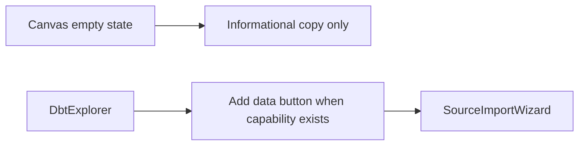
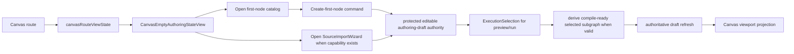
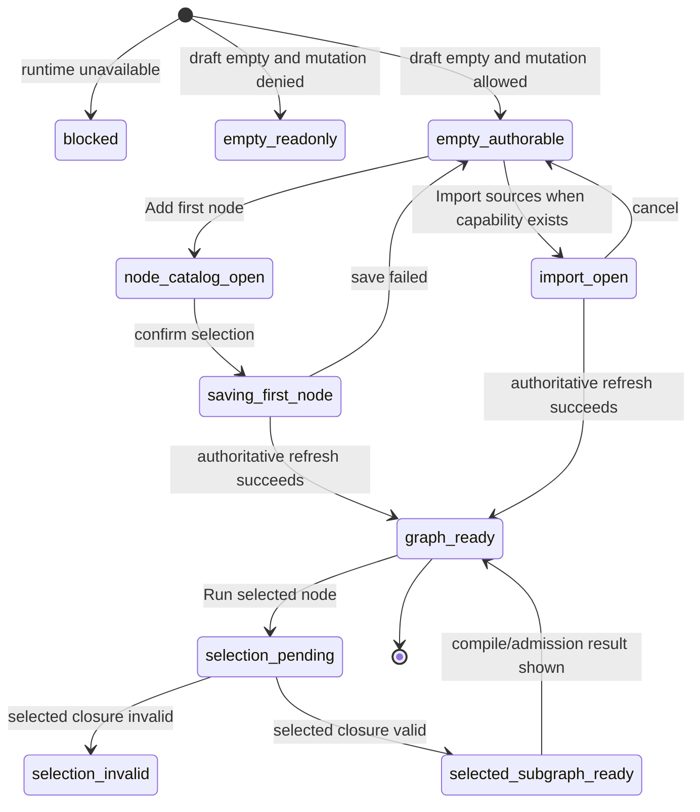
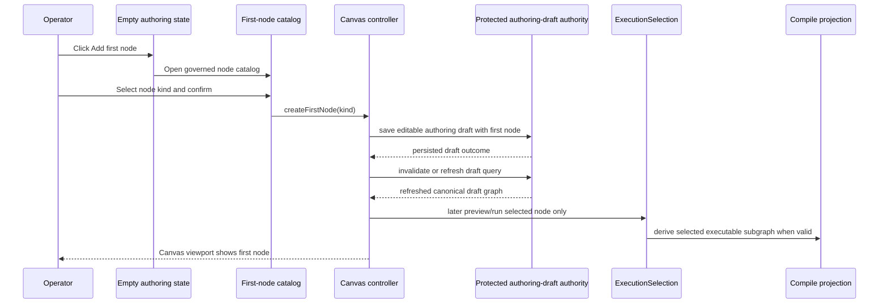

# TF-E2 Canvas Empty Authoring Entrypoint Design 2026-04-22

## Summary

This proposal freezes the canonical product behavior for the Canvas route when
protected draft truth exists but the active graph is empty.

The route already fails closed correctly after the runtime-truth hard cut. What
it still lacks is a governed way to start authoring from that empty state.

That entrypoint now has an explicit architectural dependency: the backend-owned
draft boundary must persist an editable authoring draft, not a compile-ready
`DesignGraphDraft`.

The design decision is:

- treat `empty` as a productive route state, not as passive copy
- expose one explicit primary action for authoring: `Add first node`
- keep `Import sources` as a secondary capability-gated action only
- never reintroduce mock, local-only, or snapshot-backed startup nodes

## Governing sources

- `AGENTS.md`
- `docs/planning/status/governance-document-rule-inventory.md`
- `docs/guides/ai-work-protocol.md`
- `docs/planning/state/planning-control-tower.md`
- `docs/planning/state/agent-lane-e.yaml`
- `docs/planning/reviews/architecture-and-governance/20260422-canvas-runtime-truth-hardcut-review.md`
- `docs/planning/proposals/mandatory/frontend-and-ux/tf-e2-canvas-target-architecture-execution-plan-20260417.md`
- `docs/architecture/components/web/graph/graph-frontend-architecture.md`
- `docs/architecture/components/web/graph/graph-route-bootstrap-architecture.md`
- `docs/architecture/components/web/graph/canvas-component-map-and-modernization-review.md`
- `docs/architecture/components/web/frontend-runtime-modes-user-manual.md`

## Relationship to current canon

- The 2026-04-22 runtime-truth review settled that Canvas authoring must use
  protected draft truth only and may not fall back to mock or legacy snapshot
  startup behavior.
- This proposal settles the next unresolved product question inside that
  architecture: how an operator enters authoring when protected draft truth is
  present but currently contains no graph nodes.
- This proposal does not change the hard-cut decision. It defines the product
  entrypoint that sits on top of that decision.
- This proposal now also records the contract correction discovered during the
  hard-cut follow-up: a graph-first first-node flow cannot be implemented on
  top of a save path that still requires a compile-valid `DesignGraphDraft`.

## Think-first analysis

### Problem summary

The current Canvas empty state is honest but non-productive.

When the backend runtime is healthy and the protected draft is simply empty, the
route renders an informational card but no first-class action to begin
authoring. The only existing creation affordance is the explorer-side `Add
data` entry, and that affordance is hidden in `api` mode because
`sourceImportAvailable` is currently `false`.

That leaves the route in a dead-end state:

- not blocked
- not read-only
- not errored
- but still unable to start work

### Root cause

The root cause is semantic mismatch, not just missing UI.

Three concerns are still mixed:

1. route operability
2. empty-state presentation
3. authoring-entry capability

The route correctly distinguishes `blocked` from `empty`, but the empty state
still behaves like a documentation surface instead of an application service
entrypoint.

In Fowler terms, the screen has a read-model state for `empty` but no command
entrypoint attached to it.

There is also a boundary mismatch under the UI:

- the current protected save path still accepts a compile-valid
  `DesignGraphDraft`
- a first-node or partially connected authoring state is a valid editing state
  but not a valid `DesignGraphDraft`

So the current runtime cannot persist the very first graph-editing step through
the canonical boundary without architectural correction.

### Constraints and invariants

- `blocked != empty`
- Canvas remains a `published` route
- protected `workspaceGraphDraft` remains the only accepted remote authoring
  truth
- React Flow remains a projection, never semantic authority
- no startup seed graph may be fabricated for convenience
- no local-only node creation may present success before authoritative draft
  refresh confirms it
- `Import sources` remains capability-gated and must not be implied by copy
  when the backend capability is unavailable
- the route must expose a primary authoring path even when source import is not
  available

### Options considered

#### Option A: keep empty state informational and wait for source import

Benefits:

- smallest code change
- no new command surface

Rejected because:

- it makes `empty` non-productive
- it couples the entire authoring journey to a backend capability that does not
  yet exist in `api` mode
- it turns an honest route into a product dead end

#### Option B: make `Import sources` the only entrypoint

Benefits:

- aligns with one currently visible creation metaphor
- keeps first authoring action tied to backend-owned object registration

Rejected because:

- source import is not currently exposed in `api` mode
- it would make Canvas authoring availability depend on one optional feature
- it conflates project resource registration with graph authoring itself

#### Option C: add a route-owned primary authoring entrypoint and keep import secondary

Benefits:

- keeps the route productive under the hard cut
- separates graph authoring from source-registration capability
- allows the backend truth to stay canonical while the UI stops being a dead
  end

Decision:

- accepted

### Selected option and rationale

Adopt Option C.

The empty route becomes an authoring state with one primary command:
`Add first node`.

`Import sources` stays available only when the backend advertises that
capability. The operator should never be forced through import if the actual
product need is to start composing a graph from governed node kinds.

This command must target an editable authoring draft boundary. It must not try
to smuggle an incomplete graph through the compile-ready `DesignGraphDraft`
writer.

### Rejected alternatives

- floating action buttons without empty-state semantics
- toolbar-only creation affordances
- reopening mock startup nodes
- auto-creating a magic default node on first load
- using project explorer inventory as the authoring catalog

## Decision

The canonical Canvas empty-state behavior is:

1. If the route is blocked, render blocked posture only.
2. If the route is empty and the user lacks mutation capability, render a
   read-only empty state with no creation CTAs.
3. If the route is empty and mutation is allowed, render a productive empty
   authoring state:
   - primary CTA: `Add first node`
   - secondary CTA: `Import sources` only when
     `workspaceServiceCapabilities.sourceImportAvailable === true`
4. Creating the first node must round-trip through the protected editable draft
   authority. No local fake graph is allowed.
5. The command is blocked on contract truth. If the protected runtime still
   exposes only a compile-valid `DesignGraphDraft` save path, the slice is not
   ready and must not fake success in the browser.

## Target UX contract

### User-visible states

| Route condition                         | Surface                | Primary action          | Secondary action        |
| --------------------------------------- | ---------------------- | ----------------------- | ----------------------- |
| backend blocked                         | blocked state          | none                    | retry if applicable     |
| empty + read-only                       | empty read-only        | none                    | none                    |
| empty + authorable + import unavailable | empty authoring        | `Add first node`        | none                    |
| empty + authorable + import available   | empty authoring        | `Add first node`        | `Import sources`        |
| non-empty                               | normal Canvas viewport | existing graph commands | existing graph commands |

### UX rule

The center surface owns the first meaningful authoring action. The explorer and
toolbar may repeat it, but must not be the only place where authoring begins.

## Proposed architecture

### Current topology



Problem:

- the center surface explains the state but owns no command
- the only existing creation entrypoint is secondary, side-panel-specific, and
  capability-gated away in the canonical runtime

### Target topology



Execution rule:

- Canvas authoring may contain loose or incomplete nodes.
- `Run` and preview actions must operate through an explicit
  `ExecutionSelection`.
- Unselected loose nodes do not block a selected SQL node when that selected
  node and its dependency closure are executable.
- Selecting an invalid loose node produces selection diagnostics, not a failed
  save or a hidden whole-draft compile attempt.

## Component ownership

| Component or seam                   | Owns                                                                                  | Must not own                              |
| ----------------------------------- | ------------------------------------------------------------------------------------- | ----------------------------------------- |
| `CanvasCenterSurface.tsx`           | choose center surface for loading, blocked, error, empty, complete                    | opening hidden local-only authoring paths |
| `CanvasEmptyAuthoringStateView.tsx` | empty-state CTAs, copy, and capability-aware operator guidance                        | backend transport or draft mutation logic |
| `Canvas.tsx`                        | route composition and command wiring                                                  | inline command-policy decisions           |
| route action model seam             | typed authoring-entry command model for the empty state                               | visual layout                             |
| first-node catalog dialog or sheet  | show governed node kinds available for first-node creation                            | persistence truth                         |
| first-node command handler          | build and persist the first-node mutation through protected authoring-draft authority | optimistic fake success without refresh   |

## Public API to introduce

### Empty-state action model

```ts
type CanvasEmptyAuthoringActionModel = Readonly<{
  canCreateFirstNode: boolean;
  canImportSources: boolean;
  createFirstNodeLabel: string;
  importSourcesLabel: string | null;
  note: string | null;
  onCreateFirstNode?: () => void;
  onImportSources?: () => void;
}>;
```

Rule:

- action presence is semantic, not inferred from copy
- handlers are omitted when the action is not permitted

### Empty-state presentation component

```ts
type CanvasEmptyAuthoringStateViewProps = Readonly<{
  title: string;
  message: string;
  actions: CanvasEmptyAuthoringActionModel | null;
}>;
```

### First-node catalog contract

```ts
type CanvasFirstNodeCatalogEntry = Readonly<{
  kind: string;
  title: string;
  description: string;
  iconKey: string;
}>;
```

Design rule:

- this catalog is a Canvas authoring catalog, not a projection of workspace
  resources from `DbtExplorer`
- it must be derived from the governed authoring vocabulary for the active
  route mode

## State machine



State rule:

- the UI may not transition from `empty_authorable` to `graph_ready` on local
  optimism alone
- authoritative draft refresh is the acceptance point

## Command sequence



## Authoring catalog rules

The first-node catalog must follow these rules:

- expose only governed authoring node kinds for the active route mode
- use the same canonical node vocabulary that later graph commands will use
- not depend on whether project resource inventory currently exists
- not synthesize fake project resources to populate the catalog

Initial expectation for the current route family:

- source-like node
- transformation node
- sink-like node

Exact node labels and icon mapping belong to the implementation slice and must
reuse the governed frontend copy and node-registry vocabulary instead of
introducing a second ad hoc catalog.

## Backend and persistence rule

This proposal does not introduce a new backend endpoint by default.

Required implementation posture:

- do not use the current compile-ready `DesignGraphDraft` save path as the
  first-node persistence model
- introduce or adopt the editable authoring-draft boundary from `TF-A2` and
  `TF-C4`
- derive `DesignGraphDraft` only after the authoring graph satisfies compile
  invariants for the selected executable subgraph
- route preview/run through explicit `ExecutionSelection`; do not infer that
  `Run` means the whole editable draft

If the editable boundary is not available yet, the route may expose the entry
affordance only as a blocked capability with explicit operator guidance. It may
not create a frontend-only success path.

## Delivery sequencing

This UX slice is graph-first, but it is not UI-only.

Required sequence:

1. `TF-A2` resets the shared draft contract so the editable aggregate is not
   `DesignGraphDraft`
2. `TF-C4` persists that editable aggregate through the protected route and
   store boundary
3. `TF-A2-C` introduces selected-subgraph compile semantics for preview/run
4. `TF-E2-A` consumes the reset boundary and then adds the route-owned empty
   authoring command

The empty-state CTA is therefore a product decision that depends on contract
truth, not a styling-only enhancement.

## Testing and evidence expectations

### Required web tests

- `Canvas.routeStates.test.tsx`
  - empty authorable shows `Add first node`
  - empty read-only shows no mutation CTA
  - empty authorable without import capability shows no import CTA
- controller or application-service tests
  - create-first-node command persists through protected draft authority
  - local state does not claim success without authoritative refresh
  - selected SQL node run/preview ignores unrelated loose draft nodes
  - selecting an invalid loose node returns diagnostics without mutating draft
- architecture tests
  - empty-state component depends on typed action model, not loose booleans
  - `DbtExplorer` remains project-resource inventory, not first-node catalog
  - `Run` command wiring depends on `ExecutionSelection`, not whole-draft
    compile-by-default behavior

### Required browser proof later under `TF-E2-E`

- live-runtime path can create the first node from an empty protected draft
- no fake graph appears when backend capability is absent or blocked

## Documentation drift to fix in the implementation slice

When implementation lands, update these docs in the same slice:

- `docs/architecture/components/web/graph/graph-frontend-architecture.md`
- `docs/architecture/components/web/graph/canvas-component-map-and-modernization-review.md`
- `docs/architecture/components/web/frontend-runtime-modes-user-manual.md`

New component-level docs expected from implementation:

- a local component guide for the empty authoring entrypoint
- module docblocks naming owned concern for any new entrypoint modules
- a semantic architecture test that protects the first-node catalog boundary

## Pre-implementation brief

- Mode: `Full`
- Scope:
  - productize the empty Canvas state as a route-owned authoring entrypoint
  - add a governed first-node command path
  - keep import capability secondary and explicit
- Touched files or paths:
  - `apps/web/src/app/views/canvas/CanvasCenterSurface.tsx`
  - `apps/web/src/app/views/canvas/CanvasStateViews.tsx`
  - `apps/web/src/app/views/Canvas.tsx`
  - `apps/web/src/app/views/canvas/canvasRouteViewState.ts`
  - route/controller command seams as needed
  - new local component docs in the Canvas architecture pack
- Expected outcome:
  - empty Canvas becomes a productive authoring entrypoint without reintroducing
    legacy fallback
- Risks and mitigations:
  - risk: first-node persistence may reveal draft-authority limitations
    mitigation: fail closed and treat unsupported creation as a real capability
    gap
  - risk: authoring catalog drifts away from governed node vocabulary
    mitigation: derive entries from existing node-kind contracts and protect
    them with architecture tests
  - risk: import and first-node entrypoints become semantically mixed
    mitigation: keep separate components and command models
- Out-of-scope items:
  - full Inspector editing
  - source-import backend implementation
  - broad toolbar redesign
  - mock-mode feature parity
- Validation plan:
  - targeted `apps/web` tests for route state and first-node command behavior
  - `pnpm docs:sync`
  - `pnpm docs:workboard:generate`
  - `pnpm verify:prepush`
- Test coverage plan:
  - blocked runtime still has no creation CTA
  - read-only empty state still has no mutation CTA
  - create-first-node fails closed on protected draft save failure
  - no fake node is shown before authoritative refresh
  - import CTA remains hidden when capability is unavailable
- Libraries evaluated:
  - none; this is an internal route, command, and presentation design

## Why this is the right shape

In Fowler terms, this restores the missing command side to a legitimate
read-model state. The route already had `empty` as a state. It lacked the
application-service entrypoint that lets an operator move out of that state
through the canonical backend truth.

In DDD terms, it keeps bounded contexts clean:

- project resource inventory stays in the explorer
- authoring entrypoint stays in Canvas
- protected draft persistence remains the only authority

In product terms, it removes the current contradiction where the route is
healthy enough to be visible but not useful enough to start work.

## Final decision

Canvas empty state is no longer just a message.

It becomes the governed authoring entrypoint for the first graph action, with:

- one primary route-owned `Add first node` command
- one optional capability-gated `Import sources` command
- zero legacy startup nodes
- zero mock fallback
- zero frontend-only success paths
